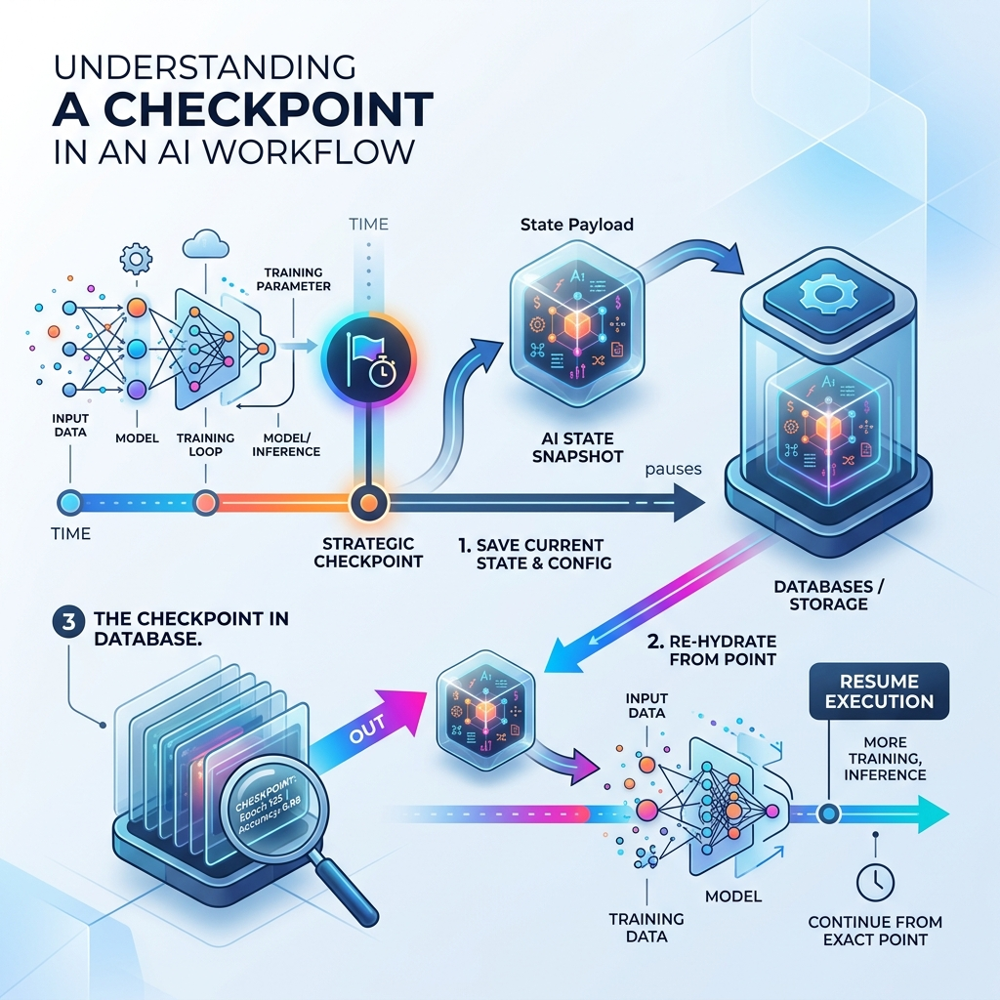

<!-- tags: glossary, agentic-ai, workflow-orchestration, checkpoint -->
# Checkpoint

> A saved snapshot of a workflow's exact state at a specific node, allowing the system to pause, resume, or 'time travel' back to that moment later.

| Aspect | Detail |
| --- | --- |
| **Domain** | Workflow Orchestration |
| **Used by** | Backend developer, AI engineer |
| **Related** | Human-in-the-Loop, AI Orchestrator, State |

📅 Created: 2026-04-28 · 🔄 Updated: 2026-05-06 · ⏱️ 5 min read

---

## 1. DEFINE

When an LLM agent executes a complex task, its "brain" is the global state object—a growing JSON blob containing the conversation history, scraped data, and intermediate reasoning. If the server restarts or the process is killed, that state is lost forever.

A **Checkpoint** is a persistence mechanism. When a workflow reaches a designated node, the orchestrator serializes the entire state object and writes it to a persistent database (e.g., PostgreSQL, Redis). 

This enables two superpowers in agentic engineering:
1.  **Asynchronous Pausing**: The system can halt, tear down the compute resources, wait hours for human input, and then re-hydrate the state to resume exactly where it left off.
2.  **Time Travel**: If an agent hallucinates at Step 5, a developer can load the Checkpoint from Step 3, manually edit the state to correct the LLM's mistake, and resume execution from Step 3 without re-running Steps 1 and 2.

---

## 2. CONTEXT

**Who uses it**: Backend developers implementing stateful agents and human-in-the-loop workflows.

**When**: Mandatory for long-running workflows, chat-based agent interfaces, and any process requiring human approval.

**In this ecosystem**:
- Checkpoints are the technical implementation that makes [Human-in-the-Loop](../agentic-core/44-human-in-the-loop.md) possible.
- They are managed natively by modern [AI Orchestrators](./63-ai-orchestrator.md).

---

## 3. EXAMPLES

*Figure: A workflow diagram illustrating a Checkpoint. The system saves its exact state to a database at a specific node, pausing execution. Later, it re-hydrates that state to resume.*

### Example 1: The Human Approval Gate
An agent writes a marketing campaign and reaches the `Wait_For_Approval` node. The orchestrator saves a Checkpoint and exits. The user gets an email, opens it 12 hours later, and clicks "Approve". The orchestrator loads the Checkpoint by its ID, re-establishes the exact context, and continues to the `Publish` node.

### Example 2: Chat History Persistence
When you chat with ChatGPT, the history is maintained across sessions. In custom agent architectures, this is achieved by saving a Checkpoint after every single user message and AI response, allowing the graph to "resume" the conversation days later.

---

## 4. COMPARE

| | Checkpoint | Application Log | Cache |
|--|---|---|---|
| **Purpose** | State persistence for resumption | Debugging and observability | Speeding up redundant queries |
| **Actionable** | Yes (Can be executed/resumed) | No (Read-only) | No |
| **Format** | Serialized state object | Text strings / JSON lines | Key-Value pairs |

---

## 5. REF

| Resource | Type | Link | Note |
| --- | --- | --- | --- |
| LangGraph Persistence & Checkpointers | Docs | https://langchain-ai.github.io/langgraph/concepts/persistence/ | Detailed explanation of how to persist state in graph-based agents |

---

## 6. RECOMMEND

| Explore next | When | Why | File/Link |
| --- | --- | --- | --- |
| Human-in-the-Loop | You want to pause for a user | Checkpoints are required to wait for humans | [Human-in-the-Loop](../agentic-core/44-human-in-the-loop.md) |
| AI Orchestrator | You want to know what saves the checkpoint | The orchestrator handles the DB writes | [AI Orchestrator](./63-ai-orchestrator.md) |
| Step / Node | You are deciding where to save | Checkpoints happen at the boundaries between nodes | [Step / Node](./67-step-node.md) |

**Links**: [← Previous](./70-retry-policy.md) · [→ Next](./72-event-driven-agent.md)
