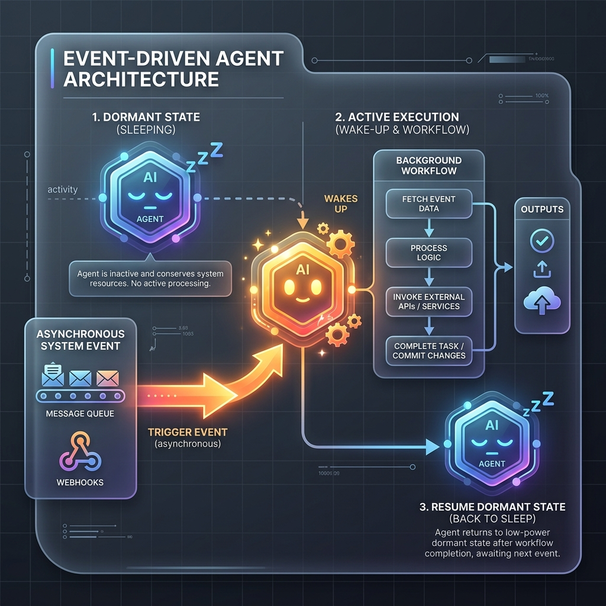

<!-- tags: glossary, agentic-ai, workflow-orchestration, event-driven-agent -->
# Event-Driven Agent

> An architectural pattern where an agent sits dormant and is instantiated by an asynchronous system event (like a webhook or message queue) rather than a direct user prompt.

| Aspect | Detail |
| --- | --- |
| **Domain** | Workflow Orchestration |
| **Used by** | Backend developer, AI architect |
| **Related** | Trigger, AI Orchestrator, Background Job |

📅 Created: 2026-04-28 · 🔄 Updated: 2026-05-06 · ⏱️ 5 min read

---

## 1. DEFINE

Most consumer AI experiences are synchronous chat interfaces: a user types a prompt, waits, and the AI responds. 

An **Event-Driven Agent** represents the shift from AI as a "chatbot" to AI as "infrastructure." These agents operate entirely in the background. They sit dormant until a specific [Trigger](./73-trigger.md) fires—such as a file landing in an S3 bucket, a row updating in a database, or an alert firing in Datadog. 

When the event occurs, the orchestrator instantiates the agent, passes the event payload as the initial state, and lets the agent execute its workflow autonomously. Once the workflow is complete, the agent spins down.

---

## 2. CONTEXT

**Who uses it**: Backend developers building scalable, automated microservices that incorporate AI reasoning.

**When**: Essential for background processing, ETL pipelines, autonomous monitoring, and any system that scales beyond 1:1 human interaction.

**In this ecosystem**:
- They are activated by a [Trigger](./73-trigger.md).
- They execute a predefined [Workflow](./64-workflow.md) or [DAG](./65-dag.md).
- Because there is no human waiting in a chat UI, they can afford to use deep, slow [Self-Reflection](../agentic-core/42-self-reflection.md) loops.

---

## 3. EXAMPLES

*Figure: An Event-Driven Agent sitting dormant until a system event (like a message queue or webhook) triggers it to wake up, execute a background workflow, and go back to sleep.*

### Example 1: The Automated Code Reviewer
A developer pushes code to GitHub. This fires a webhook (the Event). The webhook hits a RabbitMQ queue, which wakes up the `Code_Review_Agent`. The agent clones the PR, reads the diffs, analyzes the code for security flaws, posts a comment on GitHub, and then shuts down. No human ever prompted the agent directly.

### Example 2: The S3 Document Ingestion Agent
A user drops a 500-page PDF into an AWS S3 bucket. An S3 `ObjectCreated` event triggers a background agent. The agent wakes up, runs an OCR pipeline, generates vector embeddings, inserts them into Pinecone, and sends an email to the user saying "Your document is ready to query."

---

## 4. COMPARE

| | Event-Driven Agent | Synchronous Chatbot | CRON Job |
|--|---|---|---|
| **Activation** | Reactive to system events | Proactive user input | Time-based schedule |
| **Latency Tolerance** | High (Background processing) | Low (User is waiting) | High |
| **Execution Context** | The event payload (JSON) | The chat history | Environment variables |

---

## 5. REF

| Resource | Type | Link | Note |
| --- | --- | --- | --- |
| Event-Driven Architecture | Concept | https://aws.amazon.com/event-driven-architecture/ | Foundational concepts for building decoupled, event-based systems |

---

## 6. RECOMMEND

| Explore next | When | Why | File/Link |
| --- | --- | --- | --- |
| Trigger | You want to activate the agent | Triggers are the signals that wake up the agent | [Trigger](./73-trigger.md) |
| Workflow | You are defining what the agent does | The agent executes a workflow upon waking | [Workflow](./64-workflow.md) |
| Pipeline | The agent processes data | Event-driven agents often run simple pipelines | [Pipeline](./66-pipeline.md) |

**Links**: [← Previous](./71-checkpoint.md) · [→ Next](./73-trigger.md)
