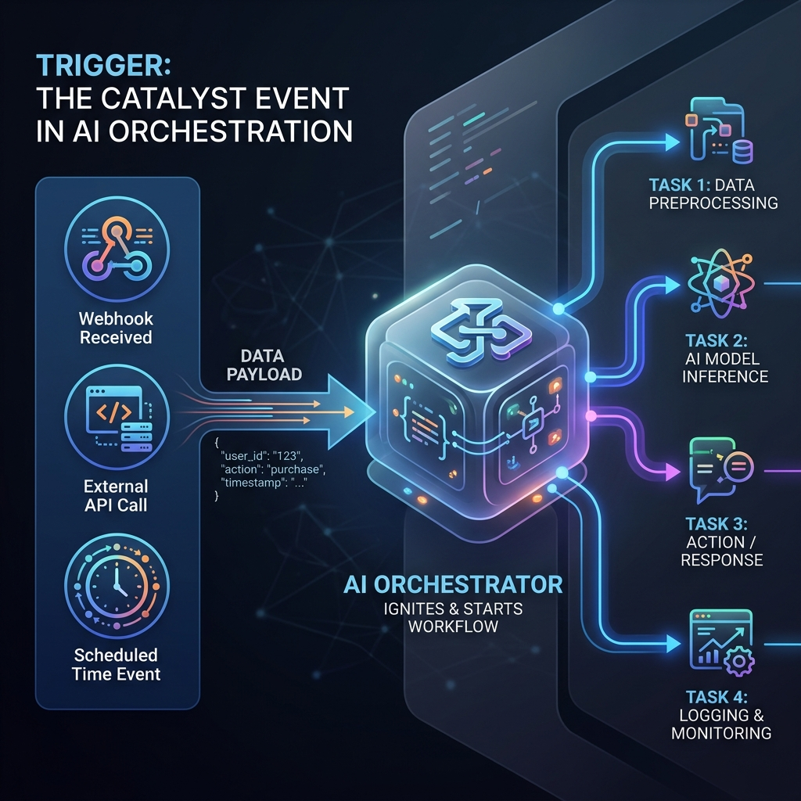

<!-- tags: glossary, agentic-ai, workflow-orchestration, trigger -->
# Trigger

> The specific external signal, rule, or payload that initiates an asynchronous workflow or wakes up an Event-Driven Agent.

| Aspect | Detail |
| --- | --- |
| **Domain** | Workflow Orchestration |
| **Used by** | Backend developer, DevOps |
| **Related** | Event-Driven Agent, Workflow |

📅 Created: 2026-04-28 · 🔄 Updated: 2026-05-06 · ⏱️ 5 min read

---

## 1. DEFINE

A **Trigger** is the entry point into any automated, background AI process. It acts as the bridge between traditional software infrastructure and the AI Orchestrator. 

When a defined condition is met in the outside world, a Trigger fires. It captures the relevant contextual data (the "payload") and pushes it to the orchestrator, saying, *"Start this specific workflow right now, and use this data as your starting state."*

Without triggers, agents would be forced to constantly poll databases or APIs to see if there is work to do, which is highly inefficient and expensive.

---

## 2. CONTEXT

**Who uses it**: Backend developers connecting existing SaaS applications, databases, and message queues to AI logic.

**When**: The first step in building an [Event-Driven Agent](./72-event-driven-agent.md).

**In this ecosystem**:
- A Trigger initiates a [Workflow](./64-workflow.md).
- It provides the initial state for the first [Step / Node](./67-step-node.md).
- Common implementations use webhooks, Kafka/RabbitMQ messages, or database CDC (Change Data Capture).

---

## 3. EXAMPLES

*Figure: A Trigger acting as the spark or catalyst (e.g., a webhook or clock) that pushes a data payload into an AI Orchestrator to start a workflow.*

### Example 1: The Support Ticket Webhook
*   **System**: Zendesk.
*   **Trigger**: A webhook configured to fire on `ticket.created`.
*   **Payload**: `{"ticket_id": 123, "text": "My laptop won't turn on."}`
*   **Action**: The orchestrator receives the trigger, instantiates a troubleshooting agent, and passes the payload to it so it can begin researching the issue.

### Example 2: The Scheduled CRON Trigger
*   **System**: A server cron job or AWS EventBridge.
*   **Trigger**: `0 8 * * *` (Fires every day at 8:00 AM).
*   **Action**: Wakes up an Executive Summary Agent. The agent queries Salesforce, Snowflake, and Jira, writes a daily briefing, and emails it to the CEO before she arrives at the office.

---

## 4. COMPARE

| | Trigger | Action (Skill) | Polling |
|--|---|---|---|
| **Role** | Starts the workflow | Executed *during* the workflow | Agent repeatedly asking if work exists |
| **Direction** | Push (System -> Agent) | Pull/Push (Agent -> System) | Pull (Agent -> System) |
| **Efficiency** | Maximum (only runs when needed) | N/A | Very Low (wastes compute) |

---

## 5. REF

| Resource | Type | Link | Note |
| --- | --- | --- | --- |
| Zapier / Make | Platforms | https://zapier.com/ | The industry standard visual paradigm for Triggers and Actions |

---

## 6. RECOMMEND

| Explore next | When | Why | File/Link |
| --- | --- | --- | --- |
| Event-Driven Agent | You set up a trigger | The trigger wakes up this specific agent | [Event-Driven Agent](./72-event-driven-agent.md) |
| AI Orchestrator | The trigger fires | The orchestrator catches the trigger and runs the graph | [AI Orchestrator](./63-ai-orchestrator.md) |
| Workflow | The trigger starts execution | The trigger dictates which workflow to start | [Workflow](./64-workflow.md) |

**Links**: [← Previous](./72-event-driven-agent.md) · [→ Next](./74-handoff.md)
