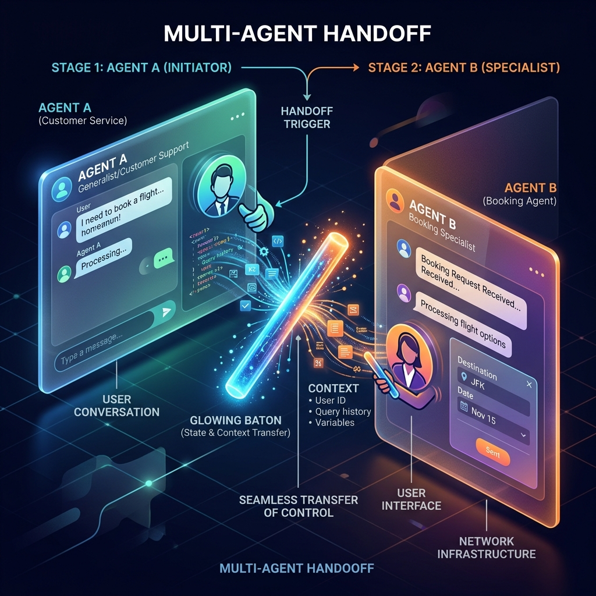

<!-- tags: glossary, agentic-ai, workflow-orchestration, handoff -->
# Handoff

> The process of securely and seamlessly transferring the execution context, state, and conversation history from one agent (or node) to a completely different agent (or human) without losing data.

| Aspect | Detail |
| --- | --- |
| **Domain** | Workflow Orchestration |
| **Used by** | AI architect, UX designer |
| **Related** | Multi-Agent Systems, AI Orchestrator, Skill Routing |

📅 Created: 2026-04-28 · 🔄 Updated: 2026-05-06 · ⏱️ 5 min read

---

## 1. DEFINE

In multi-agent architectures, no single agent does everything. A system is composed of many specialized agents (e.g., a triage agent, a sales agent, a technical support agent). 

**Handoff** is the specific orchestration mechanism that allows Agent A to surrender control of the workflow and pass the baton to Agent B. Crucially, a successful handoff means transferring the *entire context* (the conversation history, the extracted variables, the current state) so that Agent B can pick up seamlessly. 

If handoff is handled poorly, the user experiences the frustrating "customer service loop" where they have to repeat their problem to every new agent they speak to.

---

## 2. CONTEXT

**Who uses it**: AI architects building hierarchical or swarm-based multi-agent systems.

**When**: Used when a task exceeds the current agent's specialized prompt instructions or available tools, requiring a specialist.

**In this ecosystem**:
- Handoff is governed by the [AI Orchestrator](./63-ai-orchestrator.md).
- It is a defining characteristic of [Multi-Agent Systems](../multi-agent-systems/README.md).
- Similar to, but distinct from, [Skill Routing](../skills-plugins/108-skill-routing.md).

---

## 3. EXAMPLES

*Figure: A diagram illustrating Handoff, where an initial AI agent transfers a glowing baton (representing the state and context) to a specialized AI agent, seamlessly transferring control of the workflow.*

### Example 1: The Swarm Handoff
A user connects to a general `Triage_Agent` and asks to process a refund. The `Triage_Agent` does not have access to the Stripe API. 
It invokes a specific tool: `transfer_to_finance()`. The orchestrator suspends the `Triage_Agent`, loads the `Finance_Agent` (which *does* have Stripe access), injects the chat history into the new agent's context, and the `Finance_Agent` says: "I see you want a refund for order #123, I can help with that."

### Example 2: Agent-to-Human Handoff
If the `Finance_Agent` encounters an error processing the refund, it initiates an escalation handoff to a human support queue. The human operator dashboard populates with the entire conversation the user had with both previous AI agents, allowing the human to resolve the issue instantly.

---

## 4. COMPARE

| | Handoff | Skill Execution | Skill Routing |
|--|---|---|---|
| **Control Flow** | Agent A transfers control completely to Agent B | Agent A calls a tool, waits for result, and continues | Orchestrator picks Agent A or B at the very beginning |
| **Context** | State is passed to a new LLM persona | State is passed to a deterministic API | Initial prompt is sent to the target |
| **Human Analogy** | Transferring a phone call to a different department | Looking up a fact in a dictionary | A phone menu ("Press 1 for Sales") |

---

## 5. REF

| Resource | Type | Link | Note |
| --- | --- | --- | --- |
| OpenAI Swarm | Framework | https://github.com/openai/swarm | OpenAI's educational framework demonstrating lightweight agent handoffs |
| LangGraph Multi-Agent Handoffs | Docs | https://langchain-ai.github.io/langgraph/tutorials/multi_agent/multi-agent-collaboration/ | Implementing handoffs in state graphs |

---

## 6. RECOMMEND

| Explore next | When | Why | File/Link |
| --- | --- | --- | --- |
| Multi-Agent Systems | You want to build a system that requires handoffs | Multi-agent architectures rely on handoffs | [Multi-Agent Systems](../multi-agent-systems/README.md) |
| AI Orchestrator | You want to implement the code | The orchestrator manages the state transfer during handoff | [AI Orchestrator](./63-ai-orchestrator.md) |
| Human-in-the-Loop | The handoff is to a human | Escalation requires transferring state to a UI | [Human-in-the-Loop](../agentic-core/44-human-in-the-loop.md) |

**Links**: [← Previous](./73-trigger.md) · [→ Next](../evaluation-observability/README.md)
