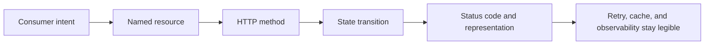
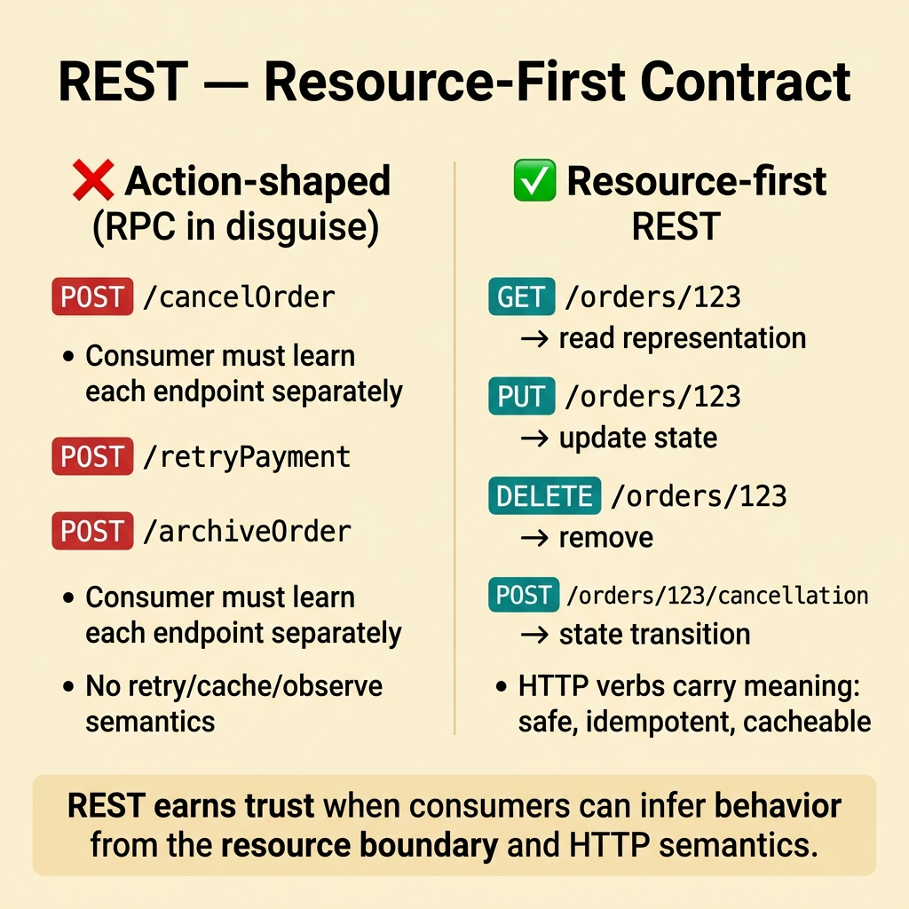
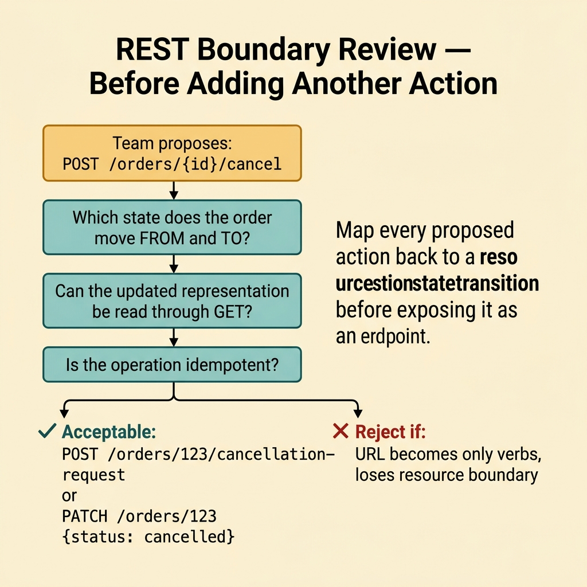
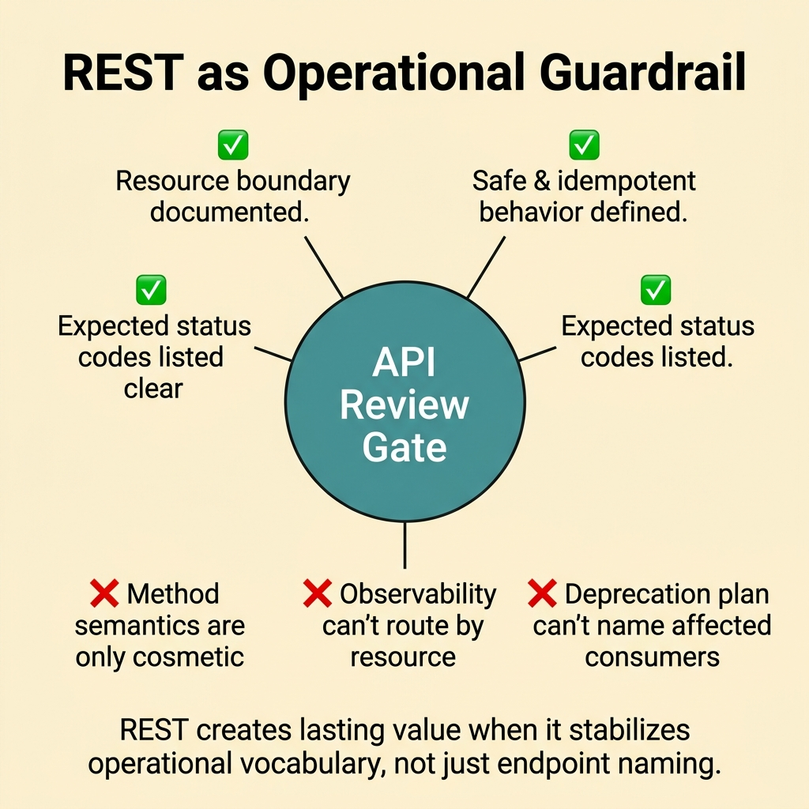
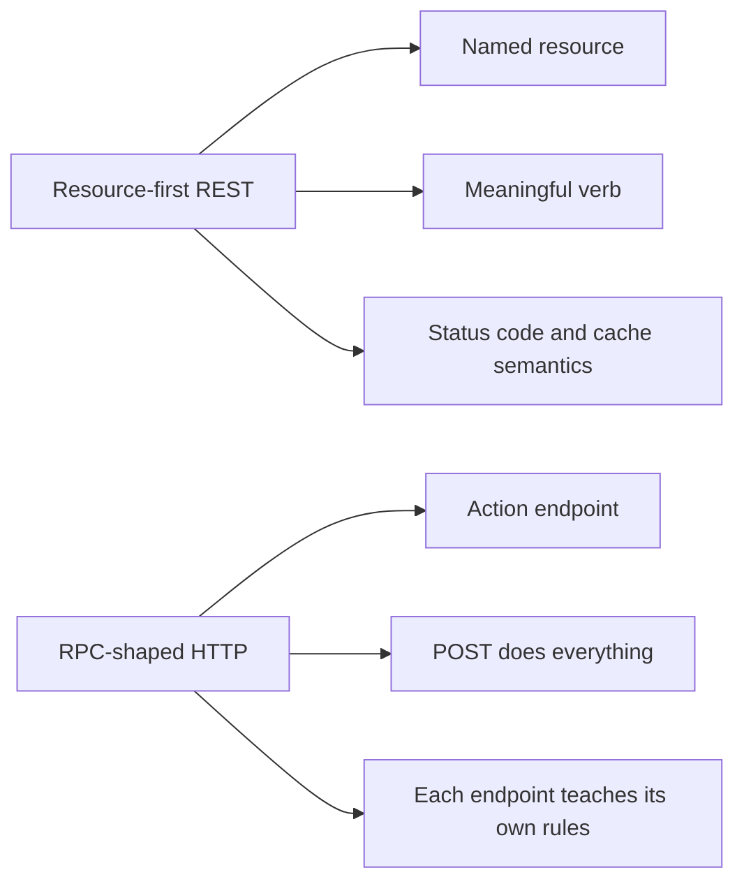
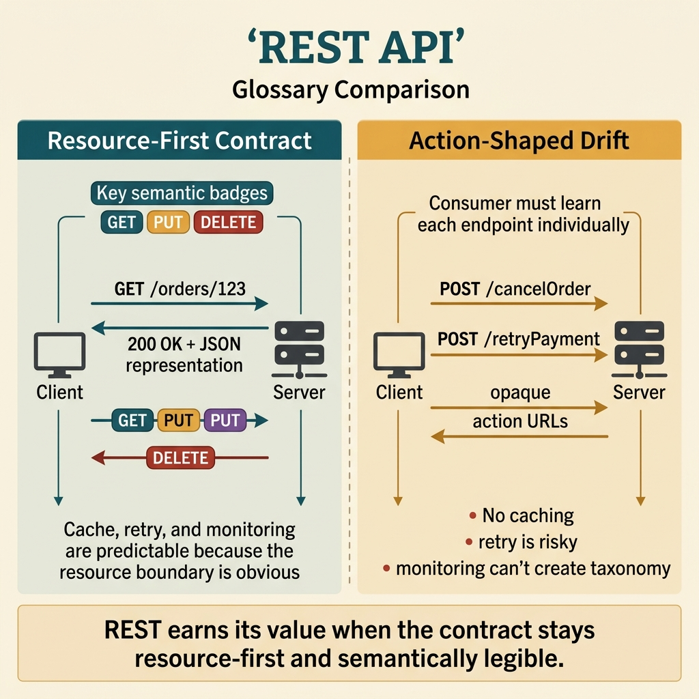

<!-- tags: glossary, reference, api-design, rest -->
# REST

> An API style built around resources, HTTP verbs, and predictable semantics so consumers can infer behavior from the contract itself.

| Aspect | Detail |
| --- | --- |
| **Concept** | A resource-first HTTP style with recognizable method and status semantics. |
| **Audience** | Backend engineer, API designer, reviewer, platform owner |
| **Primary style** | Glossary term |
| **Entry point** | Use it when the team needs a public HTTP contract that is easy to read, observe, cache, and evolve. |

📅 Created: 2026-03-30 · 🔄 Updated: 2026-04-17 · ⏱️ 7 min read

---

## 1. DEFINE

Picture a new partner asking why your API exposes `POST /orders/123/cancel`, `POST /orders/123/retry-payment`, and `POST /orders/123/archive`, yet never shows the primary resource in a way they can reason about. The backend team says, "it still works." The partner says, "we cannot tell what is safe to retry, cache, or monitor." At that point, the problem is no longer naming. The problem is contract legibility. That is the boundary of **REST**.

**REST** is an API style that models resources, uses standard HTTP verbs, and keeps communication stateless so consumers can infer behavior from familiar HTTP semantics.

REST does not mean "every URL must be a noun." Its real value is the discipline of resource boundaries, status codes, idempotency, and stable representations.

| Variant | Description |
| --- | --- |
| Resource-oriented HTTP API | Publish a contract around named resources and meaningful verbs. |
| Pragmatic REST | Keep the useful semantics without forcing every academic constraint. |
| Hypermedia-lite | Add just enough links or actions to expose valid state transitions. |

| Approach | Time | Space | Choose it when |
| --- | --- | --- | --- |
| Resource modeling | O(1) | O(1) | You need a predictable contract for many consumers. |
| HTTP semantics first | O(1) | O(1) | You want to reuse cache, retry, and observability built around HTTP. |
| Action as state transition | Domain-shaped | O(1) | The domain has rich behavior but you still want resource boundaries. |

Core insight:

> REST is powerful because producer and consumer can speak one language about resources, behavior, and cacheability.

### 1.1 Invariants and Failure Modes

- The consumer should infer which resource is being manipulated.
- The HTTP method and status code must carry real meaning.
- The representation must stay stable enough for monitoring, retry, and caching.

The common failure mode is an API that looks REST-like but behaves like RPC hidden inside URLs. The contract then loses predictability, and the vocabulary of HTTP stops helping.

---

## 2. CONTEXT

**Who uses it**: Backend engineer, API designer, reviewer, platform owner

**When**: Use it when the team needs a public HTTP contract that is easy to read, debug, cache, and monitor.

**Why it matters**: REST is most valuable when it creates a stable, shared language for resource behavior.

**In this ecosystem**:
- Choose `REST` first when browsers, mobile apps, or partner systems need a readable public contract.
- Choose `GraphQL` when the real pain is flexible field selection for one client view.
- Choose `gRPC` when the main actor is an internal service that needs typed stubs and streaming.

Resource-based HTTP is clear on paper. The next question is where the boundary breaks when a team starts slipping back into action-shaped endpoints.

---

## 3. EXAMPLES

REST becomes visible when teams call every HTTP API "REST" even though the surface is action-heavy, when `POST /doSomething` becomes the answer to every need, or when public endpoints become hard to observe and deprecate. The examples below place REST in those moments.



*Diagram: The example flow starts with a resource, not with an action verb.*

### Example 1: Basic - Give the consumer a contract they can read

> **Goal**: Model `order` as a resource instead of a pile of action URLs.
> **Approach**: Use HTTP semantics so the consumer can infer safety and side effects.
> **Example**: `GET /orders/123` reads a representation, and `PUT /orders/123` updates it.
> **Complexity**: Basic



*Figure: REST earns trust when consumers can infer behavior from the resource boundary and HTTP semantics.*

```http
GET /orders/123 HTTP/1.1
Accept: application/json

HTTP/1.1 200 OK
Content-Type: application/json
ETag: "order-v17"

{
  "id": "123",
  "status": "paid",
  "total": 420000
}
```

**Conclusion**: At the basic level, REST earns trust by letting the consumer read the contract through ordinary web semantics.

### Example 2: Intermediate - Review the boundary before adding another action endpoint

> **Goal**: Separate "the domain has behavior" from "the API should expose an action URL."
> **Approach**: Force a review that maps behavior back to a resource state change.
> **Example**: The team wants to add `POST /orders/{id}/cancel`.
> **Complexity**: Intermediate



*Figure: Map every proposed action back to a resource state transition before exposing it as an endpoint.*

```yaml
rest_review:
  proposed_action: cancel order
  ask_first:
    - "Which state does the order move from and to?"
    - "Can the updated representation be read through GET?"
    - "Does the consumer need to know whether the operation is idempotent?"
  acceptable_shapes:
    - "POST /orders/123/cancellation-request"
    - "PATCH /orders/123 { status: cancelled }"
  reject_if:
    - "the URL becomes only verbs and loses the resource boundary"
```

> **Why?** Mapping behavior back to a state transition prevents REST from drifting into RPC with nicer URLs.

**Conclusion**: When this checklist is used consistently, teams invent fewer ad-hoc action endpoints and keep the contract easier to evolve.

### Example 3: Advanced - Turn REST into an operational guardrail

> **Goal**: Keep a public API observable, cacheable, and deprecatable for years.
> **Approach**: Put resource semantics into ADRs and API review gates.
> **Example**: A platform team wants to know whether a new endpoint breaks its taxonomy.
> **Complexity**: Advanced



*Figure: REST creates lasting value when it stabilizes operational vocabulary, not just endpoint naming.*

```yaml
governance_gate:
  term: REST
  must_document:
    - "resource boundary"
    - "safe and idempotent behavior"
    - "expected status codes"
    - "cache or retry implications"
  fail_if:
    - "method semantics are only cosmetic"
    - "observability labels cannot be routed by resource"
    - "the deprecation plan cannot name affected consumers"
```

> **Why?** REST creates lasting value when it stabilizes operational vocabulary. If it is reduced to naming style, the best part disappears after a few sprints.

**Conclusion**: At the advanced level, REST is not just endpoint design. It is a way to keep a public contract legible under change.

---

## 4. COMPARE



*Diagram: REST earns its keep when the contract teaches behavior through the resource boundary and HTTP semantics.*



*Figure: REST earns its keep when the contract teaches behavior through the resource boundary and HTTP semantics.*

If the opening sounded like a naming dispute, the contrast below resets the question. Is this surface truly resource-first, or is it RPC wearing an HTTP coat?

### Level 1

```text
Client  ->  GET /orders/123      ->  200 OK + order representation
Client  ->  PUT /orders/123      ->  200 or 204 + updated state
Client  ->  DELETE /orders/123   ->  204 No Content
```

*Diagram: Level 1 shows how REST encodes behavior through familiar HTTP semantics.*

### Level 2

```text
Resource-first REST                     RPC-shaped endpoint
-------------------                     ------------------
/orders/123/cancellation-request        /cancelOrder
GET, PUT, DELETE keep meaning           POST becomes the universal hammer
Retry and cache rules stay legible      Consumers must learn each endpoint alone
Observability follows the resource      Observability follows detached actions
```

*Diagram: Level 2 shows that REST is not prettier naming. It is a different contract discipline.*

### Easy-to-miss Boundary Drift

When people misuse **REST**, the failure is rarely a missing definition. The failure is applying the term in the wrong context.

| # | Severity | Mistake | Consequence | Fix |
| --- | --- | --- | --- | --- |
| 1 | 🔴 Fatal | Action URLs dominate the whole surface | Consumers cannot infer idempotency, retry, or monitoring rules | Force the team to name the resource boundary first |
| 2 | 🟡 Common | `POST` becomes the shortcut for every operation | HTTP semantics disappear, so caching and debugging degrade | Choose the method that matches the real behavior |
| 3 | 🟡 Common | REST is treated as "no complex business behavior allowed" | Teams abandon resource modeling and run back to RPC | Map rich behavior to state transitions instead |
| 4 | 🔵 Minor | Every HTTP API is labeled REST | Review vocabulary becomes muddy | Use the term only when HTTP semantics genuinely govern the contract |

### Quick Scan

| If you see | Do this |
| --- | --- |
| A consumer asks, "what resource is this touching?" | Recheck the resource boundary |
| The team proposes another action URL | Run the checklist from Example 2 |
| Public APIs are hard to monitor or deprecate | Review the governance gate from Example 3 |

---

## 5. REF

| Resource | Type | Link | Note |
| --- | --- | --- | --- |
| Roy Fielding Dissertation | Official | https://ics.uci.edu/~fielding/pubs/dissertation/top.htm | Architectural foundation of REST |
| RFC 9110 HTTP Semantics | Official | https://www.rfc-editor.org/rfc/rfc9110 | Source of truth for methods and status codes |
| Microsoft REST API Guidelines | Reference | https://github.com/microsoft/api-guidelines | Practical guidance for public HTTP APIs |

---

## 6. RECOMMEND

REST solves the problem of a legible public contract. If the team is still uncomfortable after the resource boundary is clear, the next blind spot usually sits in payload shape or governance.

| Explore next | When to read next | Why | File/Link |
| --- | --- | --- | --- |
| GraphQL | The UI still complains about over-fetching after the resources are clear | The pain has moved from resource semantics to client-shaped queries | [GraphQL](./02-graphql.md) |
| OpenAPI / Swagger | The contract is clear, but docs, SDKs, and mocks still drift | Governance needs a machine-readable source of truth | [OpenAPI / Swagger](./07-openapi-swagger.md) |
| Versioning | A breaking change is about to hit old consumers | Stable resources still need a compatibility strategy | [Versioning](./08-versioning.md) |

Return to the `POST /doSomething` opening. If there is no real resource and no useful semantics, calling it REST does not help anyone. Use the right paradigm for the real boundary.

**Links**: [← Previous](./README.md) · [→ Next](./02-graphql.md)
