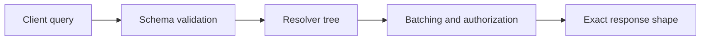
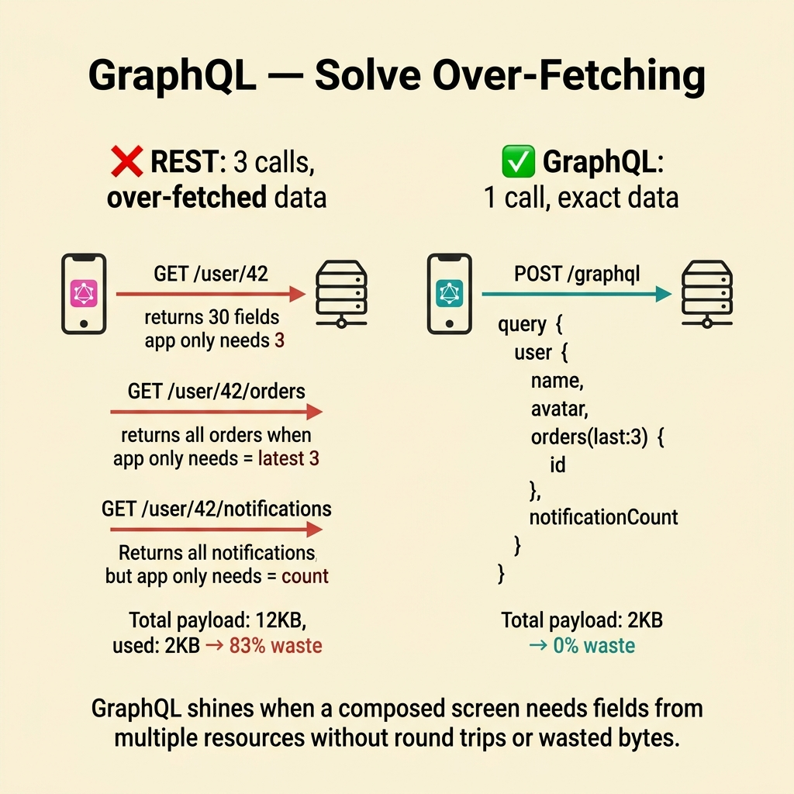
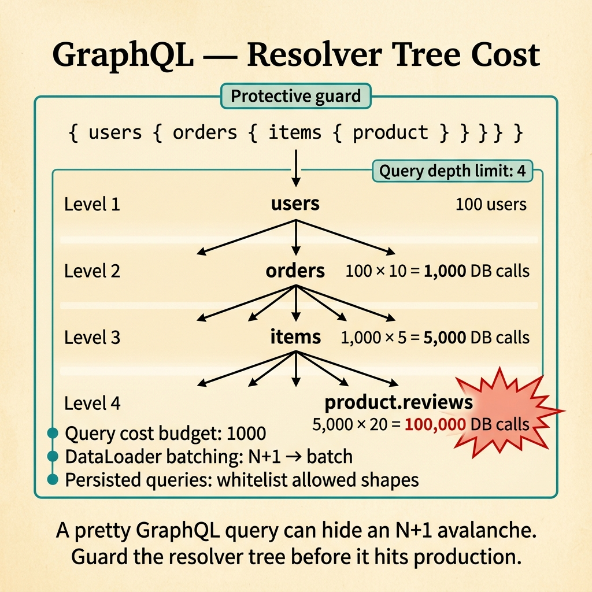
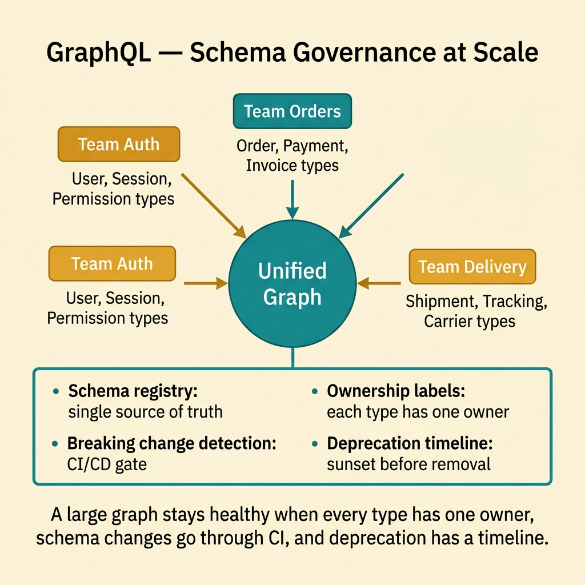
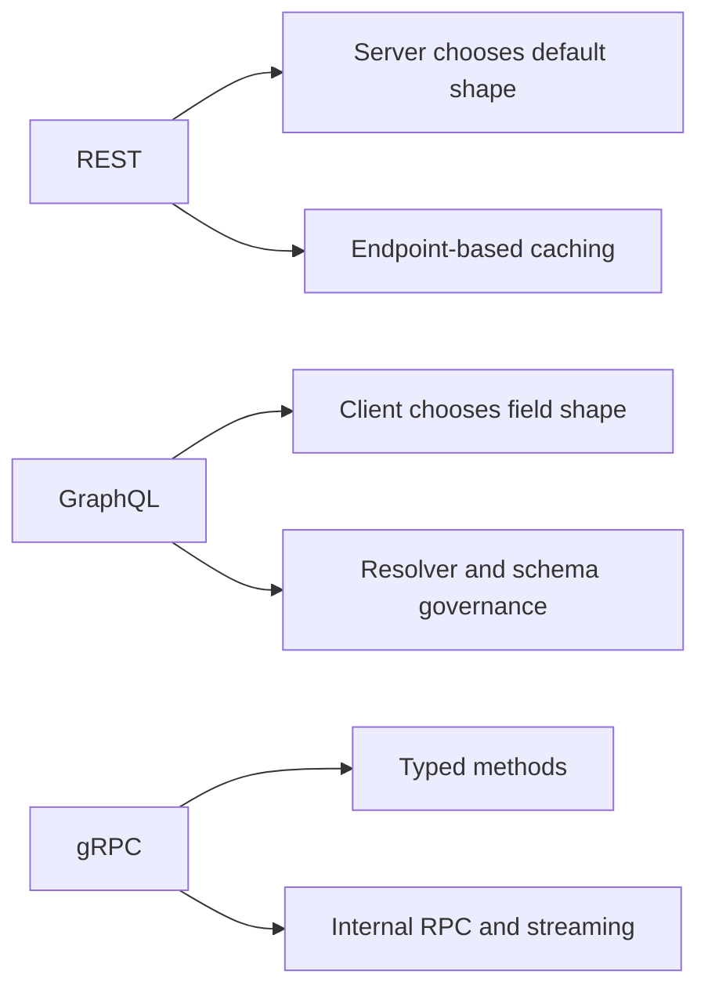
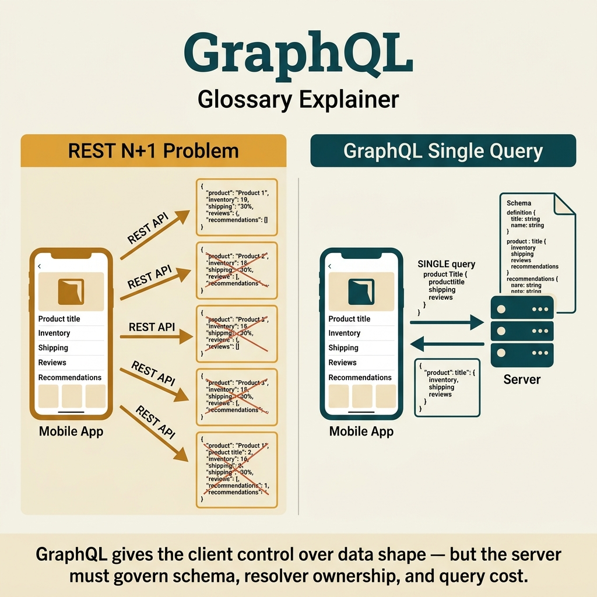

<!-- tags: glossary, reference, api-design, graphql -->
# GraphQL

> A query language and schema contract that lets clients ask for the exact shape of data they need instead of accepting one fixed representation.

| Aspect | Detail |
| --- | --- |
| **Concept** | A typed query surface where the client chooses fields and relationships per request. |
| **Audience** | Backend engineer, API designer, reviewer, platform owner |
| **Primary style** | Glossary term |
| **Entry point** | Use it when API pressure comes from UI composition and over-fetching becomes a real cost. |

📅 Created: 2026-03-30 · 🔄 Updated: 2026-04-17 · ⏱️ 7 min read

---

## 1. DEFINE

Picture a product detail screen that needs title, inventory, a shipping quote, the latest three reviews, and a recommendation block. With the current REST surface, the frontend makes five calls, stitches payloads together, and throws half the fields away. Backend dashboards show request counts rising, cache efficiency falling, and nobody can say which screen truly needs which field. That is when **GraphQL** starts making sense.

**GraphQL** is a typed API query language and schema that lets the client request the exact fields and relationships it needs in one call.

GraphQL gives the client more control over data shape. The price is that the server must govern schema ownership, resolver cost, batching, and query complexity with real discipline.

| Variant | Description |
| --- | --- |
| Query and Mutation | Read and write through one typed schema. |
| Subscription | Push events through the same schema for realtime use cases. |
| Federation | Compose many subgraphs into one shared graph. |

| Approach | Time | Space | Choose it when |
| --- | --- | --- | --- |
| Single graph for UI composition | Query-depth shaped | Schema-shaped | One client view needs data from many domains in one request. |
| Resolver batching | Fan-out shaped | Batch-shaped | You need to avoid N+1 queries and latency zigzags. |
| Query cost governance | O(1) guard | O(1) | The graph is large enough to be abused by heavy queries. |

Core insight:

> GraphQL is strongest when the real problem is client composition. If payload shape is not the pain, the server only inherits more complexity.

### 1.1 Invariants and Failure Modes

- Every field and relationship needs clear ownership.
- Resolvers need batching or caching when a query fans out.
- Growing graphs need complexity limits, depth limits, or persisted queries.

The common failure mode is adopting GraphQL because the client syntax looks elegant while the server still has no resolver discipline. N+1 queries then eat the early win.

---

## 2. CONTEXT

**Who uses it**: Backend engineer, API designer, reviewer, platform owner

**When**: Use it when API pressure comes from UI composition and over-fetching becomes a real cost.

**Why it matters**: GraphQL solves the data-shape negotiation problem. It does not remove the cost of governance.

**In this ecosystem**:
- Reach for `GraphQL` when one screen needs fields from several resources without excess payload.
- Stay with `REST` when the main need is a readable public contract with simple caching.
- Reach for `gRPC` when the main actor is an internal service that wants typed RPC and code generation.

The client-side win is easy to see. The harder part is understanding where server complexity migrates once fields become cheap to request.

---

## 3. EXAMPLES

GraphQL becomes visible when mobile screens need only three fields while REST returns fifty, when nested resolvers create N+1 explosions, or when teams adopt GraphQL for fashion without enough governance. The examples below place it in those situations.



*Diagram: The example flow shows where GraphQL moves the work: from endpoint shape to schema execution.*

### Example 1: Basic - Cut over-fetching on a composed screen

> **Goal**: Let one UI screen fetch exactly the fields it needs in one request.
> **Approach**: Use one query that describes the required shape.
> **Example**: A product detail page only needs title, inventory, and three reviews.
> **Complexity**: Basic



*Figure: GraphQL shines when a composed screen needs fields from multiple resources without round trips or wasted bytes.*

```graphql
query ProductDetail($id: ID!) {
  product(id: $id) {
    id
    title
    inventory
    reviews(limit: 3) {
      rating
      comment
    }
  }
}
```

**Conclusion**: At the basic level, GraphQL pays off when it removes round-trips and strips away unused fields.

### Example 2: Intermediate - Guard a pretty query from becoming an expensive resolver tree

> **Goal**: Stop a client-friendly query from turning into N+1 work on the server.
> **Approach**: Review resolver strategy before exposing another field.
> **Example**: The team adds `reviews.author.avatar`, and latency jumps.
> **Complexity**: Intermediate



*Figure: A pretty GraphQL query can hide an N+1 avalanche. Guard the resolver tree before it hits production.*

```yaml
graphql_field_review:
  field: product.reviews.author
  ask_first:
    - "Does this field trigger extra work for every item?"
    - "Do we already have batching, DataLoader, or a prefetch strategy?"
    - "Is this field needed by many consumers or one screen only?"
  reject_if:
    - "resolver cost is not measurable"
    - "field ownership is unclear"
```

> **Why?** GraphQL rarely fails at query syntax. It fails when adding a field feels cheap while every new field grows the execution tree.

**Conclusion**: Long-lived GraphQL systems review fields as part of API surface, not as tiny implementation details.

### Example 3: Advanced - Keep a large graph governed across many teams

> **Goal**: Prevent a shared graph from becoming a dumping ground for every domain.
> **Approach**: Enforce ownership, deprecation, and cost budgets at schema level.
> **Example**: Several teams add fields to one super-app graph.
> **Complexity**: Advanced



*Figure: A large graph stays healthy when every type has one owner and schema changes go through CI.*

```yaml
schema_governance:
  require:
    - "field owner"
    - "deprecation policy"
    - "complexity budget"
    - "resolver observability"
  fail_if:
    - "a field is added without a clear consumer"
    - "a schema change has no migration note"
    - "a subscription opens without a fan-out plan"
```

> **Why?** Once the graph becomes a platform, each new field becomes an operational promise. Governance keeps that promise visible.

**Conclusion**: At the advanced level, GraphQL is as much a schema-governance problem as it is a contract-design problem.

---

## 4. COMPARE



*Diagram: GraphQL sits between public HTTP resource contracts and internal typed RPC. Its unique move is client-controlled payload shape.*



*Figure: GraphQL sits between public HTTP resource contracts and internal typed RPC.*

If `REST` makes the contract easy to read, `GraphQL` makes the client ask for precisely what it needs. Both are contracts. The center of control simply moves.

### Level 1

```text
Client query:
  product(id: "42") {
    title
    inventory
    reviews(limit: 3) { rating }
  }

Server:
  schema validate -> resolve field tree -> return requested shape
```

*Diagram: Level 1 shows that GraphQL changes how client and server negotiate shape, not just how endpoints are named.*

### Level 2

```text
Fixed REST response shape                Query-shaped GraphQL response
-------------------------                ------------------------------
Server picks default fields              Client picks requested fields
Endpoint caching is straightforward      Resolver governance becomes central
Over-fetching is common                  Resolver cost becomes the new risk
```

*Diagram: Level 2 shows that GraphQL does not erase complexity. It relocates complexity into schema execution.*

### Easy-to-miss Boundary Drift

When teams misuse **GraphQL**, the problem is rarely the definition. The problem is choosing it for the wrong pressure.

| # | Severity | Mistake | Consequence | Fix |
| --- | --- | --- | --- | --- |
| 1 | 🔴 Fatal | Adopting GraphQL when composition is not the real pain | The server absorbs schema and resolver complexity for no meaningful win | Prove that over-fetching or under-fetching is the real symptom |
| 2 | 🟡 Common | Adding fields without reviewing resolver cost | Client queries look elegant while latency and DB load climb | Apply the field review gate from Example 2 |
| 3 | 🟡 Common | Leaving the schema ownerless | The graph turns into a shared junk drawer | Assign owners and deprecation rules by schema area |
| 4 | 🔵 Minor | Treating GraphQL as "REST but nicer" | Teams compare the wrong neighbors | Remember that GraphQL changes who controls response shape |

### Quick Scan

| If you see | Do this |
| --- | --- |
| One screen calls too many endpoints | Check whether the pain is real composition pressure |
| Queries look good but the server slows down | Review resolver cost and batching |
| The graph is growing too fast | Use the governance checklist from Example 3 |

---

## 5. REF

| Resource | Type | Link | Note |
| --- | --- | --- | --- |
| GraphQL Learn | Official | https://graphql.org/learn/ | Foundation for schema, query, and execution model |
| DataLoader | Reference | https://github.com/graphql/dataloader | Common pattern for reducing N+1 work in resolvers |
| Apollo GraphQL Schema Design | Reference | https://www.apollographql.com/docs/graphos/schema-design/ | Practical guidance for schema governance |

---

## 6. RECOMMEND

GraphQL solves data-shape pressure. If the shape is now flexible but the contract still struggles to live cleanly, the next blind spot usually sits in typed RPC, docs, or governance.

| Explore next | When to read next | Why | File/Link |
| --- | --- | --- | --- |
| gRPC | The main actor is an internal service, not a UI | The pain has moved to typed RPC and streaming | [gRPC](./03-grpc.md) |
| OpenAPI / Swagger | You still need a source of truth for public contracts and review flows | Introspection does not replace contract governance | [OpenAPI / Swagger](./07-openapi-swagger.md) |
| REST | You realize the real need is simply a legible public HTTP contract | The team may not need GraphQL at all | [REST](./01-rest.md) |

Return to the mobile screen from the opening. GraphQL solves over-fetching, but it creates new work in N+1 control, authorization, caching, and schema governance. The trade-off is explicit, not free.

**Links**: [← Previous](./01-rest.md) · [→ Next](./03-grpc.md)
