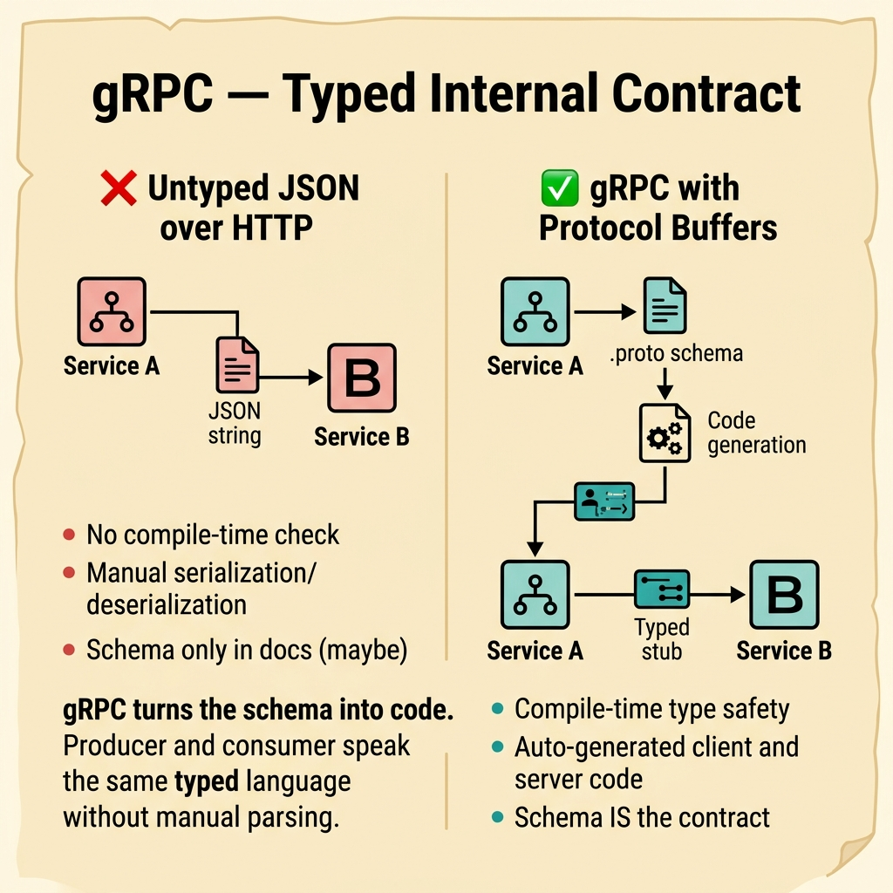
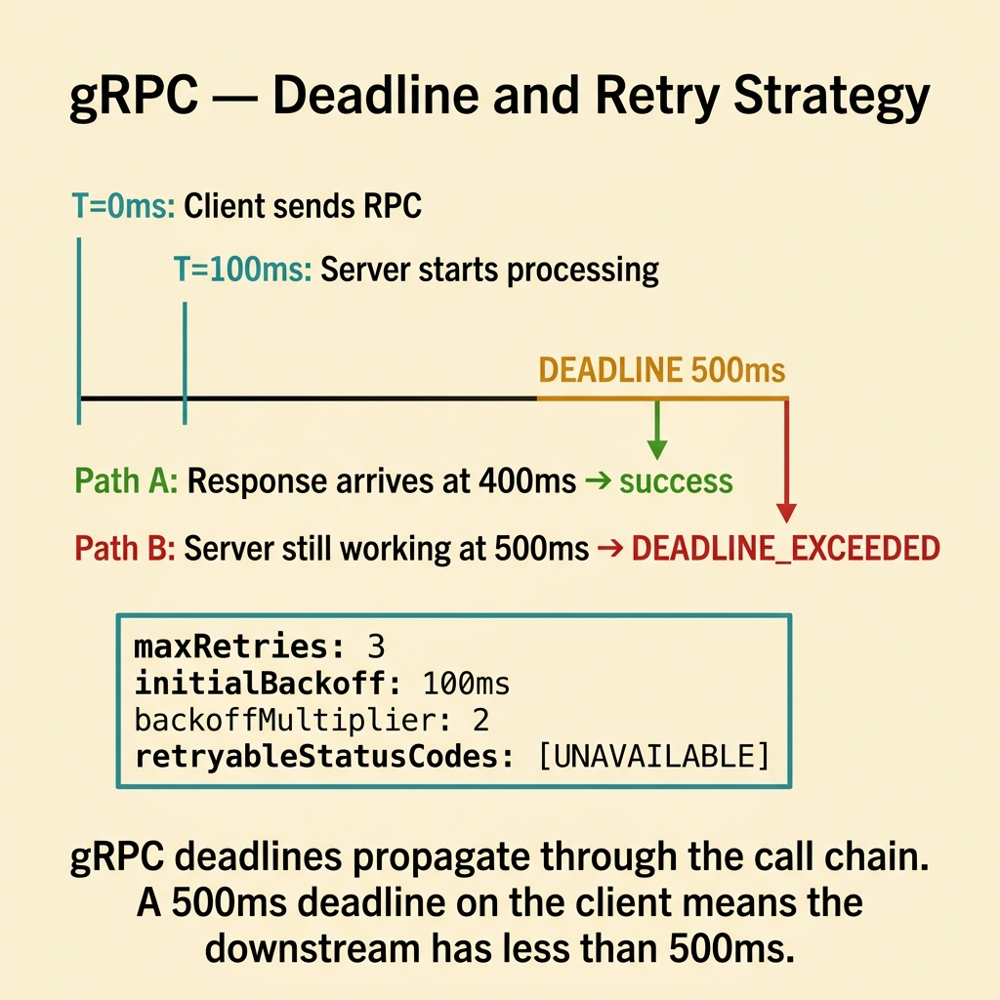
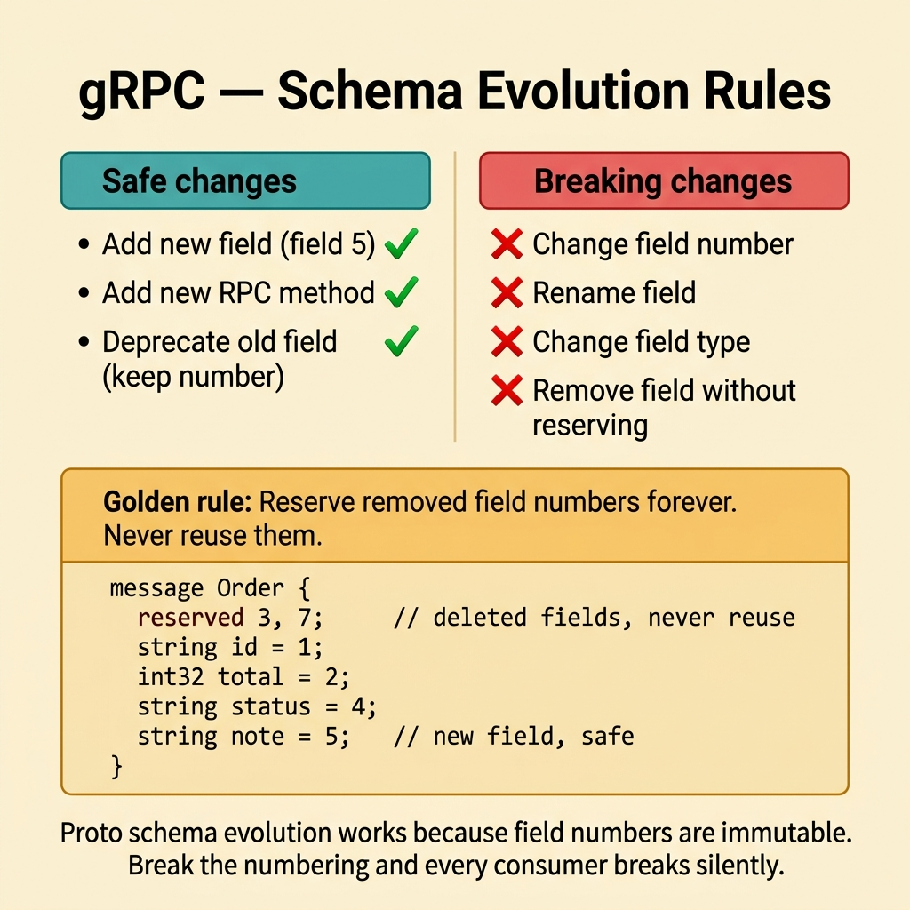
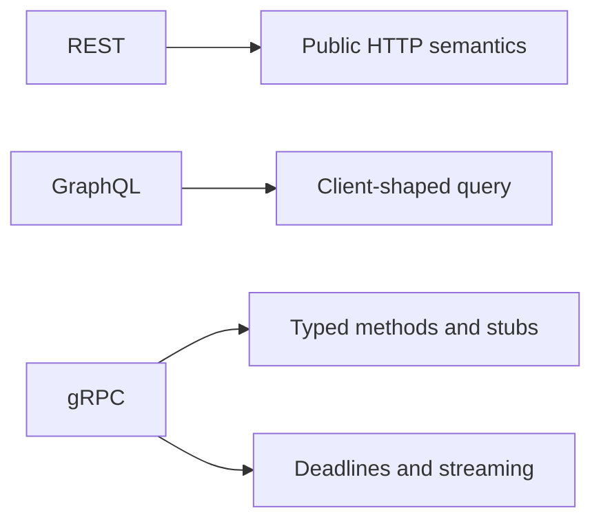
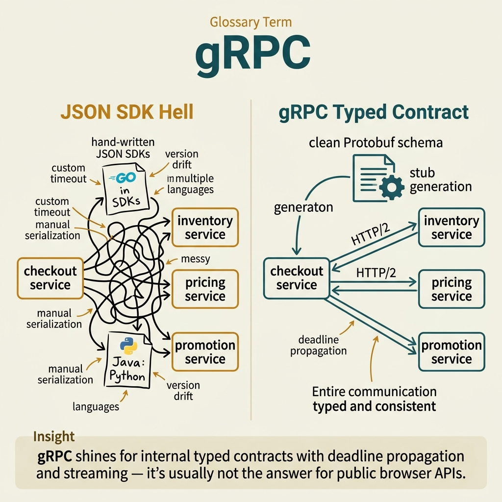

<!-- tags: glossary, reference, api-design, grpc -->
# gRPC

> A remote procedure call model built on Protocol Buffers and HTTP/2 for typed contracts, generated stubs, and streaming at service-to-service boundaries.

| Aspect | Detail |
| --- | --- |
| **Concept** | Typed RPC over protobuf and HTTP/2, designed for internal service communication. |
| **Audience** | Backend engineer, API designer, reviewer, platform owner |
| **Primary style** | Glossary term |
| **Entry point** | Use it when internal services are feeling real pressure from latency, contract drift, or code generation needs. |

📅 Created: 2026-03-30 · 🔄 Updated: 2026-04-17 · ⏱️ 7 min read

---

## 1. DEFINE

Picture a checkout service calling inventory, pricing, and promotion on its hot path. Over time, every client library grows a little JSON wrapper, a little timeout wrapper, and a little language-specific drift. At high traffic, all those "little" layers turn into latency and strange cross-language bugs. The team starts asking whether the internal contract can be typed, generated, and streamed with one shared source. That is the boundary of **gRPC**.

**gRPC** is a remote procedure call model that uses Protocol Buffers and HTTP/2 to define service methods, generate client and server stubs, and support both unary and streaming calls.

gRPC is most valuable when the primary consumer is another internal service, SDK, or data pipeline that benefits from typed contracts and explicit deadlines. It is usually not the cleanest answer for public browser APIs.

| Variant | Description |
| --- | --- |
| Unary RPC | One request produces one response. |
| Streaming RPC | Data flows as a stream instead of isolated requests. |
| Protobuf contract-first | One schema defines the contract across many languages. |

| Approach | Time | Space | Choose it when |
| --- | --- | --- | --- |
| Typed internal API | Method-count shaped | Schema-shaped | You want to reduce drift across internal clients and servers. |
| Streaming transport | Stream-length shaped | Buffer-shaped | You need progress updates, telemetry, or flowing data. |
| gRPC behind a gateway | O(1) | O(1) | Public clients still need HTTP and JSON, but internals need typed RPC. |

Core insight:

> gRPC is worth its learning curve only when typed contracts, generated stubs, or streaming are real requirements.

### 1.1 Invariants and Failure Modes

- The protobuf schema must be treated as a reviewed contract.
- Deadline, retry, and error mapping must be explicit between services.
- Field and message evolution must avoid breaking older consumers.

The common failure mode is choosing gRPC because it sounds fast while the real problem is timeout governance, observability, or browser fit. The team then trades JSON pain for platform pain.

---

## 2. CONTEXT

**Who uses it**: Backend engineer, API designer, reviewer, platform owner

**When**: Use it when internal services feel real pressure from latency, code generation, and typed contract drift.

**Why it matters**: gRPC shines when the actor is internal and the contract benefits from being typed and generated.

**In this ecosystem**:
- Choose `gRPC` when many internal services across languages must share one contract.
- Choose `REST` when the main consumer is external and needs browser-friendly HTTP semantics.
- Choose `GraphQL` when the pain is UI composition, not typed RPC.

Binary transport and code generation are easy to admire. The harder question is where policy must sit so the contract remains safe in production.

---

## 3. EXAMPLES

gRPC becomes visible when services call each other at high frequency, when a stream is more natural than many requests, or when a team wants public APIs to inherit an internal RPC model they do not fit. The examples below place it in those moments.


*Diagram: The example flow shows that schema and call policy must travel together.*

### Example 1: Basic - Generate a typed contract for internal services

> **Goal**: Let multiple services speak one contract without hand-maintained client conventions.
> **Approach**: Start from a protobuf schema and generate stubs from it.
> **Example**: Checkout calls inventory to reserve stock.
> **Complexity**: Basic



*Figure: gRPC turns the schema into code. Producer and consumer speak the same typed language without manual parsing.*

```proto
syntax = "proto3";

service InventoryService {
  rpc ReserveStock(ReserveStockRequest) returns (ReserveStockResponse);
}

message ReserveStockRequest {
  string order_id = 1;
  string sku = 2;
  int32 quantity = 3;
}

message ReserveStockResponse {
  bool reserved = 1;
  string reservation_id = 2;
}
```

**Conclusion**: At the basic level, gRPC earns its place by letting client and server share one typed contract.

### Example 2: Intermediate - Review deadline and retry with the schema

> **Goal**: Stop a clean RPC slide deck from becoming timeout chaos in production.
> **Approach**: Review call policy together with the method contract.
> **Example**: Checkout calls inventory on a hot path.
> **Complexity**: Intermediate



*Figure: gRPC deadlines propagate through the call chain. A 500ms deadline on the client means the downstream has less than 500ms.*

```yaml
grpc_call_policy:
  method: InventoryService.ReserveStock
  require:
    - "client deadline"
    - "retry rule for idempotent methods"
    - "error code mapping"
    - "observability labels by method"
  reject_if:
    - "the schema exists but timeout policy does not"
    - "retry is enabled without a clear idempotency rule"
```

> **Why?** Typed contracts do not save a system from loose timeout behavior. The call policy is part of the contract.

**Conclusion**: A healthy gRPC surface reviews networking policy at the same time as protobuf shape.

### Example 3: Advanced - Protect schema evolution across many consumers

> **Goal**: Evolve protobuf messages without surprising older clients.
> **Approach**: Put evolution rules in the review gate.
> **Example**: A shared protobuf package is used across many services and languages.
> **Complexity**: Advanced



*Figure: Proto schema evolution works because field numbers are immutable. Break the numbering and every consumer breaks silently.*

```yaml
protobuf_evolution_gate:
  allow:
    - "add new optional fields with fresh numbers"
    - "reserve removed field numbers"
    - "document enum expansion risk"
  reject_if:
    - "field numbers are reused"
    - "required-like assumptions are introduced through application logic"
    - "breaking message changes ship without consumer audit"
```

> **Why?** Protobuf feels stable until one reused field number gives an old client a wrong meaning that is hard to trace back.

**Conclusion**: At the advanced level, gRPC is as much a schema-evolution discipline as it is a fast transport.

---

## 4. COMPARE



*Diagram: gRPC belongs beside REST and GraphQL only when the comparison is contract shape. Its special value is typed RPC for internal actors.*



*Figure: gRPC belongs beside REST and GraphQL only when the comparison is contract shape.*

Once binary transport and code generation sound attractive, the next question is not "is it faster?" It is "is this the right lane?"

### Level 1

```text
Client stub
  -> InventoryService.ReserveStock(...)
  -> protobuf request over HTTP/2
  -> protobuf response or stream
```

*Diagram: Level 1 shows how gRPC makes a network call feel like a typed method call.*

### Level 2

```text
REST                                  gRPC
----                                  ----
Resource and HTTP semantics           Typed method contract
Browser-friendly public surface       Internal service boundary
JSON by default                       Protobuf by default
Caching and status vocabulary         Deadlines, stubs, and streaming
```

*Diagram: Level 2 shows that gRPC is not "REST but faster." It solves a different boundary problem.*

### Easy-to-miss Boundary Drift

When teams misuse **gRPC**, the issue is usually context, not definition.

| # | Severity | Mistake | Consequence | Fix |
| --- | --- | --- | --- | --- |
| 1 | 🔴 Fatal | Choosing gRPC for public or browser APIs just because it sounds fast | Gateways, tooling, and consumer experience become painful | Use gRPC when the main consumers are internal typed clients |
| 2 | 🟡 Common | Reviewing the schema without deadline or retry policy | Production pain reappears as timeout drift and retry storms | Review call policy together with the method contract |
| 3 | 🟡 Common | Reusing field numbers or evolving enums carelessly | Older consumers silently decode the wrong meaning | Enforce protobuf evolution rules |
| 4 | 🔵 Minor | Treating gRPC as "faster REST" | Teams compare the wrong lane and expect the wrong value | Remember that gRPC solves typed RPC, not public HTTP semantics |

### Quick Scan

| If you see | Do this |
| --- | --- |
| Internal clients keep drifting apart | Recheck protobuf and stub strategy |
| Hot-path service calls have no explicit deadlines | Run the call-policy review from Example 2 |
| A shared schema is about to roll out broadly | Apply the evolution gate from Example 3 |

---

## 5. REF

| Resource | Type | Link | Note |
| --- | --- | --- | --- |
| gRPC Documentation | Official | https://grpc.io/docs/ | Baseline for deadlines, retries, and streaming |
| Protocol Buffers Guide | Official | https://protobuf.dev/programming-guides/proto3/ | Source of truth for schema evolution rules |
| gRPC over HTTP/2 | Reference | https://grpc.github.io/grpc/core/md_doc__p_r_o_t_o_c_o_l-_h_t_t_p2.html | Wire-level reference for deep debugging |

---

## 6. RECOMMEND

gRPC solves internal typed-contract pressure. If the contract is now typed but the next pain sits in delivery or long-lived compatibility, open the lane that actually owns that problem.

| Explore next | When to read next | Why | File/Link |
| --- | --- | --- | --- |
| Webhook | Data should arrive as producer-pushed events, not synchronous RPC | The problem has shifted from request/response to delivery semantics | [Webhook](./04-webhook.md) |
| Versioning | The schema must live across many older consumers | Contract evolution becomes the next blind spot | [Versioning](./08-versioning.md) |
| REST | The real audience turns out to be public and external | The correct baseline may be public HTTP, not internal RPC | [REST](./01-rest.md) |

Return to the hot path from the opening. Protobuf, generated stubs, and HTTP/2 can remove real friction. They just do not replace a public HTTP contract when the audience and ecosystem are different.

**Links**: [← Previous](./02-graphql.md) · [→ Next](./04-webhook.md)
