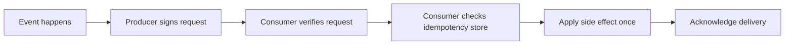
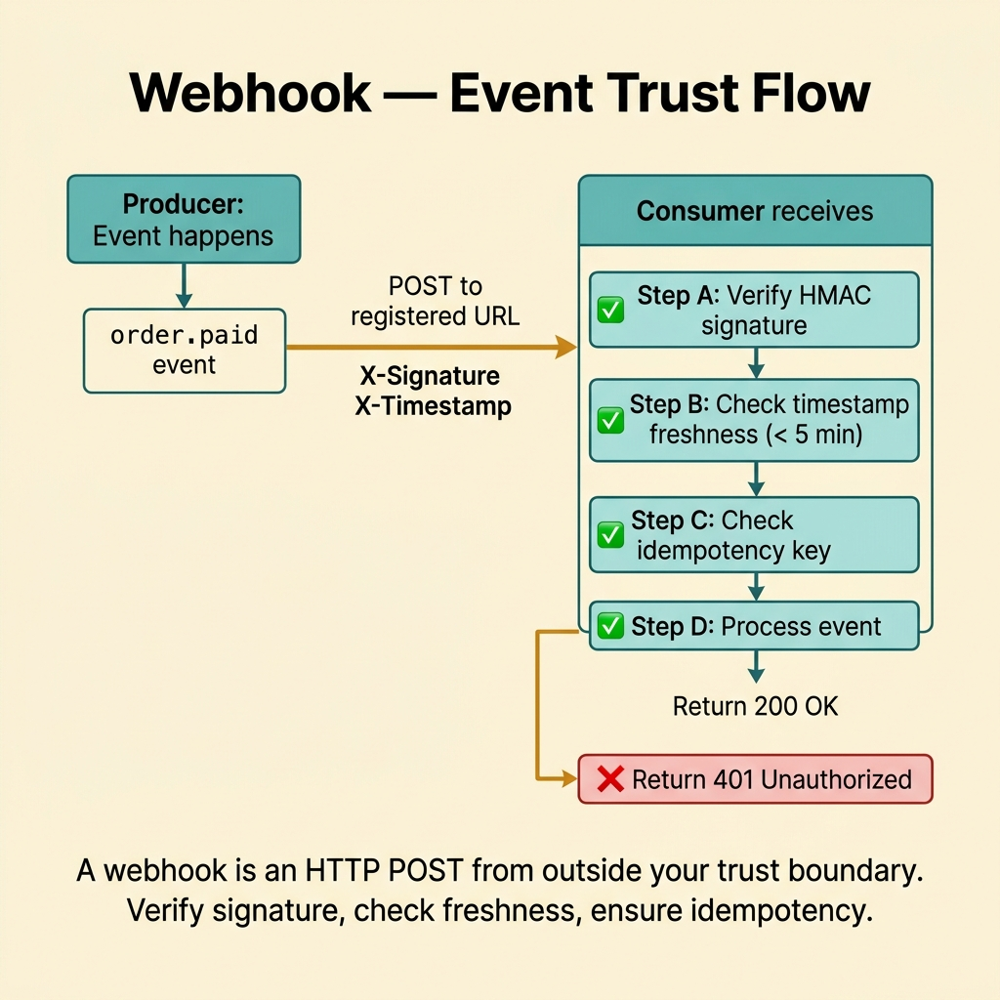
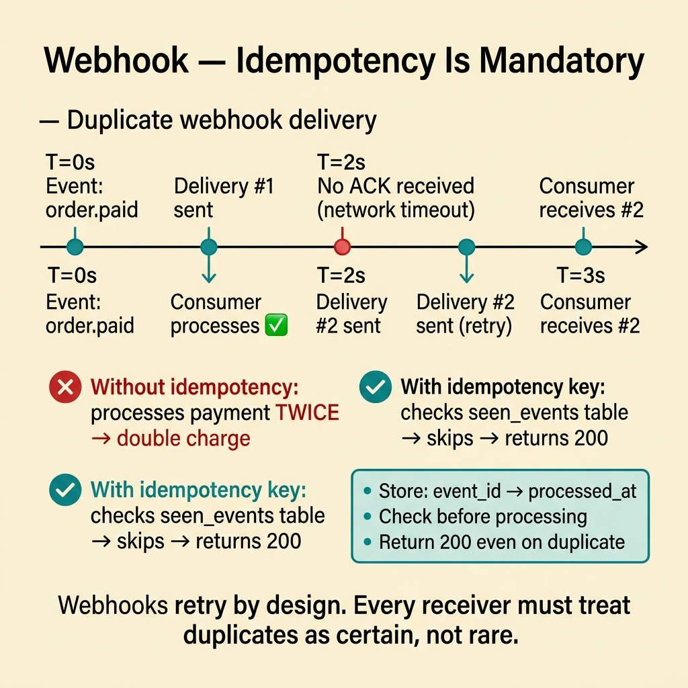
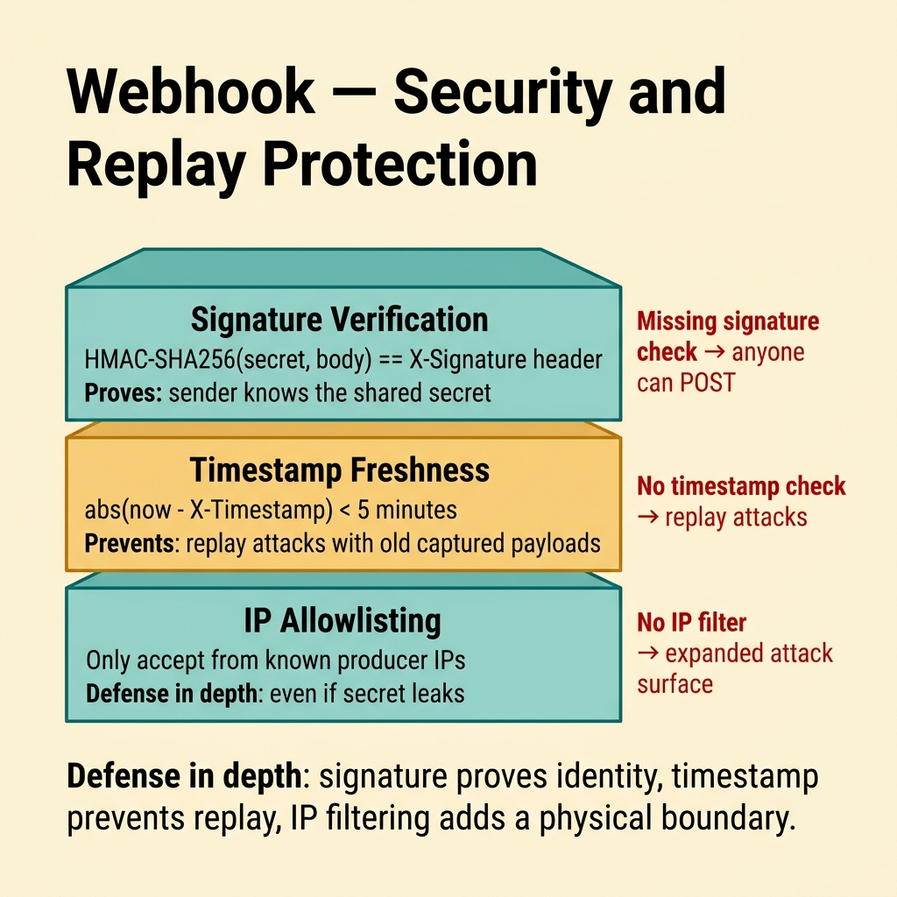
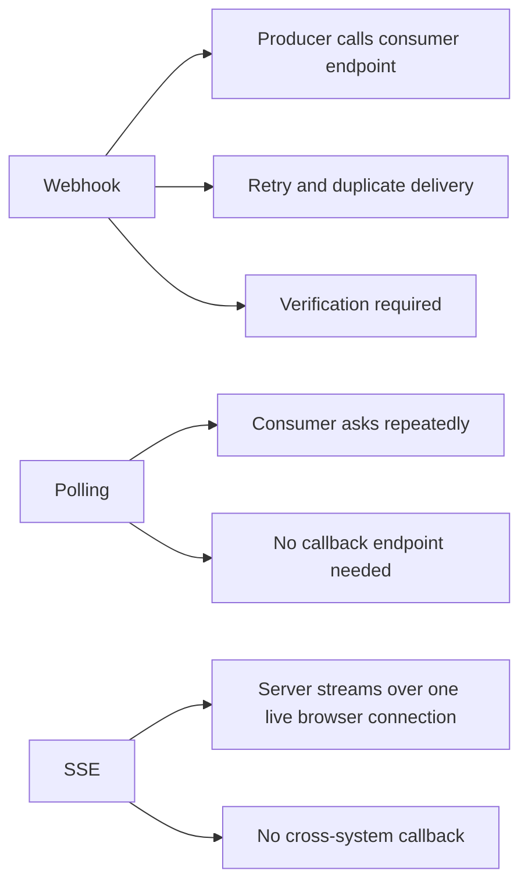
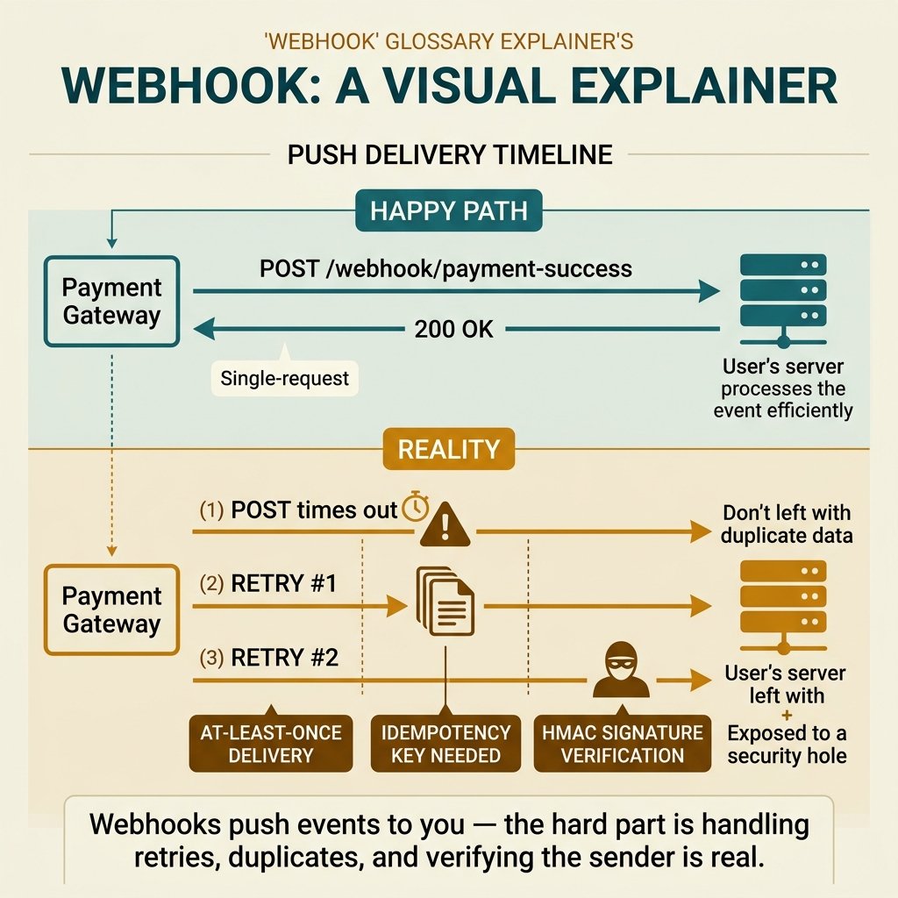

<!-- tags: glossary, reference, api-design, webhook -->
# Webhook

> An HTTP callback that lets a producer notify a consumer about an event, with retry, duplicate delivery, and request verification built into the deal.

| Aspect | Detail |
| --- | --- |
| **Concept** | A producer-initiated HTTP callback, usually delivered with at-least-once semantics. |
| **Audience** | Backend engineer, API designer, reviewer, platform owner |
| **Primary style** | Glossary term |
| **Entry point** | Use it when the producer must notify another system and cannot wait for the consumer to poll. |

📅 Created: 2026-03-30 · 🔄 Updated: 2026-04-17 · ⏱️ 7 min read

---

## 1. DEFINE

Picture a payment provider promising to call your endpoint every time a transaction succeeds. The demo looks fine. In production, one request times out, another arrives twenty seconds late, and a duplicate shows up after your system has already sent the confirmation email. The problem is no longer "how do we accept an HTTP POST?" The problem is how to survive producer-initiated delivery across an unreliable network without duplicating side effects or trusting forged traffic. That is the boundary of **Webhook**.

**Webhook** is an HTTP callback where a producer actively calls a consumer endpoint when an event happens, usually with at-least-once delivery behavior.

Webhook is valuable when the producer must push an event into another system. The price is that the consumer must be ready for retry, duplicate delivery, replay, and authenticity checks.

| Variant | Description |
| --- | --- |
| Notification webhook | Announces that an event happened, then lets the consumer fetch details. |
| Full payload webhook | Pushes most of the needed data inside the callback itself. |
| Signed webhook | Adds signature and timestamp data for verification and replay control. |

| Approach | Time | Space | Choose it when |
| --- | --- | --- | --- |
| Event notification only | O(1) payload | O(1) | You want looser coupling and can fetch details later. |
| Retry plus idempotency | Retry-policy shaped | Key-store shaped | Network failure and duplicates are normal, not exceptional. |
| Signature verification | O(1) | O(1) | The callback crosses internet or tenant trust boundaries. |

Core insight:

> Webhook is not "push API" in the abstract. It is a delivery contract where duplicate handling and trust verification belong in the design from day one.

### 1.1 Invariants and Failure Modes

- The consumer must be idempotent around a stable event or message key.
- The producer needs a clear retry policy and acknowledgment expectation.
- The trust boundary needs signature checks, timestamp checks, or an equivalent control.

The classic failure is treating a webhook like a one-time callback. The moment retries happen, duplicated side effects and drift appear immediately.

---

## 2. CONTEXT

**Who uses it**: Backend engineer, API designer, reviewer, platform owner

**When**: Use it when a producer must notify another system and the consumer should not keep polling.

**Why it matters**: Webhook moves the update burden to the producer, but it also moves delivery risk onto the consumer design.

**In this ecosystem**:
- Choose `Webhook` when the producer must actively notify another system that owns a callback endpoint.
- Choose `Polling / Long Polling` when the consumer still must ask for updates itself.
- Choose `SSE` when a browser tab keeps one open connection and only needs one-way streaming.

Once producer-initiated delivery is on the table, the real question becomes how the callback survives retries, duplicates, and hostile traffic.

---

## 3. EXAMPLES

Webhook becomes visible when a payment gateway reports results, when replay produces duplicate charges, or when an attacker imitates a trusted provider because the consumer never verifies the request. The examples below put webhook in those situations.



*Diagram: The example flow shows that verification and deduplication happen before the side effect.*

### Example 1: Basic - Receive an event and still know why you trust it

> **Goal**: Define a webhook request so the consumer can tell what happened and why it should trust the sender.
> **Approach**: Put an event key, event type, timestamp, and signature into the contract.
> **Example**: A payment provider sends `payment.succeeded` to a merchant endpoint.
> **Complexity**: Basic



*Figure: A webhook is an HTTP POST from outside your trust boundary. Verify signature, check freshness, ensure idempotency.*

```http
POST /webhooks/payments HTTP/1.1
Content-Type: application/json
X-Event-Id: evt_123
X-Event-Type: payment.succeeded
X-Signature: t=1712200000,v1=abc123

{
  "payment_id": "pay_42",
  "order_id": "order_7",
  "amount": 420000
}
```

**Conclusion**: At the basic level, a healthy webhook contract names both the event and the trust signal.

### Example 2: Intermediate - Treat duplicates as certain, not rare

> **Goal**: Stop producer retries from multiplying side effects.
> **Approach**: Check a processed-event ledger before any irreversible work happens.
> **Example**: The consumer has already sent one email for `evt_123`, and the producer retries.
> **Complexity**: Intermediate



*Figure: Webhooks retry by design. Every receiver must treat duplicates as certain, not rare.*

```yaml
webhook_consumer_gate:
  event_id_header: X-Event-Id
  process_flow:
    - "verify signature"
    - "check processed-event store"
    - "skip if the event already exists"
    - "apply side effect"
    - "mark processed"
  fail_if:
    - "the side effect runs before the duplicate check"
```

> **Why?** Producers retry to make delivery durable. Consumers become durable only when they design around duplicates as a baseline fact.

**Conclusion**: Idempotency is not an enhancement for webhooks. It is the condition that keeps the integration sane.

### Example 3: Advanced - Lock down trust and replay windows

> **Goal**: Keep a webhook endpoint from becoming a back door for forged or replayed traffic.
> **Approach**: Formalize signature verification, timestamp skew, and key rotation.
> **Example**: One webhook surface spans many tenants and environments over the public internet.
> **Complexity**: Advanced



*Figure: Defense in depth: signature proves identity, timestamp prevents replay, IP filtering adds a physical boundary.*

```yaml
webhook_security_policy:
  require:
    - "signature verification"
    - "timestamp skew limit"
    - "secret rotation plan"
    - "separate secrets per environment"
  reject_if:
    - "the consumer trusts requests just because they arrived over HTTP"
    - "the replay window is undefined"
```

> **Why?** Webhooks often live on a harsher trust boundary than ordinary pull APIs. The trust assumptions must therefore be part of the contract.

**Conclusion**: At the advanced level, a good webhook design models retry, duplicate delivery, and trust as first-class concerns.

---

## 4. COMPARE



*Diagram: Webhook differs from polling and SSE because the producer actively calls across a trust boundary into another system.*



*Figure: Webhook differs from polling and SSE because the producer actively calls across a trust boundary.*

REST and gRPC talk about request and response contracts. Webhook only becomes clear when you see it as delivery under failure, where duplicate arrival is expected.

### Level 1

```text
event occurs -> producer POSTs webhook -> consumer returns 200 -> event gets handled
```

*Diagram: Level 1 shows the happy path, which is why teams often underestimate the rest of the design.*

### Level 2

```text
event occurs
  -> producer sends webhook
  -> timeout, 5xx, or packet loss happens
  -> producer retries
  -> the same event may arrive again
  -> idempotency and signature checks decide whether the integration survives
```

*Diagram: Level 2 shows that retries and duplicates are native behavior, not bad luck.*

### Easy-to-miss Boundary Drift

When teams misuse **Webhook**, the problem is rarely definition. It is usually false confidence about delivery or trust.

| # | Severity | Mistake | Consequence | Fix |
| --- | --- | --- | --- | --- |
| 1 | 🔴 Fatal | Running the side effect before checking duplicates | Emails, charges, or ledger writes happen twice | Use an event ledger like Example 2 |
| 2 | 🟡 Common | Skipping signature verification because the partner is "trusted" | Forged or replayed traffic reaches the consumer | Enforce the trust gate from Example 3 |
| 3 | 🟡 Common | Sending a heavy full payload for every event even when the consumer does not need it | Coupling grows and contract evolution gets harder | Use notification-only mode when the consumer can fetch details |
| 4 | 🔵 Minor | Comparing webhook with REST as a shape alternative | The review argues in the wrong lane | Remember that webhook is a delivery model |

### Quick Scan

| If you see | Do this |
| --- | --- |
| The producer retries on timeout | Treat duplicates as default behavior |
| The consumer never verifies the sender | Add signature and timestamp checks to the contract |
| The team argues between webhook and stream | Ask whether the actor has a callback endpoint or an open connection |

---

## 5. REF

| Resource | Type | Link | Note |
| --- | --- | --- | --- |
| Stripe Webhooks | Official | https://docs.stripe.com/webhooks | Practical example of signing, retry, and duplicate handling |
| Svix Webhook Best Practices | Reference | https://www.svix.com/resources/webhook-best-practices/ | Guidance for secure, durable webhook delivery |
| Hookdeck Guides | Reference | https://hookdeck.com/webhooks/guides | Operational perspective on replay, observability, and delivery at scale |

---

## 6. RECOMMEND

Webhook solves producer-initiated delivery. If your problem is actually browser streaming or consumer-driven refresh, the next lane is easier to reason about.

| Explore next | When to read next | Why | File/Link |
| --- | --- | --- | --- |
| Polling / Long Polling | The consumer still must ask for status | A callback endpoint may not match the actor | [Polling / Long Polling](./05-polling-long-polling.md) |
| SSE | The consumer is a browser tab holding one live connection | One-way browser streaming is a different delivery shape | [SSE](./06-sse.md) |
| Versioning | The event contract is changing while many consumers remain alive | After delivery stabilizes, compatibility becomes the next blind spot | [Versioning](./08-versioning.md) |

Return to the payment example from the opening. HMAC signatures, idempotency keys, and retry rules are not polish. They are the core of webhook design.

**Links**: [← Previous](./03-grpc.md) · [→ Next](./05-polling-long-polling.md)
