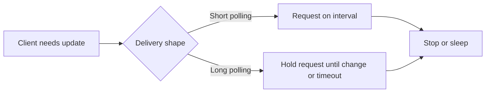
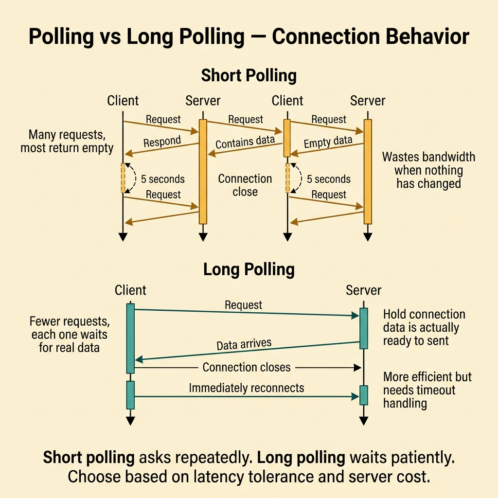
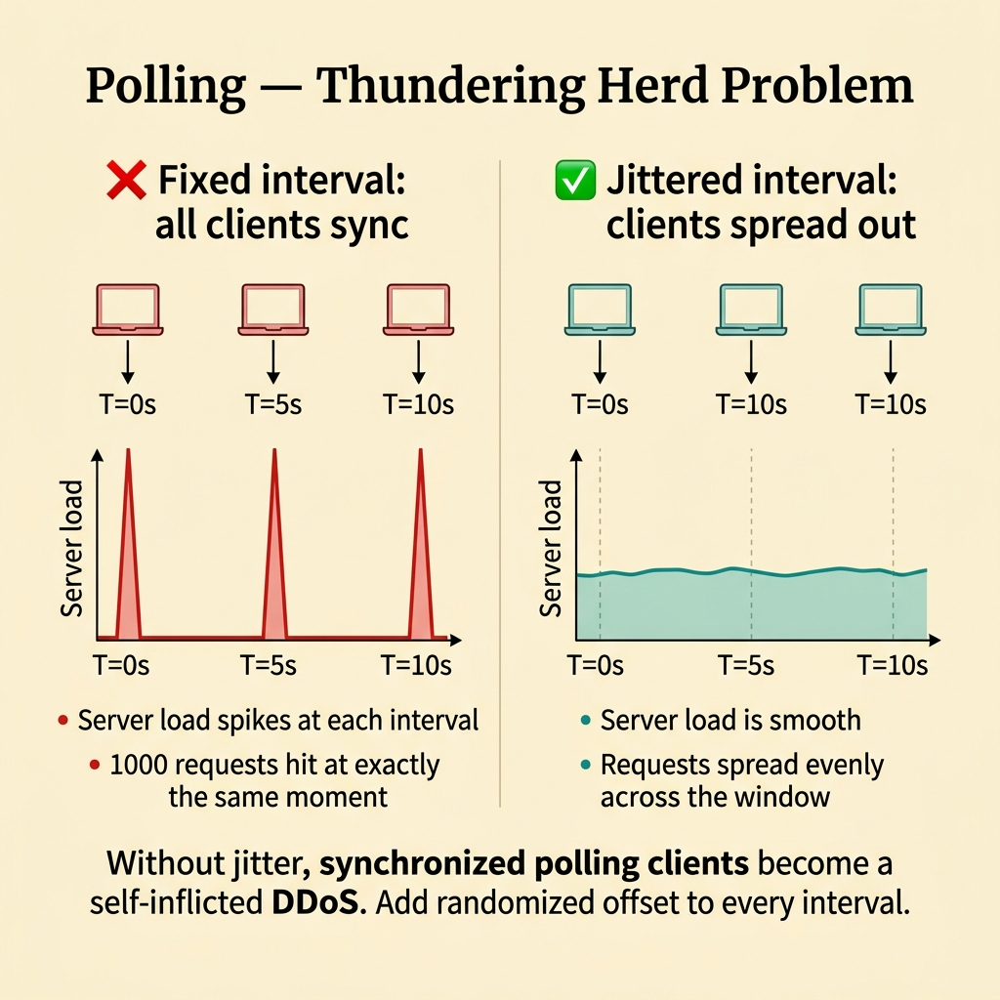
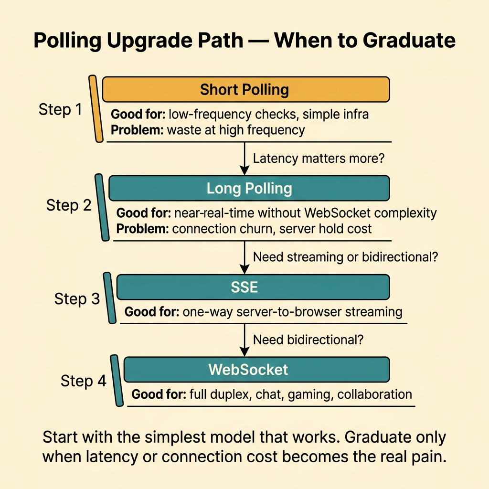
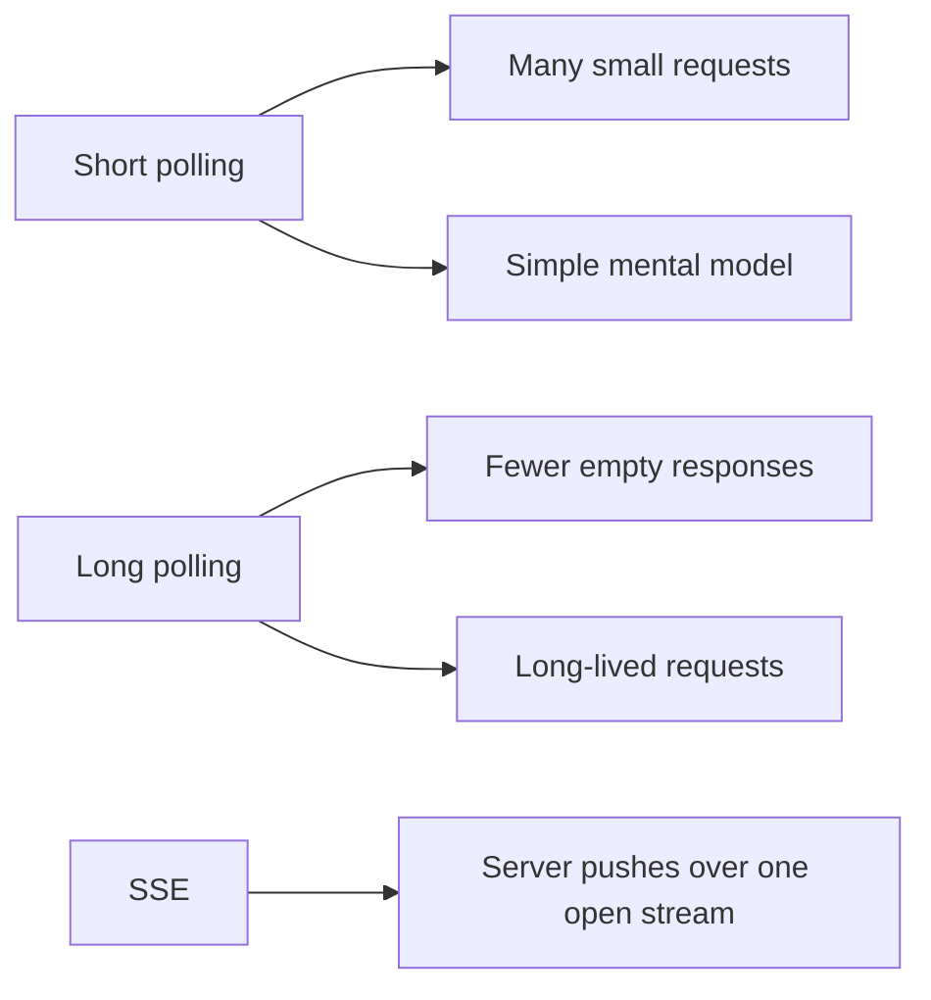
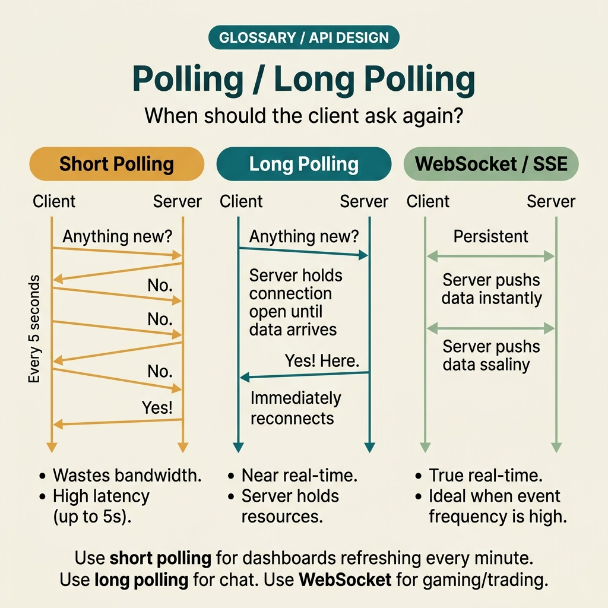

<!-- tags: glossary, reference, api-design, polling-long-polling -->
# Polling / Long Polling

> Two pull-based update models: polling asks on a schedule, while long polling keeps one request open to cut empty responses and shorten perceived wait time.

| Aspect | Detail |
| --- | --- |
| **Concept** | Client-driven update retrieval over HTTP, either by fixed intervals or held requests. |
| **Audience** | Backend engineer, API designer, reviewer, platform owner |
| **Primary style** | Glossary term |
| **Entry point** | Use it when the consumer cannot receive direct push and the team must balance freshness against request cost. |

📅 Created: 2026-03-30 · 🔄 Updated: 2026-04-17 · ⏱️ 7 min read

---

## 1. DEFINE

Picture an admin dashboard waiting to learn whether an export job has finished. The team does not want to expose callback endpoints for every tenant, and it does not want to pay for a richer realtime stack yet. The easiest move is a browser loop that asks every two seconds, "is it done now?" At small scale, that is fine. At large scale, thousands of tabs mainly receive "not yet" all day. That is the boundary of **Polling / Long Polling**.

**Polling / Long Polling** are two pull-based ways for a client to ask for new state. Polling uses fixed intervals. Long polling keeps a request open until new data appears or a timeout expires.

Both models solve client-driven refresh. The real difference is economic. Polling spends more empty requests. Long polling spends longer-lived connections to reduce wasted asks.

| Variant | Description |
| --- | --- |
| Short polling | Ask on a fixed interval. Simple, but often wasteful. |
| Long polling | Hold a request until data changes or the timeout expires. |
| Adaptive polling | Adjust the interval by state, load, or urgency. |

| Approach | Time | Space | Choose it when |
| --- | --- | --- | --- |
| Simple interval poll | Interval-shaped | O(1) | Few actors watch a slowly changing state. |
| Long poll with timeout | Timeout-shaped | Connection-shaped | You need near-realtime without leaving HTTP pull. |
| Adaptive backoff | State-shaped | O(1) | Many consumers watch a process with distinct phases. |

Core insight:

> Polling is not outdated by default. It becomes expensive only when the freshness requirement does not justify the request and connection cost.

### 1.1 Invariants and Failure Modes

- The interval or timeout must reflect a real freshness need.
- The client needs reconnect and backoff rules.
- The server must understand how many empty requests or waiting connections it can afford.

The common failure is increasing polling frequency to mask a deeper delivery problem. That usually trades slow UX for a hot server.

---

## 2. CONTEXT

**Who uses it**: Backend engineer, API designer, reviewer, platform owner

**When**: Use it when the consumer cannot receive direct push and the team must balance freshness against request cost.

**Why it matters**: Polling stays useful when the pull model matches the actor and the cost remains proportional to the need.

**In this ecosystem**:
- Choose `Polling / Long Polling` when a browser or worker must ask for updates itself.
- Choose `Webhook` when another system can expose a callback endpoint and the producer should notify it.
- Choose `SSE` when a browser already holds a connection and only needs a one-way stream.

Once pull-based delivery is chosen, the next question is no longer "does it work?" The next question is "what does it cost under scale and waiting time?"

---

## 3. EXAMPLES

Polling becomes visible when a client checks every second for data that changes every five minutes, when ten thousand clients poll the same endpoint in lockstep, or when a long-polling client never reconnects after timeout. The examples below put it in those moments.



*Diagram: The example flow shows that both models stay pull-based. They only price waiting differently.*

### Example 1: Basic - Poll a short-lived async process

> **Goal**: Track one simple async task without adding push infrastructure.
> **Approach**: Poll on a clear interval and stop when the task reaches a terminal state.
> **Example**: A browser waits for an export result.
> **Complexity**: Basic



*Figure: Short polling asks repeatedly. Long polling waits patiently. Choose based on latency tolerance and server cost.*

```javascript
async function waitForExport(exportId) {
  while (true) {
    const res = await fetch(`/exports/${exportId}/status`);
    const data = await res.json();

    if (data.status === "done" || data.status === "failed") {
      return data;
    }

    await new Promise((resolve) => setTimeout(resolve, 2000));
  }
}
```

**Conclusion**: At the basic level, polling is reasonable when the actor count is low and empty requests are still cheaper than a push stack.

### Example 2: Intermediate - Use long polling to cut empty requests

> **Goal**: Reduce repeated "still not done" responses on a busy dashboard.
> **Approach**: Hold the request until new state arrives or the timeout fires, then reconnect with control.
> **Example**: Operators watch a queue-processing dashboard.
> **Complexity**: Intermediate



*Figure: Without jitter, synchronized polling clients become a self-inflicted DDoS. Add randomized offset to every interval.*

```yaml
long_poll_contract:
  endpoint: GET /jobs/42/updates
  server_behavior:
    - "hold the request for up to 25 seconds"
    - "return immediately when a new state appears"
    - "return 204 when the timeout expires without change"
  client_behavior:
    - "reconnect immediately after 204"
    - "back off after 429 or 5xx"
```

> **Why?** Long polling reduces empty responses, but it also creates timeout planning and connection-capacity work that short polling does not force as early.

**Conclusion**: Long polling is useful when empty requests are now a real cost but a richer push model still is not justified.

### Example 3: Advanced - Know when to leave polling behind

> **Goal**: Recognize the point where polling stops being a sensible compromise.
> **Approach**: Define exit criteria based on freshness pressure and wasted traffic.
> **Example**: Thousands of browser tabs watch state that changes every second.
> **Complexity**: Advanced



*Figure: Start with the simplest model that works. Graduate only when latency or connection cost becomes the real pain.*

```yaml
polling_exit_criteria:
  move_away_when:
    - "freshness must stay below one second"
    - "empty responses dominate the load"
    - "many consumers watch the same live event stream"
  next_options:
    browser_one_way: SSE
    cross_system_callback: Webhook
```

> **Why?** Polling does not fail because it is old. It fails when it is forced to solve a push problem.

**Conclusion**: At the advanced level, the skill is not just implementing polling well. It is leaving it at the right time.

---

## 4. COMPARE



*Diagram: Short polling and long polling solve the same pull problem with different economics. SSE moves into server-initiated push over one held connection.*



*Figure: Short polling and long polling solve the same pull problem with different economics.*

REST talks about contract shape. Polling and long polling talk about the rhythm of asking for updates. Their cost lives in request volume and waiting behavior.

### Level 1

```text
Polling:
  client -> GET /status
  server -> "not ready"
  client -> sleep 2s -> repeat
```

*Diagram: Level 1 shows that the core cost of polling is repeated empty work while state remains unchanged.*

### Level 2

```text
Short polling                          Long polling
-------------                          ------------
Many quick requests                    Fewer empty responses
Server answers fast every time         Server holds a request until data or timeout
Simple to implement                    Harder on timeout and connection planning
```

*Diagram: Level 2 shows that the choice is mostly about request economics, not about different data types.*

### Easy-to-miss Boundary Drift

When teams misuse **Polling / Long Polling**, the issue is usually cost blindness, not a missing definition.

| # | Severity | Mistake | Consequence | Fix |
| --- | --- | --- | --- | --- |
| 1 | 🔴 Fatal | Increasing poll frequency to hide slow UX | The server heats up while freshness still stays uneven | Recheck the delivery model and exit criteria |
| 2 | 🟡 Common | Using long polling without timeout and reconnect rules | Hanging connections and hard-to-debug client behavior | Formalize the contract like Example 2 |
| 3 | 🟡 Common | Polling forever after a task reaches a terminal state | Empty requests continue for no value | Stop when terminal state appears |
| 4 | 🔵 Minor | Comparing polling to REST or GraphQL as the same kind of choice | The review argues in the wrong lane | Remember that polling is an update-delivery model |

### Quick Scan

| If you see | Do this |
| --- | --- |
| Few actors and slowly changing state | Simple polling may be enough |
| Empty responses dominate the load | Consider long polling or a push model |
| A browser needs sub-second updates | Evaluate `SSE` next |

---

## 5. REF

| Resource | Type | Link | Note |
| --- | --- | --- | --- |
| RFC 9110 HTTP Semantics | Official | https://www.rfc-editor.org/rfc/rfc9110 | Baseline for HTTP behavior and timeout reasoning |
| Ably: WebSockets vs SSE | Reference | https://ably.com/blog/websockets-vs-sse | Practical delivery-model trade-offs |
| Azure Architecture Center: Polling | Reference | https://learn.microsoft.com/en-us/azure/architecture/patterns/polling-consumer | Production guidance for polling consumers |

---

## 6. RECOMMEND

Polling solves consumer-driven refresh. If the real pressure has shifted to producer push or one-way browser streaming, the next lane will be easier to operate.

| Explore next | When to read next | Why | File/Link |
| --- | --- | --- | --- |
| SSE | A browser needs continuous one-way updates and empty requests are too expensive | A stream fits the browser actor more naturally | [SSE](./06-sse.md) |
| Webhook | A producer should notify another system directly | The problem has changed from pull to callback delivery | [Webhook](./04-webhook.md) |
| Versioning | The polling endpoint lives long enough that status contracts are changing | Governance becomes the next blind spot after delivery | [Versioning](./08-versioning.md) |

Return to the export-status loop from the opening. Polling is fine until it is asked to mimic a push system at scale. The right move is to know when that point arrives.

**Links**: [← Previous](./04-webhook.md) · [→ Next](./06-sse.md)
