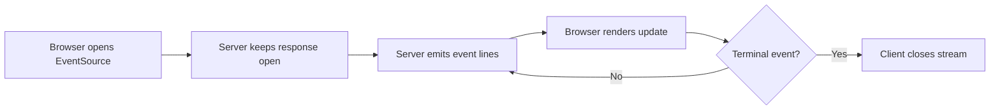
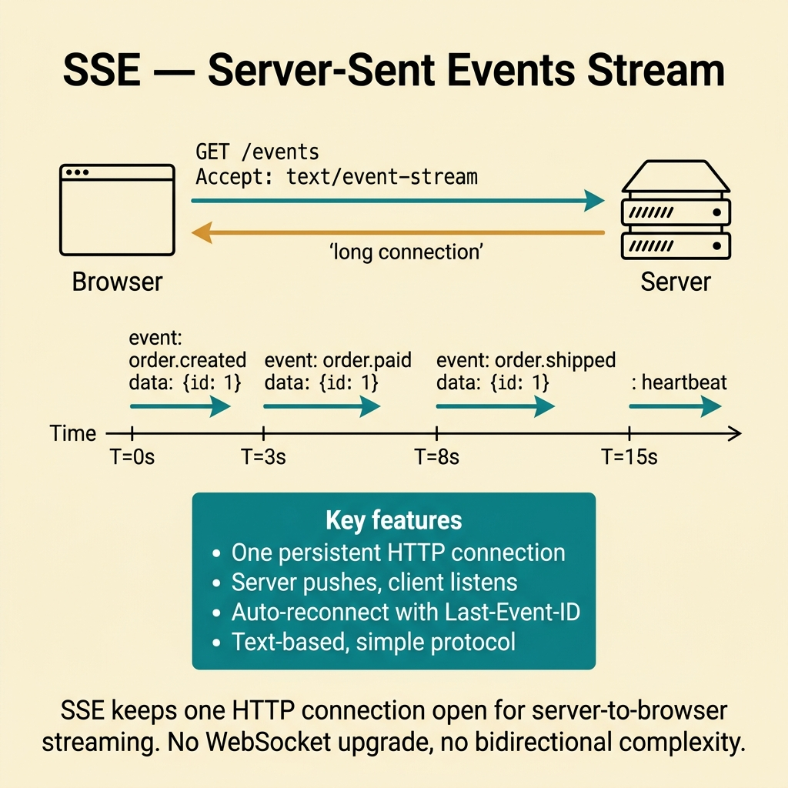
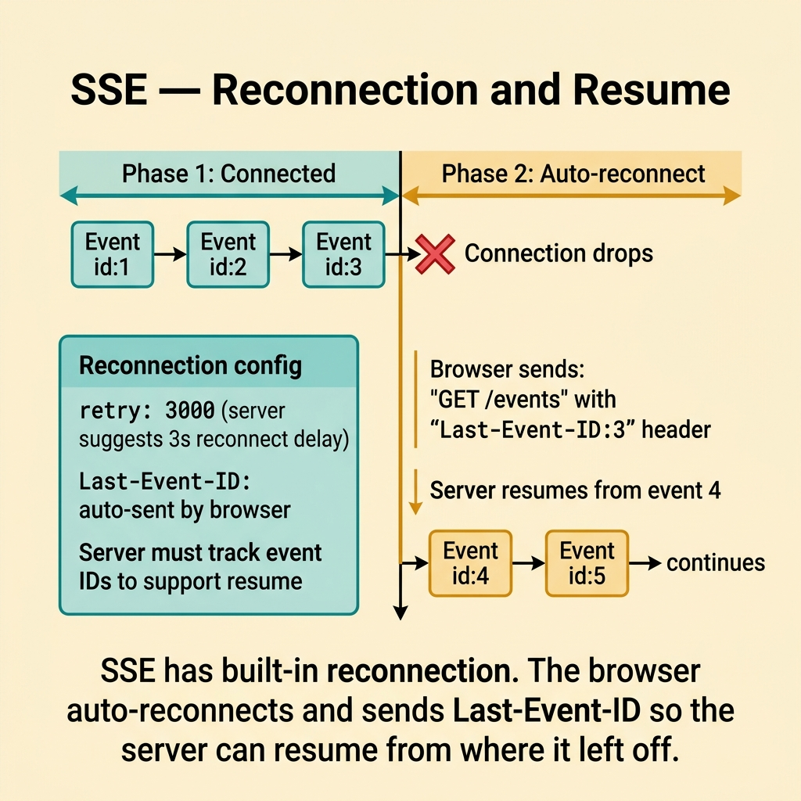
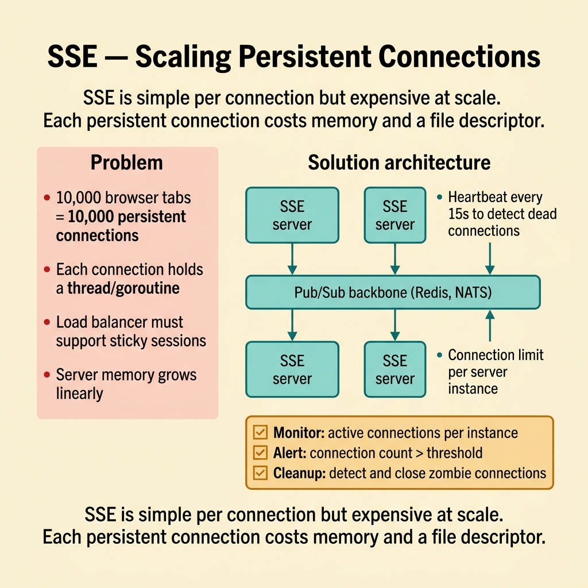
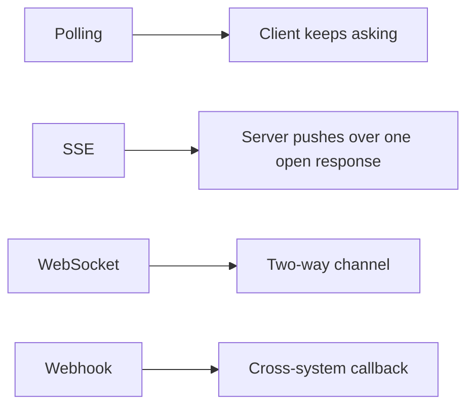
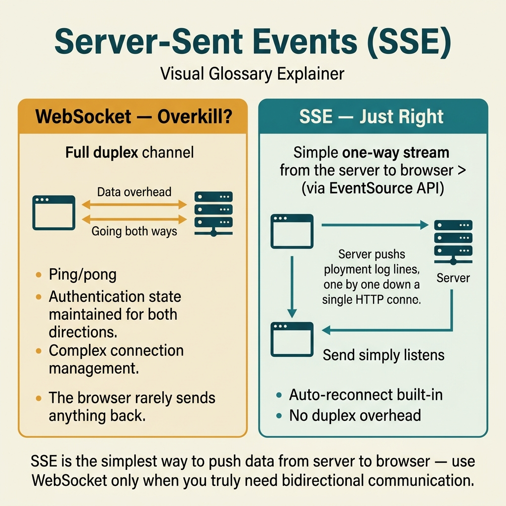

<!-- tags: glossary, reference, api-design, sse -->
# SSE

> A one-way server push mechanism over HTTP that keeps one response open, making it a natural fit when a browser needs a lightweight event stream without a two-way channel.

| Aspect | Detail |
| --- | --- |
| **Concept** | One-way event streaming over a live HTTP response, commonly consumed through `EventSource`. |
| **Audience** | Backend engineer, API designer, reviewer, platform owner |
| **Primary style** | Glossary term |
| **Entry point** | Use it when a browser tab needs one-way realtime updates but a full duplex channel is unnecessary. |

📅 Created: 2026-03-30 · 🔄 Updated: 2026-04-17 · ⏱️ 7 min read

---

## 1. DEFINE

Picture a deployment dashboard that twenty engineers keep open while a release rolls through. The browser only needs new log lines and state changes from the server. It does not need to send messages back over the same connection. WebSocket sounds powerful, but the team does not want to inherit duplex transport, ping and pong logic, and a more complicated auth story without a real need. That is the boundary of **SSE**.

**SSE** is a one-way server-push mechanism over an HTTP response that stays open while the browser consumes text events, usually through `EventSource`.

SSE is valuable when the interaction really is one-way: server to browser. It keeps the mental model close to HTTP while postponing the heavier trade-offs of duplex transport.

| Variant | Description |
| --- | --- |
| One-way event stream | The server emits events to the client over one live response. |
| Last-Event-ID resume | The client can resume from the latest seen event in some designs. |
| Proxy-aware SSE | The stream includes heartbeat and headers that survive intermediaries. |

| Approach | Time | Space | Choose it when |
| --- | --- | --- | --- |
| Browser-friendly push | Event-rate shaped | Connection-shaped | A browser needs one-way realtime updates. |
| Heartbeat plus reconnect | Heartbeat-shaped | O(1) | The stream must survive proxies and load balancers. |
| Event ID checkpointing | O(1) | O(1) | Losing events during reconnect is unacceptable. |

Core insight:

> SSE is ideal when the team needs push in one direction and does not want to turn a simple problem into a duplex transport problem.

### 1.1 Invariants and Failure Modes

- The stream needs heartbeat or lightweight traffic that keeps the connection alive.
- The client needs a reconnect strategy.
- The team must know which events can be skipped and which require resume support.

The common failure is using SSE for a use case that really needs two-way interaction or binary frames. The application then slowly rebuilds WebSocket by hand.

---

## 2. CONTEXT

**Who uses it**: Backend engineer, API designer, reviewer, platform owner

**When**: Use it when a browser tab needs one-way realtime updates without the cost of a duplex channel.

**Why it matters**: SSE gives a browser-native push path while keeping the conceptual model close to HTTP.

**In this ecosystem**:
- Choose `SSE` when a browser holds one open connection and only needs one-way updates.
- Choose `Webhook` when a producer must call into another system's callback endpoint.
- Choose `Polling / Long Polling` when the client still must ask for changes itself.

Once one-way streaming is chosen, the hard part shifts from API surface to reconnect behavior and infrastructure fit.

---

## 3. EXAMPLES

SSE becomes visible when a dashboard needs realtime updates, when a browser actor does not need to talk back over the same channel, or when a stream dies behind a proxy because nobody designed heartbeat and reconnect behavior. The examples below place it in those moments.



*Diagram: The example flow is intentionally one-way. The browser listens; the server speaks.*

### Example 1: Basic - Open a one-way browser stream

> **Goal**: Push deployment logs into a browser without a polling loop.
> **Approach**: Use `EventSource` and react to named events.
> **Example**: A deployment dashboard stays open for several minutes.
> **Complexity**: Basic



*Figure: SSE keeps one HTTP connection open for server-to-browser streaming. No WebSocket upgrade, no bidirectional complexity.*

```javascript
const stream = new EventSource("/deployments/42/events");

stream.addEventListener("log", (event) => {
  const payload = JSON.parse(event.data);
  appendLogLine(payload.message);
});

stream.addEventListener("done", () => {
  stream.close();
});
```

**Conclusion**: At the basic level, SSE wins by removing the polling loop when the browser only needs to listen.

### Example 2: Intermediate - Keep the stream alive through proxies and reconnects

> **Goal**: Prevent the stream from dying silently behind reverse proxies and load balancers.
> **Approach**: Define heartbeat, headers, and reconnect behavior as part of the runtime contract.
> **Example**: A dashboard stream runs behind infrastructure layers.
> **Complexity**: Intermediate



*Figure: SSE has built-in reconnection. The browser auto-reconnects and sends Last-Event-ID so the server can resume.*

```yaml
sse_runtime_contract:
  response_headers:
    - "Content-Type: text/event-stream"
    - "Cache-Control: no-cache"
    - "Connection: keep-alive"
  server_rules:
    - "send a heartbeat every 15 seconds"
    - "flush after each important event"
  client_rules:
    - "reconnect after disconnect"
    - "close the stream when a terminal event arrives"
```

> **Why?** SSE is easy on localhost and easy to break behind intermediaries. Heartbeat and reconnect are design responsibilities, not later bug fixes.

**Conclusion**: Durable SSE requires a reviewed runtime contract, not just a JavaScript API call.

### Example 3: Advanced - Resume from the right place after reconnect

> **Goal**: Avoid losing important events when the browser reconnects.
> **Approach**: Emit event IDs and support replay or checkpoint logic.
> **Example**: A deployment timeline or moderation queue where missing state is unacceptable.
> **Complexity**: Advanced



*Figure: SSE is simple per connection but expensive at scale. Each persistent connection costs memory and a file descriptor.*

```yaml
sse_resume_policy:
  require:
    - "an event id on every important event"
    - "Last-Event-ID support or an equivalent checkpoint"
    - "server retention for replay"
  reject_if:
    - "a critical stream reconnects without context recovery"
```

> **Why?** Once the stream becomes a source of truth for the UI, reconnect without resume creates a hidden hole in the user's understanding.

**Conclusion**: At the advanced level, SSE is not only about streaming events. It is about preserving continuity through browser reconnects.

---

## 4. COMPARE



*Diagram: SSE sits between pull-based refresh and full duplex transport. It is one-way push over an existing browser connection.*



*Figure: SSE sits between pull-based refresh and full duplex transport.*

Polling repeatedly asks. SSE flips the rhythm. The browser opens one pipe, and the server writes into it when something changes.

### Level 1

```text
browser opens EventSource
  -> server holds the HTTP response open
  -> new events arrive line by line
  -> browser handles and renders them
```

*Diagram: Level 1 shows that SSE preserves an HTTP mental model while still giving the browser push semantics.*

### Level 2

```text
Polling or Long Polling                 SSE
----------------------                  ---
Client asks again                       Server pushes when data appears
Many requests or waiting requests       One live one-way stream
Freshness follows the ask rhythm        Freshness follows event arrival
```

*Diagram: Level 2 shows that SSE changes who initiates the update, not merely which browser API is used.*

### Easy-to-miss Boundary Drift

When teams misuse **SSE**, the issue is usually actor mismatch, not definition.

| # | Severity | Mistake | Consequence | Fix |
| --- | --- | --- | --- | --- |
| 1 | 🔴 Fatal | Using SSE for a use case that truly needs two-way communication | The app starts inventing reverse messaging and becomes awkward | Use SSE only when the event flow is genuinely one-way |
| 2 | 🟡 Common | Skipping heartbeat and flush rules | The stream dies behind proxies and the failure hides | Define the runtime contract from Example 2 |
| 3 | 🟡 Common | Reconnecting without event recovery | The UI loses context and displays an incomplete truth | Use event IDs and replay support for important streams |
| 4 | 🔵 Minor | Comparing SSE with webhook as the same kind of push | The team argues with the wrong actor model | Remember that SSE streams to one open client connection |

### Quick Scan

| If you see | Do this |
| --- | --- |
| A browser needs one-way event flow | Evaluate SSE before WebSocket |
| Streams die behind intermediaries | Check heartbeat, flush, and reconnect rules |
| The UI loses context after reconnect | Add the resume policy from Example 3 |

---

## 5. REF

| Resource | Type | Link | Note |
| --- | --- | --- | --- |
| WHATWG HTML Living Standard - Server-sent events | Official | https://html.spec.whatwg.org/multipage/server-sent-events.html | Source of truth for `EventSource` and event stream format |
| MDN EventSource | Reference | https://developer.mozilla.org/en-US/docs/Web/API/EventSource | Practical guidance for browser usage |
| Ably: WebSockets vs SSE | Reference | https://ably.com/blog/websockets-vs-sse | Trade-off view between SSE and richer realtime channels |

---

## 6. RECOMMEND

SSE solves one-way browser streaming. If the next pressure is actually cross-system callbacks or long-lived compatibility, open the lane that owns that problem.

| Explore next | When to read next | Why | File/Link |
| --- | --- | --- | --- |
| Polling / Long Polling | The browser does not need a live stream and the actor count is low | SSE may be more than the use case needs | [Polling / Long Polling](./05-polling-long-polling.md) |
| Webhook | The event must reach another system, not one open browser tab | The actor and trust boundary are different | [Webhook](./04-webhook.md) |
| Versioning | The stream contract is changing while several clients stay alive | Compatibility becomes the next delivery blind spot | [Versioning](./08-versioning.md) |

Return to the deployment dashboard from the opening. `EventSource`, `text/event-stream`, heartbeat, and reconnect logic are enough when the job is one-way browser delivery. No duplex channel is required unless the use case truly needs it.

**Links**: [← Previous](./05-polling-long-polling.md) · [→ Next](./07-openapi-swagger.md)
