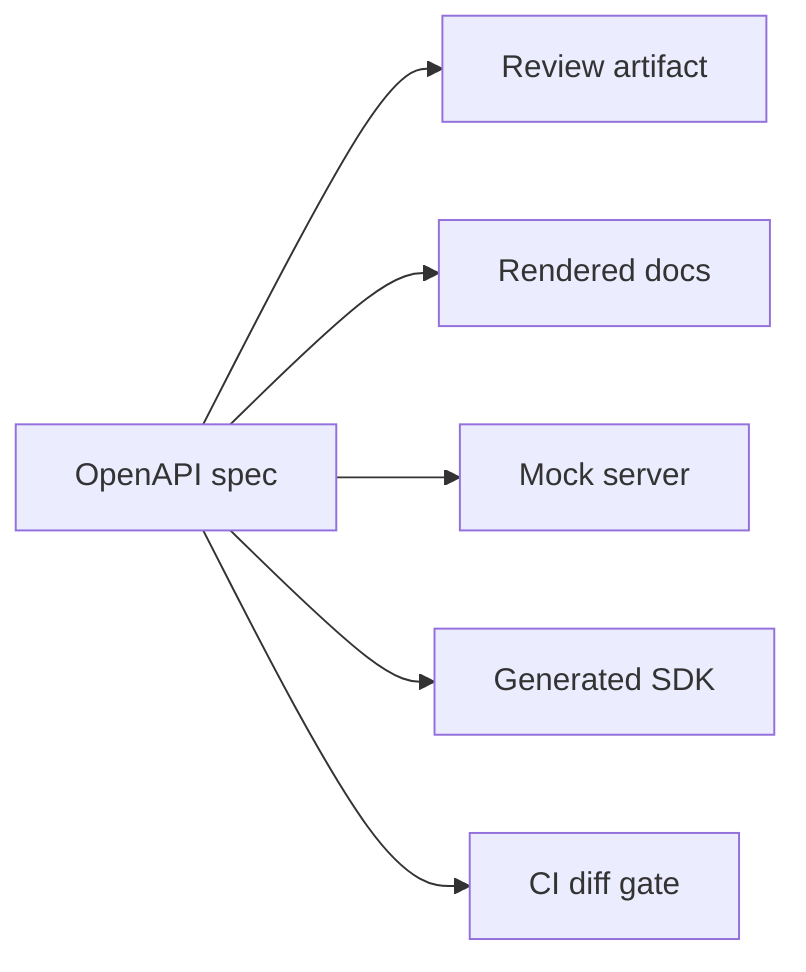
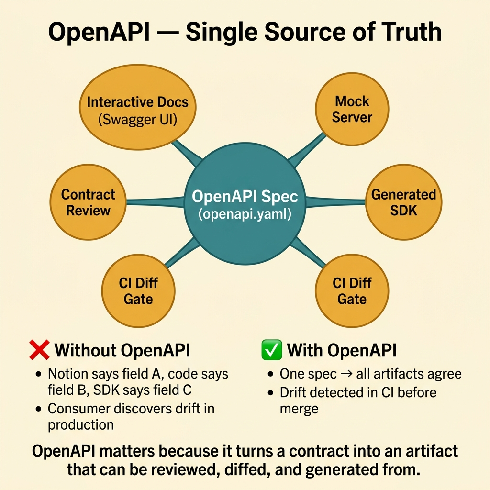
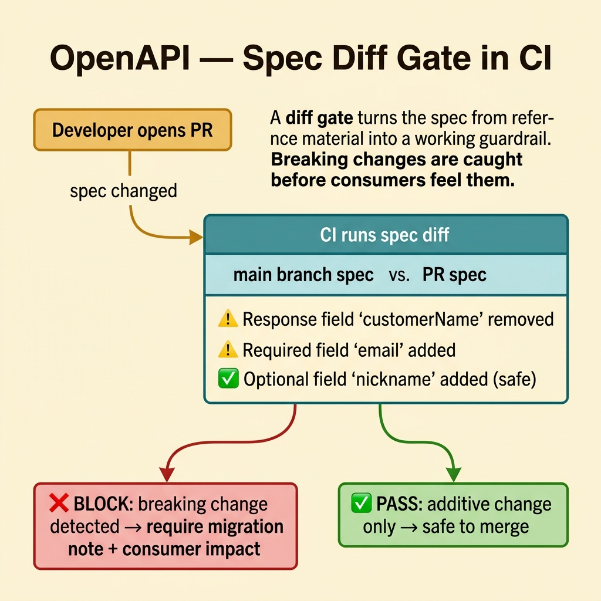
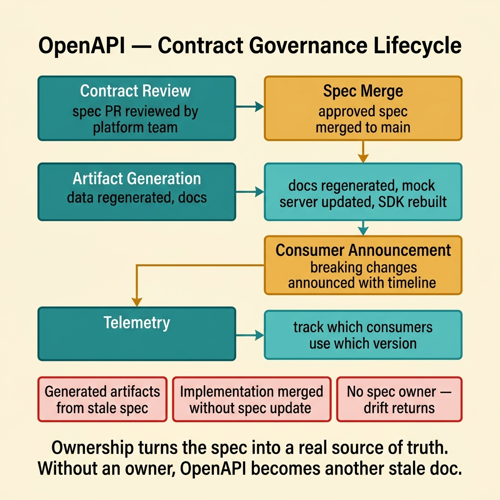
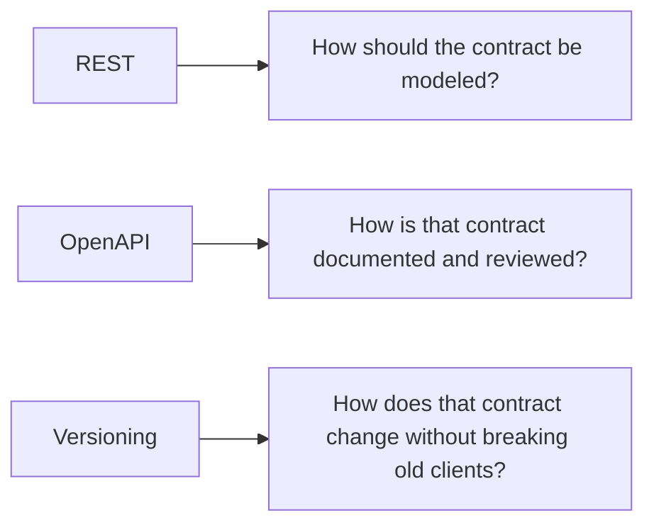

<!-- tags: glossary, reference, api-design, openapi-swagger -->
# OpenAPI / Swagger

> A machine-readable contract format for REST APIs that lets teams review endpoints, generate docs and SDKs, and detect drift before consumers discover it in production.

| Aspect | Detail |
| --- | --- |
| **Concept** | A machine-readable API contract, with `OpenAPI` as the specification and `Swagger` as a common tooling family. |
| **Audience** | Backend engineer, API designer, reviewer, platform owner |
| **Primary style** | Glossary term |
| **Entry point** | Use it when code, docs, SDKs, mocks, and consumer expectations are starting to disagree. |

📅 Created: 2026-03-30 · 🔄 Updated: 2026-04-17 · ⏱️ 7 min read

---

## 1. DEFINE

Picture a frontend team coding from a Notion page, a backend team implementing from framework annotations, and QA testing against a Swagger UI build from three weeks ago. A partner then reports that `customerName` became `fullName`, and nobody can prove which artifact was correct. The problem is no longer the endpoint itself. The problem is that the team has no contract source of truth that both people and machines can read. That is the boundary of **OpenAPI / Swagger**.

**OpenAPI / Swagger** refers to a machine-readable way to describe REST API contracts. `OpenAPI` is the specification. `Swagger` is a widely used tooling ecosystem around that specification.

The real value of OpenAPI sits in contract governance: review the contract before code ships, generate docs, SDKs, and mocks from the same source, and diff changes before consumers feel them.

| Variant | Description |
| --- | --- |
| OpenAPI spec | Describes paths, schemas, auth, and error contracts. |
| Swagger UI | Renders the spec as interactive documentation. |
| Codegen or mock server | Generates SDKs, stubs, or mocks from the same spec. |

| Approach | Time | Space | Choose it when |
| --- | --- | --- | --- |
| Spec-first | API-surface shaped | Schema-shaped | The contract should be reviewed before implementation. |
| Code-first export | Codebase-shaped | Codebase-shaped | The framework already emits a trustworthy spec from code. |
| Diff gate in CI | Diff-shaped | O(1) | Multiple consumers depend on a contract that must not drift silently. |

Core insight:

> OpenAPI matters because it turns a contract into an artifact that can be reviewed, diffed, and generated from, not because it merely produces prettier docs.

### 1.1 Invariants and Failure Modes

- One artifact must be declared the source of truth for the spec.
- Spec changes must be reviewed like code changes.
- Rendered docs, mocks, and SDKs must be generated from the living spec, not stale files.

The classic failure is a beautiful Swagger UI backed by an outdated schema. The team then thinks it has documentation when it only has a snapshot of an old contract.

---

## 2. CONTEXT

**Who uses it**: Backend engineer, API designer, reviewer, platform owner

**When**: Use it when code, docs, SDKs, mocks, and consumer expectations are starting to disagree.

**Why it matters**: OpenAPI creates one contract artifact that humans can review and tooling can enforce.

**In this ecosystem**:
- Choose `OpenAPI / Swagger` when docs, SDKs, mocks, and implementation disagree about the same REST surface.
- Choose `GraphQL` when the real problem is client-side composition, not contract drift.
- Choose `Versioning` when the contract is already clear but breaking changes must coexist with older clients.

Once standard documentation enters the picture, the hard question is no longer whether the spec exists. The hard question is whether the spec governs anything real.

---

## 3. EXAMPLES

OpenAPI becomes visible when frontend and backend drift apart, when code-first generation emits unreadable or stale specs, or when Swagger UI becomes the only "documentation" but nobody owns the lifecycle behind it. The examples below place it in those situations.



*Diagram: The example flow shows why one living spec can stabilize many downstream artifacts.*

### Example 1: Basic - Describe a contract that both humans and machines can read

> **Goal**: Use one artifact so documentation and implementation speak with one voice.
> **Approach**: Define the path, response, and schema in the OpenAPI spec itself.
> **Example**: A public `GET /orders/{id}` endpoint used by partners and frontend clients.
> **Complexity**: Basic



*Figure: OpenAPI turns a contract into an artifact that can be reviewed, diffed, and generated from.*

```yaml
openapi: 3.1.0
paths:
  /orders/{id}:
    get:
      summary: Get order by id
      responses:
        "200":
          description: Order found
```

**Conclusion**: At the basic level, OpenAPI becomes valuable the moment a contract stops living only in prose and memory.

### Example 2: Intermediate - Block spec drift before it hits consumers

> **Goal**: Detect breaking changes before a partner or frontend client breaks.
> **Approach**: Compare the current spec against the main branch in CI or review.
> **Example**: A response field is renamed in a "small" pull request.
> **Complexity**: Intermediate



*Figure: A diff gate turns the spec from reference material into a working guardrail.*

```yaml
openapi_diff_gate:
  compare:
    - "spec on main"
    - "spec in current branch"
  block_if:
    - "response field removed"
    - "required field added"
    - "status code contract changed"
  require:
    - "migration note"
    - "consumer impact summary"
```

> **Why?** OpenAPI only matters operationally when the spec behaves like a contract under review, not like a decorative side file.

**Conclusion**: A diff gate turns the spec from reference material into a working guardrail.

### Example 3: Advanced - Generate docs, mocks, and SDKs without losing ownership

> **Goal**: Avoid a world where many artifacts are generated from the spec but nobody owns the spec itself.
> **Approach**: Define ownership, generation order, and release triggers around the contract.
> **Example**: One API now supports frontend clients, QA mocks, and partner SDKs.
> **Complexity**: Advanced



*Figure: Ownership turns the spec into a real source of truth. Without an owner, OpenAPI becomes another stale doc.*

```yaml
openapi_governance:
  owner: platform-api
  spec_flow:
    - "contract review"
    - "spec merge"
    - "docs, mock, and SDK generation"
    - "consumer announcement for breaking changes"
  fail_if:
    - "generated artifacts come from a stale spec"
    - "implementation changes merge without spec updates"
```

> **Why?** Teams often have enough tooling but still drift because nobody owns the contract lifecycle. Ownership turns the spec into a real source of truth.

**Conclusion**: At the advanced level, OpenAPI is a contract-governance discipline as much as a file format.

---

## 4. COMPARE



*Diagram: REST models the contract, OpenAPI describes and governs it, and Versioning keeps it survivable over time.*


*Figure: REST models the contract, OpenAPI describes and governs it, Versioning keeps it survivable.*

If `REST` answers "what kind of public HTTP contract are we exposing?", then `OpenAPI` answers "how do we keep that contract synchronized across tools and teams?"

### Level 1

```text
OpenAPI spec
  -> docs
  -> mock server
  -> SDK
  -> review artifact
```

*Diagram: Level 1 shows one spec feeding several downstream artifacts without copy and paste.*

### Level 2

```text
No OpenAPI source of truth               OpenAPI source of truth
--------------------------               -----------------------
Notion, code, and SDK disagree           Artifacts are generated from one contract
Breaking changes hide in review          Spec diffs expose the change early
Consumers detect drift in production     Consumers get docs, mocks, and SDKs from the same source
```

*Diagram: Level 2 shows that OpenAPI is about governance, not a sidecar docs file.*

### Easy-to-miss Boundary Drift

When teams misuse **OpenAPI / Swagger**, the issue is usually false certainty about what the tooling guarantees.

| # | Severity | Mistake | Consequence | Fix |
| --- | --- | --- | --- | --- |
| 1 | 🔴 Fatal | Treating Swagger UI as enough while the source spec is stale | The docs look polished but the contract is wrong | Make the spec the source of truth and the UI only an output |
| 2 | 🟡 Common | Changing code without changing the spec | Consumers drift away before the team notices | Add a spec diff gate in review and CI |
| 3 | 🟡 Common | Generating many artifacts without naming a spec owner | SDKs, mocks, and docs release out of sync | Define governance like Example 3 |
| 4 | 🔵 Minor | Using OpenAPI and Swagger as if they were the same thing | Spec and tooling discussions stay muddy | Name them precisely: OpenAPI is the spec, Swagger is a tooling family |

### Quick Scan

| If you see | Do this |
| --- | --- |
| Docs, SDKs, and code disagree | Find the real source of truth for the spec |
| A small PR renames a response field | Run the diff gate |
| Swagger UI looks good but consumers still break | Suspect a stale or weakly governed spec |

---

## 5. REF

| Resource | Type | Link | Note |
| --- | --- | --- | --- |
| OpenAPI Specification | Official | https://spec.openapis.org/oas/latest.html | Source of truth for spec syntax and semantics |
| Swagger Docs | Official | https://swagger.io/docs/ | Common tooling ecosystem around OpenAPI |
| Redocly API Governance | Reference | https://redocly.com/docs/cli/api-registry/guides/ | Practical linting and governance guidance |

---

## 6. RECOMMEND

OpenAPI solves contract-source-of-truth pressure. If the contract is now explicit but a breaking change still must ship safely, the next problem is compatibility strategy.

| Explore next | When to read next | Why | File/Link |
| --- | --- | --- | --- |
| Versioning | A spec diff reveals a real breaking change | Governance must now extend into compatibility | [Versioning](./08-versioning.md) |
| REST | The spec exists, but the resource boundary still feels wrong | The source of truth may describe a weak contract model | [REST](./01-rest.md) |
| GraphQL | The true pain is not drift but client composition | The team may be fixing the wrong lane | [GraphQL](./02-graphql.md) |

Return to the opening scene with Notion, annotations, and screenshots. OpenAPI is the move that turns those scattered descriptions into one contract artifact that the team can actually govern.

**Links**: [← Previous](./06-sse.md) · [→ Next](./08-versioning.md)
