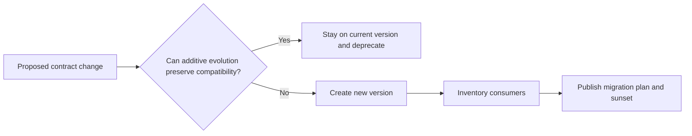
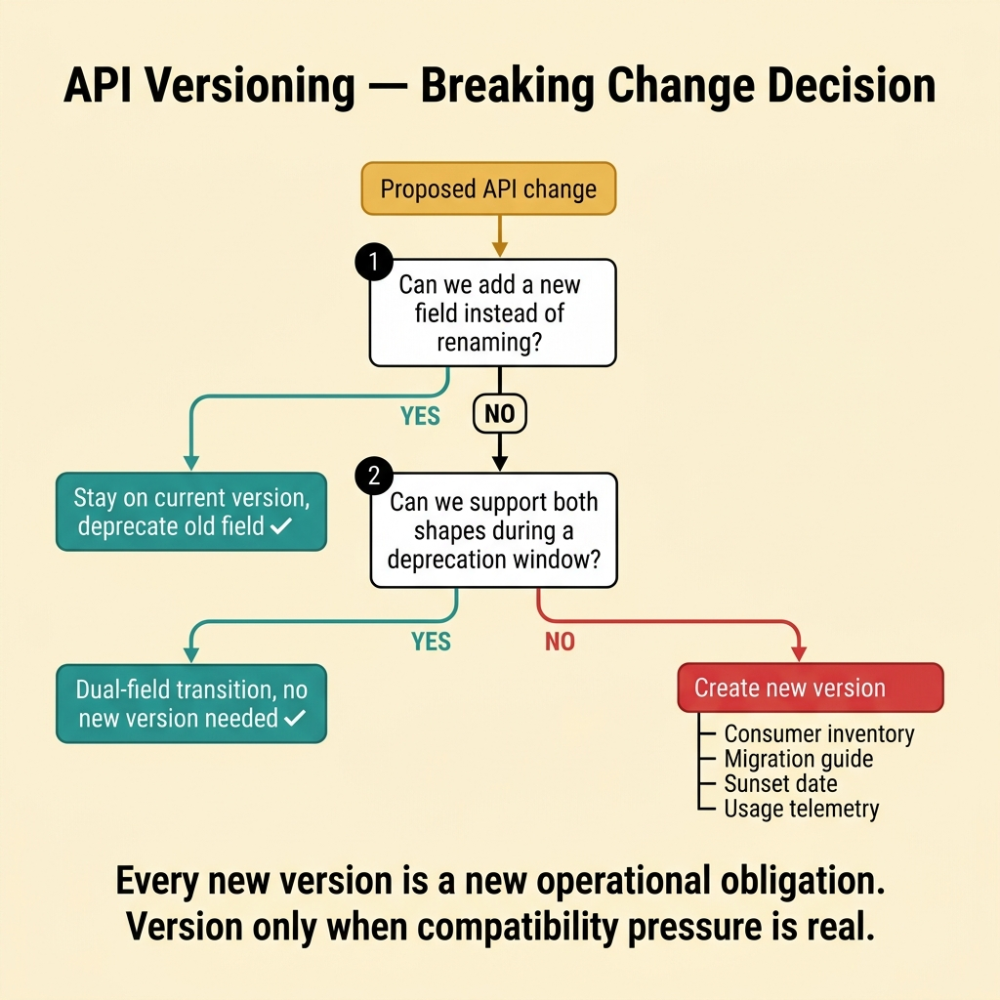
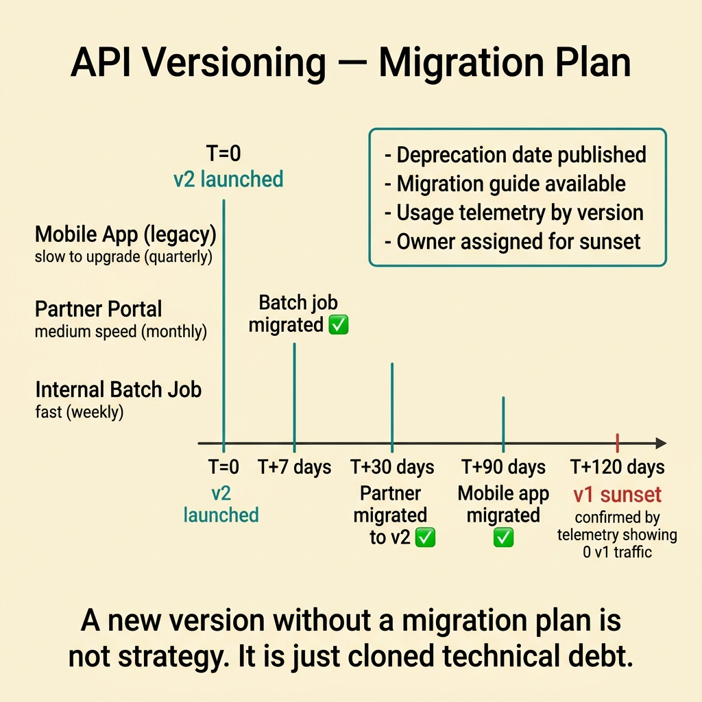
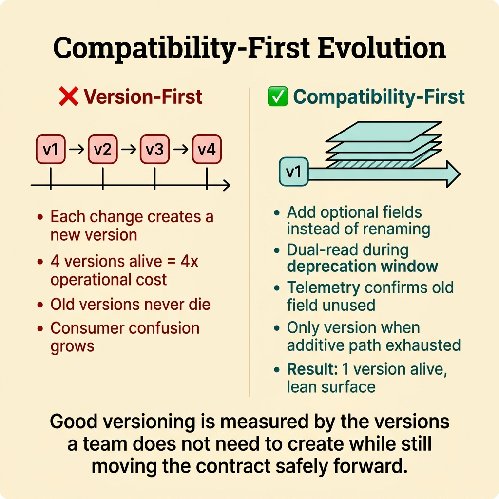
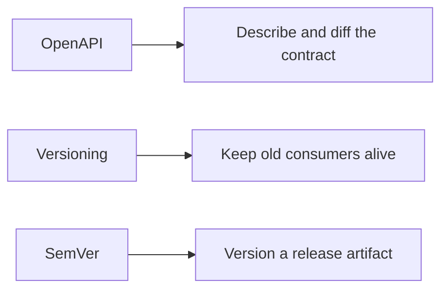
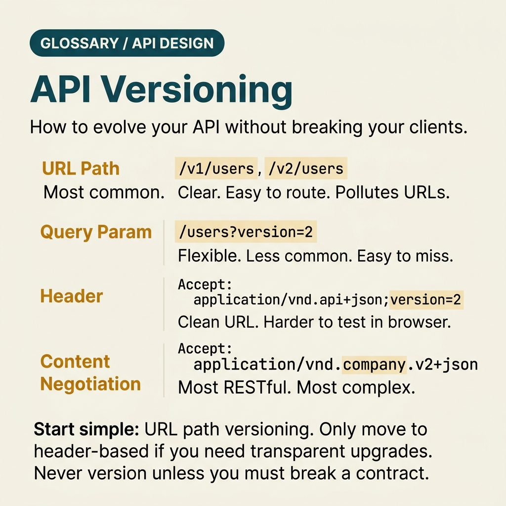

<!-- tags: glossary, reference, api-design, versioning -->
# Versioning

> A strategy for changing an API contract over time without turning every breaking change into an outage for clients that cannot upgrade immediately.

| Aspect | Detail |
| --- | --- |
| **Concept** | A way to evolve API contracts while older consumers still remain alive. |
| **Audience** | Backend engineer, API designer, reviewer, platform owner |
| **Primary style** | Glossary term |
| **Entry point** | Use it when a long-lived API is about to break old clients, partners, or slow-to-upgrade mobile apps. |

📅 Created: 2026-03-30 · 🔄 Updated: 2026-04-17 · ⏱️ 7 min read

---

## 1. DEFINE

Picture yourself renaming `fullName` to `displayName` because it feels cleaner. The new web app can absorb the change in a day. An older mobile app still lives on user devices, external partners upgrade quarterly, and one internal script survives precisely because nobody dares touch it. Suddenly each contract change becomes a political problem: who breaks, for how long, and how many versions must now be kept alive? That is the boundary of **Versioning**.

**Versioning** is the strategy of managing API contract changes over time so breaking changes do not become outages for consumers that cannot upgrade immediately.

Versioning is not the same as package `SemVer`, even though both use version numbers. The real problem here is a network contract that several consumers adopt at different speeds.

| Variant | Description |
| --- | --- |
| URI versioning | Put the version in the path to separate contract surfaces explicitly. |
| Header or media-type versioning | Keep the URL stable while shifting the contract through headers. |
| Compatibility-first evolution | Prefer additive change and disciplined deprecation to reduce parallel versions. |

| Approach | Time | Space | Choose it when |
| --- | --- | --- | --- |
| Version by breakage | O(1) rule | Version-surface shaped | The team needs a hard rule for when a new version is justified. |
| Deprecation window | Lifecycle-shaped | O(1) | Consumers need real migration time. |
| Consumer segmentation | Consumer-map shaped | Consumer-map shaped | Different client groups upgrade at very different speeds. |

Core insight:

> Versioning is not a victory. Every new version is a new operational obligation. Use it when compatibility pressure is real, not to avoid hard design conversations.

### 1.1 Invariants and Failure Modes

- The team must know which consumers use which contract.
- Every breaking change needs a migration path, a deprecation window, and an owner.
- A new version should solve a real compatibility break, not a vague fear.

The common failure is opening a new version for every small change. The surface grows, consumer inventory becomes blurry, and old versions never die.

---

## 2. CONTEXT

**Who uses it**: Backend engineer, API designer, reviewer, platform owner

**When**: Use it when a long-lived API is about to break old clients, partners, or slow-to-upgrade mobile apps.

**Why it matters**: Versioning is about compatibility governance, not about decorating URLs with `v2`.

**In this ecosystem**:
- Choose `Versioning` when the contract really must break and old consumers cannot move immediately.
- Choose `OpenAPI / Swagger` when the source of truth is still unclear and the problem is drift.
- Revisit `REST`, `GraphQL`, or `gRPC` when the contract shape itself may still be wrong.

Once versioning enters the conversation, the central question is not which syntax looks cleaner. The central question is whether the team has earned a new parallel contract.

---

## 3. EXAMPLES

Versioning becomes visible when `v1` and `v2` coexist for years, when clients never migrate because the old contract still works, or when a breaking change ships without anyone admitting it was breaking. The examples below place it in those situations.



*Diagram: The example flow starts with compatibility pressure, not with the desire to mint a new version.*

### Example 1: Basic - Decide whether the change is truly breaking

> **Goal**: Avoid opening a new version without necessity.
> **Approach**: Use a simple rule: stay additive when possible, split only for real breakage.
> **Example**: Rename `fullName` to `displayName`.
> **Complexity**: Basic



*Figure: Every new version is a new operational obligation. Version only when compatibility pressure is real.*

```yaml
versioning_decision:
  change: rename fullName -> displayName
  additive_possible: false
  breaks_existing_consumers: true
  action: create_new_version_or_dual_field_transition
```

**Conclusion**: At the basic level, versioning adds value when it stops teams from creating versions out of anxiety or, worse, from shipping a break without admitting it.

### Example 2: Intermediate - Tie the new version to a real migration plan

> **Goal**: Make sure every new version includes an exit path for old consumers.
> **Approach**: Require consumer inventory, a deprecation window, and sunset signals.
> **Example**: Legacy mobile apps, partner integrations, and batch jobs still depend on `v1`.
> **Complexity**: Intermediate



*Figure: A new version without a migration plan is not strategy. It is just cloned technical debt.*

```yaml
version_rollout_plan:
  new_version: v2
  consumers:
    - mobile_app_legacy
    - partner_portal
    - internal_batch_job
  require:
    - "deprecation date"
    - "migration guide"
    - "usage telemetry by version"
  reject_if:
    - "the team does not know who still uses v1"
```

> **Why?** Versioning usually fails long after `v2` is launched. It fails when `v1` cannot be shut down because no one built a consumer map from the start.

**Conclusion**: A new version without a migration plan is not strategy. It is just cloned technical debt.

### Example 3: Advanced - Reduce parallel versions through compatibility-first design

> **Goal**: Change the contract without leaving a graveyard of old versions behind.
> **Approach**: Prefer additive fields, dual-read or dual-write windows, and disciplined deprecation before declaring a hard break.
> **Example**: A team wants to clean an old response schema without creating endless parallel tracks.
> **Complexity**: Advanced



*Figure: Good versioning is measured by the versions a team does not need to create.*

```yaml
compatibility_first_gate:
  ask_first:
    - "Can we add a new field instead of renaming the old one?"
    - "Can we support both shapes during one deprecation window?"
    - "Do we have telemetry that tells us when the old field is unused?"
  only_version_if:
    - "the consumer contract breaks even after the additive path is exhausted"
```

> **Why?** Good versioning is measured by the versions a team does not need to create while still moving the contract safely forward.

**Conclusion**: At the advanced level, versioning becomes the art of shrinking parallel obligations, not naming `v3`.

---

## 4. COMPARE



*Diagram: OpenAPI describes the contract, Versioning governs compatibility, and package SemVer solves a different problem entirely.*



*Figure: OpenAPI describes the contract, Versioning governs compatibility, SemVer solves a different problem.*

Versioning sounds abstract until you picture it as branching responsibility. The question is not "can we stamp a version?" The question is "should we create another contract we must operate?"

### Level 1

```text
additive change?
  yes -> keep the current contract and deprecate gradually
  no  -> create a new version with a migration plan
```

*Diagram: Level 1 shows that a new version should appear only after additive evolution fails to preserve compatibility.*

### Level 2

```text
No consumer map                         Consumer map exists
---------------                         -------------------
No one knows who will break             Teams know who is on which version
Versions open on instinct               Versions tie directly to migration plans
Sunset feels too risky                  Sunset has telemetry, owners, and dates
```

*Diagram: Level 2 shows that versioning is really consumer governance, not just URL syntax.*

### Easy-to-miss Boundary Drift

When teams misuse **Versioning**, the issue is usually weak compatibility discipline, not missing terminology.

| # | Severity | Mistake | Consequence | Fix |
| --- | --- | --- | --- | --- |
| 1 | 🔴 Fatal | Creating a new version without knowing who still uses the old one | Sunset never happens and old debt lives forever | Build a consumer inventory like Example 2 |
| 2 | 🟡 Common | Using versioning to avoid additive compatibility work | The API surface grows faster than the team can maintain it | Run the compatibility-first gate before versioning |
| 3 | 🟡 Common | Treating API versioning like package SemVer | The team debates syntax while ignoring migration reality | Focus on network consumers and rollout plans |
| 4 | 🔵 Minor | Debating URI versus header versioning too early | The team argues about syntax before proving breakage | Lock the boundary and migration pressure first |

### Quick Scan

| If you see | Do this |
| --- | --- |
| Someone wants to rename a field for aesthetics | Ask whether an additive path still exists |
| A new `v2` is proposed | Require a consumer inventory and migration plan |
| An old version never dies | Check telemetry, ownership, and sunset criteria |

---

## 5. REF

| Resource | Type | Link | Note |
| --- | --- | --- | --- |
| Microsoft REST API Guidelines - Versioning | Reference | https://github.com/microsoft/api-guidelines/blob/vNext/Guidelines.md#12-versioning | Practical guidance for evolving public API contracts |
| Stripe API Versioning | Official | https://docs.stripe.com/api/versioning | A mature example of explicit contract-version governance |
| OpenAPI Specification | Official | https://spec.openapis.org/oas/latest.html | Useful when contract change must be described and diffed clearly |

---

## 6. RECOMMEND

Versioning appears only after the contract has lived long enough for compatibility pressure to become real. If the source of truth is still weak or the contract shape is still wrong, fix that lane before adding another parallel surface.

| Explore next | When to read next | Why | File/Link |
| --- | --- | --- | --- |
| OpenAPI / Swagger | The contract still lacks one clear artifact to diff | The team may be missing a source of truth before it needs more versions | [OpenAPI / Swagger](./07-openapi-swagger.md) |
| REST | You want to revisit the resource model that is generating breaks | Better boundaries can reduce future breakage | [REST](./01-rest.md) |
| Webhook | The next compatibility problem sits in event payloads delivered to outside consumers | Event contracts often become the next versioning pressure point | [Webhook](./04-webhook.md) |

Return to the `fullName` to `displayName` example. A version number is never free. Each version that stays alive is a contract the team must continue to operate, monitor, and sunset on purpose.

**Links**: [← Previous](./07-openapi-swagger.md) · [→ Next](./README.md)
