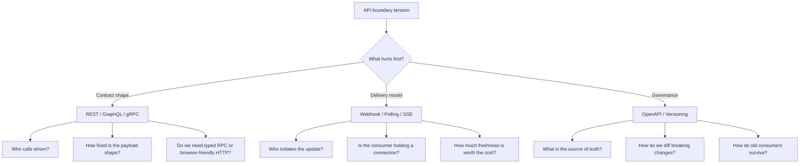
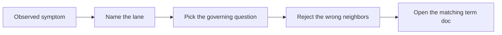

<!-- tags: glossary, reference, api-design, overview -->
# API Design

> A cluster of terms for shaping API contracts, choosing interaction models, and evolving interfaces without charging unnecessary cost to producers and consumers.

| Aspect | Detail |
| --- | --- |
| **Concept** | A map for separating contract shape, update delivery, and contract governance. |
| **Audience** | Backend engineer, API designer, reviewer, platform owner |
| **Primary style** | Glossary hub router |
| **Entry point** | Open this when the team knows the pain sits at the API boundary but has not named the right lane yet. |

📅 Created: 2026-03-30 · 🔄 Updated: 2026-04-17 · ⏱️ 8 min read

---

## 1. DEFINE

Picture a design review for one new API surface. The mobile team wants only the fields each screen needs. The platform team wants a contract that is easy to cache, observe, and sunset. A partner integration wants callbacks when events happen. Another service wants generated client stubs and tight deadlines. If every one of those tensions gets flattened into the word "API", the meeting turns into tool preference theater.

**API design** is the discipline of separating what problem the interface is solving: resource contract, client-shaped query, service-to-service RPC, update delivery, or governance of a long-lived contract.

| Variant | Description |
| --- | --- |
| Contract shape | `REST`, `GraphQL`, and `gRPC` answer what the consumer calls and what the producer returns. |
| Update delivery | `Webhook`, `Polling / Long Polling`, and `SSE` answer how fresh data reaches the consumer. |
| Governance and evolution | `OpenAPI / Swagger` and `Versioning` keep a contract reviewable and survivable over time. |

| Approach | Time | Space | Choose it when |
| --- | --- | --- | --- |
| Route by initiator | O(1) | O(1) | You first need to know who starts the exchange. |
| Route by contract pressure | O(1) | O(1) | The pain sits in payload shape, typing, browser fit, or governance. |
| Route by lifecycle pressure | O(1) | O(1) | The API already lives long enough to accumulate drift or version debt. |

Core insight:

> API design rarely fails because a tool is missing. It fails because the team answered the wrong question first.

### 1.1 Signals and Boundaries

- Start with `REST` when the core need is a legible public HTTP contract.
- Start with `GraphQL` when one client view must compose many fields with minimal over-fetching.
- Start with `gRPC` when internal services need generated stubs, deadlines, and streaming.
- Start with `Webhook`, `Polling / Long Polling`, or `SSE` when the real question is update delivery.
- Start with `OpenAPI / Swagger` and `Versioning` when the contract already exists but governance is failing.

### Coverage Map

| Entry | Role | Note |
| --- | --- | --- |
| [REST](01-rest.md) | Contract baseline | Resource-first HTTP contract |
| [GraphQL](02-graphql.md) | Client-shaped contract | Flexible field selection |
| [gRPC](03-grpc.md) | Internal typed RPC | Stubs, deadlines, streaming |
| [Webhook](04-webhook.md) | Callback delivery | Producer pushes to consumer endpoint |
| [Polling / Long Polling](05-polling-long-polling.md) | Pull delivery | Consumer asks for updates |
| [SSE](06-sse.md) | One-way browser stream | Server pushes over one open HTTP response |
| [OpenAPI / Swagger](07-openapi-swagger.md) | Contract source of truth | Docs, mocks, SDKs, review gate |
| [Versioning](08-versioning.md) | Compatibility governance | Long-lived contract evolution |

The names are on the table now. The harder part is opening the right lane before the team starts defending a favorite tool.

---

## 2. VISUAL



*Diagram: The lane matters more than the tool name. Contract shape, delivery, and governance solve different tensions.*

Theory alone is not enough. A good router must let a reviewer walk from a symptom to the next file without comparing unrelated options.

### Level 1

```text
Who initiates the exchange?
  Consumer pulls         -> REST / GraphQL / gRPC / Polling
  Producer or server pushes -> Webhook / SSE

Where is the main pain?
  Contract shape         -> REST / GraphQL / gRPC
  Delivery timing        -> Webhook / Polling / SSE
  Governance and drift   -> OpenAPI / Versioning
```

*Diagram: Level 1 compresses the cluster into two routing questions: who starts, and where the pain truly lives.*

### Level 2

```text
If you are seeing...                        Open this first
----------------------------------------    ---------------------------
Public HTTP API must be legible             REST
One UI view needs a custom field mix        GraphQL
Internal services need typed RPC            gRPC
Another system must receive callbacks       Webhook
The client can only ask for updates         Polling / Long Polling
A browser tab needs one-way realtime        SSE
Docs, SDKs, and code disagree               OpenAPI / Swagger
Breaking change will hit old clients        Versioning
```

*Diagram: Level 2 routes by symptom, not by brand name.*

---

## 3. CODE

The router becomes useful when the team can apply it inside a live review. The examples below turn the taxonomy into worksheets and gates.



*Diagram: The examples section starts from symptoms, not from tool names.*

### Problem 1: Basic - Lock the lane before debating the tool

> **Goal**: Stop an API discussion from collapsing into "which technology do we like more?"
> **Approach**: Start with the actor and the interaction shape.
> **Example**: One review must cover a mobile screen, a partner callback, and an internal worker.
> **Complexity**: Basic

```yaml
api_design_router:
  first_question: "Who starts the exchange?"
  if_consumer_pulls:
    next_question: "Does the consumer need resource semantics, flexible fields, or typed RPC?"
    choose:
      resource_http: REST
      flexible_query_shape: GraphQL
      internal_typed_rpc: gRPC
  if_producer_pushes:
    next_question: "Does the consumer expose a callback endpoint or hold a live connection?"
    choose:
      callback_endpoint: Webhook
      one_way_browser_stream: SSE
  if_governance_hurts:
    choose:
      contract_artifact_drift: OpenAPI / Swagger
      breaking_change_management: Versioning
```

**Conclusion**: This worksheet does not crown a winner. It removes the wrong lanes before implementation starts.

### Problem 2: Intermediate - Read the family in the right sequence

> **Goal**: Build a mental model that compares neighbors, not random cousins.
> **Approach**: Read from contract shape to delivery to governance.
> **Example**: A reviewer wants better terminology for ADRs and incident reviews.
> **Complexity**: Intermediate

```yaml
learning_path:
  contract_shape:
    - 01-rest.md
    - 02-graphql.md
    - 03-grpc.md
  update_delivery:
    - 04-webhook.md
    - 05-polling-long-polling.md
    - 06-sse.md
  governance:
    - 07-openapi-swagger.md
    - 08-versioning.md
```

> **Why?** Contract shape, delivery, and governance fail in different ways. Mixing them makes teams compare `Webhook` with `GraphQL`, or use `Versioning` to patch a documentation problem.

**Conclusion**: The sequence matters because each file becomes easier to compare against its real neighbors.

### Problem 3: Advanced - Turn the taxonomy into a review gate

> **Goal**: Force design reviews to describe the pain before proposing a tool.
> **Approach**: Require a small set of questions before any proposal is accepted.
> **Example**: A platform review wants to stop "use GraphQL because it sounds modern."
> **Complexity**: Advanced

```yaml
review_gate:
  must_answer:
    - "What does the consumer need most: legibility, flexible shape, or typed contract?"
    - "Who initiates the update?"
    - "Is the main actor a browser, a partner system, or an internal service?"
    - "Is the pain in implementation, delivery timing, or governance?"
  reject_if:
    - "a tool is proposed before the symptom is named"
    - "contract shape is mixed with delivery semantics"
    - "versioning is used as a default safety blanket"
```

> **Why?** A weak API review usually starts with a mislabeled problem, not with a bad framework choice.

**Conclusion**: At the advanced level, this cluster becomes a review vocabulary that prevents the wrong class of decision.

---

## 4. PITFALLS

By this point, the cluster looks cleaner. The usual failure is not misreading a definition. It is placing the right term at the wrong depth.

| # | Severity | Mistake | Consequence | Fix |
| --- | --- | --- | --- | --- |
| 1 | 🔴 Fatal | Choosing a tool before naming the symptom | The team solves the wrong layer and hardens the wrong contract | Start with the router questions in this README |
| 2 | 🟡 Common | Mixing contract shape with delivery model | `REST` gets compared to `Webhook` as if they were substitutes | Separate the `contract` and `delivery` lanes |
| 3 | 🟡 Common | Treating governance as an afterthought | Drift, stale SDKs, and painful migrations arrive late | Read `OpenAPI / Swagger` and `Versioning` as soon as the API starts living |
| 4 | 🔵 Minor | Deep-linking one file and skipping the hub | The term is understood, but the context is wrong | Return to this README and route the symptom first |

---

## 5. REF

| Resource | Type | Link | Note |
| --- | --- | --- | --- |
| RFC 9110 HTTP Semantics | Official | https://www.rfc-editor.org/rfc/rfc9110 | Foundation for HTTP semantics and public API design |
| GraphQL Learn | Official | https://graphql.org/learn/ | Canonical starting point for query-shaped APIs |
| gRPC Documentation | Official | https://grpc.io/docs/ | Baseline for typed RPC, deadlines, and streaming |
| OpenAPI Specification | Official | https://spec.openapis.org/oas/latest.html | Contract source of truth for docs and SDKs |

---

## 6. RECOMMEND

Once you have named the pressure, the next move is to open the term that reveals the next blind spot in that lane.

| Explore next | When | Why | File/Link |
| --- | --- | --- | --- |
| Contract baseline | You still are not sure whether public HTTP should be the default | The baseline makes the other options easier to compare | [REST](./01-rest.md) |
| Delivery pressure | The consumer needs updates instead of repeated fetches | Push versus pull should be separated early | [Webhook](./04-webhook.md) |
| Governance pressure | The API is drifting or a breaking change is near | Governance arrives too late when ignored | [OpenAPI / Swagger](./07-openapi-swagger.md) |

---

## 7. QUICK REF

| If you are seeing | Open first |
| --- | --- |
| Public API must be easy to read and monitor | [REST](./01-rest.md) |
| UI screens need the exact field shape | [GraphQL](./02-graphql.md) |
| Internal services need typed contracts | [gRPC](./03-grpc.md) |
| A producer must notify another system | [Webhook](./04-webhook.md) |
| The contract is drifting or about to break old clients | [OpenAPI / Swagger](./07-openapi-swagger.md), [Versioning](./08-versioning.md) |

**Links**: [← Previous](../README.md) · [→ Next](./01-rest.md)
