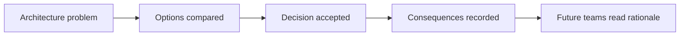
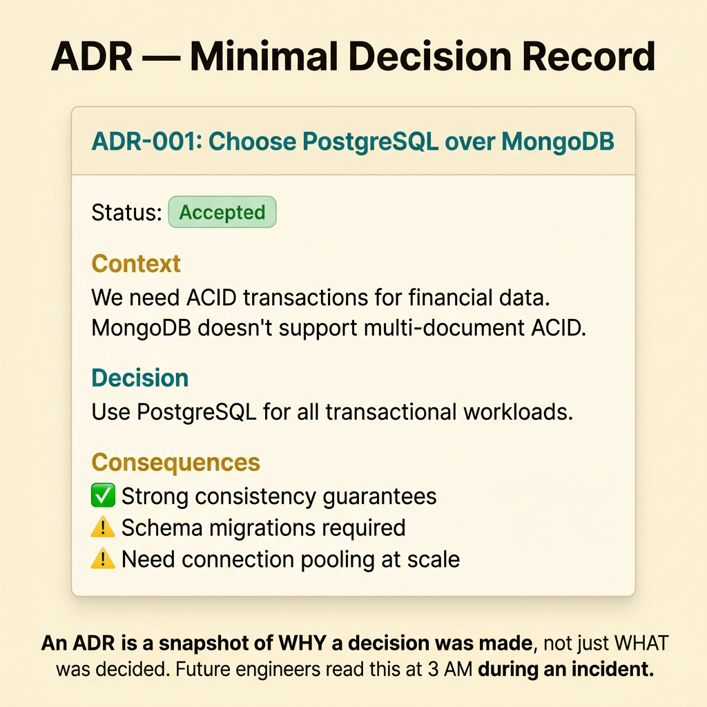
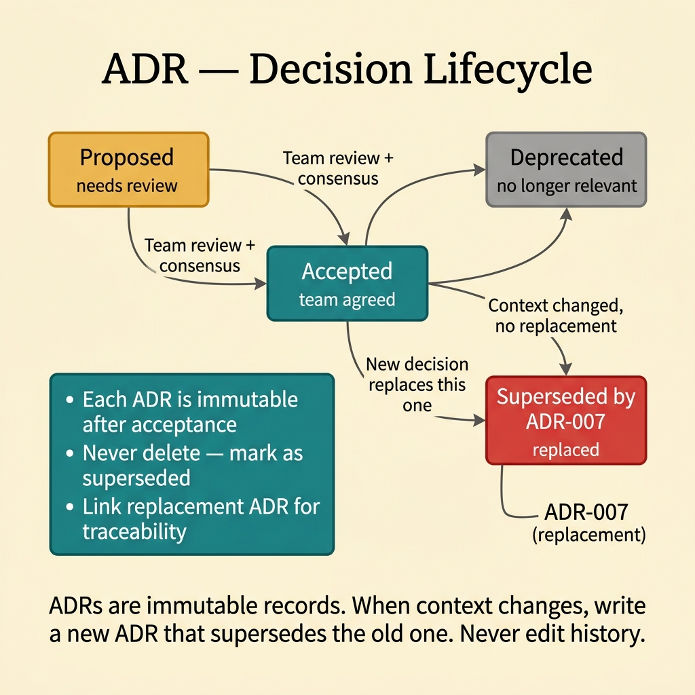
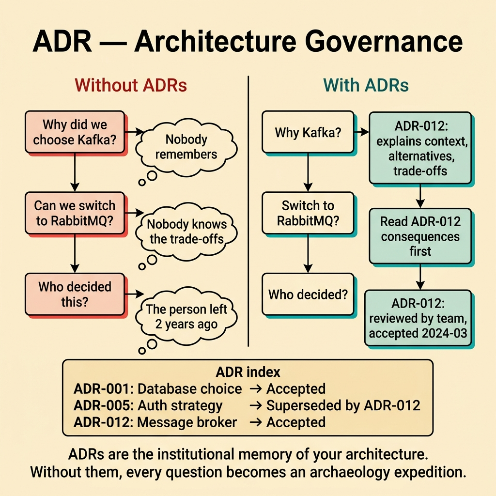
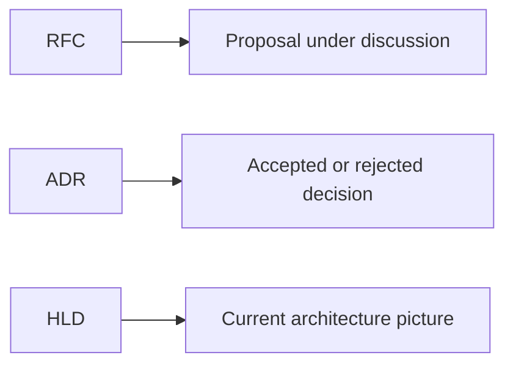

<!-- tags: glossary, reference, architecture-design, adr -->
# ADR — Architecture Decision Record

> A short record that captures one important architecture decision, the context behind it, and the consequences the team accepts.

| Aspect | Detail |
| --- | --- |
| **Concept** | A concise, durable record of one meaningful architecture decision. |
| **Audience** | Tech lead, architect, senior engineer |
| **Primary style** | Glossary term |
| **Entry point** | Use it when the team needs a reliable answer to "why did we choose this?" |

📅 Created: 2026-03-23 · 🔄 Updated: 2026-04-17 · ⏱️ 9 min read

---

## 1. DEFINE

Picture a service that currently speaks internal REST. Someone proposes moving to gRPC. Two months later, another engineer asks why the team did not choose GraphQL instead. Without an ADR, the answer lives in scattered chat messages, commit guesses, and fading memory. That is the exact kind of architecture amnesia ADR exists to prevent.

**ADR (Architecture Decision Record)** is a short document that captures one architecture decision, the context that led to it, and the consequences the team agrees to accept.

ADR is not a living description of the entire system. It is a point-in-time explanation of why one direction was accepted over its alternatives.

| Variant | Description |
| --- | --- |
| Nygard ADR | The classic format built around `Context`, `Decision`, and `Consequences`. |
| MADR | A richer template with clearer metadata and status. |
| Lightweight ADR | A minimal record for smaller repositories that still preserves rationale. |

| Approach | Time | Space | Choose it when |
| --- | --- | --- | --- |
| One decision per record | O(n decisions) | O(n markdown files) | Each independent decision needs separate traceability. |
| ADR index plus immutable history | O(n decisions + reviews) | O(index + records) | The team needs a readable history of statuses over time. |
| Supersede by new ADR | O(n replacements) | O(history) | The old context must remain visible when a decision changes. |

Core insight:

> ADR does not describe what the system is. ADR preserves why the team accepted one direction at one moment in time.

### 1.1 Invariants and Failure Modes

- One ADR should capture one meaningful decision.
- Historical records should stay immutable.
- A changed decision should produce a new record rather than rewrite the old one.

The main failure mode is editing an old ADR until it matches the present. That destroys the original trade-offs and the learning value of the decision history.

---

## 2. CONTEXT

**Who uses it**: Tech lead, architect, senior engineer

**When**: Use it when the team needs a durable answer to "why did we choose this direction?"

**Why it matters**: ADR preserves architectural memory without forcing the team to reverse-engineer intent from code or chat history.

**In this ecosystem**:
- `ADR` differs from `RFC`: an RFC proposes a direction under discussion; an ADR records one that was accepted or rejected.
- `ADR` differs from `HLD`: HLD shows the architecture shape; ADR records the rationale behind a particular design choice.
- If a decision has little architectural, operational, or team impact, a full ADR may be unnecessary.

Once a team starts forgetting the reason behind important decisions, the question is no longer whether to document. The question is whether the record will stay durable enough to matter.

---

## 3. EXAMPLES

ADR becomes visible when nobody remembers why the team chose Kafka over RabbitMQ, when a new engineer asks why service boundaries look the way they do, or when a past decision must be replaced without erasing history. The examples below place ADR in those moments.



*Diagram: ADR freezes the decision path, not just the chosen answer.*

### Example 1: Basic - Record one decision with a minimal template

> **Goal**: Capture an important choice quickly enough that the team will actually write it down.
> **Approach**: Use a compact `Context`, `Decision`, `Consequences` structure.
> **Example**: Choosing PostgreSQL over MongoDB for the order service.
> **Complexity**: Basic



*Figure: An ADR is a snapshot of WHY a decision was made, not just WHAT was decided.*

```yaml
adr:
  id: ADR-0007
  title: use-postgresql-for-order-service
  status: accepted
  context:
    - relational_queries_dominate
    - transaction_integrity_required
  decision:
    - choose_postgresql
  consequences:
    positive:
      - strong_transaction_support
    negative:
      - schema_changes_require_migrations
```

**Conclusion**: A useful ADR is short enough to write now and clear enough to explain the trade-off later.

### Example 2: Intermediate - Preserve lifecycle and replacement history

> **Goal**: Keep architecture history readable when a decision changes over time.
> **Approach**: Track status explicitly and supersede old records with new ones.
> **Example**: `ADR-0012` replaces `ADR-0007` after the sync model moves from polling to events.
> **Complexity**: Intermediate



*Figure: ADRs are immutable records. When context changes, write a new ADR that supersedes the old one.*

```yaml
adr_lifecycle:
  statuses:
    - proposed
    - accepted
    - rejected
    - superseded
  supersedes:
    old_record: ADR-0007
    new_record: ADR-0012
  rule:
    never_edit_historical_decision: true
```

> **Why?** If the team edits the past to resemble the present, it loses the reason the older decision once made sense.

**Conclusion**: A good intermediate ADR records not only the decision but also how it aged.

### Example 3: Advanced - Connect the decision to follow-up work

> **Goal**: Stop ADR from becoming a polite statement that implementation quietly ignores.
> **Approach**: Link the decision to issues, PRs, migrations, and operational tasks.
> **Example**: An outbox-pattern ADR creates schema work, a relay worker, and observability tasks.
> **Complexity**: Advanced



*Figure: ADRs are the institutional memory of your architecture. Without them, every question becomes an archaeology expedition.*

```yaml
adr_followup:
  decision: adopt_outbox_pattern
  linked_work:
    - schema_migration_issue
    - relay_worker_pr
    - alerting_dashboard_task
  review_questions:
    - are_consequences_reflected_in_backlog
    - is_rollback_path_defined
```

> **Why?** Architecture decisions create execution consequences. If the ADR does not pull work behind it, the document and the codebase drift apart.

**Conclusion**: An advanced ADR ties design intent to an execution trail.

### Example 4: Expert - Use ADR as long-term architecture governance

> **Goal**: Prevent architecture from drifting with each sprint and each strong opinion.
> **Approach**: Standardize which decision types require ADRs, who approves them, and when superseding is mandatory.
> **Example**: Changes to persistence style, public API style, or service boundaries require an ADR.
> **Complexity**: Expert

```yaml
adr_governance:
  required_for:
    - persistence_strategy_changes
    - service_boundary_changes
    - public_api_style_changes
    - critical_runtime_tradeoffs
  approvers:
    - architecture_owner
    - engineering_manager
  replacement_rule:
    new_record_required_if_decision_changes: true
```

> **Why?** Long-term architecture cannot depend on memory or on the loudest voice in the room. Governance turns ADR into an organized memory system.

**Conclusion**: At the expert level, ADR becomes a durable architecture-governance mechanism, not just a markdown habit.

---

## 4. COMPARE



*Diagram: ADR sits between proposal and design view. It records why a choice was made, while HLD shows what the resulting system looks like.*

ADR sounds like documentation, but its boundary is sharper than that. It does not try to explain the full system. It preserves a decision and the trade-offs behind it.

### Level 1

```text
problem appears
  -> options are compared
  -> one decision is accepted
  -> consequences are recorded
```

*Diagram: Level 1 shows ADR as a memory of choice, not a generic architecture note.*

### Level 2

```text
proposal or architecture pain
  -> trade-off discussion
  -> ADR drafted
  -> accepted, rejected, or superseded
  -> future teams read the rationale before changing course
```

*Diagram: Level 2 shows ADR as a memory layer for architecture decision-making.*

### Easy-to-miss Boundary Drift

The common ADR failure is not missing syntax. It is using the artifact for the wrong job.

| # | Severity | Mistake | Consequence | Fix |
| --- | --- | --- | --- | --- |
| 1 | 🔴 Fatal | Editing an old ADR instead of writing a new one | History and rationale disappear | Keep records immutable and use `superseded` |
| 2 | 🟡 Common | Recording only the final choice without context | Future readers see the outcome but not the reason | Keep `Context` and `Consequences` complete |
| 3 | 🟡 Common | Writing ADRs for trivial implementation details | The repository bloats and nobody reads it | Reserve ADRs for high-impact decisions |
| 4 | 🔵 Minor | Leaving ADR unlinked to real follow-up work | The document sounds right while execution drifts | Link ADRs to issues, PRs, and tasks |

### Quick Scan

| If you face | Action |
| --- | --- |
| The team asks, "why did we choose this?" | Write or open an ADR |
| An accepted direction has changed | Create a new ADR and supersede the old one |
| A decision looks disconnected from implementation | Link the ADR to concrete follow-up work |

---

## 5. REF

| Resource | Type | Link | Note |
| --- | --- | --- | --- |
| Documenting Architecture Decisions | Reference | https://cognitect.com/blog/2011/11/15/documenting-architecture-decisions | The original post by Michael Nygard |
| MADR | Reference | https://adr.github.io/madr/ | A structured ADR template family |
| Log4brains | Tool | https://github.com/thomvaill/log4brains | Tooling for repo-native ADR management |

---

## 6. RECOMMEND

ADR solves the memory problem behind major architecture choices. The next question is usually whether the system picture is clear enough and whether the domain boundary behind the decision is modeled well.

| Expand to | When | Reason | File/Link |
| --- | --- | --- | --- |
| HLD | You need the current architecture picture, not just the rationale | HLD shows the present system shape that the decision affected | [HLD](./HLD.md) |
| DDD | The decision touches domain language, invariants, or context boundaries | DDD explains many architecture choices at the domain level | [DDD](./DDD.md) |
| Architecture & Design | You want to return to the full branch router | The hub restores taxonomy and abstraction context | [Architecture & Design](./README.md) |

Return to the opening question about why one integration style was chosen over another. That is exactly the space ADR owns: one decision, one context, one set of accepted consequences, preserved without rewriting history.

**Links**: [← Previous](./README.md) · [→ Next](./DDD.md)
