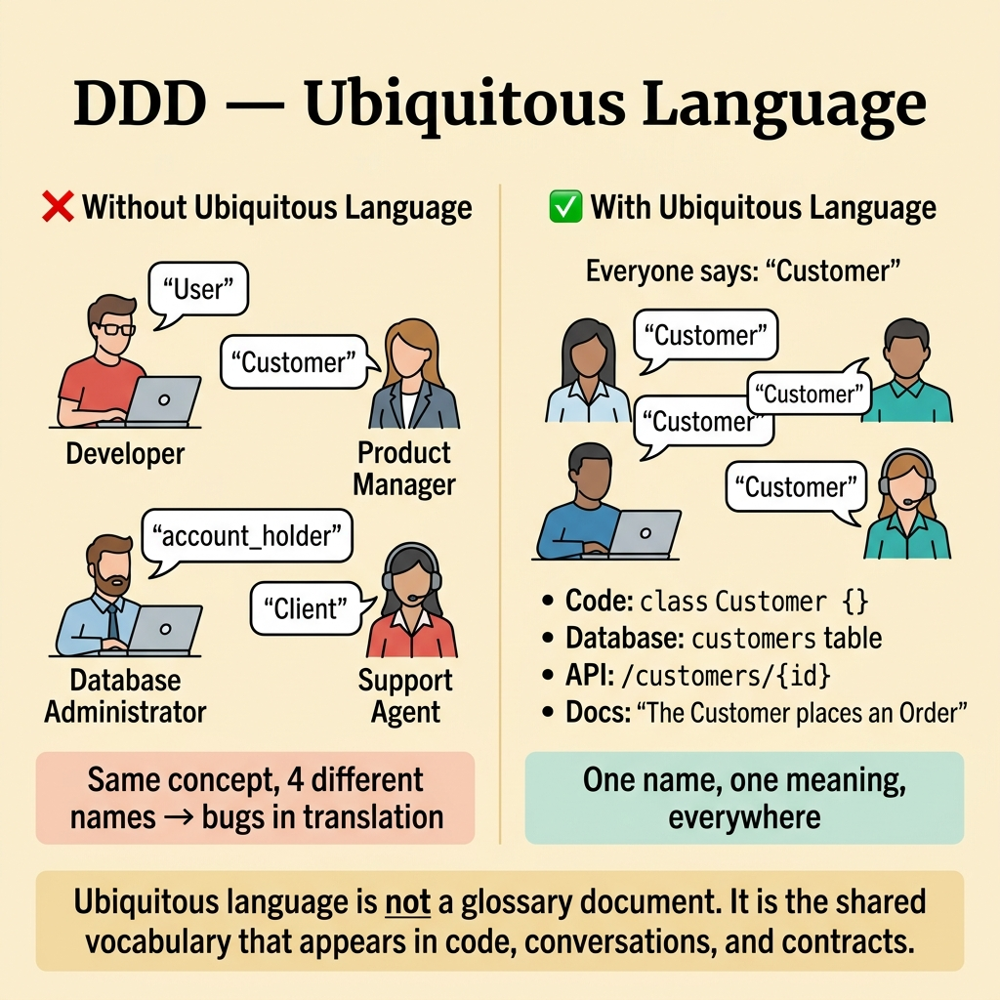
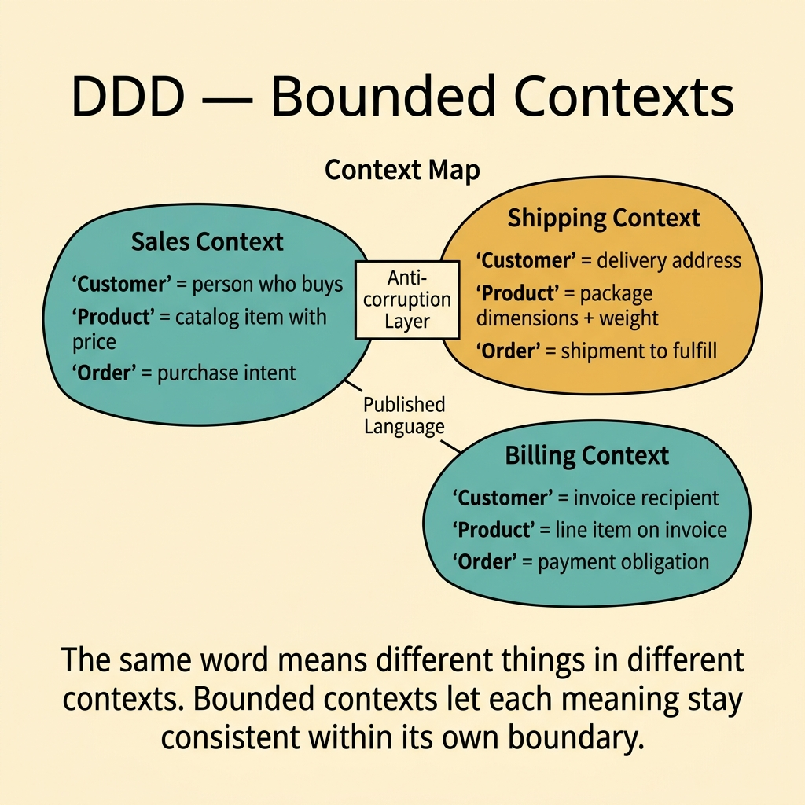
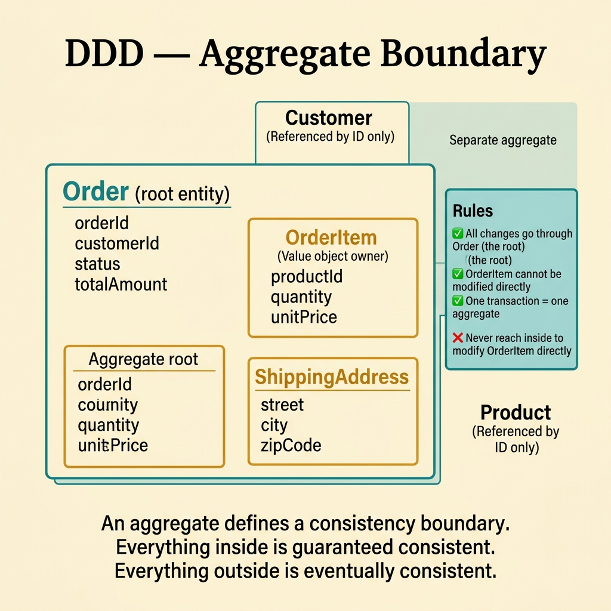
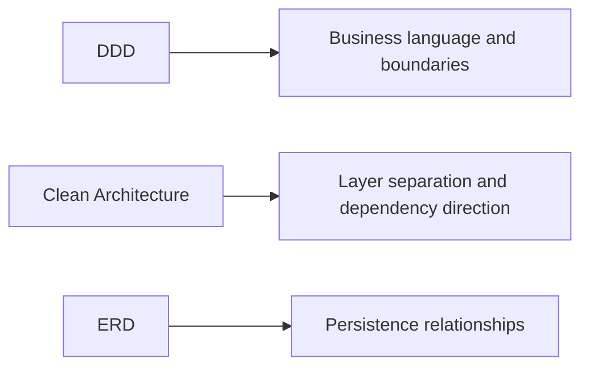

<!-- tags: glossary, reference, architecture-design, ddd -->
# DDD — Domain-Driven Design

> A software-design approach that puts domain language, boundaries, and business invariants at the center so the code reflects real business meaning.

| Aspect | Detail |
| --- | --- |
| **Concept** | A domain-centered design approach based on language, boundaries, and model integrity. |
| **Audience** | Architect, tech lead, backend engineer |
| **Primary style** | Glossary term |
| **Entry point** | Use it when CRUD naming and table-first design can no longer preserve the business meaning of the system. |

📅 Created: 2026-03-23 · 🔄 Updated: 2026-04-17 · ⏱️ 10 min read

---

## 1. DEFINE

Picture a team where billing calls something a "subscription," sales calls the same thing a "contract," and the code calls it a "plan." At the same time, the actual business rules leak from controllers into SQL patches and service glue. That is the moment **DDD** becomes necessary.

**DDD (Domain-Driven Design)** is a software-design approach that places the domain model and the business language at the center so the system reflects real business meaning instead of accidental CRUD structure.

DDD is not a decorative list of patterns. It is a way to reduce entropy in complex business software through shared language, explicit boundaries, and models that protect real invariants.

| Variant | Description |
| --- | --- |
| Strategic DDD | Organizes the system through subdomains, bounded contexts, and context maps. |
| Tactical DDD | Uses entities, value objects, aggregates, repositories, and events to enforce domain rules. |
| Lightweight DDD | Preserves language and boundaries without adopting every building block. |

| Approach | Time | Space | Choose it when |
| --- | --- | --- | --- |
| Ubiquitous-language first | O(n discovery sessions) | O(glossary + notes) | The same concept is being named differently across the team. |
| Bounded-context decomposition | O(n domain boundaries) | O(context maps + contracts) | One large model is carrying too many meanings. |
| Tactical modeling | O(n aggregates + use cases) | O(domain model) | Business invariants need explicit protection. |

Core insight:

> DDD matters because it aligns code with business meaning before terminology drift and boundary confusion harden into architecture debt.

### 1.1 Invariants and Failure Modes

- Language should be consistent inside one bounded context.
- Boundaries should protect meaning, not merely package structure.
- Critical invariants should live behind explicit model boundaries.

The main failure mode is semantic drift: the same term gains several meanings, or one aggregate stops enforcing the rules it exists to protect.

---

## 2. CONTEXT

**Who uses it**: Architect, tech lead, backend engineer

**When**: Use it when CRUD naming and table-first design can no longer preserve business semantics.

**Why it matters**: DDD gives teams a way to model business complexity without flattening it into generic tables and handlers.

**In this ecosystem**:
- `DDD` differs from CRUD-centric design: DDD optimizes for business meaning and invariants; CRUD optimizes for simple data manipulation.
- `DDD` does not require event sourcing or microservices.
- If the domain is simple, short-lived, and low-risk, heavy DDD may be unnecessary.

Once domain complexity becomes the real pressure, the next question is not "should we use all the tactical patterns?" The next question is "where is meaning drifting, and which boundary should stop that drift?"

---

## 3. EXAMPLES

DDD becomes visible when payment `Order` and shipping `Order` mean different things but share one model, when domain experts and engineers use different language, or when a large monolith has no stable semantic boundary. The examples below place DDD in those moments.


*Diagram: DDD starts by fixing language, then draws boundaries, then protects invariants inside those boundaries.*

### Example 1: Basic - Lock domain semantics with ubiquitous language

> **Goal**: Stop the codebase from drifting because the team uses different names for the same concept.
> **Approach**: Choose canonical terms and apply them everywhere.
> **Example**: "Order" exists only after payment commitment; before that, the concept is "Cart."
> **Complexity**: Basic



*Figure: Ubiquitous language is not a glossary document. It is the shared vocabulary that appears in code, conversations, and contracts.*

```yaml
ubiquitous_language:
  canonical_terms:
    cart: pending_purchase_before_confirmation
    order: confirmed_purchase_after_commitment
  forbidden_mixes:
    - use_order_for_unconfirmed_cart
  apply_in:
    - code
    - docs
    - review_comments
```

**Conclusion**: Basic DDD often starts with language discipline before it ever reaches aggregates.

### Example 2: Intermediate - Split bounded contexts so meanings can stay consistent

> **Goal**: Stop one shared model from carrying conflicting meanings for different teams.
> **Approach**: Define context ownership and translate between contexts through explicit contracts.
> **Example**: `Customer` in billing does not mean the same thing as `Customer` in support.
> **Complexity**: Intermediate



*Figure: The same word means different things in different contexts. Bounded contexts let each meaning stay consistent.*

```yaml
bounded_contexts:
  billing:
    owns:
      - subscription
      - invoice
  support:
    owns:
      - ticket
      - customer_case_view
  integration_rule:
    translate_through_contracts: true
```

> **Why?** A single shared model usually becomes half one thing and half another. Bounded contexts let the same word exist with different meanings without collapsing the codebase.

**Conclusion**: Intermediate DDD shines when it gives each part of the system permission to keep its own meaning cleanly.

### Example 3: Advanced - Use aggregates to protect critical invariants

> **Goal**: Stop core business rules from leaking across services, controllers, and database checks.
> **Approach**: Use an aggregate root to own state transitions and invariant enforcement.
> **Example**: `Order` must not become `Paid` before line items are frozen.
> **Complexity**: Advanced



*Figure: An aggregate defines a consistency boundary. Everything inside is guaranteed consistent.*

```yaml
aggregate_design:
  aggregate_root: order
  invariants:
    - cannot_mark_paid_before_items_frozen
    - total_must_equal_sum_of_items
  mutation_rule:
    all_state_changes_go_through_root: true
```

> **Why?** If invariants are split across multiple places, nobody knows where the final business truth lives.

**Conclusion**: Advanced DDD uses aggregates to protect invariants, not to add ceremony.

### Example 4: Expert - Keep DDD alive as a governance system

> **Goal**: Prevent context maps, canonical terms, and tactical models from drifting sprint by sprint.
> **Approach**: Review domain language, boundaries, and invariant leaks continuously.
> **Example**: A new domain term or boundary change triggers glossary, ADR, and context-map review.
> **Complexity**: Expert

```yaml
ddd_governance:
  review_triggers:
    - new_domain_term
    - context_boundary_change
    - invariant_leak_detected
  artifacts:
    - glossary
    - adr
    - context_map
  checklists:
    - language_consistent
    - aggregate_invariants_clear
    - external_contracts_explicit
```

> **Why?** DDD is not a one-time workshop. The business changes, so the model must be maintained with similar seriousness.

**Conclusion**: At the expert level, DDD becomes a long-term governance discipline for language, boundaries, and invariants.

---

## 4. COMPARE



*Diagram: DDD owns domain meaning and boundaries, Clean Architecture organizes technical layers, and ERD models persistence structure.*

DDD often gets confused with architectural layering or with data modeling. The sharper boundary is this: DDD owns business meaning, while other artifacts often own technical structure.

### Level 1

```text
complex business domain
  -> shared language
  -> bounded contexts
  -> domain model enforces rules
```

*Diagram: Level 1 shows DDD turning business complexity into language and enforceable boundaries.*

### Level 2

```text
subdomains identified
  -> bounded contexts defined
  -> entities, value objects, and aggregates modeled
  -> repositories and events expose only safe boundaries
```

*Diagram: Level 2 shows DDD's two tiers: strategic context division and tactical invariant protection.*

### Easy-to-miss Boundary Drift

The common DDD failure is not missing vocabulary. It is applying the vocabulary without solving real domain pain.

| # | Severity | Mistake | Consequence | Fix |
| --- | --- | --- | --- | --- |
| 1 | 🔴 Fatal | Applying heavy DDD to a simple CRUD domain | Delivery slows while complexity adds little value | Reserve strong DDD investment for complex core domains |
| 2 | 🟡 Common | Keeping ubiquitous language only in documents, not in code | Docs and implementation drift apart | Rename code and docs to match canonical terms |
| 3 | 🟡 Common | Making aggregates too large or boundaries too vague | Contention rises and reasoning gets harder | Keep invariants focused and review context boundaries |
| 4 | 🔵 Minor | Treating DDD as a pattern checklist | The terminology is present but the model adds little value | Start from real business complexity first |

### Quick Scan

| If you face | Action |
| --- | --- |
| The same term means different things to different teams | Start with ubiquitous language |
| One model tries to serve too many contexts | Revisit bounded contexts |
| A critical business rule leaks across many places | Design an aggregate boundary to hold it |

---

## 5. REF

| Resource | Type | Link | Note |
| --- | --- | --- | --- |
| Domain-Driven Design | Book | https://www.domainlanguage.com/ddd/ | The original foundation by Eric Evans |
| Implementing Domain-Driven Design | Book | https://vaughnvernon.com/ | Pragmatic strategic and tactical follow-up |
| Context Mapper | Tool | https://contextmapper.org/ | Helpful for bounded-context and context-map modeling |

---

## 6. RECOMMEND

DDD solves the problem of business meaning drifting away from the code. The next question is usually whether those domain choices should now be recorded as architecture decisions or translated into more concrete design artifacts.

| Expand to | When | Reason | File/Link |
| --- | --- | --- | --- |
| ADR | A domain boundary or modeling choice needs durable rationale | DDD often drives architecture decisions that should be recorded | [ADR](./ADR.md) |
| LLD | The tactical model now needs interface and module detail | LLD is where domain choices become implementable seams | [LLD](./LLD.md) |
| Architecture & Design | You want to return to the full branch router | The hub restores the branch taxonomy | [Architecture & Design](./README.md) |

Return to the opening moment where one business concept had three names. That is the kind of entropy DDD is meant to reduce before it becomes architecture debt.

**Links**: [← Previous](./ADR.md) · [→ Next](./ERD.md)
