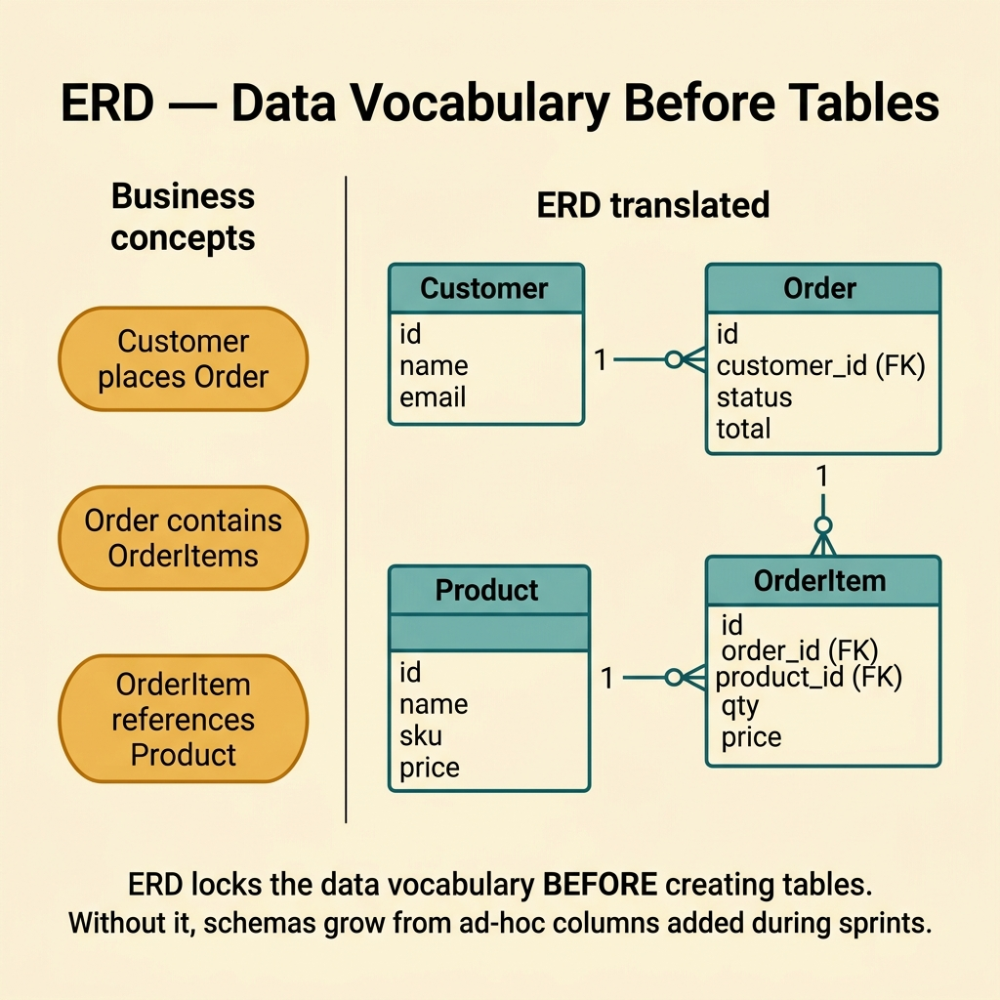
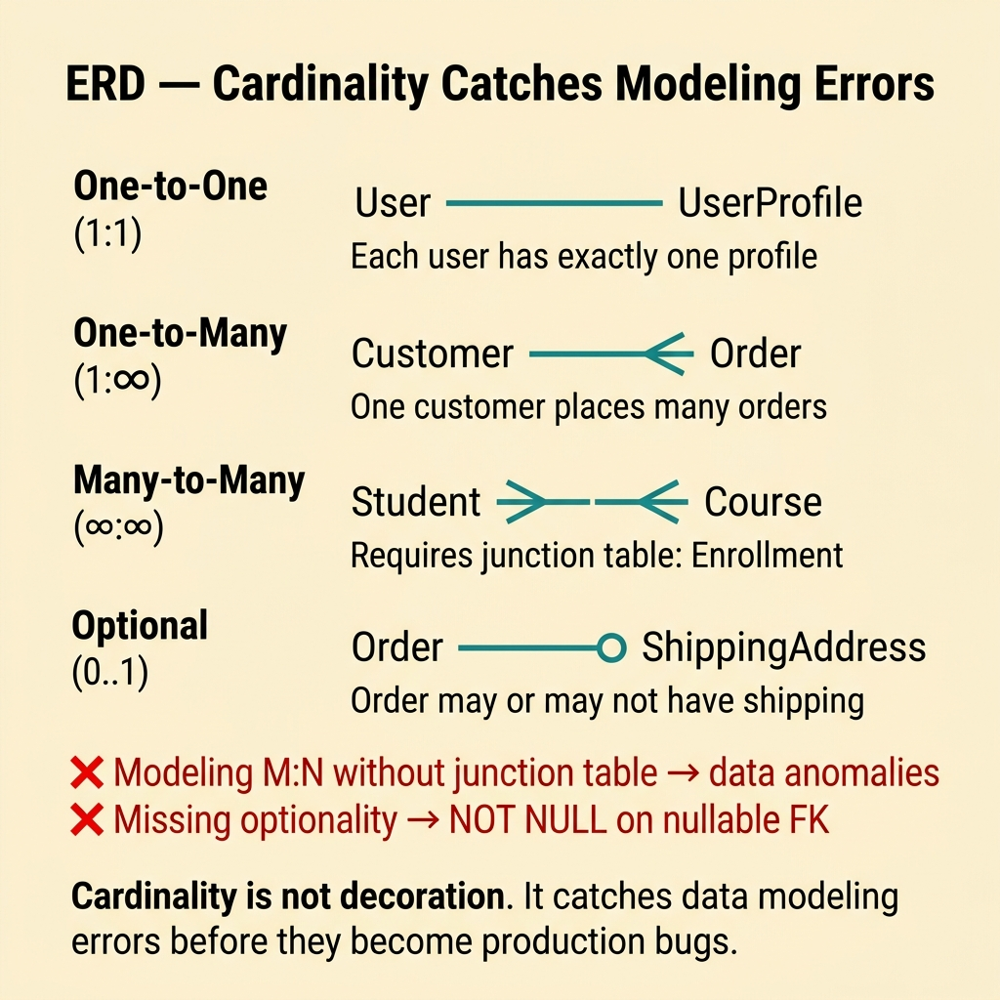
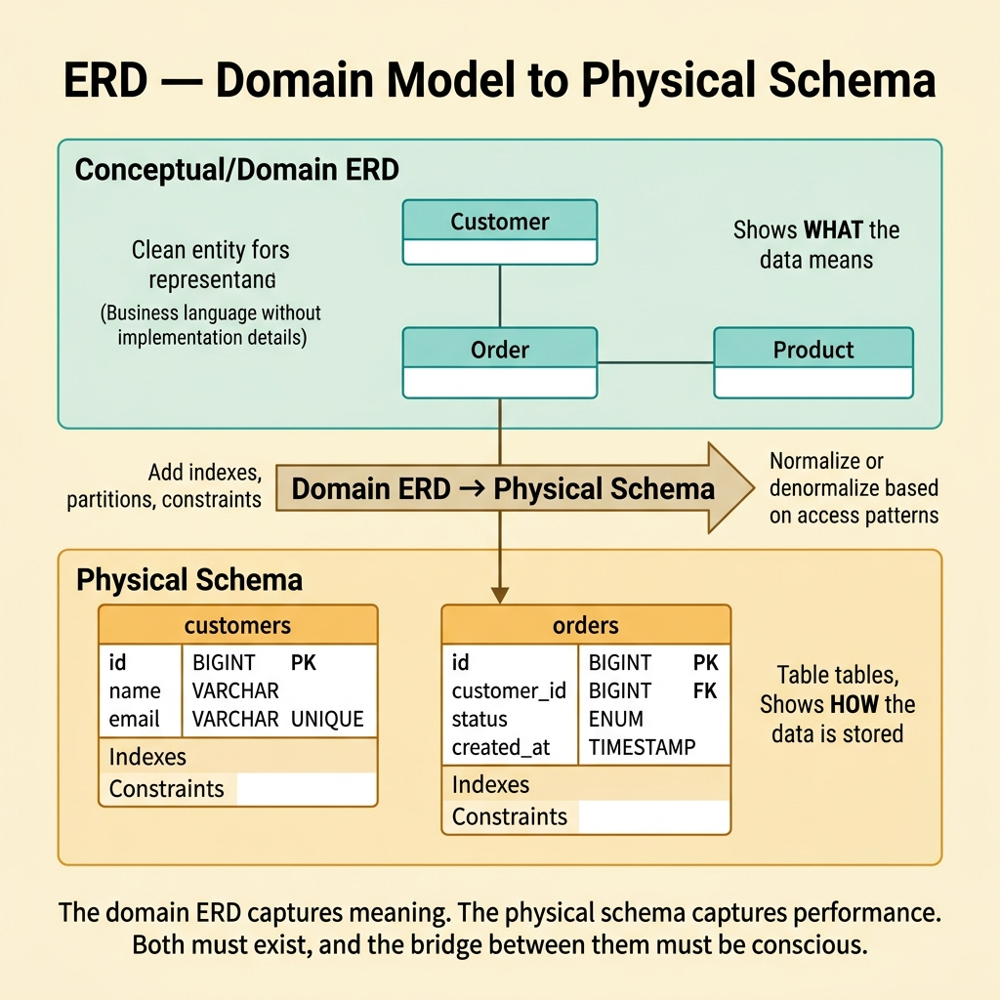
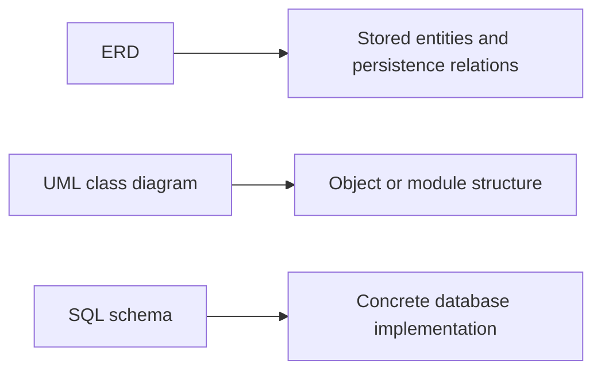

<!-- tags: glossary, reference, architecture-design, erd -->
# ERD — Entity-Relationship Diagram

> A diagram that shows entities, attributes, and data relationships so the team can reason about persistence structure before it hardens into schema and migration decisions.

| Aspect | Detail |
| --- | --- |
| **Concept** | A persistence-oriented diagram for entities and their relationships. |
| **Audience** | Backend engineer, database engineer, analyst |
| **Primary style** | Glossary term |
| **Entry point** | Use it when the team must answer "what data objects exist and how do they relate?" before talking about queries or migrations. |

📅 Created: 2026-03-20 · 🔄 Updated: 2026-04-17 · ⏱️ 9 min read

---

## 1. DEFINE

Picture an `orders` table that slowly absorbs shipping addresses, payment snapshots, coupon data, and audit trails. A few sprints later, every migration feels risky because nobody can still see the original relationship structure behind the schema. That is the moment **ERD** becomes necessary.

**ERD (Entity-Relationship Diagram)** is a diagram that represents entities, attributes, and data relationships so the team can see the storage domain's structure before it becomes encoded in concrete database schemas.

ERD is not about drawing a database poster. Its real value is forcing the team to make cardinality, ownership, and relationship meaning explicit before those assumptions spread into migrations, APIs, and analytics.

| Variant | Description |
| --- | --- |
| Conceptual ERD | Focuses on business entities and relationships without PK or FK detail. |
| Logical ERD | Adds keys, cardinality, and constraints without tying the model to one vendor. |
| Physical ERD | Maps directly to tables, columns, indexes, and foreign keys. |

| Approach | Time | Space | Choose it when |
| --- | --- | --- | --- |
| Conceptual modeling | O(n entities + relations) | O(diagram) | The team must align on data vocabulary and scope first. |
| Logical normalization view | O(n entities x constraints) | O(schema notes) | The model is approaching real schema design. |
| Physical schema mapping | O(n tables + indexes) | O(migration plan) | The ERD must now guide implementation and evolution. |

Core insight:

> ERD matters because it forces the team to see data structure before that structure becomes expensive to change.

### 1.1 Invariants and Failure Modes

- Cardinality should be explicit.
- Ownership should be explicit.
- Optionality should be explicit.

The main failure mode is a relationship line that says "these things connect somehow" without stating whether the relation is optional, one-to-many, or many-to-many. That kind of vagueness creates expensive schema mistakes.

---

## 2. CONTEXT

**Who uses it**: Backend engineer, database engineer, analyst

**When**: Use it when the team must answer "what data objects exist and how do they relate?" before query or migration detail takes over.

**Why it matters**: ERD exposes persistence structure early enough that the schema does not accidentally define the model by itself.

**In this ecosystem**:
- `ERD` differs from a `UML` class diagram: ERD optimizes for stored data and persistence relations; UML class diagrams optimize for object and module structure.
- `ERD` does not replace indexing strategy or query tuning.
- If the team is debating runtime behavior rather than persistence relationships, sequence or activity diagrams are a better fit.

Once the persistence lens is chosen, the harder question becomes how much structure to show at each stage without dragging implementation detail in too early.

---

## 3. EXAMPLES

ERD becomes visible when a team crams fifty tables into one unreadable picture, when the schema changes but the model explanation does not, or when a new engineer only sees raw `CREATE TABLE` files and misses the relationship story. The examples below place ERD in those moments.


*Diagram: ERD grows from vocabulary to relationship meaning, then to implementable persistence structure.*

### Example 1: Basic - Lock data vocabulary before creating tables

> **Goal**: Agree on the main data objects before the team starts debating columns and migrations.
> **Approach**: Draw a conceptual ERD around entities and business relationships.
> **Example**: Order, Customer, Product, and Payment with their primary relations.
> **Complexity**: Basic



*Figure: ERD locks the data vocabulary BEFORE creating tables. Without it, schemas grow from ad-hoc columns.*

```yaml
conceptual_erd:
  entities:
    - customer
    - order
    - product
    - payment
  relations:
    - customer_has_many_orders
    - order_contains_many_products_via_order_item
    - order_has_one_payment_attempt_chain
```

**Conclusion**: A basic ERD prevents schema-first decisions from racing ahead while the underlying data model is still ambiguous.

### Example 2: Intermediate - Use cardinality to catch modeling errors early

> **Goal**: Detect wrong relationship assumptions before they spread into schema, validation, and reporting.
> **Approach**: Build a logical ERD with explicit cardinality and optionality.
> **Example**: An order may have zero or one coupon, while one coupon may apply to many orders.
> **Complexity**: Intermediate



*Figure: Cardinality is not decoration. It catches data modeling errors before they become production bugs.*

```yaml
logical_erd:
  relation:
    left: coupon
    right: order
    cardinality: one_to_many_optional
  notes:
    - order_may_have_no_coupon
    - coupon_can_be_used_many_times_if_business_allows
```

> **Why?** A wrong cardinality assumption is expensive because it leaks into schema, validation, APIs, and reporting all at once.

**Conclusion**: An intermediate ERD earns its keep by making relationship meaning explicit, not by drawing prettier boxes.

### Example 3: Advanced - Bridge the domain view to a physical schema

> **Goal**: Convert a stable relationship model into tables, junctions, and constraints with control.
> **Approach**: Add keys, junction tables, and implementation notes.
> **Example**: An order model uses `order_items`, payment snapshots, and soft-delete rules.
> **Complexity**: Advanced



*Figure: The domain ERD captures meaning. The physical schema captures performance. Both must exist.*

```yaml
physical_mapping:
  tables:
    - orders
    - order_items
    - products
    - payment_attempts
  constraints:
    - order_items.order_id_fk
    - order_items.product_id_fk
  implementation_notes:
    - soft_delete_on_customers
    - payment_attempts_append_only
```

> **Why?** A useful ERD should survive the handoff into schema work. Otherwise it stays a slide artifact with no operational value.

**Conclusion**: Advanced ERD sits between conceptual modeling and physical schema, not on one side of that divide.

### Example 4: Expert - Govern data-model evolution over time

> **Goal**: Keep the persistence picture accurate as migrations keep changing the schema.
> **Approach**: Review relation changes, ownership changes, and downstream consumers alongside ERD updates.
> **Example**: Any change to the `orders`, `payments`, or `customers` core relations triggers ERD review.
> **Complexity**: Expert

```yaml
erd_governance:
  update_required_when:
    - relation_changes
    - new_core_entity_added
    - ownership_moves_between_tables
  review_checks:
    - cardinality_still_true
    - downstream_reports_considered
    - migration_backward_compatibility_checked
```

> **Why?** Data models outlive many other code decisions. A wrong relation change can damage analytics, billing, or compliance long after the migration ships.

**Conclusion**: At the expert level, ERD becomes a governance tool for durable persistence structure.

---

## 4. COMPARE



*Diagram: ERD owns the persistence relationship view, UML class diagrams own object structure, and SQL schemas own implementation detail.*

ERD often sounds like a class diagram because both draw named things connected by lines. The boundary is simpler than that: ERD is a storage view, while class diagrams are logic and structure views.

### Level 1

```text
Customer 1 --- N Order
Order    1 --- N OrderItem
Product  1 --- N OrderItem
```

*Diagram: Level 1 shows ERD at its simplest: which entities exist and how they connect.*

### Level 2

```text
Customer(id)
  1 -> N Order(id, customer_id, status)
Order(id)
  1 -> N OrderItem(order_id, product_id, qty)
Product(id)
  1 -> N OrderItem(order_id, product_id, qty)
Coupon(id)
  0..1 -> N Order(coupon_id)
```

*Diagram: Level 2 adds keys, optionality, and cardinality to prepare for schema decisions.*

### Easy-to-miss Boundary Drift

The common ERD failure is not missing boxes. It is missing relationship meaning.

| # | Severity | Mistake | Consequence | Fix |
| --- | --- | --- | --- | --- |
| 1 | 🔴 Fatal | Drawing relationships without clear cardinality or optionality | Schema and validation head in the wrong direction | State one-to-many, many-to-many, optional, or required explicitly |
| 2 | 🟡 Common | Using ERD to explain runtime behavior | The diagram becomes overloaded and confusing | Keep ERD for data structure only |
| 3 | 🟡 Common | Leaving ERD stale while the schema changes | Docs and database drift apart | Review ERD with major migrations |
| 4 | 🔵 Minor | Jumping into physical detail too early | The team debates implementation before the model is stable | Start conceptual, then move to logical and physical |

### Quick Scan

| If you face | Action |
| --- | --- |
| The team has not agreed on core data objects | Draw a conceptual ERD |
| Optionality or many-to-many rules are unclear | Build a logical ERD with explicit cardinality |
| Schema and docs have drifted apart | Tie ERD review to migration review |

---

## 5. REF

| Resource | Type | Link | Note |
| --- | --- | --- | --- |
| Database Design for Mere Mortals | Book | https://www.informit.com/store/database-design-for-mere-mortals-9780136788041 | Accessible foundation for ERD and data modeling |
| PostgreSQL Docs | Official | https://www.postgresql.org/docs/ | Useful when the model moves toward physical schema |
| PlantUML IE Diagrams | Tool | https://plantuml.com/ie-diagram | Text-based ERD rendering option |

---

## 6. RECOMMEND

ERD solves the persistence-structure problem. The next question is usually whether the team now needs a broader diagram language or a more implementation-oriented artifact.

| Expand to | When | Reason | File/Link |
| --- | --- | --- | --- |
| UML | You need structure or behavior views beyond persistence | UML covers more than stored data relationships | [UML](./UML.md) |
| LLD | The problem has moved into schema ownership and implementation detail | LLD is the next step closer to code | [LLD](./LLD.md) |
| Architecture & Design | You want the full router again | The hub restores the branch taxonomy | [Architecture & Design](./README.md) |

Return to the opening moment where one table started carrying everything. That is exactly the kind of drift ERD is meant to expose before the schema becomes painful to change.

**Links**: [← Previous](./DDD.md) · [→ Next](./HLD.md)
