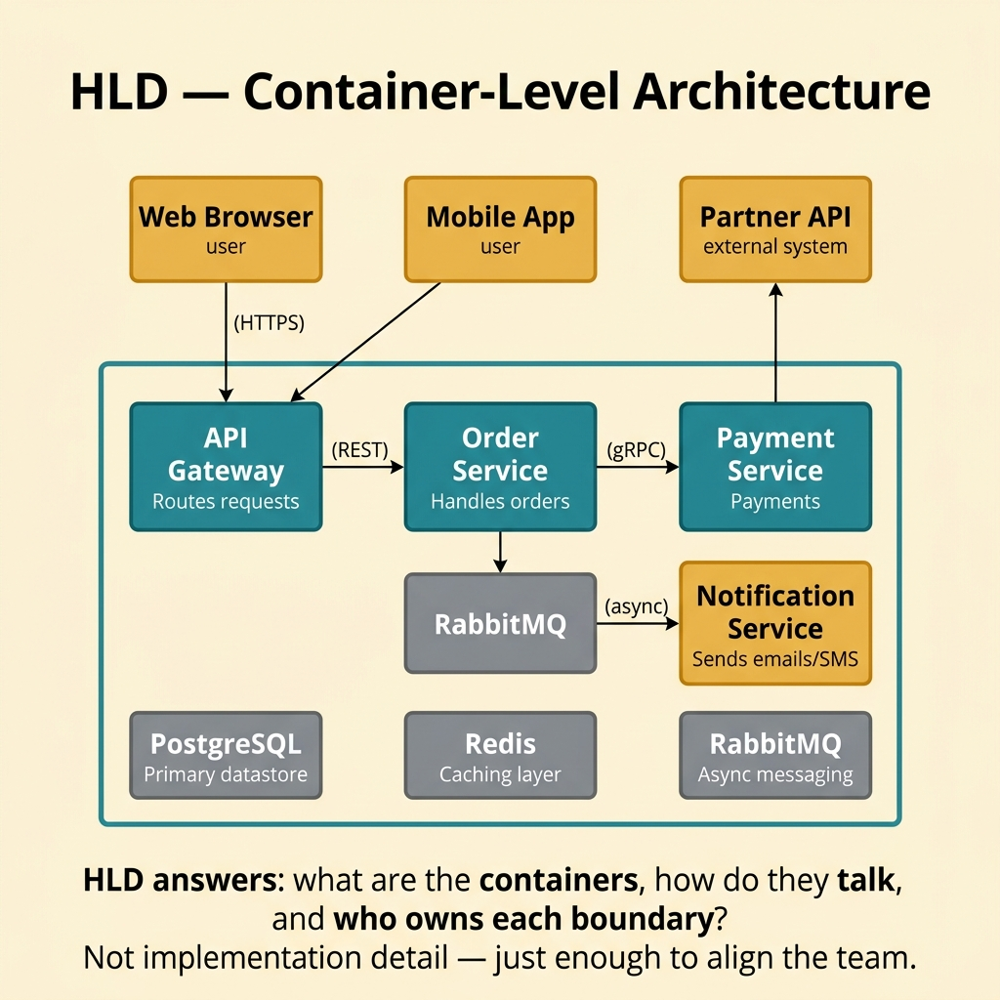
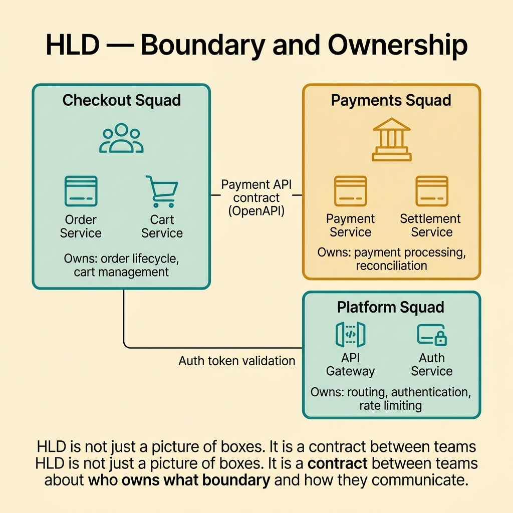
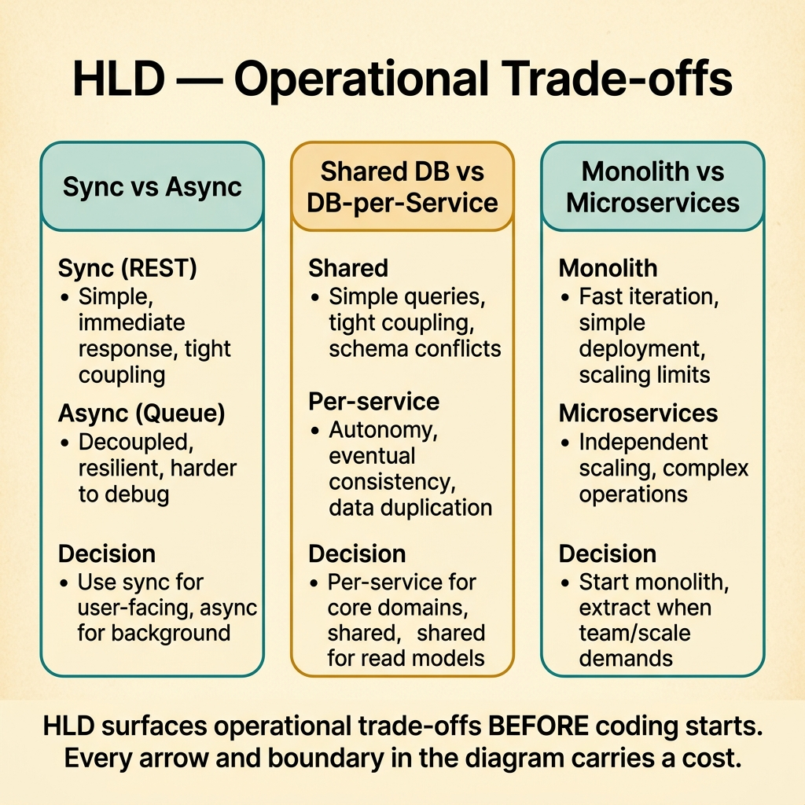
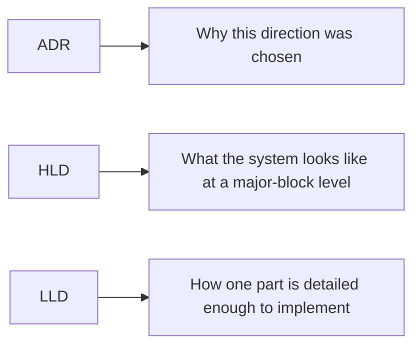

<!-- tags: glossary, reference, architecture-design, hld -->
# HLD — High-Level Design

> A system-level design view that aligns a team on major building blocks, responsibility boundaries, and primary flows before implementation detail takes over.

| Aspect | Detail |
| --- | --- |
| **Concept** | A high-level architecture document for major components, dependencies, and flows. |
| **Audience** | Architect, tech lead, reviewer, technical stakeholder |
| **Primary style** | Glossary term |
| **Entry point** | Use it when the team must agree on the system's big shape before discussing class names or DTO fields. |

📅 Created: 2026-03-20 · 🔄 Updated: 2026-04-17 · ⏱️ 9 min read

---

## 1. DEFINE

Picture a team that does not need repository method names yet, but absolutely needs to know where authentication lives, which service calls inventory, and whether a payment failure can cascade into order creation. That is the altitude where **HLD** becomes necessary.

**HLD (High-Level Design)** is a system-level design document that aligns a team on major building blocks, responsibility boundaries, and primary flows before implementation detail begins.

HLD is not a prettier version of implementation notes. Its job is to keep the system picture clear enough that teams can divide work without inventing the architecture by accident in code.

| Variant | Description |
| --- | --- |
| System-context HLD | Places the system among users and external systems. |
| Container or service HLD | Breaks the system into major modules, services, stores, and queues. |
| Solution-option HLD | Compares multiple high-level directions before one is chosen. |

| Approach | Time | Space | Choose it when |
| --- | --- | --- | --- |
| Context-first decomposition | O(n actors + systems) | O(diagrams + notes) | The team must understand external boundaries first. |
| Container-level design | O(n components + relations) | O(architecture docs) | Implementation work will be split across people or teams. |
| Trade-off-oriented HLD | O(n options x constraints) | O(decision matrix) | Several architecture directions still compete. |

Core insight:

> HLD answers strategic system questions early enough that architecture does not get decided by whichever code merges first.

### 1.1 Invariants and Failure Modes

- Major boundaries must be clear.
- Primary flows must be legible.
- Ownership must be explicit enough that two teams do not infer two incompatible architectures.

The main failure mode is a document that looks architectural but leaves readers guessing who owns what. At that point, implementation drift becomes inevitable.

---

## 2. CONTEXT

**Who uses it**: Architect, tech lead, reviewer, technical stakeholder

**When**: Use it when the team must agree on the system's big shape before touching implementation detail.

**Why it matters**: HLD creates a shared system picture early enough to prevent accidental architecture.

**In this ecosystem**:
- `HLD` differs from `LLD`: HLD speaks in major blocks, contracts, and primary flows; LLD speaks in interfaces, schemas, and detailed collaborations.
- `HLD` is not a backlog list.
- Once a document starts naming method signatures or concrete DTO fields, it has slipped into LLD territory.

Once the need for a system picture is clear, the next question is how much detail HLD should carry without collapsing into implementation noise.

---

## 3. EXAMPLES

HLD becomes visible when teams start coding without a shared system picture, when an architect explains everything verbally but nothing is anchored visually, or when a supposed HLD dives so deep it loses its bird's-eye view. The examples below place HLD in those moments.


*Diagram: A good HLD starts with boundaries and major flows before it discusses implementation seams.*

### Example 1: Basic - Draw a container-level picture for a new system

> **Goal**: Agree on the system's major blocks before dividing implementation work.
> **Approach**: Name actors, core components, storage, and external integrations.
> **Example**: An e-commerce system with a web app, API gateway, order service, payment gateway, PostgreSQL, and Redis.
> **Complexity**: Basic



*Figure: HLD answers: what are the containers, how do they talk, and who owns each boundary?*

```yaml
hld_overview:
  actors:
    - customer
    - admin
  components:
    - web_app
    - api_gateway
    - order_service
    - payment_adapter
    - postgres
    - redis
  main_flow:
    - customer_places_order
    - api_validates
    - order_persists
    - payment_requested
```

**Conclusion**: A basic HLD gives the team one stable picture of the system before code begins fragmenting that picture.

### Example 2: Intermediate - Clarify boundary and ownership

> **Goal**: Prevent the same responsibility from being pulled into multiple services or modules.
> **Approach**: State who owns which capability and which flows consume that ownership through contracts.
> **Example**: Auth owns token issuance; profile only consumes verified claims.
> **Complexity**: Intermediate



*Figure: HLD is not just a picture of boxes. It is a contract between teams about who owns what boundary.*

```yaml
ownership_map:
  auth_service:
    owns:
      - identity_verification
      - token_issuance
  profile_service:
    owns:
      - profile_data
    depends_on:
      - auth_claims
```

> **Why?** Many architecture failures begin as ownership ambiguity, not as technology mistakes.

**Conclusion**: An intermediate HLD does more than draw boxes. It locks down who is responsible for each critical part of the system.

### Example 3: Advanced - Surface operational trade-offs before coding

> **Goal**: Evaluate latency, failure isolation, scaling, and rollback before implementation hardens a direction.
> **Approach**: Put non-functional trade-offs directly into the HLD.
> **Example**: Use asynchronous events between order and notification to isolate failure, while accepting eventual consistency.
> **Complexity**: Advanced



*Figure: HLD surfaces operational trade-offs BEFORE coding starts. Every arrow carries a cost.*

```yaml
operational_tradeoffs:
  design_choice: async_event_between_order_and_notification
  benefits:
    - failure_isolation
    - independent_scaling
  costs:
    - eventual_consistency
    - replay_operational_complexity
  requires:
    - idempotent_consumers
    - observability_for_queue_lag
```

> **Why?** Architecture is not only about clean boxes. It is also about accepting real reliability and operability costs.

**Conclusion**: An advanced HLD helps the team see the price of a design direction before it pays that price in production.

### Example 4: Expert - Turn HLD into a contract between design and execution

> **Goal**: Prevent HLD from becoming a diagram the team admires once and ignores afterward.
> **Approach**: Link it to ADRs, LLDs, risks, and implementation streams.
> **Example**: One service-boundary choice needs an ADR, and one auth flow needs a separate LLD.
> **Complexity**: Expert

```yaml
hld_governance:
  links_to:
    - adr_for_major_tradeoffs
    - lld_for_component_details
    - implementation_streams
  review_triggers:
    - boundary_change
    - new_external_dependency
    - scaling_assumption_change
```

> **Why?** HLD stays useful only when it leads to real follow-up decisions and real implementation work.

**Conclusion**: At the expert level, HLD is the guiding layer that connects architecture intent with concrete execution.

---

## 4. COMPARE



*Diagram: ADR records rationale, HLD shows the big system picture, and LLD zooms into implementable detail.*

HLD sounds close to LLD until the abstraction boundary is made explicit. HLD owns system-level shape. LLD owns the seam where developers need implementation detail.

### Level 1

```text
users and external systems
  -> system boundary
  -> major components
  -> primary data and control flows
```

*Diagram: Level 1 shows that HLD answers the big-picture system question before code detail appears.*

### Level 2

```text
web app
  -> api gateway
  -> auth service, order service, payment adapter
  -> postgres, redis, message bus
  -> rollback, reliability, and observability assumptions
```

*Diagram: Level 2 shows that HLD should remain clear about containers, dependencies, and operational boundaries without collapsing into code detail.*

### Easy-to-miss Boundary Drift

The common HLD failure is not drawing too little. It is drawing at the wrong altitude.

| # | Severity | Mistake | Consequence | Fix |
| --- | --- | --- | --- | --- |
| 1 | 🔴 Fatal | HLD stays vague about ownership and boundary | Teams implement incompatible interpretations | Name who owns each major component, data set, and contract |
| 2 | 🟡 Common | HLD dives into implementation detail | It overlaps with LLD and becomes hard to scan | Keep focus on major blocks, flows, and trade-offs |
| 3 | 🟡 Common | Operational trade-offs stay implicit | Only the happy path is visible | Add scaling, reliability, and rollback assumptions |
| 4 | 🔵 Minor | HLD has no links to ADR or LLD follow-up | The document looks nice but drives little action | Tie it to the next artifact and execution stream |

### Quick Scan

| If you face | Action |
| --- | --- |
| It is unclear what the major blocks are | Draw HLD first |
| Services or modules argue about ownership | Add an ownership map |
| The HLD diagram drives no review or follow-up | Link it to ADRs, LLDs, and workstreams |

---

## 5. REF

| Resource | Type | Link | Note |
| --- | --- | --- | --- |
| C4 Model | Reference | https://c4model.com/ | Pragmatic multi-zoom framing for HLD |
| Software Architecture in Practice | Book | https://www.informit.com/store/software-architecture-in-practice-9780136885979 | Foundation for architecture views and trade-offs |
| Architecture Decision Records | Reference | https://adr.github.io/ | HLD often reveals choices that deserve ADRs |

---

## 6. RECOMMEND

HLD solves the problem of a missing system picture. The next question is usually whether the implementation boundary is detailed enough and whether the rationale behind major trade-offs has been recorded.

| Expand to | When | Reason | File/Link |
| --- | --- | --- | --- |
| LLD | You need interface, schema, or collaboration detail inside one part of the system | LLD takes over once the high-level shape is stable | [LLD](./LLD.md) |
| ADR | A major trade-off needs durable rationale | HLD often exposes choices that deserve explicit decision records | [ADR](./ADR.md) |
| Architecture & Design | You want to return to the full branch router | The hub restores the artifact taxonomy | [Architecture & Design](./README.md) |

Return to the opening scene where people needed to know where auth lived and how failures traveled. That is HLD territory: enough detail to align the system, not so much detail that the system gets lost in implementation noise.

**Links**: [← Previous](./ERD.md) · [→ Next](./LLD.md)
