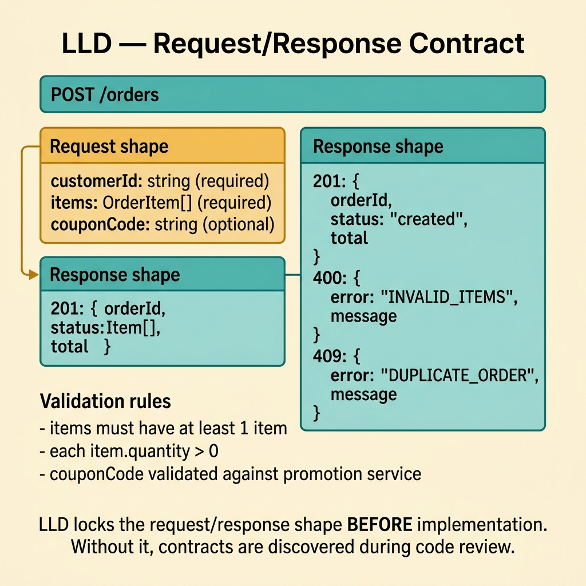
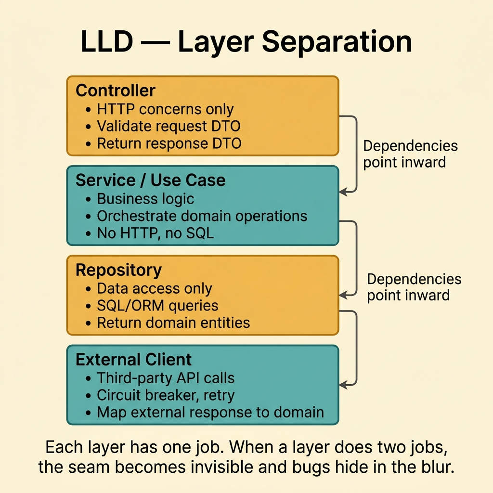
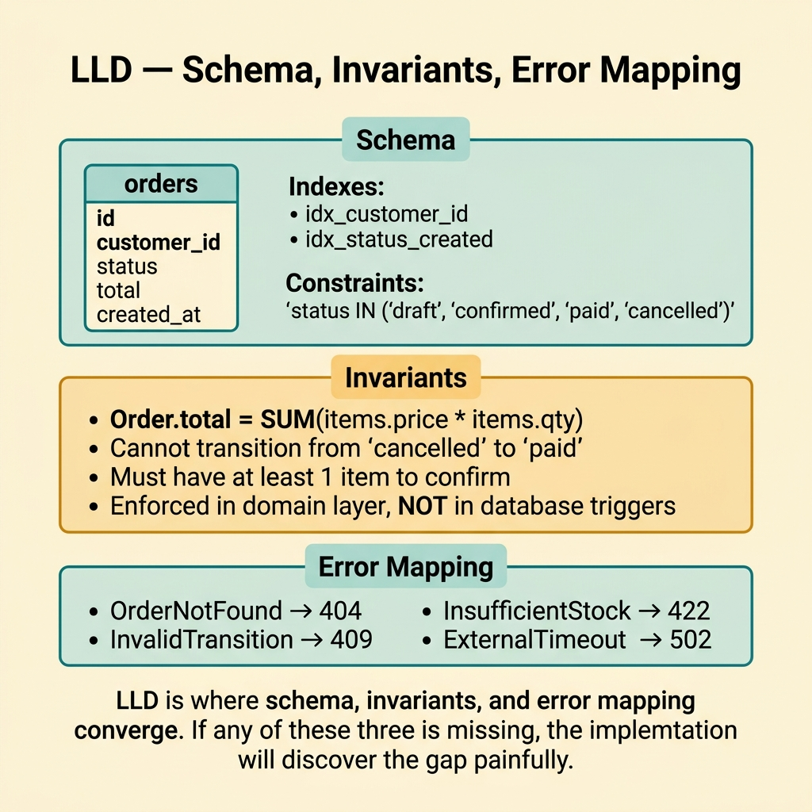
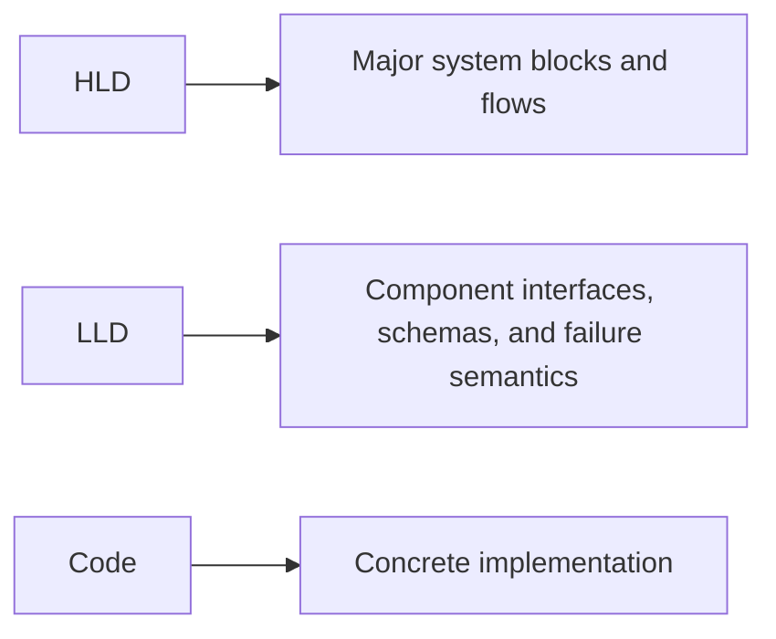

<!-- tags: glossary, reference, architecture-design, lld -->
# LLD — Low-Level Design

> A detailed design view that specifies interfaces, schemas, contracts, and collaborator boundaries so one component can be implemented consistently.

| Aspect | Detail |
| --- | --- |
| **Concept** | A low-level design artifact for contracts, schemas, and concrete collaboration seams. |
| **Audience** | Developer, reviewer, tech lead |
| **Primary style** | Glossary term |
| **Entry point** | Use it when `HLD` has fixed the system shape and the team now needs exact answers about one component. |

📅 Created: 2026-03-20 · 🔄 Updated: 2026-04-17 · ⏱️ 9 min read

---

## 1. DEFINE

Everyone already agrees that "the auth service issues tokens." Then implementation begins, and the real questions appear. What is the request shape? Where does password policy live? Which repository interface is public inside the component? Which failure returns `401`, which returns `423`, and which is retryable? That is where **LLD** becomes necessary.

**LLD (Low-Level Design)** is a detailed design document that describes interfaces, schemas, contracts, and specific dependencies so one component can be implemented consistently.

LLD is not a code dump. It is the design layer where ambiguity about collaboration, ownership, and failure semantics gets removed before code hardens in different directions.

| Variant | Description |
| --- | --- |
| Object or module LLD | Focuses on classes, interfaces, and collaboration boundaries. |
| API or contract LLD | Focuses on request or response shape, errors, auth, and compatibility detail. |
| Persistence LLD | Focuses on schema, indexes, mappings, and repository contracts. |

| Approach | Time | Space | Choose it when |
| --- | --- | --- | --- |
| Interface-first design | O(n interfaces + methods) | O(spec + stubs) | One component has many collaborators and needs clean seams. |
| Contract-first detail | O(n endpoints or messages) | O(schemas + examples) | Boundary precision matters before implementation begins. |
| Data-first detail | O(n tables + mappings) | O(schema docs) | Complexity sits in persistence shape and invariants. |

Core insight:

> If HLD answers "what are the major system blocks?", LLD answers "how will this one block actually be built so reviewers and implementers converge on the same shape?"

### 1.1 Invariants and Failure Modes

- Different implementers should produce nearly the same public contract after reading the LLD.
- Ownership must be explicit across collaborators.
- Error semantics and invariants must be visible, not inferred later from code.

The main failure mode is a document that looks detailed but still leaves contract and ownership ambiguous. At that point, the codebase will fork in style and behavior.

---

## 2. CONTEXT

**Who uses it**: Developer, reviewer, tech lead

**When**: Use it when `HLD` has fixed the system shape and the team now needs exact answers about one component.

**Why it matters**: LLD is where architecture stops being abstract and starts becoming implementable without guesswork.

**In this ecosystem**:
- `LLD` differs from `HLD`: HLD owns major blocks and flows; LLD owns interfaces, schemas, and detailed component collaboration.
- `LLD` should not duplicate every future line of code.
- If a document still lives only at the service-box and high-level-flow layer, it is not yet LLD.

Once the need for detail is clear, the real question becomes how much detail is enough to guide implementation without turning the document into pseudo-code.

---

## 3. EXAMPLES

LLD becomes visible when a developer starts coding without knowing which interfaces to expose, when a supposed low-level design is still too abstract to guide implementation, or when the document becomes so literal that nobody updates it. The examples below place LLD in those moments.


*Diagram: LLD turns one selected part of the system into an implementable contract map.*

### Example 1: Basic - Lock request and response shape before implementation

> **Goal**: Prevent one endpoint or use case from being implemented differently by whoever writes the first code.
> **Approach**: Specify input, output, and primary error cases before coding.
> **Example**: A registration endpoint needs a defined request body, validation, and error surface.
> **Complexity**: Basic



*Figure: LLD locks the request/response shape BEFORE implementation. Without it, contracts are discovered during code review.*

```yaml
api_contract:
  endpoint: POST /auth/register
  request:
    email: string
    password: string
  success_response:
    user_id: uuid
    status: pending_verification
  errors:
    - email_already_exists
    - password_policy_violation
```

**Conclusion**: A useful basic LLD makes the boundary explicit enough that implementation and review stop guessing.

### Example 2: Intermediate - Separate service, repository, and external dependency roles

> **Goal**: Create seams that support testing, refactoring, and dependency replacement.
> **Approach**: Assign ownership to each collaborator before implementation.
> **Example**: An auth service depends on `UserRepository`, `PasswordHasher`, and `TokenIssuer`.
> **Complexity**: Intermediate



*Figure: Each layer has one job. When a layer does two jobs, the seam becomes invisible and bugs hide in the blur.*

```yaml
component_collaboration:
  auth_service:
    depends_on:
      - user_repository
      - password_hasher
      - token_issuer
  ownership:
    auth_service: orchestration_and_rules
    user_repository: persistence
    token_issuer: token_creation_only
```

> **Why?** Boundary ambiguity usually creates design drift long before technology choices do.

**Conclusion**: An intermediate LLD draws the seam lines before code makes those seam lines expensive to change.

### Example 3: Advanced - Lock schema, invariants, and failure mapping

> **Goal**: Prevent constraints and error behavior from being invented bug by bug.
> **Approach**: Make schema rules, transaction scope, and failure mapping explicit.
> **Example**: User creation must preserve unique email, transaction scope, and API error mapping.
> **Complexity**: Advanced



*Figure: LLD is where schema, invariants, and error mapping converge. If any is missing, the gap surfaces painfully.*

```yaml
persistence_detail:
  table: users
  constraints:
    - unique_email
  transaction_scope:
    - create_user
    - create_audit_seed
  error_mapping:
    unique_violation: email_already_exists
    timeout: retryable_failure
```

> **Why?** Leaving constraint and failure semantics blank produces inconsistent behavior across code paths.

**Conclusion**: Advanced LLD protects correctness at the places where production bugs usually begin: schema detail and failure semantics.

### Example 4: Expert - Use LLD as contract governance for maintainability

> **Goal**: Stop interfaces and data ownership from drifting through convenient shortcuts.
> **Approach**: Review public DTOs, dependency rules, invariants, and compatibility whenever the component changes materially.
> **Example**: Changes to a public DTO or retry rule must update the LLD and pass review.
> **Complexity**: Expert

```yaml
lld_governance:
  update_required_for:
    - public_contract_change
    - persistence_ownership_change
    - new_dependency_or_side_effect
  review_checks:
    - invariants_preserved
    - interfaces_still_minimal
    - backward_compatibility_considered
```

> **Why?** Long-lived components attract shortcuts. LLD is one place where the team can push back before those shortcuts become the permanent contract.

**Conclusion**: At the expert level, LLD becomes a maintenance and governance tool for explicit component contracts.

---

## 4. COMPARE



*Diagram: HLD gives the system picture, LLD gives the component blueprint, and code realizes the blueprint.*

LLD often gets confused with code documentation. The distinction is timing and purpose. LLD guides implementation before code stabilizes. Code documentation explains code that already exists.

### Level 1

```text
component selected
  -> interfaces defined
  -> data model detailed
  -> edge cases and failures made explicit
```

*Diagram: Level 1 shows how LLD turns one chosen block into something concrete enough to build.*

### Level 2

```text
API handler
  -> service interface
  -> repository contract
  -> schema, DTO, and validation detail
  -> exact failure paths and ownership
```

*Diagram: Level 2 shows that LLD clarifies seams inside one component, not the entire system topology.*

### Easy-to-miss Boundary Drift

The common LLD failure is not insufficient detail. It is detail that still fails to guide consistent implementation.

| # | Severity | Mistake | Consequence | Fix |
| --- | --- | --- | --- | --- |
| 1 | 🔴 Fatal | LLD stays vague about contract or ownership | Two teams can both claim they followed the document | Specify inputs, outputs, owners, and failure semantics |
| 2 | 🟡 Common | The document becomes a code dump | It grows hard to read and harder to maintain | Stay at the contract, schema, and collaboration level |
| 3 | 🟡 Common | Failure paths and invariants are skipped | Edge cases are invented gradually after release | Define constraints, transaction scope, and error mapping |
| 4 | 🔵 Minor | LLD is not updated when contracts change | Review and onboarding rely on stale detail | Tie contract changes to LLD review |

### Quick Scan

| If you face | Action |
| --- | --- |
| HLD is clear but implementation intent still diverges | Write an LLD |
| Service, repository, and gateway boundaries feel muddy | Lock the collaboration map |
| Contract or schema keeps changing under review | Update the LLD alongside the review |

---

## 5. REF

| Resource | Type | Link | Note |
| --- | --- | --- | --- |
| Clean Architecture | Reference | https://blog.cleancoder.com/uncle-bob/2012/08/13/the-clean-architecture.html | Useful for dependency direction and boundary thinking |
| Refactoring | Book | https://martinfowler.com/books/refactoring.html | Helpful when LLD must preserve long-term maintainability |
| OpenAPI Specification | Official | https://spec.openapis.org/oas/latest.html | Relevant when LLD touches API contract detail |

---

## 6. RECOMMEND

LLD solves the problem of implementation ambiguity inside one chosen component. The next question is usually whether the surrounding system picture is still visible and whether a more formal diagram language or data-model view would help.

| Expand to | When | Reason | File/Link |
| --- | --- | --- | --- |
| HLD | You need to step back to the bigger system picture | HLD restores context before more low-level detail accumulates | [HLD](./HLD.md) |
| ERD | The low-level problem is mostly about persistence structure | ERD gives a clearer data-relationship lens | [ERD](./ERD.md) |
| Architecture & Design | You want the full router again | The hub restores the branch taxonomy | [Architecture & Design](./README.md) |

Return to the opening moment where everyone knew "auth issues tokens" but nobody knew the exact contract. That gap is exactly what LLD is supposed to close.

**Links**: [← Previous](./HLD.md) · [→ Next](./UML.md)
