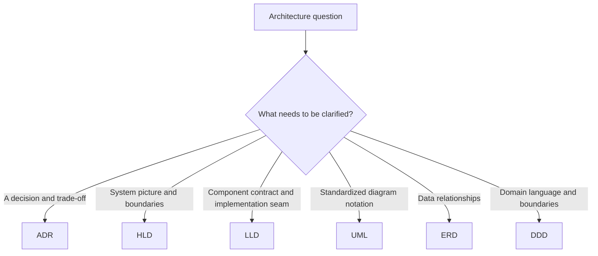
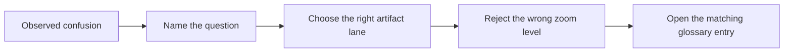
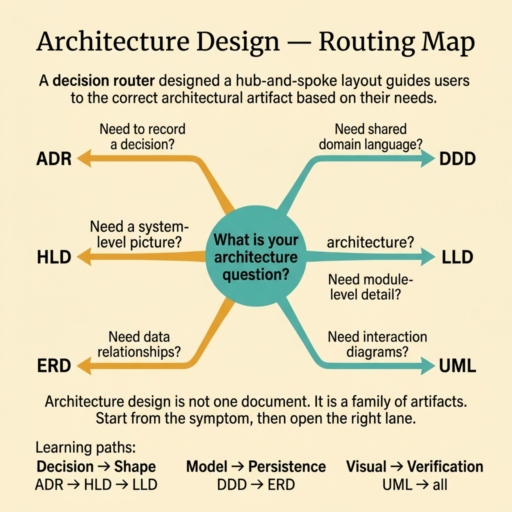

<!-- tags: glossary, reference, architecture-design, overview -->
# Architecture & Design

> A cluster of terms for architecture artifacts, modeling views, and decision records that help teams draw the right picture at the right abstraction level.

| Aspect | Detail |
| --- | --- |
| **Concept** | A router for architecture documents, diagram languages, and system-modeling lenses. |
| **Audience** | Solution architect, tech lead, reviewer, design-doc author |
| **Primary style** | Glossary hub router |
| **Entry point** | Open this when the team is unsure which artifact should answer the question on the table. |

📅 Created: 2026-03-30 · 🔄 Updated: 2026-04-17 · ⏱️ 8 min read

---

## 1. DEFINE

Picture a design-review meeting where `ADR`, `HLD`, `LLD`, `UML`, `ERD`, and `DDD` all appear within fifteen minutes. The problem is not a lack of artifacts. The problem is that nobody agrees on which artifact should carry the current question. One person answers a boundary decision with a sequence diagram. Another answers a modeling question with an ADR. The meeting becomes noisy because the team is drawing at the wrong altitude. That is the reason this hub exists.

**Architecture & Design** is a cluster of terms covering decision records, abstraction layers, and modeling lenses that help a team describe a system without blurring intent, structure, and implementation detail.

| Variant | Description |
| --- | --- |
| Decision records | `ADR` captures a specific decision, its context, and its consequences. |
| Architecture layers | `HLD` and `LLD` describe the same system at different zoom levels. |
| Modeling lenses | `UML`, `ERD`, and `DDD` explain structure, data, behavior, and domain meaning from different angles. |

| Approach | Time | Space | Choose it when |
| --- | --- | --- | --- |
| Route by architecture question | O(1) | O(1) | You first need to name what kind of answer the team needs. |
| Route by abstraction level | O(1) | O(1) | The meeting is mixing system shape with implementation detail. |
| Route by artifact lifecycle | O(1) | O(1) | You need to know whether to record a decision, describe a view, or model a concept. |

Core insight:

> Design sessions often fail because the team uses the wrong artifact for the wrong question, not because the team lacks technical ideas.

### 1.1 Signals and Boundaries

- `ADR` stores one important decision and its rationale. It does not describe the whole system.
- `HLD` and `LLD` differ by zoom level, not by page count.
- `UML`, `ERD`, and `DDD` are not interchangeable. They illuminate different parts of a system.

### Coverage Map

| Entry | Role | Note |
| --- | --- | --- |
| [ADR — Architecture Decision Record](ADR.md) | Decision memory | Why one direction was accepted |
| [HLD — High-Level Design](HLD.md) | System overview | Major blocks, boundaries, and primary flows |
| [LLD — Low-Level Design](LLD.md) | Implementation blueprint | Interfaces, schemas, collaboration seams |
| [UML — Unified Modeling Language](UML.md) | Diagram language | Standard notation for structure and behavior |
| [ERD — Entity-Relationship Diagram](ERD.md) | Data-model lens | Persistence entities and relations |
| [DDD — Domain-Driven Design](DDD.md) | Domain-model lens | Language, contexts, and invariants |

Knowing the names is not enough. The real skill is opening the correct lane before the team starts arguing in circles.

---

## 2. VISUAL



*Diagram: The hub routes by the kind of question being asked, not by the artifact name people remember first.*

The taxonomy is clearer now. The next job is to translate that taxonomy into a practical router so a reviewer can move from a symptom to the right document without comparing unrelated tools.

### Level 1

```text
Decision memory        -> ADR
Architecture overview  -> HLD
Implementation detail  -> LLD
Diagram notation       -> UML
Data structure         -> ERD
Domain language        -> DDD
```

*Diagram: Level 1 compresses the branch into six distinct lanes so the reader can choose the right altitude fast.*

### Level 2

```text
If the situation is...                                   Open first
------------------------------------------------------   ---------------------------
Need to preserve why a choice was made                  ADR
Need to align on the big system picture                 HLD
Need exact contracts inside one component               LLD
Need a standard diagram language                        UML
Need to model persistence relationships                 ERD
Need to model business language and boundaries          DDD
```

*Diagram: Level 2 routes by symptom, not by acronym familiarity.*

---

## 3. CODE

The visual split the branch into lanes. The examples below turn that split into a practical routing worksheet the team can use during reviews.



*Diagram: The router starts from confusion and ends with the right artifact, not the other way around.*

### Problem 1: Basic - Route the right symptom to the right entry

> **Goal**: Stop every architecture question from collapsing into one generic "design doc" bucket.
> **Approach**: Start from the symptom, then open the best-fitting artifact.
> **Example**: A review question should map directly to one file, such as `./ADR.md`.
> **Complexity**: Basic



*Figure: Architecture design is not one document. It is a family of artifacts. Start from the symptom, then open the right lane.*

```yaml
router:
  - symptom: Need to preserve a decision and its trade-off
    open_first: ./ADR.md
  - symptom: Need to align on the system's major blocks
    open_first: ./HLD.md
  - symptom: Need to specify interfaces, schemas, and collaboration details
    open_first: ./LLD.md
  - symptom: Need to describe persistence relationships
    open_first: ./ERD.md
  - symptom: Need a standard notation for structure or behavior
    open_first: ./UML.md
  - symptom: Need to fix ambiguous domain language and boundaries
    open_first: ./DDD.md
```

**Conclusion**: The hub's first value is not explanation depth. It is keeping the team from starting at the wrong zoom level.

### Problem 2: Intermediate - Read the branch as an abstraction ladder

> **Goal**: Build a mental model that moves from intent to design to modeling without random jumps.
> **Approach**: Read by lane and by handoff.
> **Example**: A reviewer wants a coherent design vocabulary, not isolated definitions.
> **Complexity**: Intermediate

```yaml
learning_path:
  decision_to_shape:
    - ADR.md
    - HLD.md
    - LLD.md
  notation_and_models:
    - UML.md
    - ERD.md
  domain_meaning:
    - DDD.md
```

> **Why?** These artifacts make more sense as neighbors than as isolated glossary cards. `ADR` explains why, `HLD` explains shape, and `LLD` explains how that shape becomes implementable.

**Conclusion**: The intermediate payoff is a cleaner abstraction ladder. Each term hands off to the next on purpose.

### Problem 3: Advanced - Use the hub as a shared vocabulary contract

> **Goal**: Keep ADRs, reviews, HLDs, and incidents using the same architecture language.
> **Approach**: Group the terms by role and treat that grouping as a review vocabulary.
> **Example**: Two people use the same word but are debating at two different architecture layers.
> **Complexity**: Advanced

```yaml
governance_map:
  decision_lane:
    - ADR.md
  architecture_lane:
    - HLD.md
    - LLD.md
  modeling_lane:
    - UML.md
    - ERD.md
    - DDD.md
```

> **Why?** Shared vocabulary is a review tool. Without it, the team spends energy untangling altitude mismatches instead of evaluating the design itself.

**Conclusion**: At the advanced level, this hub works as a zoom-level controller for architecture discussions.

---

## 4. PITFALLS

The lanes are visible now. The common failure is still using the right word at the wrong altitude.

| # | Severity | Mistake | Consequence | Fix |
| --- | --- | --- | --- | --- |
| 1 | 🔴 Fatal | Mixing several abstraction layers in one discussion | The team fixes the wrong problem and the meeting drifts | Re-route through this README before opening a term doc |
| 2 | 🟡 Common | Choosing an artifact by familiar name instead of by symptom | The reader lands in a correct file with the wrong boundary | Ask the symptom question first |
| 3 | 🟡 Common | Reading one term in isolation and skipping the handoff path | Understanding stays fragmented | Follow the reading paths in `CODE` and `RECOMMEND` |
| 4 | 🔵 Minor | Letting child files become islands with no return path | Readers lose the taxonomy once they go deep | Keep this hub as the router back to context |

---

## 5. REF

| Resource | Type | Link | Note |
| --- | --- | --- | --- |
| Architecture Decision Records | Reference | https://adr.github.io/ | Canonical reference for concise decision records |
| arc42 | Reference | https://arc42.org/ | Useful structure for architecture communication |
| Domain-Driven Design | Book | https://www.domainlanguage.com/ddd/ | Foundation for domain language and boundaries |

---

## 6. RECOMMEND

You now know which lane you need. The next step is to open the adjacent artifact that keeps the design from blurring intent, structure, and implementation detail.

| Expand to | When | Reason | File/Link |
| --- | --- | --- | --- |
| ADR first | The team must lock down rationale before people forget it | Without a clear why, the rest of the architecture story drifts | [ADR — Architecture Decision Record](./ADR.md) |
| HLD then LLD | The big picture is not yet aligned, then implementation detail becomes necessary | This keeps abstraction in the right order | [HLD — High-Level Design](./HLD.md) |
| DDD | The friction is in language, domain boundaries, and invariants | At that point, shape alone is not enough | [DDD — Domain-Driven Design](./DDD.md) |

---

## 7. QUICK REF

| If you face | Open |
| --- | --- |
| Need to preserve why a choice was made | [ADR — Architecture Decision Record](./ADR.md) |
| Need the big system picture | [HLD — High-Level Design](./HLD.md) |
| Need component-level contracts and seams | [LLD — Low-Level Design](./LLD.md) |
| Need a standard diagram language | [UML — Unified Modeling Language](./UML.md) |
| Need a persistence relationship view | [ERD — Entity-Relationship Diagram](./ERD.md) |
| Need domain language and boundary modeling | [DDD — Domain-Driven Design](./DDD.md) |

**Links**: [← Previous](../README.md) · [→ Next](./ADR.md)
