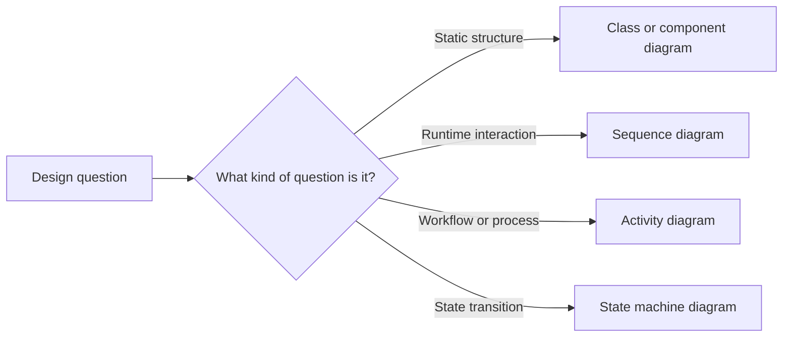
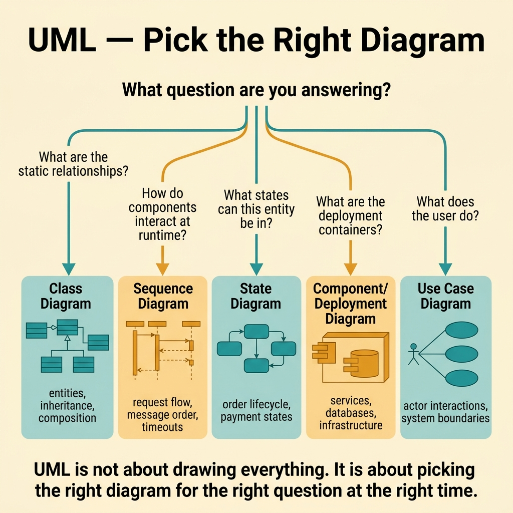
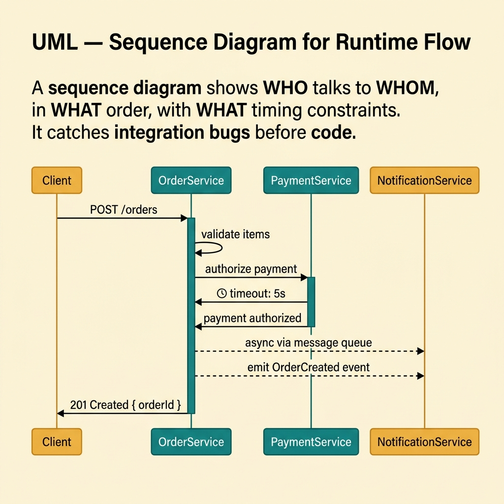
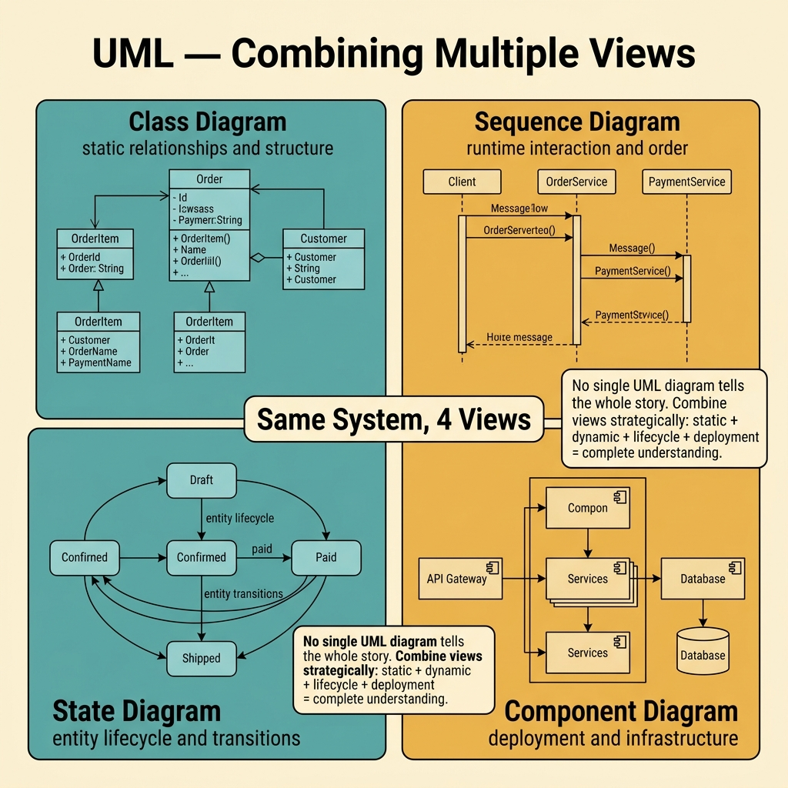
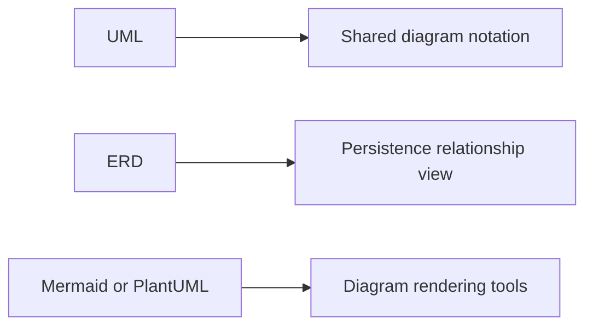

<!-- tags: glossary, reference, architecture-design, uml -->
# UML — Unified Modeling Language

> A standardized modeling language that represents system structure and behavior through diagrams with shared notation.

| Aspect | Detail |
| --- | --- |
| **Concept** | A diagram language for describing structure, interaction, workflow, and state with consistent notation. |
| **Audience** | Architect, developer, analyst |
| **Primary style** | Glossary term |
| **Entry point** | Use it when the team needs a diagram language that other people can read without decoding one person's private style. |

📅 Created: 2026-03-20 · 🔄 Updated: 2026-04-17 · ⏱️ 9 min read

---

## 1. DEFINE

Picture a team explaining the login flow to a new reviewer. One person sketches a sequence diagram, another pastes a screenshot, and a third draws a few arrows with custom labels. Each picture says something useful, but none of them share one common grammar. That is the gap **UML** was created to close.

**UML (Unified Modeling Language)** is a standardized modeling language for representing system structure and behavior through diagrams with consistent notation.

UML does not require all fourteen diagram types to be useful. Its practical value lies in choosing the right diagram for the right question while keeping notation consistent enough that other people can read it quickly.

| Variant | Description |
| --- | --- |
| Structural UML | Class, component, package, and deployment diagrams for static structure. |
| Behavioral UML | Sequence, activity, state-machine, and use-case diagrams for behavior and interaction. |
| Lightweight UML usage | A pragmatic subset of diagrams chosen for real communication value. |

| Approach | Time | Space | Choose it when |
| --- | --- | --- | --- |
| Use-case-driven selection | O(n questions) | O(chosen diagrams) | The first challenge is picking the correct diagram type. |
| Structure-first modeling | O(n components or classes) | O(structure diagrams) | The pain is in organization, dependency, or ownership. |
| Behavior-first modeling | O(n interactions or states) | O(sequence, activity, or state diagrams) | The pain is in runtime flow or state transition. |

Core insight:

> UML is most valuable when it helps the team ask, "what question am I trying to answer?" before drawing anything.

### 1.1 Invariants and Failure Modes

- Each diagram should answer one clear question.
- The notation should match the kind of question being asked.
- The team should prefer a small useful subset over a large decorative set.

The main failure mode is forcing one diagram to explain structure, behavior, deployment, and data shape at once. The picture then stops communicating anything cleanly.

---

## 2. CONTEXT

**Who uses it**: Architect, developer, analyst

**When**: Use it when the team needs a standard diagram language instead of ad hoc sketches with inconsistent meaning.

**Why it matters**: UML reduces ambiguity in diagrams by giving the team a shared visual grammar.

**In this ecosystem**:
- `UML` differs from `Mermaid` and `PlantUML`: UML is the notation system; those are rendering tools.
- `UML` differs from `ERD`: UML covers both structure and behavior; ERD focuses on persistence data relationships.
- If a small note needs only a quick lightweight flow, a stricter UML artifact may be unnecessary.

Once standardized diagramming is on the table, the next question is not "which tool?" The next question is "which UML view matches the design question?"

---

## 3. EXAMPLES

UML becomes visible when a team needs to communicate design visually but keeps improvising notation, when a sequence diagram reveals a race before coding, or when the team knows UML exists but still chooses diagrams without asking what question needs answering. The examples below place UML in those moments.



*Diagram: UML becomes useful when the team maps the question to the correct diagram family first.*

### Example 1: Basic - Pick the right UML diagram for the right question

> **Goal**: Avoid forcing the reader to mentally re-translate the wrong diagram type.
> **Approach**: Start from the design question and choose the matching UML family.
> **Example**: If the team wants to see login flow at runtime, it should choose a sequence diagram, not a class diagram.
> **Complexity**: Basic



*Figure: UML is not about drawing everything. It is about picking the right diagram for the right question.*

```yaml
diagram_selection:
  if_question_is:
    structure_of_modules: component_diagram
    object_relations: class_diagram
    runtime_interaction: sequence_diagram
    state_transitions: state_machine_diagram
```

**Conclusion**: Basic UML starts with disciplined diagram selection, not with tool preference.

### Example 2: Intermediate - Use a sequence diagram to clarify runtime interaction

> **Goal**: Show who calls whom, in what order, across multiple actors and services.
> **Approach**: Use a sequence view for message order, sync or async boundaries, and response paths.
> **Example**: A login flow moves through web app, API gateway, auth service, and database.
> **Complexity**: Intermediate



*Figure: A sequence diagram shows WHO talks to WHOM, in WHAT order, with WHAT timing constraints.*

```yaml
sequence_flow:
  actors:
    - user
    - web_app
    - api_gateway
    - auth_service
    - database
  messages:
    - submit_credentials
    - validate_user
    - issue_token
    - return_session
```

> **Why?** A class diagram can show structure, but it cannot show the order of runtime interaction or where round trips become expensive.

**Conclusion**: Intermediate UML shines when it reveals runtime order rather than only static shape.

### Example 3: Advanced - Combine multiple UML views without losing focus

> **Goal**: Explain a system through several viewpoints without building one unreadable mega-diagram.
> **Approach**: Use several small diagrams, each tied to one question.
> **Example**: A class diagram explains the domain model, a sequence diagram explains checkout flow, and a state machine explains order lifecycle.
> **Complexity**: Advanced



*Figure: No single UML diagram tells the whole story. Combine views strategically for complete understanding.*

```yaml
multi_view_modeling:
  structure_views:
    - class_diagram_for_domain_model
    - component_diagram_for_modules
  behavior_views:
    - sequence_diagram_for_checkout
    - state_machine_for_order_status
  rule:
    one_question_per_diagram: true
```

> **Why?** Communication collapses when one diagram tries to do every job at once. Multiple purposeful views are easier to read and easier to maintain.

**Conclusion**: Advanced UML is not about more diagrams. It is about the right number of diagrams, each with one teaching job.

### Example 4: Expert - Keep UML diagrams alive only when they still carry cognitive load

> **Goal**: Stop diagrams from decaying into decorative wiki artifacts.
> **Approach**: Keep only the diagrams with owners, review use cases, and update triggers.
> **Example**: A login sequence diagram changes when token flow changes; a state machine changes when a new order state appears.
> **Complexity**: Expert

```yaml
uml_governance:
  keep_alive_when:
    - used_in_review
    - used_in_onboarding
    - used_in_incident_analysis
  update_triggers:
    - interaction_flow_changes
    - state_model_changes
    - component_boundary_changes
  avoid:
    - decorative_diagrams_without_owner
```

> **Why?** Expert UML practice is selective. The team should preserve the diagrams that still reduce cognitive load and retire the ones that do not.

**Conclusion**: At the expert level, UML becomes a living communication layer with ownership and purpose.

---

## 4. COMPARE



*Diagram: UML is the notation system, ERD is one specialized modeling lens, and Mermaid or PlantUML are rendering tools.*

UML often sounds like ERD or like a diagramming tool. The clearer boundary is this: UML is a diagram language that spans many questions, not one specialized persistence diagram and not one specific renderer.

### Level 1

```text
question asked
  -> choose diagram type
  -> draw with shared notation
  -> communicate one mental model
```

*Diagram: Level 1 shows that UML begins by matching diagram family to design question.*

### Level 2

```text
Need structure?        -> class or component
Need interaction?      -> sequence
Need workflow?         -> activity
Need state changes?    -> state machine
```

*Diagram: Level 2 shows that UML's power comes from choosing the right family for the right design concern.*

### Easy-to-miss Boundary Drift

The common UML failure is not imperfect notation. It is drawing before the question is clear.

| # | Severity | Mistake | Consequence | Fix |
| --- | --- | --- | --- | --- |
| 1 | 🔴 Fatal | Using the wrong diagram type for the design question | The reader misunderstands the design or must guess the author's intent | Choose the diagram from the question first |
| 2 | 🟡 Common | Packing too many concerns into one picture | The diagram becomes cluttered and unreadable | Let each diagram answer one clear question |
| 3 | 🟡 Common | Leaving diagrams stale after behavior or state changes | Reviews and onboarding rely on false information | Give the diagram an owner and update triggers |
| 4 | 🔵 Minor | Arguing about tools before notation and purpose | The team burns time without improving clarity | Lock the question and notation first, then pick the renderer |

### Quick Scan

| If you face | Action |
| --- | --- |
| You cannot tell whether to draw sequence or class | Ask whether the question is about structure or behavior |
| A diagram is turning into an all-in-one wall | Split it into multiple views |
| Diagram lifespan feels random across sprints | Assign an owner and update trigger |

---

## 5. REF

| Resource | Type | Link | Note |
| --- | --- | --- | --- |
| UML 2.5 Specification | Official | https://www.omg.org/spec/UML/2.5/ | Canonical UML standard |
| PlantUML | Tool | https://plantuml.com/ | Popular text-based UML renderer |
| Mermaid | Tool | https://mermaid.js.org/ | Lightweight diagram-as-code renderer |

---

## 6. RECOMMEND

UML solves the problem of shared diagram grammar. The next question is usually whether the team needs a persistence-only lens or whether the architecture view itself is still missing.

| Expand to | When | Reason | File/Link |
| --- | --- | --- | --- |
| ERD | The question shifts entirely to data-model persistence | ERD is the sharper lens for entity relationships | [ERD](./ERD.md) |
| HLD | The team needs the big system picture before detailed diagrams | HLD restores the right architecture zoom level | [HLD](./HLD.md) |
| Architecture & Design | You want to return to the full router | The hub restores the branch taxonomy | [Architecture & Design](./README.md) |

Return to the opening moment where everyone drew the login story differently. UML exists to replace personal diagram dialects with a shared visual language that others can read.

**Links**: [← Previous](./LLD.md) · [→ Next](./README.md)
