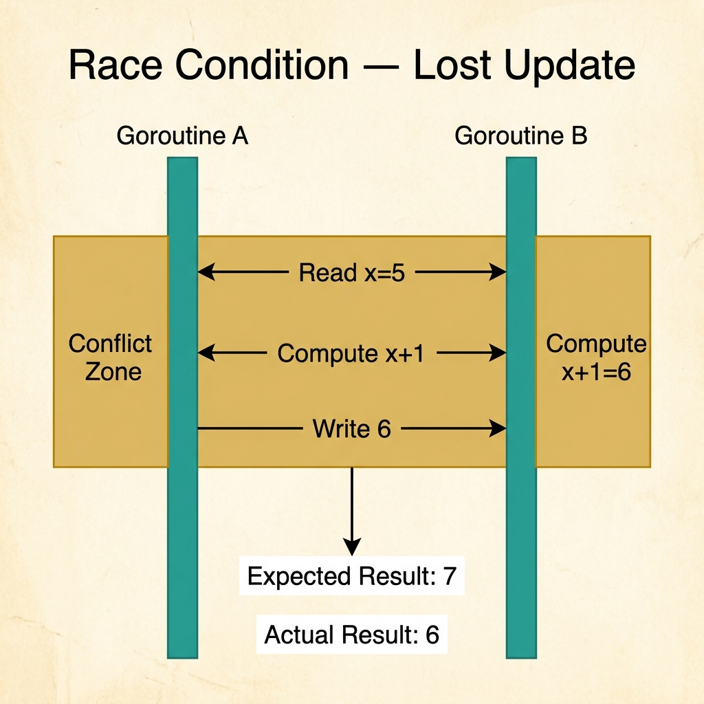
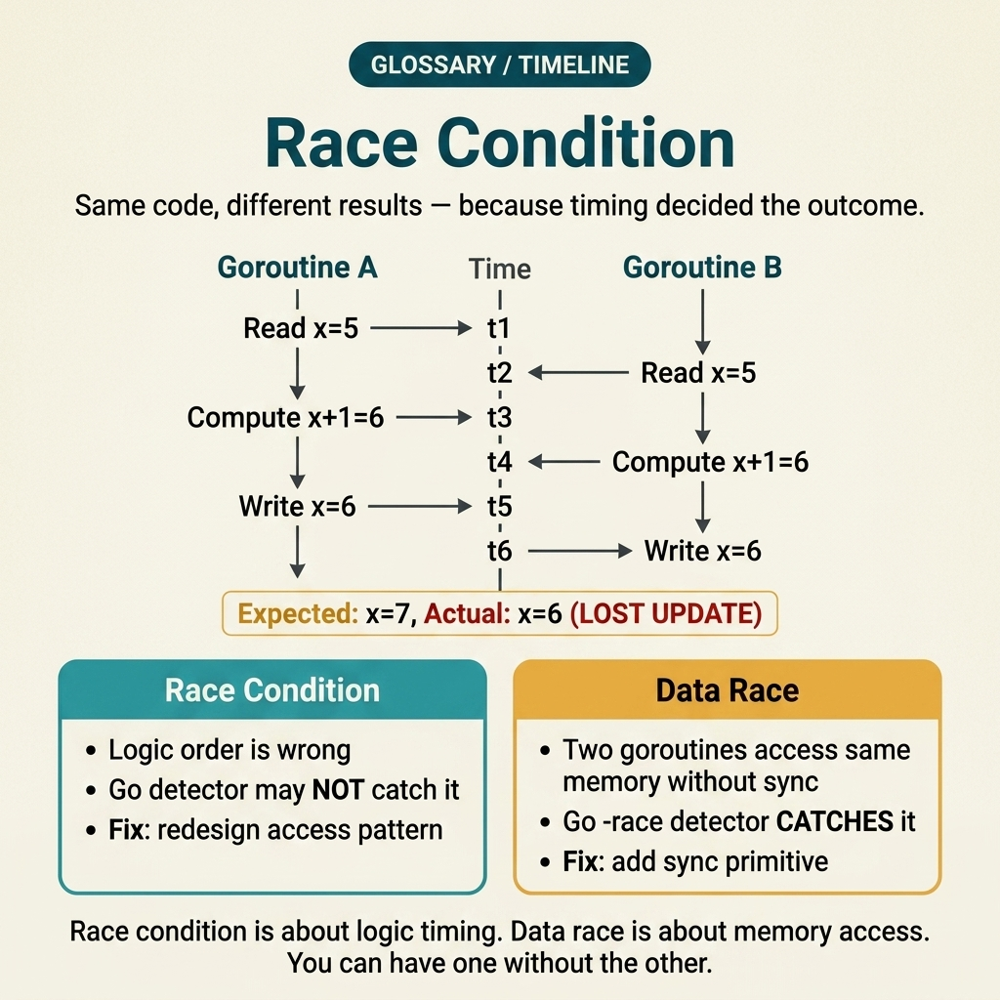
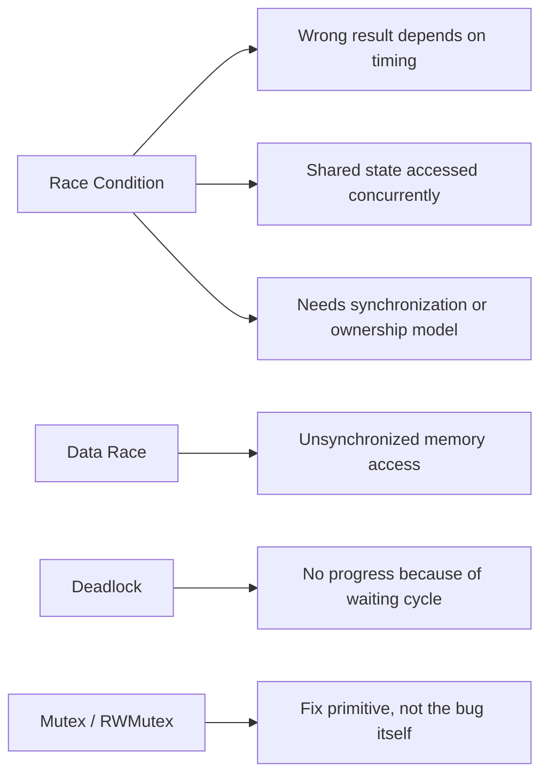

<!-- tags: glossary, reference, concurrency-async, race-condition -->
# Race Condition

> A situation where multiple execution paths access shared state without proper synchronization, making the outcome depend on timing.

| Aspect | Detail |
| --- | --- |
| **Concept** | A situation where multiple execution paths access shared state without proper synchronization, making the outcome depend on timing. |
| **Audience** | Backend engineer, Go developer, reviewer, incident responder |
| **Primary style** | Glossary term |
| **Entry point** | Use when data is randomly incorrect or output depends on interleaving of multiple actors |

📅 Created: 2026-03-30 · 🔄 Updated: 2026-04-17 · ⏱️ 8 min read

---

## 1. DEFINE

Picture a service counter that occasionally jumps to the wrong value, but only when traffic is high enough. Local tests pass fine, yet production exposes "unexplainable" results. This is the kind of bug that erodes team confidence because the logic looks correct while the output is still wrong. That is the boundary of **Race Condition**.

**Race Condition** is a situation where multiple execution paths access shared state without proper synchronization, making the outcome depend on timing.

Race condition differs from deadlock in that the system can still keep running but produces nondeterministic results; deadlock halts the flow entirely because parties wait on each other.

| Variant | Description |
| --- | --- |
| Read-write race | One thread reads/writes state while another thread is also modifying the same state. |
| Check-then-act race | A decision is based on stale state, then acts on state that another thread has already changed. |
| Publication / visibility race | A value is updated but another thread sees the wrong timing or the wrong state. |

| Approach | Time | Space | When to choose |
| --- | --- | --- | --- |
| Mutual exclusion | O(1) | O(1) | When shared state needs updates within a clear critical section. |
| Message passing | O(1) per hop | O(queue) | When avoiding direct shared mutable state altogether. |
| Immutability / copy-on-write | Per state size | Per copy | When reads far exceed writes and contention must be reduced. |

Core insight:

> Race condition is a bug of **timing + shared state**, not a pure business-rule bug. If the team only looks at output without examining access patterns, the fix path will be very roundabout.

### 1.1 Invariants & Failure Modes

The common failure mode is adding sleep, retry, or logging to "reduce the probability of the bug" instead of fixing synchronization. These approaches usually shift timing temporarily without solving the underlying mechanism.

---

## 2. CONTEXT

**Who uses it**: Backend engineer, Go developer, reviewer, incident responder

**When**: Use when data is randomly incorrect or output depends on interleaving of multiple actors

**Purpose**: Race condition is a bug of **timing + shared state**, not a pure business-rule bug. If the team only looks at output without examining access patterns, the fix path will be very roundabout.

**In the ecosystem**:
Common signals:
- results are randomly wrong and hard to reproduce consistently;
- single-thread or low-load local tests pass, but high load exposes the bug;
- race detector or instrumentation reveals overlapping accesses to the same state.

The boundary to hold: when discussing **Race Condition**, always identify which shared state is being accessed concurrently and which actors cause the interleaving.

---

Two goroutines competing is clear. But how does a race condition differ from a data race, how do you detect it, and how do you fix it without killing throughput?

## 3. EXAMPLES

Race condition surfaces most clearly when a counter increments incorrectly despite correct logic, when integration tests pass but production yields random results, or when the -race detector flags an issue but the team suppresses it because "it slows things down." The examples below place the pattern into exactly those situations.

### Example 1: Basic — Match the right symptom with the shared-state hazard

> **Goal**: Standardize how a race is described in a design note or incident.
> **Approach**: State the shared state, the actors, and the effect explicitly instead of just saying "counter is wrong."
> **Example**: An API metrics counter occasionally reports lower than expected.
> **Complexity**: Basic — lock the right failure class first.

```yaml
race_note:
  shared_state: "request_counter"
  competing_paths:
    - "HTTP handler A increments"
    - "background aggregator resets snapshots"
  visible_effect: "counter occasionally lower than expected"
```



*Figure: Two goroutines read x=5 simultaneously, both compute 6, both write 6 — the second increment is lost. Expected 7, actual 6. The conflict zone shows where unsynchronized reads overlap.*

**Why?** Without naming the shared state and the actors touching it, "race" is just an emotional label. A structured note forces the team to call out the mechanism correctly.

**Conclusion**: The basic value of this term is confirming that the problem is timing on shared state, not domain logic.

### Example 2: Intermediate — Choose the right fix primitive instead of hacking timing

> **Goal**: Map a race to a deliberate fix strategy.
> **Approach**: Compare lock, channel, and immutability based on access pattern.
> **Example**: Code that both reads and writes a shared map from multiple goroutines.
> **Complexity**: Intermediate — beginning to make local architectural decisions.

```yaml
fix_options:
  option_a:
    strategy: mutex
    use_when: "small critical section, write needs atomicity"
  option_b:
    strategy: channel_owner
    use_when: "want a single goroutine to own the state"
  option_c:
    strategy: immutable_snapshot
    use_when: "read-heavy, infrequent updates"
```

**Why?** Race condition does not have a single fix. The right primitive depends on the shape of contention and the lifecycle of the state.

**Conclusion**: Intermediate understanding of race means knowing how to choose a coordination model, not just remembering to "add a lock."

### Example 3: Advanced — Build race prevention into the review checklist

> **Goal**: Prevent races from reappearing in new code paths.
> **Approach**: Turn lessons from past bugs into review checklists or ADR guardrails.
> **Example**: The team standardizes rules for every code path that touches a shared cache or shared metric.
> **Complexity**: Advanced — from incident learning to engineering governance.

```yaml
review_guardrail:
  ask_before_merge:
    - "Is this state accessed from multiple goroutines?"
    - "Does this update require atomicity or ordering?"
    - "Has the race detector covered the important paths?"
  reject_if:
    - "shared mutable state with no synchronization story"
```

**Why?** Race prevention is more durable when it becomes a review checklist, not just the memory of whoever handled the most recent incident.

**Conclusion**: At the advanced level, this term should live in the governance layer of review and testing strategy.

---

## 4. COMPARE



*Figure: Original compare-card visual positioning race condition against nearby concurrency failure and fix terms.*



*Figure: Race condition positioned against nearby terms: wrong result by timing, distinct from deadlock, and often fixed with a lock or ownership change.*

Race condition sounds like data race. Close, but the boundary matters: a data race is unsynchronized memory access that the Go detector can often catch. A race condition is a wrong outcome caused by interleaving, and some of those failures only become obvious when someone reasons through the business meaning of the shared state.

### Level 1

```text
Goroutine A: read x=5 -> compute 6 -> write 6
Goroutine B: read x=5 -> compute 6 -> write 6
Expected: 7, Actual: 6
```
*Figure: Level 1 shows that lost update is the classic pattern of a race condition.*

### Level 2

```text
Shared state write
  -> no lock / no channel coordination
  -> interleaving depends on scheduler timing
  -> final state becomes nondeterministic

Race detector is usually the first signal, but the fix must trace back to the access pattern.
```
*Figure: Level 2 emphasizes that a race is an overlapping access-pattern problem, not just a "missing if" bug.*

### Easily confused or boundary-slipping

You have seen at which concurrency layer Race Condition should be used. The mistakes below show common misunderstandings that lead teams to fix the symptom while the timing mechanism remains intact.

| # | Severity | Mistake | Consequence | Fix |
| --- | --- | --- | --- | --- |
| 1 | 🔴 Fatal | Using sleep/retry to "dodge" the race | Bug just shifts timing; it does not vanish | Trace back to the access pattern and synchronization story. |
| 2 | 🟡 Common | Labeling every nondeterministic bug as a race | Debug goes in the wrong direction, misses deadlock or leak | Identify shared state and competing paths first. |
| 3 | 🟡 Common | Using an overly broad lock out of fear of races | Reduces throughput, creates new contention | Narrow the critical section or switch to ownership-by-channel. |
| 4 | 🔵 Minor | Relying only on review without detector/test | Race slips into production silently | Add race detector or stress-test critical paths. |

### Quick scan

| If you face | Action |
| --- | --- |
| Unsure whether this is a correctness bug or a pressure pattern | Go back to README to route the symptom |
| Need a concise standard sentence for review/incident | Copy the Problem 1 artifact and attach it to the team's context |
| Need to jump to the nearest term for comparison | Open previous/next at the bottom of the file |

---

## 5. REF

| Resource | Type | Link | Note |
| --- | --- | --- | --- |
| Go Memory Model | Official | https://go.dev/ref/mem | Solid foundation for reasoning about visibility, ordering, and synchronization. |
| Go Blog | Official | https://go.dev/blog/ | Many foundational posts on goroutines, channels, and context. |
| AWS Builders Library | Reference | https://aws.amazon.com/builders-library/ | Useful for retry, backoff, load protection, and herd behavior. |

---

## 6. RECOMMEND

Race condition solves the problem "results differ on every run even though the code has not changed." The next question: what to lock with, and what happens when the lock goes wrong?

| Expand to | When | Reason | File/Link |
| --- | --- | --- | --- |
| Topic hub | When you need to place this term in the larger learning path | Return to the symptom router for the whole branch | [Concurrency & Async](./README.md) |
| Previous concept | When you need to compare with the immediately preceding concept | Maintains continuity instead of reading in isolation | [README](./README.md) |
| Next concept | When you want to continue to the adjacent term | Keeps the learning thread and comparison within the same topic | [Deadlock](./02-deadlock.md) |

Back to the wrong counter at the start — logic correct but two goroutines raced. Now you know: the -race detector catches data races, not logic races. You need both: tooling for data races, design review for logic races.

**Links**: [← Previous](./README.md) · [→ Next](./02-deadlock.md)
