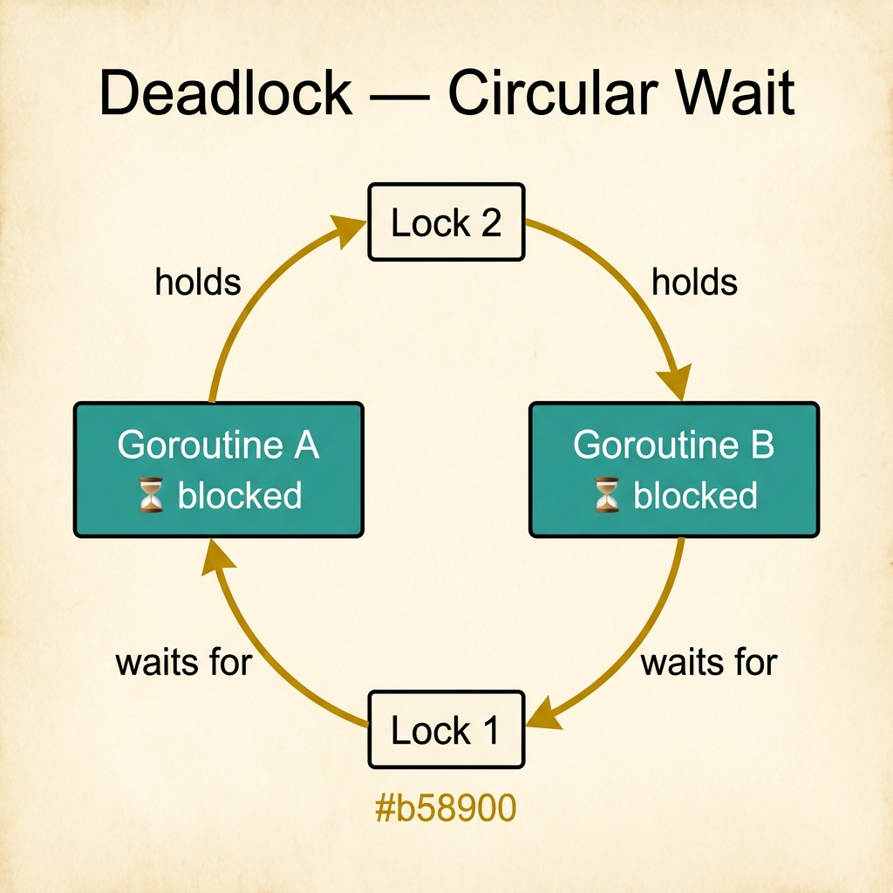
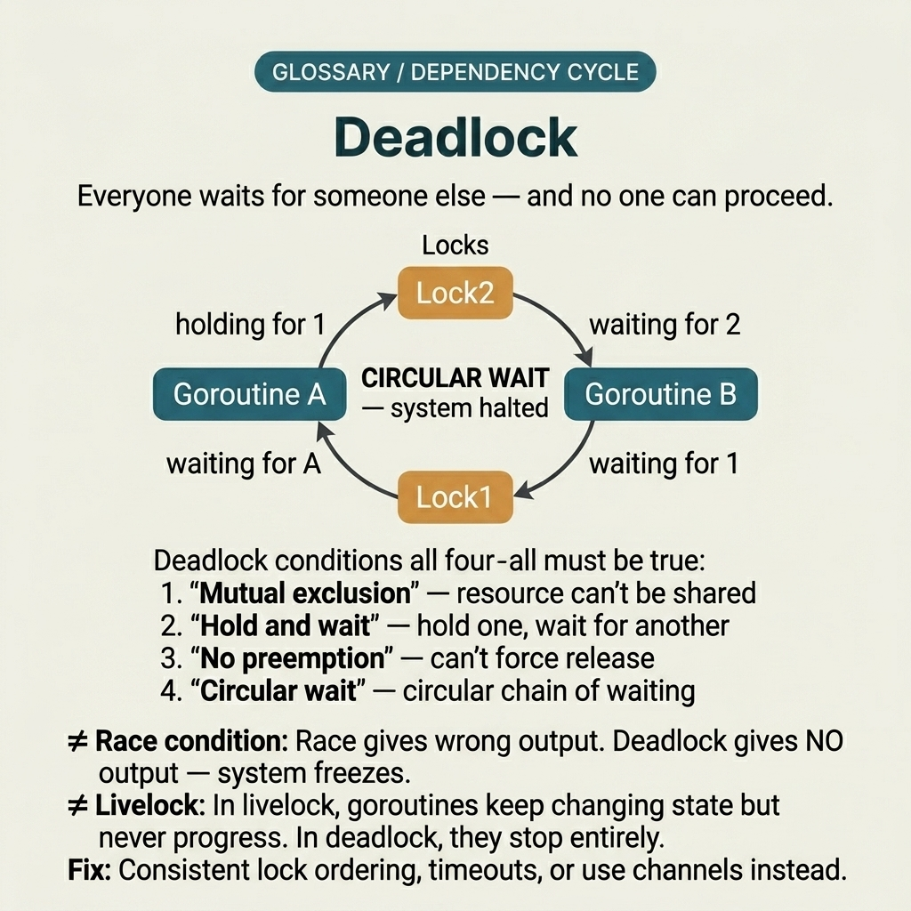
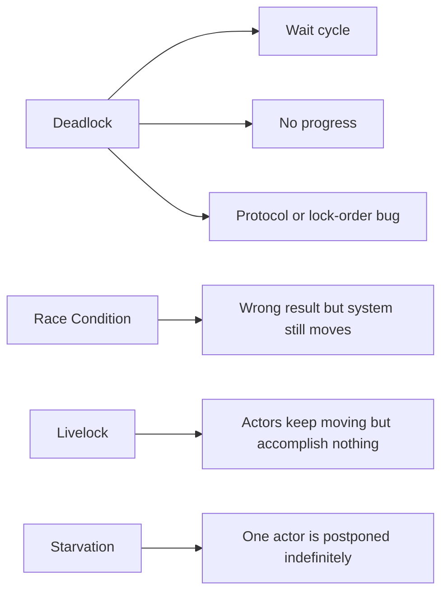

<!-- tags: glossary, reference, concurrency-async, deadlock -->
# Deadlock

> A state where execution paths wait on each other's resources indefinitely, preventing progress even though nothing has crashed.

| Aspect | Detail |
| --- | --- |
| **Concept** | A state where execution paths wait on each other's resources indefinitely, preventing progress even though nothing has crashed. |
| **Audience** | Backend engineer, Go developer, reviewer, incident responder |
| **Primary style** | Glossary term |
| **Entry point** | Use when a request or worker hangs because of a resource wait cycle |

📅 Created: 2026-03-30 · 🔄 Updated: 2026-04-17 · ⏱️ 8 min read

---

## 1. DEFINE

Picture a request that hangs forever. CPU does not spike, logs stand still. Everything looks "quiet" rather than "exploding," yet the system makes no progress because actors are holding resources and waiting on each other in a cycle with no exit.

**Deadlock** is a state where execution paths wait on each other's resources indefinitely, preventing progress even though nothing has crashed.

Deadlock differs from race condition in that a race produces wrong results but the system keeps running; a deadlock freezes the flow entirely because of cyclic waiting.

| Variant | Description |
| --- | --- |
| Lock-order deadlock | Two threads acquire the same set of locks but in reverse order. |
| Channel deadlock | A goroutine blocks because send/receive is never fulfilled by the other side. |
| Resource cycle deadlock | Multiple actors hold different resources and wait on each other in a closed loop. |

| Approach | Time | Space | When to choose |
| --- | --- | --- | --- |
| Global lock ordering | O(1) | O(1) | When deadlock comes from multiple locks with inconsistent acquire order. |
| Timeout / cancellation | O(1) | O(1) | When infinite waits on an external dependency or internal queue must be cut. |
| Channel protocol design | Per stage count | O(1) | When coordination primarily flows through send/receive and close semantics. |

Core insight:

> Deadlock is a bug of **dependency cycle**, not a bug of speed. Adding CPU or retries will not make the wait cycle disappear on its own.

### 1.1 Invariants & Failure Modes

The common failure mode is adding more logs and waiting for the problem to "resolve itself," while the dependency cycle remains intact. Deadlock usually needs a protocol or lock-ordering review, not resource tuning.

---

## 2. CONTEXT

**Who uses it**: Backend engineer, Go developer, reviewer, incident responder

**When**: Use when a request or worker hangs because of a resource wait cycle

**Purpose**: Deadlock is a bug of **dependency cycle**, not a bug of speed. Adding CPU or retries will not make the wait cycle disappear on its own.

**In the ecosystem**:
Common signals:
- goroutine dump shows many actors blocked on a lock or channel;
- request/worker hangs for a long time but resource usage does not match;
- lock acquire order or send/receive protocol is hard to reason about and inconsistent.

The boundary to hold: deadlock must point to a specific wait cycle or protocol block, not serve as a catch-all label for every hanging request.

---

Two goroutines waiting on each other forever is clear. But how does deadlock differ from livelock, how do you detect it at runtime, and which design patterns prevent it?

## 3. EXAMPLES

Deadlock surfaces most clearly when a service hangs with CPU at 0%, when the Go runtime panics with "all goroutines are asleep," or when different lock orderings between two packages cause intermittent hangs. The examples below place the pattern into exactly those situations.

### Example 1: Basic — Describe a deadlock with a minimal wait graph

> **Goal**: Name the right failure class in a note or incident.
> **Approach**: State explicitly which actor holds what and waits for what.
> **Example**: Two workers both hang while processing payment + inventory.
> **Complexity**: Basic — prioritize seeing the cycle.

```yaml
wait_graph:
  actor_a:
    holds: [inventory_lock]
    waits_for: payment_lock
  actor_b:
    holds: [payment_lock]
    waits_for: inventory_lock
```



*Figure: Goroutine A holds Lock 1 and waits for Lock 2; Goroutine B holds Lock 2 and waits for Lock 1. The circular dependency means neither can proceed — both are permanently blocked.*

**Why?** Without drawing who holds what and waits for what, the team easily mislabels any hanging request as a deadlock.

**Conclusion**: Basic deadlock analysis starts from a wait graph, not from a feeling that "the system is stuck."

### Example 2: Intermediate — Design a consistent lock-ordering rule

> **Goal**: Eliminate the deadlock class caused by different acquire orders.
> **Approach**: Define a global ordering for resource acquisition.
> **Example**: Code paths from different teams both touch user_lock and account_lock.
> **Complexity**: Intermediate — shifting from debug to prevention design.

```yaml
lock_order_policy:
  global_order:
    - user_lock
    - account_lock
    - ledger_lock
  rule: "Acquire in ascending order, release in reverse order"
```

**Why?** Many deadlocks vanish simply with clear global ordering. This is the cheapest and most reviewable prevention for multi-lock code paths.

**Conclusion**: Intermediate deadlock prevention means making the protocol clearer before adding runtime workarounds.

### Example 3: Advanced — Use timeout/cancellation to prevent infinite hangs

> **Goal**: Keep the system degrading in a controlled way instead of blocking forever.
> **Approach**: Wrap wait paths with timeout or context cancel when absolute deadlock prevention is hard.
> **Example**: A worker waiting on a dependency or internal queue for an indeterminate time.
> **Complexity**: Advanced — adding a runtime escape hatch for the worst failure mode.

```yaml
deadlock_escape_hatch:
  wait_policy:
    timeout: "2s"
    on_timeout: "abort operation and emit contention signal"
  observability:
    - "blocked_goroutines_count"
    - "lock_wait_duration"
```

**Why?** Timeout does not fix the root deadlock, but it turns the failure from "stuck forever with nobody knowing" into a signal that can be measured and acted upon. This is a runtime guardrail, not a root fix.

**Conclusion**: Advanced deadlock handling always separates prevention from containment.

---

## 4. COMPARE



*Figure: Original compare-card visual positioning deadlock among adjacent no-progress failure patterns.*



*Figure: Deadlock positioned among adjacent failures: no progress from cyclic waiting, unlike race condition, livelock, or starvation.*

Deadlock sounds like a hang. True — but it differs from livelock (goroutines still run but make no progress) and starvation (one goroutine never gets served). All three are concurrency bugs, but their symptoms and fixes differ.

### Level 1

```text
A holds Lock1 -> waits Lock2
B holds Lock2 -> waits Lock1
=> no progress
```
*Figure: Level 1 shows that a two-lock wait cycle is the classic deadlock.*

### Level 2

```text
Acquire resource A -> need B
Acquire resource B -> need C
Acquire resource C -> need A

Cycle exists => progress impossible until protocol changes
```
*Figure: Level 2 extends deadlock into a dependency-cycle problem, not just two simple locks.*

### Easily confused or boundary-slipping

You have seen at which concurrency layer Deadlock should be used. The mistakes below show common misunderstandings that lead teams to fix the symptom while the timing mechanism remains intact.

| # | Severity | Mistake | Consequence | Fix |
| --- | --- | --- | --- | --- |
| 1 | 🔴 Fatal | Assuming deadlock means "slow system" | Tunes performance without touching the protocol | Draw a wait graph before optimizing. |
| 2 | 🟡 Common | Acquiring locks in arbitrary order across code paths | Wait cycles are very hard to spot in review | Standardize global ordering. |
| 3 | 🟡 Common | Using timeout as a root fix | The logic bug still exists and resurfaces on other paths | Keep timeout as containment, not a replacement for prevention. |
| 4 | 🔵 Minor | Not dumping goroutine/stack on hang | Loses evidence needed to confirm deadlock | Prepare a playbook for capturing dumps during incidents. |

### Quick scan

| If you face | Action |
| --- | --- |
| Unsure whether this is a correctness bug or a pressure pattern | Go back to README to route the symptom |
| Need a concise standard sentence for review/incident | Copy the Problem 1 artifact and attach it to the team's context |
| Need to jump to the nearest term for comparison | Open previous/next at the bottom of the file |

---

## 5. REF

| Resource | Type | Link | Note |
| --- | --- | --- | --- |
| Go Memory Model | Official | https://go.dev/ref/mem | Solid foundation for reasoning about visibility, ordering, and synchronization. |
| Go Blog | Official | https://go.dev/blog/ | Many foundational posts on goroutines, channels, and context. |
| AWS Builders Library | Reference | https://aws.amazon.com/builders-library/ | Useful for retry, backoff, load protection, and herd behavior. |

---

## 6. RECOMMEND

Deadlock solves the problem "service freeze at CPU 0%." The next question: which lock fits which scenario, and how does a goroutine leak differ?

| Expand to | When | Reason | File/Link |
| --- | --- | --- | --- |
| Topic hub | When you need to place this term in the larger learning path | Return to the symptom router for the whole branch | [Concurrency & Async](./README.md) |
| Previous concept | When you need to compare with the immediately preceding concept | Maintains continuity instead of reading in isolation | [Race Condition](./01-race-condition.md) |
| Next concept | When you want to continue to the adjacent term | Keeps the learning thread and comparison within the same topic | [Mutex / RWMutex](./03-mutex-rwmutex.md) |

Back to the hanging service at the start — CPU 0%, no crash, no logs. Now you know: consistent lock ordering, context timeout, and channel select with default — the three most common ways to avoid deadlock.

**Links**: [← Previous](./01-race-condition.md) · [→ Next](./03-mutex-rwmutex.md)
