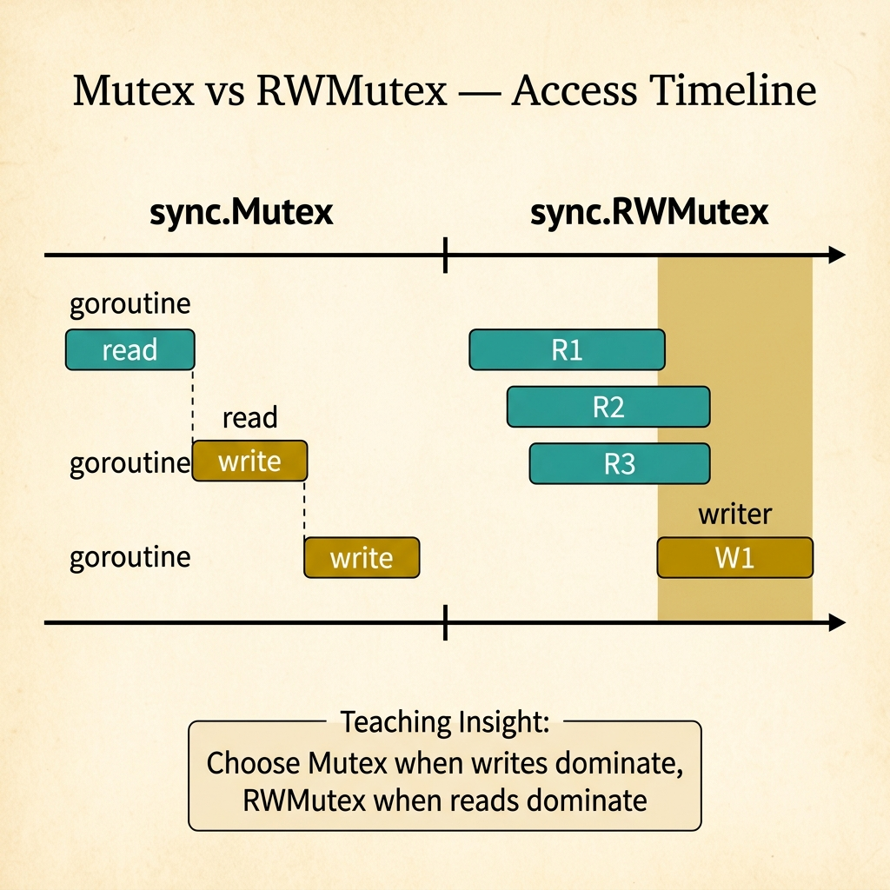
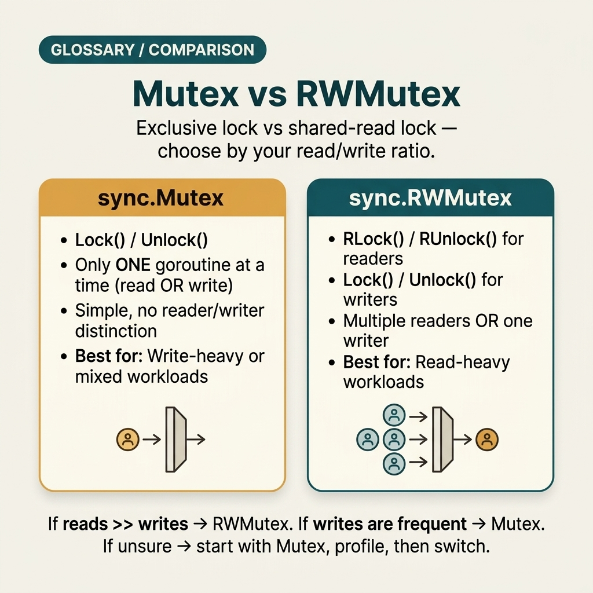
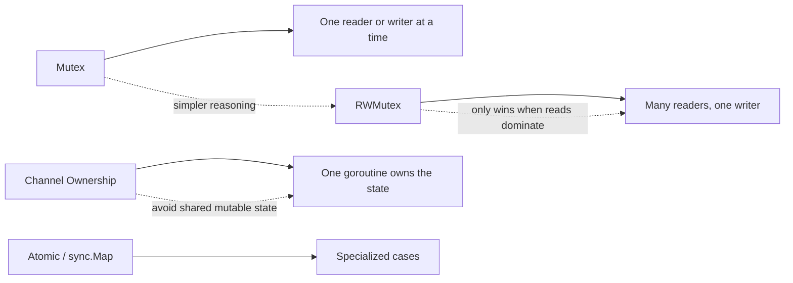

<!-- tags: glossary, reference, concurrency-async, mutex-rwmutex -->
# Mutex / RWMutex

> Synchronization primitives for protecting shared state: Mutex provides exclusive access; RWMutex allows many concurrent readers but exclusive writer access.

| Aspect | Detail |
| --- | --- |
| **Concept** | Synchronization primitives for protecting shared state: Mutex provides exclusive access; RWMutex allows many concurrent readers but exclusive writer access. |
| **Audience** | Go developer, backend engineer, reviewer, performance engineer |
| **Primary style** | Glossary term |
| **Entry point** | Use when the team needs to choose the right primitive for protecting shared state based on the access pattern |

📅 Created: 2026-03-30 · 🔄 Updated: 2026-04-17 · ⏱️ 8 min read

---

## 1. DEFINE

Picture a team that knows shared state exists but struggles with a very practical question: should they use Mutex, RWMutex, or switch entirely to a different ownership model? Picking the wrong primitive does not just slow things down; it can create contention, starvation, or the illusion that "concurrency is fixed." That is the boundary of **Mutex / RWMutex**.

**Mutex / RWMutex** are synchronization primitives for protecting shared state: Mutex provides exclusive access; RWMutex allows many concurrent readers but exclusive writer access.

Mutex/RWMutex guard critical sections. They are not patterns for all types of coordination. When coordination exceeds simple shared-state guarding, channels or worker ownership may be a better fit.

| Variant | Description |
| --- | --- |
| Mutex | A single exclusive lock for both read and write. |
| RWMutex | Many readers in parallel, but writers must have exclusive access. |
| Try-lock / contention-aware wrappers | Variants or auxiliary policies for measuring and managing contention more effectively. |

| Approach | Time | Space | When to choose |
| --- | --- | --- | --- |
| Mutex for simple critical section | O(1) | O(1) | When state is small, writes are significant, or even the read path benefits from simple serialization. |
| RWMutex for read-heavy state | O(1) | O(1) | When reads clearly dominate writes and contention is mainly on the reader path. |
| Single owner goroutine | Per message path | O(queue) | When shared state is complex enough that lock logic becomes hard to review. |

Core insight:

> Mutex/RWMutex only protect correctly when the team understands the access pattern. Choosing the wrong primitive may solve a race but breed contention or starvation.

### 1.1 Invariants & Failure Modes

The common failure mode is using RWMutex by feeling — "more readers so it must be faster" — even though the write path is frequent enough that the benefit vanishes. Conversely, some teams keep a Mutex scope too broad, accidentally serializing parts that do not need a lock at all.

---

## 2. CONTEXT

**Who uses it**: Go developer, backend engineer, reviewer, performance engineer

**When**: Use when the team needs to choose the right primitive for protecting shared state based on the access pattern

**Purpose**: Mutex/RWMutex only protect correctly when the team understands the access pattern. Choosing the wrong primitive may solve a race but breed contention or starvation.

**In the ecosystem**:
Common signals:
- a shared map/counter/cache is accessed from multiple goroutines;
- a critical section is clear but no better ownership model exists yet;
- contention or a reader-heavy workload is starting to affect latency.

The boundary to hold: a lock primitive solves protected access for a specific state; it does not replace queue design, retry strategy, or lifecycle ownership.

---

Locking a resource is clear. The harder question is selection pressure: when does a plain Mutex keep the design simpler, when does RWMutex actually pay off, and when is the better move to stop sharing mutable state directly?

## 3. EXAMPLES

Mutex/RWMutex surfaces most clearly when a cache corrupts because concurrent writes lack a lock, when an RWMutex cache suffers writer starvation because reads are too frequent, or when pprof shows 60% of time spent on mutex wait. The examples below place the pattern into exactly those situations.

### Example 1: Basic — State the access pattern before choosing a lock

> **Goal**: Avoid choosing a primitive out of habit.
> **Approach**: Describe the state, readers, writers, and contention expectation.
> **Example**: A config cache that is read often but updated rarely.
> **Complexity**: Basic — lock the right access pattern first.

```yaml
access_pattern:
  state: "in-memory config cache"
  readers: "many requests per second"
  writers: "manual config reload"
  contention_expectation: "mostly read-heavy"
```



*Figure: Mutex serializes all access — each goroutine waits its turn. RWMutex lets readers overlap but blocks everything during a write. Choose based on workload: write-heavy favors Mutex, read-heavy favors RWMutex.*

**Why?** Choosing a lock without knowing the access pattern is essentially guessing. This structured note forces the team to state the technical reason before writing code.

**Conclusion**: Basic primitive choice should start from workload shape, not from personal preference.

### Example 2: Intermediate — Compare Mutex with RWMutex using a simple selection rule

> **Goal**: Reduce emotional debates like "RWMutex is always better."
> **Approach**: Set a selection rule based on write frequency and critical-section size.
> **Example**: A shared map that just hit a race and has degrading p95 under increasing load.
> **Complexity**: Intermediate — adding runtime trade-offs to the decision.

```yaml
lock_selection_rule:
  use_mutex_when:
    - "small critical section and writes are not rare"
    - "want to simplify reasoning"
  use_rwmutex_when:
    - "reads clearly dominate writes"
    - "contention measured on the reader path"
```

**Why?** RWMutex is not free. It is only worth using when read concurrency truly delivers a larger benefit than the complexity and cost of the primitive.

**Conclusion**: Intermediate understanding means knowing when the simplicity of Mutex is more valuable than the concurrency of RWMutex.

### Example 3: Advanced — When to drop locks and switch to an ownership model

> **Goal**: Recognize when a lock is no longer the best abstraction.
> **Approach**: Establish triggers for switching to a single-owner goroutine or queue-based serialization.
> **Example**: State mutation is growing complex, lock nesting increases, and review burden rises sharply.
> **Complexity**: Advanced — from primitive choice to architectural shift.

```yaml
escalation_trigger:
  move_away_from_locks_if:
    - "critical section starts calling many other dependencies"
    - "lock nesting or lock ordering becomes hard to review"
    - "contention metrics climb but lock tuning does not solve the root"
```

**Why?** Sometimes the right answer is not "Mutex or RWMutex" but "stop designing with shared mutable state altogether." This is where a primitive decision meets an architectural decision.

**Conclusion**: At the advanced level, this term should lead the team to the boundary of ownership models, not just to the next lock type.

---

## 4. COMPARE



*Figure: Original compare-card visual restoring the lock-selection comparison between Mutex, RWMutex, and nearby alternatives.*



*Figure: Mutex and RWMutex positioned against ownership-by-channel and specialized primitives so selection stays tied to workload shape rather than habit.*

Mutex sounds like a simple lock. True — but RWMutex allows many readers in parallel and only blocks on writes. Channels are the alternative when data ownership transfer is explicit. Pick the wrong tool and throughput dies.

### Level 1

```text
Mutex: one goroutine enters, others wait
RWMutex: many readers can enter, writer waits until readers leave
```
*Figure: Level 1 places the two primitives side by side to highlight the basic trade-off between simplicity and reader concurrency.*

### Level 2

```text
Read-heavy state? -> consider RWMutex
Mixed read/write with small critical section? -> Mutex often simpler
Complex shared mutable state? -> consider single-owner goroutine
```
*Figure: Level 2 turns lock selection into a decision tree instead of a memorized trick.*

### Easily confused or boundary-slipping

You have seen at which concurrency layer Mutex / RWMutex should be used. The mistakes below show common misunderstandings that lead teams to fix the symptom while the timing mechanism remains intact.

| # | Severity | Mistake | Consequence | Fix |
| --- | --- | --- | --- | --- |
| 1 | 🔴 Fatal | Defaulting to RWMutex because it sounds more optimal | Increases complexity with no guaranteed throughput gain | Measure the access pattern before choosing. |
| 2 | 🟡 Common | Keeping the critical section too broad | Serializes parts that do not need a lock | Narrow the lock scope; separate computation from protected state. |
| 3 | 🟡 Common | Holding a lock while calling an external dependency | Increases wait time and easily triggers deadlock/contention | Only hold the lock around the minimal state mutation. |
| 4 | 🔵 Minor | Not measuring contention after adding a lock | Hard to know what trade-off the concurrency fix introduced | Add lock-wait metrics or benchmark the critical path. |

### Quick scan

| If you face | Action |
| --- | --- |
| Unsure whether this is a correctness bug or a pressure pattern | Go back to README to route the symptom |
| Need a concise standard sentence for review/incident | Copy the Problem 1 artifact and attach it to the team's context |
| Need to jump to the nearest term for comparison | Open previous/next at the bottom of the file |

---

## 5. REF

| Resource | Type | Link | Note |
| --- | --- | --- | --- |
| Go Memory Model | Official | https://go.dev/ref/mem | Solid foundation for reasoning about visibility, ordering, and synchronization. |
| Go Blog | Official | https://go.dev/blog/ | Many foundational posts on goroutines, channels, and context. |
| AWS Builders Library | Reference | https://aws.amazon.com/builders-library/ | Useful for retry, backoff, load protection, and herd behavior. |

---

## 6. RECOMMEND

Mutex/RWMutex solves the problem "shared state needs protection." The next question: what does a goroutine leak from a bad lock cause, and how does fan-out/fan-in work?

| Expand to | When | Reason | File/Link |
| --- | --- | --- | --- |
| Topic hub | When you need to place this term in the larger learning path | Return to the symptom router for the whole branch | [Concurrency & Async](./README.md) |
| Previous concept | When you need to compare with the immediately preceding concept | Maintains continuity instead of reading in isolation | [Deadlock](./02-deadlock.md) |
| Next concept | When you want to continue to the adjacent term | Keeps the learning thread and comparison within the same topic | [Goroutine Leak](./04-goroutine-leak.md) |

Back to the corrupt cache at the start — concurrent writes without a lock. Now you know: Mutex for write-heavy, RWMutex for read-heavy, channels for ownership transfer. And always measure contention with pprof before optimizing.

**Links**: [← Previous](./02-deadlock.md) · [→ Next](./04-goroutine-leak.md)
