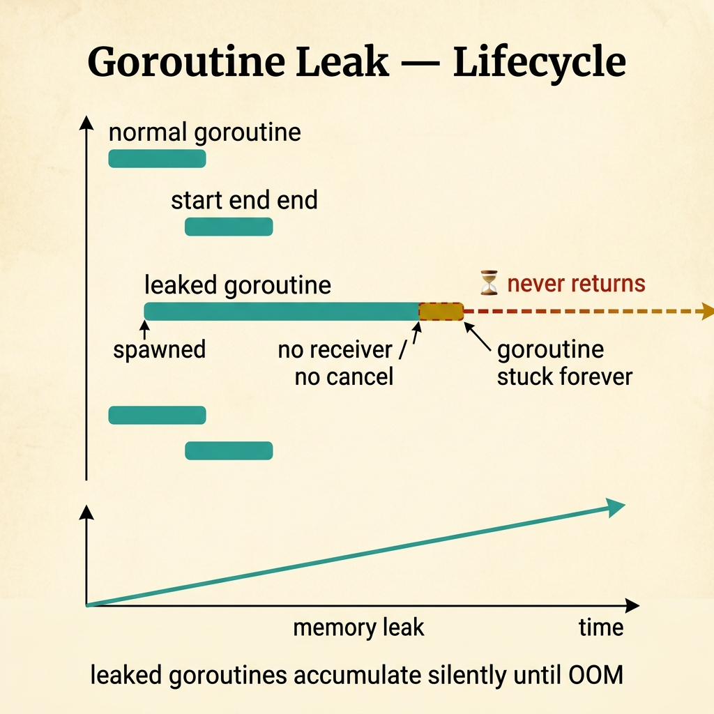
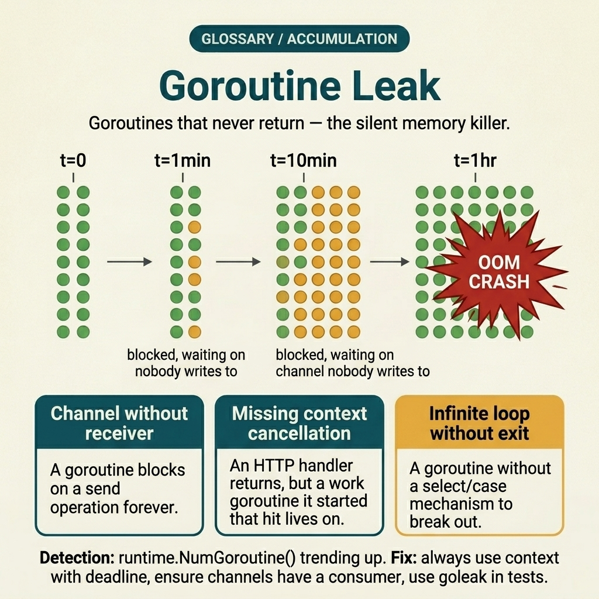
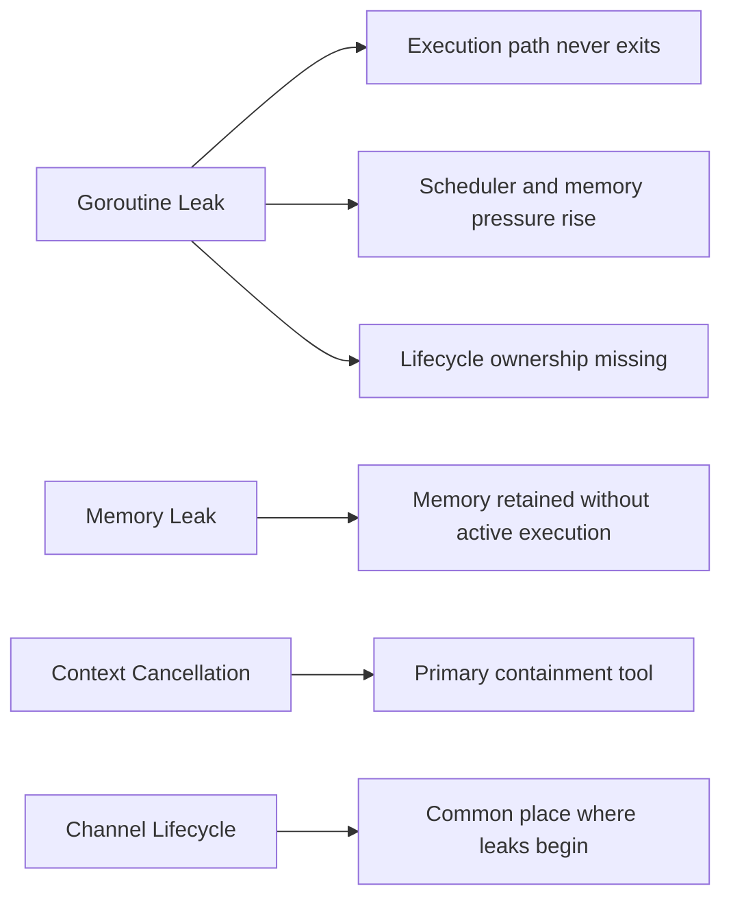

<!-- tags: glossary, reference, concurrency-async, goroutine-leak -->
# Goroutine Leak

> A situation where a goroutine continues to live and wait indefinitely after its work should have ended, causing memory and scheduler pressure to grow over time.

| Aspect | Detail |
| --- | --- |
| **Concept** | A situation where a goroutine continues to live and wait indefinitely after its work should have ended, causing memory and scheduler pressure to grow over time. |
| **Audience** | Go developer, backend engineer, SRE, reviewer |
| **Primary style** | Glossary term |
| **Entry point** | Use when runtime_num_goroutine keeps climbing or shutdown is not clean |

📅 Created: 2026-03-30 · 🔄 Updated: 2026-04-17 · ⏱️ 8 min read

---

## 1. DEFINE

Picture a request that returned long ago, yet goroutine count keeps climbing steadily over time. CPU does not necessarily spike right away, so the problem is easy to miss until the scheduler, memory, or downstream queue gradually chokes.

**Goroutine Leak** is a situation where a goroutine continues to live and wait indefinitely after its work should have ended, causing memory and scheduler pressure to grow over time.

Goroutine leak differs from a pure memory leak in that the leaking unit is a living execution path. It also differs from deadlock because a leak can let the system keep running — just getting heavier over time.

| Variant | Description |
| --- | --- |
| Blocked receive/send leak | A goroutine waits on a channel that will never be closed or have a matching send/receive. |
| Forgotten cancellation leak | A context has expired but the goroutine is not listening to the Done signal. |
| Background task ownership leak | A goroutine is spawned without a lifecycle owner or shutdown path. |

| Approach | Time | Space | When to choose |
| --- | --- | --- | --- |
| Context cancellation | O(1) | O(1) | When the goroutine must end alongside a request or service lifecycle. |
| Bounded channel / worker ownership | Per queue size | O(queue) | When the goroutine serves a job stream and needs a clear owner. |
| Leak detection metrics | O(1) | O(1) | When early detection is needed before the problem becomes an outage. |

Core insight:

> Goroutine leak is a bug of lifecycle ownership. If a goroutine is created without a clear entity responsible for ending it, a leak is only a matter of time.

### 1.1 Invariants & Failure Modes

The common failure mode is treating goroutines as "cheap so spawn freely." Cheap to create does not mean cheap to forget their lifecycle.

---

## 2. CONTEXT

**Who uses it**: Go developer, backend engineer, SRE, reviewer

**When**: Use when runtime_num_goroutine keeps climbing or shutdown is not clean

**Purpose**: Goroutine leak is a bug of lifecycle ownership. If a goroutine is created without a clear entity responsible for ending it, a leak is only a matter of time.

**In the ecosystem**:
Common signals:
- goroutine count grows steadily with uptime or traffic;
- stack dump shows many goroutines blocked on channel, select, or network wait;
- shutdown is slow or unclean because background tasks do not exit.

The boundary to hold: when discussing goroutine leak, always identify the owner, stop signal, or wait path that is left open.

---

A goroutine that never exits is clear. But how do you detect leaks, where are they most common, and how do you fix them without breaking logic?

## 3. EXAMPLES

Goroutine leak surfaces most clearly when memory grows steadily per request with no obvious bug, when pprof goroutine profile shows 50k goroutines blocking, or when a channel send has no receiver. The examples below place the pattern into exactly those situations.

### Example 1: Basic — State the owner and shutdown condition of a goroutine

> **Goal**: Prevent background execution paths from being created without an owner.
> **Approach**: Every goroutine must have an owner, an exit signal, and a reason to stop.
> **Example**: A watcher goroutine spawned per request.
> **Complexity**: Basic — lock the lifecycle contract first.

```yaml
goroutine_contract:
  owner: "request handler"
  stop_signal: "ctx.Done()"
  exits_when:
    - "request canceled"
    - "response already sent"
```



*Figure: Normal goroutines start and end cleanly. A leaked goroutine — spawned without a receiver or cancel — extends forever, accumulating memory silently until OOM.*

**Why?** Many leaks start from "create it now, figure out later." Just forcing the team to describe the owner and stop condition exposes many leak classes at design review time.

**Conclusion**: Basic goroutine leak prevention means the lifecycle contract must exist before spawn.

### Example 2: Intermediate — Use cancellation and bounded wait instead of waiting forever

> **Goal**: Cut wait paths that can live forever after their purpose has ended.
> **Approach**: Combine context cancel, select, and a reasonable timeout.
> **Example**: A worker waiting on a channel receive even though upstream has stopped sending.
> **Complexity**: Intermediate — containment + protocol discipline.

```yaml
wait_policy:
  select_cases:
    - "receive job"
    - "ctx.Done()"
    - "timeout / heartbeat"
  rule: "Do not block indefinitely if the owner is dead"
```

**Why?** Leaks usually come from a goroutine waiting for a condition that will never arrive again. Cancellation and bounded wait turn "forgotten forever" into a provable protocol.

**Conclusion**: Intermediate handling is teaching every wait path how to exit in a controlled manner.

### Example 3: Advanced — Set up observability to catch leaks before they become outages

> **Goal**: Detect lifecycle bugs early through runtime signals.
> **Approach**: Feed goroutine count and blocked stacks into incident readiness.
> **Example**: A service that tends to grow goroutines after every deploy or under traffic bursts.
> **Complexity**: Advanced — from correctness to runtime detection.

```yaml
leak_detection:
  metrics:
    - "runtime_num_goroutine"
    - "blocked_workers_by_stage"
  response_playbook:
    - "capture goroutine dump"
    - "check newest code path spawning background tasks"
```

**Why?** Leaks are hardest to spot when the system "still works." Observability lets the team see an abnormal slope before scheduler pressure pushes the entire service into degraded mode.

**Conclusion**: At the advanced level, this term must live alongside runbooks and runtime signals, not just in code review.

---

## 4. COMPARE



*Figure: Original compare-card visual restoring the boundary between goroutine leak, memory leak, and lifecycle controls.*



*Figure: Goroutine leak positioned against memory leak and the lifecycle controls that usually prevent it: cancellation and channel ownership.*

Goroutine leak sounds like memory leak. Close — but goroutine leak is more specific: the goroutine is blocked forever because of a channel deadlock, missing context cancel, or infinite loop. Memory is just the consequence; the root cause is concurrency design.

### Level 1

```text
request starts goroutine -> request returns -> goroutine still waiting on channel -> count grows
```
*Figure: Level 1 shows that a leak does not need to crash immediately; it silently accumulates after each request.*

### Level 2

```text
Spawn goroutine
  -> has owner? no
  -> has cancellation? no
  -> has bounded wait? no
  => leak risk high
```
*Figure: Level 2 turns leak detection into a clear ownership and cancellation checklist.*

### Easily confused or boundary-slipping

You have seen at which concurrency layer Goroutine Leak should be used. The mistakes below show common misunderstandings that lead teams to fix the symptom while the timing mechanism remains intact.

| # | Severity | Mistake | Consequence | Fix |
| --- | --- | --- | --- | --- |
| 1 | 🔴 Fatal | Spawning a goroutine without an owner/cancel path | Leak silently accumulates over time | Require owner + stop signal in the design. |
| 2 | 🟡 Common | Waiting on a channel indefinitely without close/timeout | Service hangs slowly and goroutine count bloats | Use select with ctx.Done or a timeout. |
| 3 | 🟡 Common | Confusing a leak with an immediate deadlock | Debug goes in the wrong direction | Look at goroutine count slope and stack states first. |
| 4 | 🔵 Minor | Not monitoring runtime_num_goroutine | Detection comes too late | Add metrics and a capture-dump playbook. |

### Quick scan

| If you face | Action |
| --- | --- |
| Unsure whether this is a correctness bug or a pressure pattern | Go back to README to route the symptom |
| Need a concise standard sentence for review/incident | Copy the Problem 1 artifact and attach it to the team's context |
| Need to jump to the nearest term for comparison | Open previous/next at the bottom of the file |

---

## 5. REF

| Resource | Type | Link | Note |
| --- | --- | --- | --- |
| Go Memory Model | Official | https://go.dev/ref/mem | Solid foundation for reasoning about visibility, ordering, and synchronization. |
| Go Blog | Official | https://go.dev/blog/ | Many foundational posts on goroutines, channels, and context. |
| AWS Builders Library | Reference | https://aws.amazon.com/builders-library/ | Useful for retry, backoff, load protection, and herd behavior. |

---

## 6. RECOMMEND

Goroutine leak solves the problem "memory grows steadily but nobody can find the source." The next question: how does fan-out/fan-in create goroutines, and how does a worker pool limit them?

| Expand to | When | Reason | File/Link |
| --- | --- | --- | --- |
| Topic hub | When you need to place this term in the larger learning path | Return to the symptom router for the whole branch | [Concurrency & Async](./README.md) |
| Previous concept | When you need to compare with the immediately preceding concept | Maintains continuity instead of reading in isolation | [Mutex / RWMutex](./03-mutex-rwmutex.md) |
| Next concept | When you want to continue to the adjacent term | Keeps the learning thread and comparison within the same topic | [Fan-out / Fan-in](./05-fan-out-fan-in.md) |

Back to the 50k goroutines at the start — all blocking on a channel send. Now you know: every goroutine needs a clear exit path. Context cancel, channel close, or select with a done channel. Creating a goroutine is easy; killing it at the right time is the hard part.

**Links**: [← Previous](./03-mutex-rwmutex.md) · [→ Next](./05-fan-out-fan-in.md)
