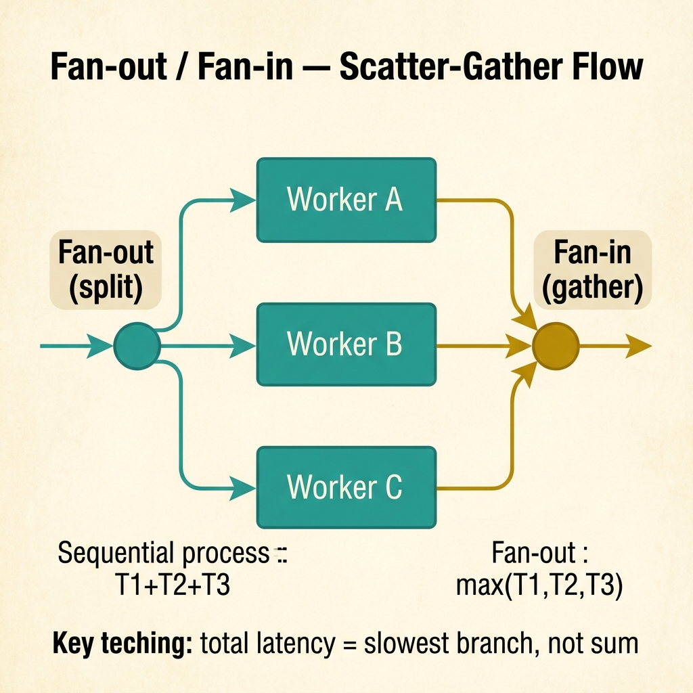
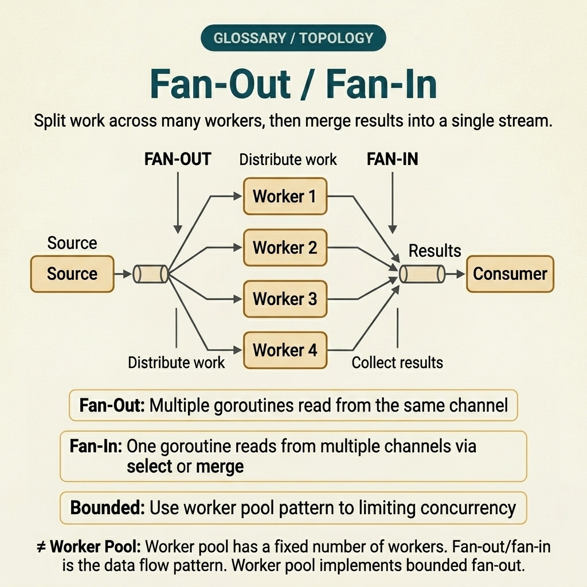
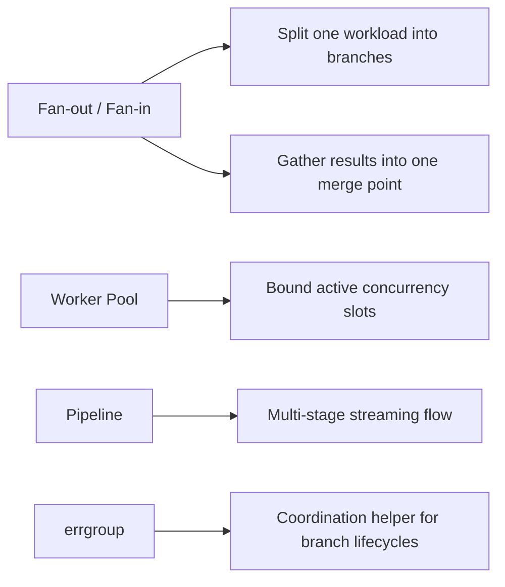

<!-- tags: glossary, reference, concurrency-async, fan-out-fan-in -->
# Fan-out / Fan-in

> A concurrent processing pattern where a single input is split across multiple workers for parallel processing, then results are gathered back into a single merge point.

| Aspect | Detail |
| --- | --- |
| **Concept** | A concurrent processing pattern where a single input is split across multiple workers for parallel processing, then results are gathered back into a single merge point. |
| **Audience** | Backend engineer, Go developer, reviewer, platform engineer |
| **Primary style** | Glossary term |
| **Entry point** | Use when the team needs to increase throughput through controlled parallelism and then merge results into a single aggregated stream |

📅 Created: 2026-03-30 · 🔄 Updated: 2026-04-17 · ⏱️ 8 min read

---

## 1. DEFINE

Picture a request that needs to call several independent dependencies. Processing them sequentially makes latency grow linearly with the number of steps; fanning out recklessly can push the system into contention, leaks, or herd behavior. This is the moment **Fan-out / Fan-in** needs to be called by its right name and right boundary.

**Fan-out / Fan-in** is a concurrent processing pattern where a single input is split across multiple workers for parallel processing, then results are gathered back into a single merge point.

This term is a concurrency organization pattern, not a synchronization primitive. It differs from worker pool in that a pool focuses on limiting long-term concurrency; fan-out/fan-in focuses on splitting one workload into branches and merging results.

| Variant | Description |
| --- | --- |
| Request-scoped fan-out | A single request splits into multiple parallel calls, then gathers results for a response. |
| Batch fan-out | A list of items is distributed among multiple workers to reduce wall-clock time. |
| Scatter-gather with partial failure | Multiple branches run in parallel, but the aggregator must decide how to handle timeout or failure from individual branches. |

| Approach | Time | Space | When to choose |
| --- | --- | --- | --- |
| Sequential baseline | O(n) per branch count | O(1) | When the number of steps is small or dependencies are not independent enough to parallelize. |
| Unbounded fan-out | O(n / k) ideal | O(n) | When demonstrating parallelism benefit but without pressure constraints yet. |
| Bounded fan-out with gather | O(n / k) bounded | O(k) to O(n) | When increasing throughput while still controlling resources and downstream pressure. |

Core insight:

> Fan-out / fan-in only works well when the team controls three things at once: the number of parallel branches, how results are gathered, and the policy for when some branches fail. If the only lens is "parallelize for speed," this pattern easily becomes a pressure amplifier.

### 1.1 Invariants & Failure Modes

The common failure mode is optimizing only the fan-out phase while ignoring the fan-in phase. When that happens, the team is likely to encounter:
- the gather step becoming slower than the processing step;
- partial failures causing the aggregator to hang or return half-complete results;
- too many branches overwhelming the downstream dependency.

---

## 2. CONTEXT

**Who uses it**: Backend engineer, Go developer, reviewer, platform engineer

**When**: Use when the team needs to increase throughput through controlled parallelism and then merge results into a single aggregated stream

**Purpose**: Fan-out / fan-in only works well when the team controls three things at once: the number of parallel branches, how results are gathered, and the policy for when some branches fail. If the only lens is "parallelize for speed," this pattern easily becomes a pressure amplifier.

**In the ecosystem**:
Common signals:
- a response needs data from multiple independent sources;
- a batch job can distribute items for parallel processing;
- multiple independent I/O steps are making latency linearly too high.

Boundary to hold:
- fan-out/fan-in is not a synonym for worker pool;
- this pattern does not solve retry, backpressure, or ownership by itself;
- the aggregator is a mandatory part of the pattern, not just "running many goroutines."

---

Splitting work then merging results is clear. The harder design work starts immediately after that first sketch: how many branches are safe, how should partial failure shape the response, and what prevents the gather phase from becoming the next bottleneck?

## 3. EXAMPLES

Fan-out/fan-in surfaces most clearly when 1 goroutine processing 10k items is too slow but spawning 10k goroutines causes OOM, when merged results arrive in the wrong order, or when 1 worker fails but the pipeline keeps running unaware. The examples below place the pattern into exactly those situations.

### Example 1: Basic — Use fan-out/fan-in for independent dependencies

> **Goal**: Reduce latency of a workflow with multiple independent I/O steps.
> **Approach**: Split the request into parallel branches and gather results when all complete.
> **Example**: A profile API needs user, preferences, and recommendations from three different services.
> **Complexity**: Basic — focusing only on the concurrency benefit and the merge step.

```yaml
profile_request:
  fan_out:
    - fetch_user
    - fetch_preferences
    - fetch_recommendations
  fan_in:
    merge_into: profile_view
```



*Figure: A single input splits into three parallel workers (fan-out), each processing independently. All branches converge at a single gather point (fan-in). Total latency equals the slowest branch, not the sum.*

**Why?** If three steps are truly independent, sequential processing only stacks latency. Fan-out/fan-in turns total wait time into roughly the slowest branch instead of the sum of all branches.

**Conclusion**: The basic value of this pattern is turning parallelism into a clearly named structure: split work and gather results.

### Example 2: Intermediate — Add bounded concurrency to avoid overwhelming downstream

> **Goal**: Use parallelism without pushing too many branches simultaneously.
> **Approach**: Limit the number of active workers in the fan-out phase before gathering results.
> **Example**: Batch enrichment of 10,000 records cannot spawn 10,000 goroutines hitting the same dependency.
> **Complexity**: Intermediate — adding a control plane for concurrency.

```yaml
bounded_fan_out:
  input_items: 10000
  concurrency_cap: 32
  work_queue: buffered
  gather:
    collect_successes: true
    collect_failures: true
```

**Why?** Unbounded fan-out easily creates the illusion of throughput in local tests but explodes into contention in production. A concurrency cap turns this pattern from "spawn as many as possible" into a design with pressure discipline.

**Conclusion**: Intermediate fan-out/fan-in must come with a concurrency limit and a result-gathering policy.

### Example 3: Advanced — Handle partial failure at the gather phase

> **Goal**: Decide clearly what happens when some branches succeed while others time out or fail.
> **Approach**: Define a gather policy upfront: fail-fast, partial response, or controlled degradation.
> **Example**: Recommendations time out but user and preferences still return successfully.
> **Complexity**: Advanced — the pattern starts touching reliability semantics, not just concurrency.

```yaml
gather_policy:
  fail_fast_if:
    - user_service_fails
  allow_partial_if:
    - recommendations_timeout
  response_shape:
    include_partial_flag: true
    fallback_for_missing_branch: "empty_recommendations"
```

**Why?** Fan-in is not just "wait for all then merge." In a real system, the aggregator must know which branch is critical, which can degrade, and which response is still valid when data is missing.

**Conclusion**: At the advanced level, fan-out/fan-in is a lightweight orchestration pattern with explicit failure semantics.

---

## 4. COMPARE



*Figure: Original compare-card visual restoring the scatter-gather comparison against worker pool, pipeline, and errgroup.*



*Figure: Fan-out / fan-in positioned against worker pool, pipeline flow, and `errgroup` so the pattern stays anchored to scatter-gather rather than general concurrency tooling.*

Fan-out/fan-in sounds like worker pool. Close — but fan-out/fan-in is a pattern (split a channel into many goroutines then merge); worker pool is a bounded implementation. Fan-out does not limit workers; a pool does.

### Level 1

```text
input request
   |
   +--> worker A ----\
   +--> worker B -----+--> gather --> final result
   +--> worker C ----/
```
*Figure: Level 1 shows that the pattern has two clear phases: split and gather.*

### Level 2

```text
Need parallelism?
  -> yes
  -> are tasks independent?
      -> no  => keep sequential or redesign workflow
      -> yes
      -> do we have concurrency cap?
          -> no  => risk: downstream overload / herd / leaks
          -> yes => bounded fan-out + explicit gather policy
```
*Figure: Level 2 turns this pattern into a decision tree, not just a pretty parallelism diagram.*

### Easily confused or boundary-slipping

You have seen at which concurrency layer Fan-out / Fan-in should be used. The mistakes below show common misunderstandings that lead teams to fix the symptom while the timing mechanism remains intact.

| # | Severity | Mistake | Consequence | Fix |
| --- | --- | --- | --- | --- |
| 1 | 🔴 Fatal | Fan-out without limiting the branch count | Creates pressure on CPU, scheduler, and downstream dependency | Always have a concurrency cap or explicit queue strategy. |
| 2 | 🟡 Common | Optimizing only the fan-out phase, forgetting the gather phase | Aggregator becomes a bottleneck or hangs on partial failure | Design the gather policy explicitly: merge, fail-fast, or partial. |
| 3 | 🟡 Common | Using this pattern for non-independent steps | Increases complexity with no real latency benefit | Only parallelize when tasks are truly independent. |
| 4 | 🔵 Minor | Not measuring latency per branch individually | Hard to know where the bottleneck sits in the scatter-gather | Emit per-branch metrics and an overall flow metric. |

### Quick scan

| If you face | Action |
| --- | --- |
| Multiple independent I/O steps stacking latency | Consider fan-out/fan-in with an explicit gather policy |
| Large batch but afraid of spawning too many goroutines | Use bounded fan-out instead of unbounded parallelism |
| Unclear how to handle partial failure | Design the gather policy before writing code |

---

## 5. REF

| Resource | Type | Link | Note |
| --- | --- | --- | --- |
| Go Blog | Official | https://go.dev/blog/ | Many foundational posts on goroutines and pipeline/concurrency patterns. |
| AWS Builders Library | Reference | https://aws.amazon.com/builders-library/ | Useful for parallel calls, retry pressure, and failure containment. |
| Google SRE Resources | Reference | https://sre.google/resources/ | Useful for connecting concurrency patterns with reliability and observability. |

---

## 6. RECOMMEND

Fan-out/fan-in solves the problem "process in parallel then merge results." The next question: how to bound concurrency, and how does retry/backoff work?

| Expand to | When | Reason | File/Link |
| --- | --- | --- | --- |
| Topic hub | When you need to see this pattern within the full concurrency topic | Preserves the symptom router and the larger learning path | [Concurrency & Async](./README.md) |
| Previous concept | When you want to reconnect with lifecycle control boundaries | Fan-out can create leaks if ownership is ambiguous | [Goroutine Leak](./04-goroutine-leak.md) |
| Next concept | When you want to limit concurrency rather than just split work | Worker pool is the closest complementary pattern | [Worker Pool](./06-worker-pool.md) |

Back to the 10k items at the start — 1 goroutine too slow, 10k goroutines OOM. Now you know: fan-out N workers, each pulling from a shared channel, fan-in merging results. N = GOMAXPROCS or per benchmark, not per item count.

**Links**: [← Previous](./04-goroutine-leak.md) · [→ Next](./06-worker-pool.md)
