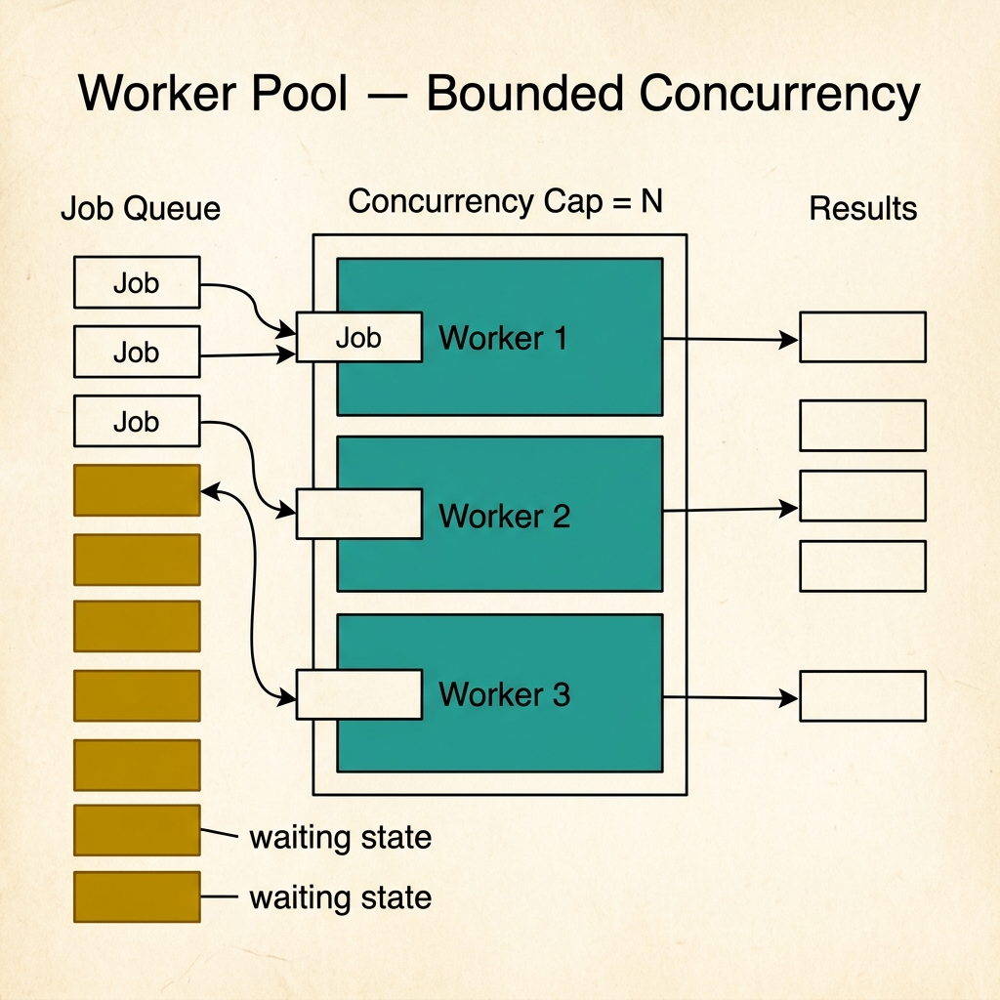
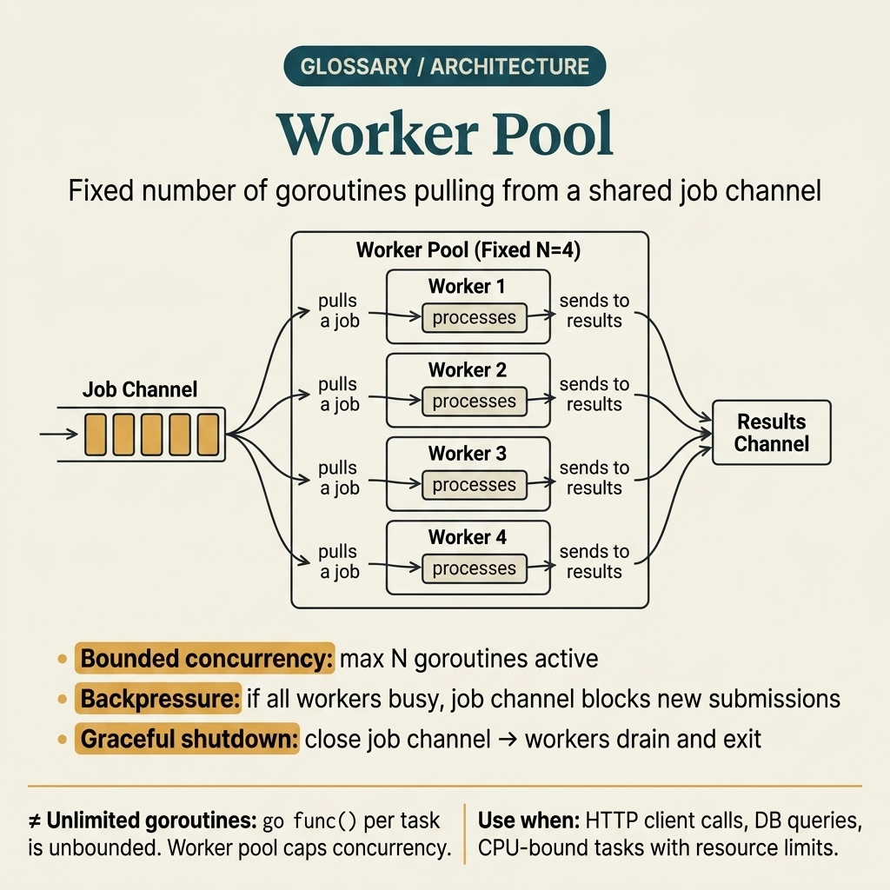
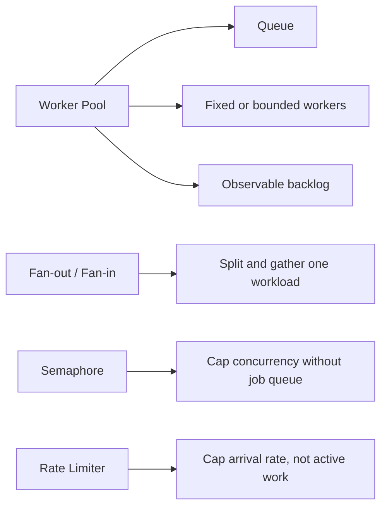

<!-- tags: glossary, reference, concurrency-async, worker-pool -->
# Worker Pool

> A fixed or bounded set of workers that receive jobs from a queue, controlling concurrency, throughput, and resource consumption.

| Aspect | Detail |
| --- | --- |
| **Concept** | A fixed or bounded set of workers that receive jobs from a queue, controlling concurrency, throughput, and resource consumption. |
| **Audience** | Backend engineer, Go developer, performance engineer, reviewer |
| **Primary style** | Glossary term |
| **Entry point** | Use when the team needs to cap the number of concurrent workers instead of spawning without control |

📅 Created: 2026-03-30 · 🔄 Updated: 2026-04-17 · ⏱️ 8 min read

---

## 1. DEFINE

Picture a job queue that can receive thousands of items in a few seconds, while CPU, DB connections, and downstream services can only handle a few dozen units of real concurrency. If every item spawns its own execution path, the system chokes itself. That is the boundary of **Worker Pool**.

**Worker Pool** is a fixed or bounded set of workers that receive jobs from a queue, controlling concurrency, throughput, and resource consumption.

Worker pool differs from fan-out/fan-in in that it focuses on **limiting and reusing concurrency slots**. It also differs from rate limiting: a rate limiter controls the speed of incoming requests; a worker pool controls the number of jobs active at the same time.

| Variant | Description |
| --- | --- |
| Fixed-size worker pool | A fixed number of workers, suitable when job cost is stable. |
| Adaptive / resizable pool | Worker count can change based on load or policy. |
| Queue-backed pool | Workers pull jobs from a central queue, making backlog and saturation easy to measure. |

| Approach | Time | Space | When to choose |
| --- | --- | --- | --- |
| Spawn-per-job | O(n) job setup | O(n) active jobs | When workload is tiny and burst is low, but rarely sustainable in production. |
| Fixed worker pool | O(n) processing / O(k) active | O(k + queue) | When a clear concurrency ceiling and simple reasoning are needed. |
| Queue + adaptive pool | Per scale policy | O(k + queue) | When workload fluctuates heavily and tuning depends on backlog or resource headroom. |

Core insight:

> Worker pool turns concurrency from "as many as you want" into a resource with a quota. Its real value is not thread reuse but creating a clear contract between backlog, throughput, and resource consumption.

### 1.1 Invariants & Failure Modes

The common failure mode is adding a worker pool without defining:
- how deep the queue can grow,
- how job timeout works,
- when backlog is abnormal,
- and whether shutdown waits for drain or aborts immediately.

Without these rules, the pool only hides the problem instead of controlling it.

---

## 2. CONTEXT

**Who uses it**: Backend engineer, Go developer, performance engineer, reviewer

**When**: Use when the team needs to cap the number of concurrent workers instead of spawning without control

**Purpose**: Worker pool turns concurrency from "as many as you want" into a resource with a quota. Its real value is not thread reuse but creating a clear contract between backlog, throughput, and resource consumption.

**In the ecosystem**:
Common signals:
- jobs are processed independently but the total number of concurrent jobs needs a cap;
- a service bursts goroutines/processes during traffic spikes or backfills;
- the team needs metrics like queue depth, active workers, and saturation.

Boundary to hold:
- a worker pool does not solve retry strategy by itself;
- a pool does not replace upstream backpressure if the queue can still grow unbounded;
- a good pool still needs ownership, a shutdown path, and observability.

---

Limiting goroutines is clear. The real design pressure is choosing the control surface around that cap: what pool size matches the true bottleneck, when should the queue absorb pressure, and when would a semaphore be simpler than a full queue-backed pool?

## 3. EXAMPLES

Worker pool surfaces most clearly when spawning a goroutine per request causes OOM during a traffic spike, when a pool too small starves throughput but a pool too large raises contention, or when shutdown leaks because workers are still blocking. The examples below place the pattern into exactly those situations.

### Example 1: Basic — Cap concurrency for job processing

> **Goal**: Prevent each job from spawning an unbounded execution path.
> **Approach**: Route jobs through a queue and process them with a fixed number of workers.
> **Example**: An image resize service that allows only 8 jobs active at a time.
> **Complexity**: Basic — turn burst load into a queue with bounded processing.

```yaml
image_resize_pool:
  queue: resize_jobs
  workers: 8
  active_limit: 8
  backlog_metric: resize_jobs_depth
```



*Figure: A job queue feeds N=3 worker slots. Each worker processes one job at a time; excess jobs wait in the queue. The pool prevents unbounded goroutine spawning by capping active workers to N.*

**Why?** If each request creates its own worker, burst traffic directly translates into burst resource usage. A worker pool inserts a throttling layer between incoming jobs and active execution.

**Conclusion**: A basic worker pool is the tool that converts uncontrolled concurrency into bounded concurrency.

### Example 2: Intermediate — Use backlog and saturation to drive tuning decisions

> **Goal**: Stop adjusting pool size by gut feeling.
> **Approach**: Observe queue depth, processing latency, and worker saturation before adding more workers.
> **Example**: Backlog rises but DB connections are also nearly exhausted.
> **Complexity**: Intermediate — treating the pool as a control surface, not just an implementation detail.

```yaml
tuning_inputs:
  metrics:
    - queue_depth
    - active_workers
    - job_latency_p95
    - downstream_db_connections
  rule:
    - "Do not add workers if the bottleneck is at the DB"
    - "Add workers when queue_depth rises and downstream still has headroom"
```

**Why?** Increasing pool size does not automatically increase throughput. If the bottleneck sits at a dependency, adding workers only shifts the queue wait into downstream contention.

**Conclusion**: Intermediate worker-pool thinking means tuning by saturation model, not by the feeling that "we seem to have too few workers."

### Example 3: Advanced — Design shutdown, timeout, and retry ownership for the pool

> **Goal**: Keep the pool from leaving jobs hanging or losing ownership during service shutdown.
> **Approach**: Define job timeout, drain policy, and who owns retry explicitly.
> **Example**: A service doing rolling restart while the queue still has a backlog.
> **Complexity**: Advanced — the pattern starts touching production operations.

```yaml
pool_runtime_contract:
  shutdown:
    mode: drain_with_deadline
    deadline: 15s
  per_job_timeout: 5s
  retry_owner: upstream_queue
  on_timeout:
    - emit_failure_metric
    - nack_or_requeue
```

**Why?** A pool is not just a worker count. In production, shutdown behavior and retry ownership determine whether the system degrades in an orderly fashion or leaves jobs hung and untraceable.

**Conclusion**: An advanced worker pool must be defined as a complete runtime contract, not just a code pattern.

---

## 4. COMPARE



*Figure: Original compare-card visual restoring the distinction between worker pool, semaphore, fan-out/fan-in, and rate limiting.*



*Figure: Worker pool positioned against fan-out/fan-in, semaphore, and rate limiter so concurrency cap, queueing, and throughput control stay distinct.*

Worker pool sounds like rate limiter. Not exactly: a pool caps concurrency (how many goroutines run simultaneously); a rate limiter caps throughput (how many requests per second). One caps parallelism, the other caps rate.

### Level 1

```text
jobs -> queue -> [worker 1]
               -> [worker 2]
               -> [worker 3]
               -> [worker 4]
```
*Figure: Level 1 shows that a worker pool is a queue plus a finite number of processing slots.*

### Level 2

```text
burst traffic
  -> if spawn-per-job: active workers explode
  -> if worker pool: queue grows, active workers capped
  -> then observe:
       backlog
       processing latency
       saturation
```
*Figure: Level 2 highlights how a worker pool shifts the failure mode from uncontrolled explosion to measurable backlog.*

### Easily confused or boundary-slipping

You have seen at which concurrency layer Worker Pool should be used. The mistakes below show common misunderstandings that lead teams to fix the symptom while the timing mechanism remains intact.

| # | Severity | Mistake | Consequence | Fix |
| --- | --- | --- | --- | --- |
| 1 | 🔴 Fatal | Increasing worker count recklessly to "chase the backlog" | Pushes the bottleneck to DB, CPU, or downstream service | Tune by saturation metrics, not by gut feeling. |
| 2 | 🟡 Common | Having a worker pool but no clear queue policy | Backlog grows unbounded and outage just arrives later | Set a queue cap, alert, and drain strategy. |
| 3 | 🟡 Common | Ambiguous retry ownership in the pool | Jobs loop infinitely or vanish on timeout | Define retry owner and timeout contract clearly. |
| 4 | 🔵 Minor | Not measuring active workers / queue depth | Hard to tell whether the pool is healthy or choking | Emit metrics for backlog, active slots, and latency. |

### Quick scan

| If you face | Action |
| --- | --- |
| Burst traffic makes active job count grow without control | Use a worker pool to cap concurrency |
| Deep queue but not sure whether to add workers | Check downstream saturation first |
| Pool runs fine but shutdown is not clean | Redesign timeout, drain, and retry ownership |

---

## 5. REF

| Resource | Type | Link | Note |
| --- | --- | --- | --- |
| Go Blog | Official | https://go.dev/blog/ | Many foundational posts on goroutines, channels, and concurrency patterns. |
| AWS Builders Library | Reference | https://aws.amazon.com/builders-library/ | Useful for controlled concurrency, timeout, and retry ownership. |
| Google SRE Resources | Reference | https://sre.google/resources/ | Useful for connecting queueing patterns with saturation and reliability. |

---

## 6. RECOMMEND

Worker pool solves the problem "too many goroutines active at once." The next question: what retry strategy to use, and how to handle thundering herd?

| Expand to | When | Reason | File/Link |
| --- | --- | --- | --- |
| Topic hub | When you need to see this pattern within the full concurrency topic | Preserves the symptom router and the larger learning path | [Concurrency & Async](./README.md) |
| Previous concept | When you just read about parallel split/merge | Worker pool is the closest concurrency-limiting pattern | [Fan-out / Fan-in](./05-fan-out-fan-in.md) |
| Next concept | When workload fails and needs controlled retry | Backoff commonly accompanies worker-based processing | [Backoff](./07-backoff.md) |

Back to the OOM at the start — goroutine per request, traffic spike, out of memory. Now you know: fixed pool, buffered job channel, graceful drain on shutdown. Pool size = benchmark, not guesswork.

**Links**: [← Previous](./05-fan-out-fan-in.md) · [→ Next](./07-backoff.md)
