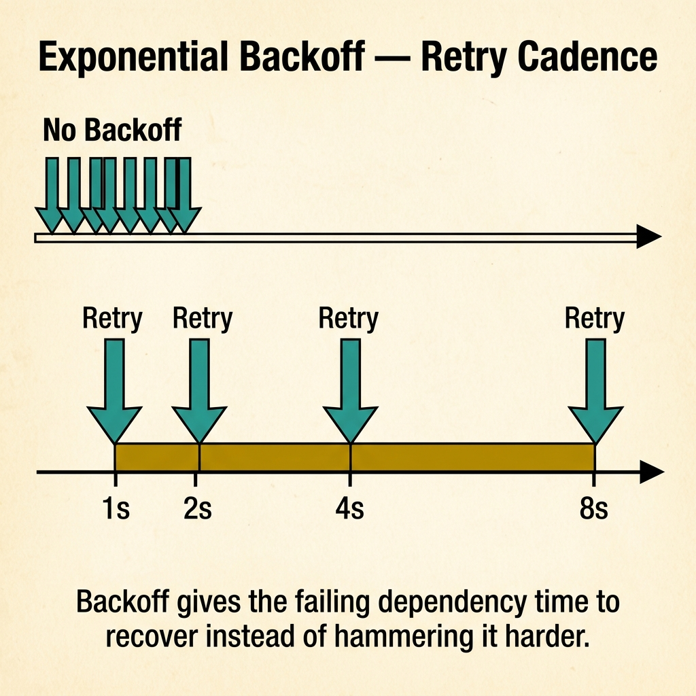
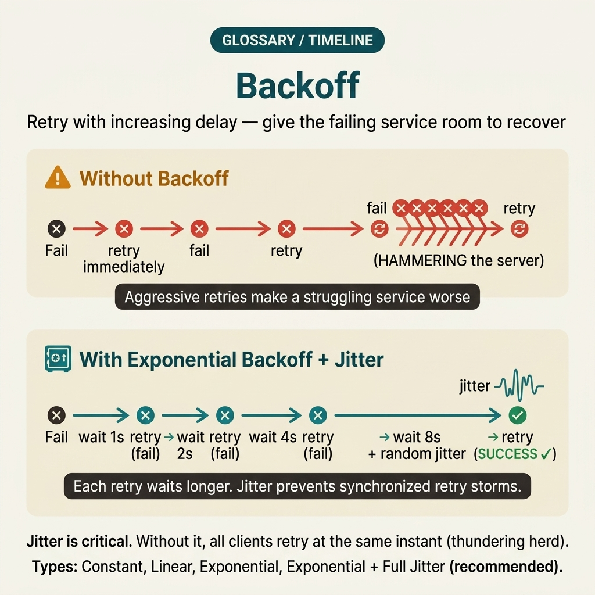
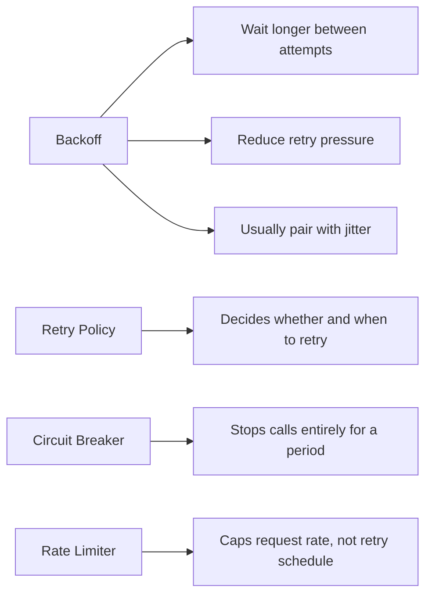

<!-- tags: glossary, reference, concurrency-async, backoff -->
# Backoff

> A strategy that progressively increases the wait time between retries to reduce pressure on a system that is failing, congested, or has not yet recovered.

| Aspect | Detail |
| --- | --- |
| **Concept** | A strategy that progressively increases the wait time between retries to reduce pressure on a system that is failing, congested, or has not yet recovered. |
| **Audience** | Backend engineer, SRE, platform engineer, reviewer |
| **Primary style** | Glossary term |
| **Entry point** | Use when the team sees retries amplifying failure instead of helping the system recover |

📅 Created: 2026-03-30 · 🔄 Updated: 2026-04-17 · ⏱️ 8 min read

---

## 1. DEFINE

Picture a dependency that just started flaking. The client in front of it immediately fires rapid retries, and those retries make the dependency even harder to recover. At this point the problem is no longer "should we retry or not" but choosing a retry cadence restrained enough to give the system a chance to breathe.

**Backoff** is a strategy that progressively increases the wait time between retries to reduce pressure on a system that is failing, congested, or has not yet recovered.

Backoff differs from timeout in that a timeout decides **how long to wait for a single attempt**; backoff decides **how long to wait before the next attempt**. It also differs from circuit breaker: backoff slows the retry cadence while a breaker can block new calls entirely for a period.

| Variant | Description |
| --- | --- |
| Fixed backoff | Each retry waits the same fixed duration. |
| Exponential backoff | Wait time grows exponentially with each retry. |
| Jittered backoff | Adds randomization to prevent many clients from retrying in lockstep. |

| Approach | Time | Space | When to choose |
| --- | --- | --- | --- |
| Immediate retry | O(1) between attempts | O(1) | Only suitable for extremely short-lived, internal errors with no pressure risk. |
| Fixed backoff | O(1) logic | O(1) | When simplicity is needed, the number of clients is small, and synchronized cadence is not a major concern. |
| Exponential backoff with jitter | O(1) logic | O(1) | When traffic is high, the dependency is pressure-sensitive, and herd behavior must be avoided. |

Core insight:

> The real value of backoff is not "retrying more politely" but cutting the feedback loop where failure generates more load, and that new load prolongs the failure.

### 1.1 Invariants & Failure Modes

The common failure mode is saying "we already have retry" as though that constitutes a complete reliability strategy. If retry has no backoff or no jitter, it easily becomes an outage amplifier.

---

## 2. CONTEXT

**Who uses it**: Backend engineer, SRE, platform engineer, reviewer

**When**: Use when the team sees retries amplifying failure instead of helping the system recover

**Purpose**: The real value of backoff is not "retrying more politely" but cutting the feedback loop where failure generates more load, and that new load prolongs the failure.

**In the ecosystem**:
Common signals:
- a dependency returns transient errors but retry volume grows faster than original traffic;
- logs show many retries at the same cadence after a timeout or reconnect;
- an outage drags on because clients recover simultaneously and re-fire all old requests.

Boundary to hold:
- backoff does not fix the root error in the dependency;
- good backoff should almost always be paired with jitter;
- retry should not apply identically to every error class.

---

Waiting progressively longer before retrying is clear. But exponential or linear, is jitter needed, and how many max retries?

## 3. EXAMPLES

Backoff surfaces most clearly when immediate retries effectively DDoS the downstream, when exponential backoff without jitter triggers a thundering-herd retry wave, or when max retry is set too high and a request waits 5 minutes before failing. The examples below place the pattern into exactly those situations.

### Example 1: Basic — Avoid immediate retry on transient errors

> **Goal**: Stop firing rapid consecutive attempts at a dependency that just failed.
> **Approach**: Insert a deliberate wait between retry attempts.
> **Example**: A client calling the inventory service hits a transient `503`.
> **Complexity**: Basic — slow the retry cadence so the dependency has a window to recover.

```yaml
retry_policy:
  max_attempts: 3
  schedule:
    - 100ms
    - 200ms
  retry_on:
    - 503
    - timeout
```



*Figure: Without backoff, retries hammer the dependency in rapid succession. With exponential backoff, wait intervals double (1s → 2s → 4s → 8s), giving the failing service time to recover instead of amplifying the failure.*

**Why?** Immediate retry keeps nearly the same pressure on the dependency. Just inserting a deliberate wait significantly reduces the probability of self-amplified failure.

**Conclusion**: Basic backoff means shifting retry from a reflex into a controlled cadence.

### Example 2: Intermediate — Add jitter to prevent clients from retrying in lockstep

> **Goal**: Prevent thousands of clients from sleeping for the same duration and then waking up to fire again simultaneously.
> **Approach**: Combine backoff with random jitter.
> **Example**: Many workers all time out when calling a shared dependency.
> **Complexity**: Intermediate — connecting retry policy with load-shaping.

```yaml
jittered_backoff:
  base: 200ms
  strategy: exponential
  jitter: full
  max_delay: 5s
```

**Why?** Exponential backoff without jitter can still create herd behavior if all clients fail at the same timestamp. Jitter helps desynchronize timing between retriers.

**Conclusion**: Intermediate backoff should almost always be understood as backoff plus jitter, not just progressively increasing delay.

### Example 3: Advanced — Tie backoff to error classification and retry budget

> **Goal**: Only retry when reasonable and within an acceptable risk budget.
> **Approach**: Classify errors as retryable, cap the total number of retries, and stop when the budget is exhausted.
> **Example**: A payment flow cannot retry indefinitely for every network error or 4xx response.
> **Complexity**: Advanced — explicit reliability policy instead of just adding delay.

```yaml
retry_governance:
  retryable_errors:
    - timeout
    - 503
    - connection_reset
  non_retryable_errors:
    - 400
    - 401
    - validation_failed
  retry_budget:
    max_attempts: 4
    max_total_delay: 8s
```

**Why?** Good backoff is not just a delay schedule. It must be tied to error semantics and a retry budget; otherwise the team is only postponing failure instead of controlling it.

**Conclusion**: At the advanced level, backoff is one component of an overall retry governance framework.

---

## 4. COMPARE



*Figure: Original compare-card visual restoring the relationship between backoff, retry policy, circuit breaker, and rate limiting.*



*Figure: Backoff positioned among retry policy, circuit breaker, and rate limiter so delay cadence, call blocking, and throughput control stay clearly separated.*

Backoff sounds like retry. True — backoff is the strategy for retry: how long to wait between attempts. Retry without backoff = DDoS. Backoff without jitter = synchronized retry storm. Both are needed.

### Level 1

```text
attempt 1 -> fail
wait 100ms
attempt 2 -> fail
wait 200ms
attempt 3 -> fail
wait 400ms
```
*Figure: Level 1 shows that backoff spaces out retry cadence instead of firing consecutively.*

### Level 2

```text
Without backoff:
clients fail -> retry immediately -> dependency hotter -> more failures

With backoff + jitter:
clients fail -> retries spread out -> recovery window appears
```
*Figure: Level 2 highlights backoff as the mechanism that breaks the failure → retry → more failure loop.*

### Easily confused or boundary-slipping

You have seen at which concurrency layer Backoff should be used. The mistakes below show common misunderstandings that lead teams to fix the symptom while the timing mechanism remains intact.

| # | Severity | Mistake | Consequence | Fix |
| --- | --- | --- | --- | --- |
| 1 | 🔴 Fatal | Retrying immediately after a transient error | Outage amplified by the client's own retries | Always use backoff for retry paths with pressure risk. |
| 2 | 🟡 Common | Having backoff but no jitter | Many clients still retry at the same cadence | Add jitter, especially for distributed clients. |
| 3 | 🟡 Common | Retrying errors that are not retryable | Increases load with no benefit and makes the flow harder to debug | Classify retryable vs non-retryable errors. |
| 4 | 🔵 Minor | No retry budget | Latency balloons and failures get hidden | Set max attempts or max total delay explicitly. |

### Quick scan

| If you face | Action |
| --- | --- |
| Retries are choking the dependency further | Add backoff instead of immediate retry |
| Many clients still "wake up" at the same time | Add jitter to the retry schedule |
| Unsure which errors should be retried | Design error classification first |

---

## 5. REF

| Resource | Type | Link | Note |
| --- | --- | --- | --- |
| AWS Builders Library | Reference | https://aws.amazon.com/builders-library/ | Excellent foundation for retry, timeout, jitter, and overload behavior. |
| Google SRE Resources | Reference | https://sre.google/resources/ | Useful for connecting backoff with resilience and overload control. |
| Go Blog | Official | https://go.dev/blog/ | Supplementary for placing backoff alongside context, cancellation, and concurrency primitives. |

---

## 6. RECOMMEND

Backoff solves the problem "continuous retries are killing downstream further." The next question: what happens when many clients retry at the same time — thundering herd?

| Expand to | When | Reason | File/Link |
| --- | --- | --- | --- |
| Topic hub | When you need to see retry behavior within the full concurrency topic | Preserves the symptom router and neighboring failure classes | [Concurrency & Async](./README.md) |
| Previous concept | When retries occur on top of a worker queue | Pool and backoff commonly travel together in production systems | [Worker Pool](./06-worker-pool.md) |
| Next concept | When you want to understand the phenomenon of mass synchronized retry/reconnect | Thundering herd is the closest consequence of uncontrolled retry | [Thundering Herd](./08-thundering-herd.md) |

Back to the downstream DDoS at the start — immediate retry, downstream could not recover. Now you know: exponential backoff + jitter. Base x 2^attempt + random(0, base). Simple, effective, and avoids a synchronized retry storm.

**Links**: [← Previous](./06-worker-pool.md) · [→ Next](./08-thundering-herd.md)
