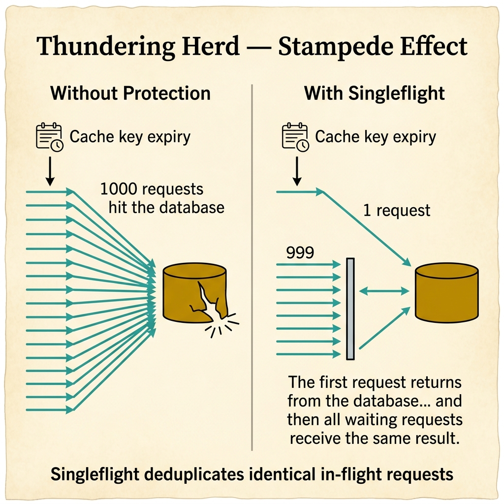
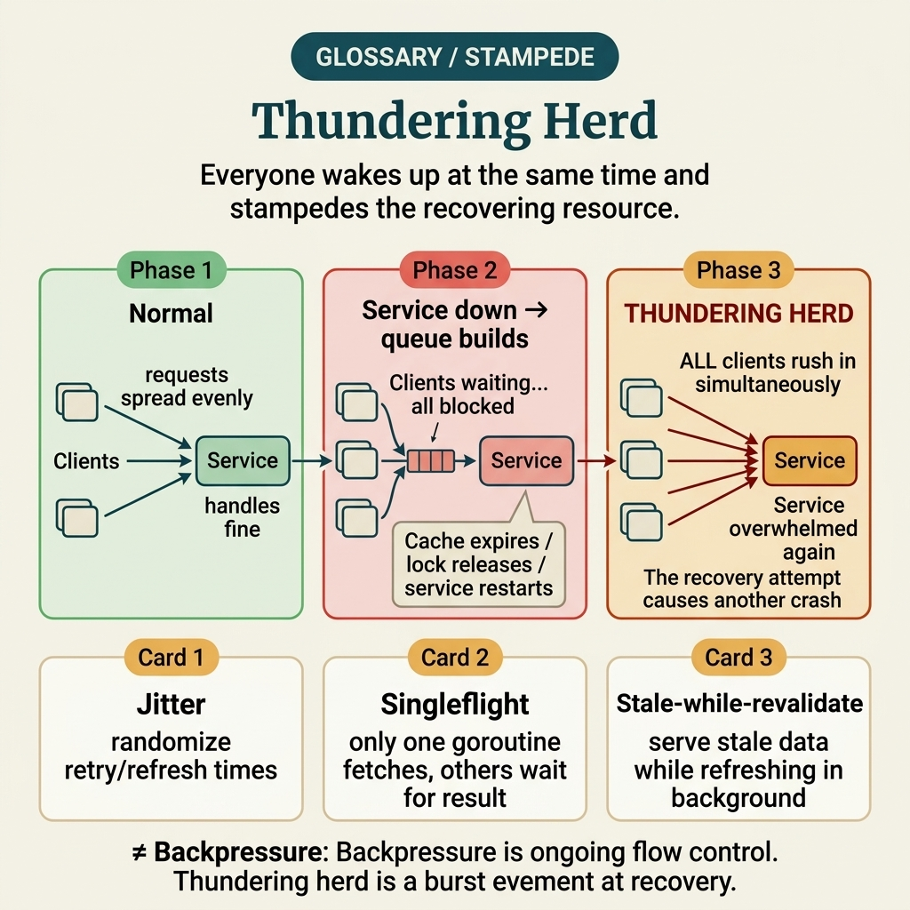
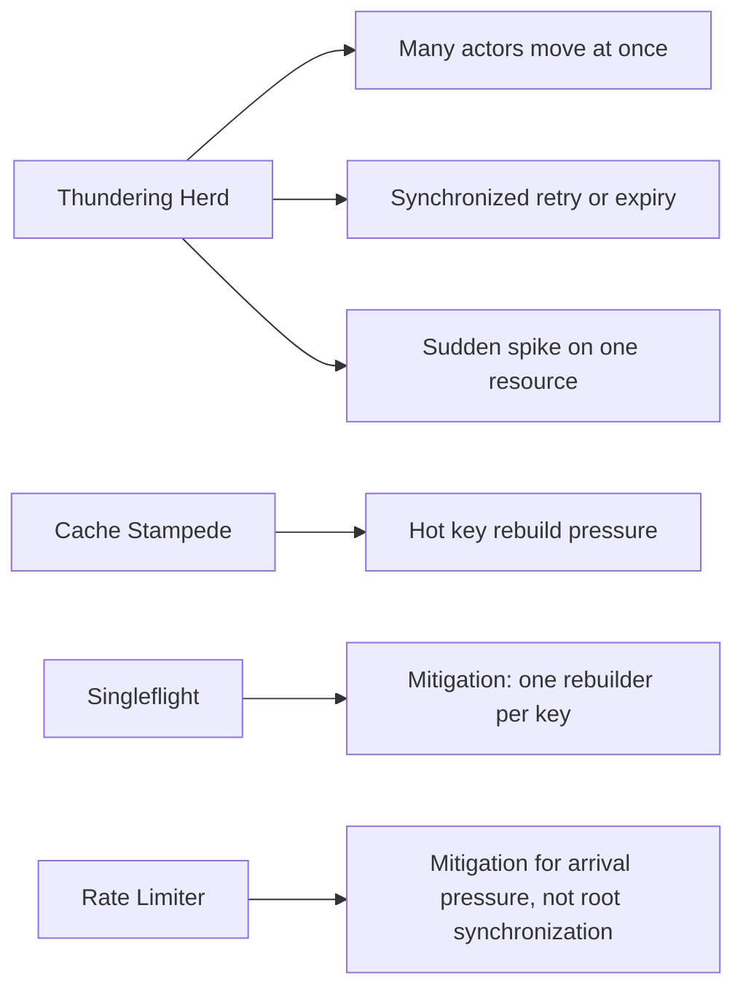

<!-- tags: glossary, reference, concurrency-async, thundering-herd -->
# Thundering Herd

> A phenomenon where a large number of clients, workers, or processes rush into the same resource or retry/reconnect at nearly the same moment, causing a sudden load spike.

| Aspect | Detail |
| --- | --- |
| **Concept** | A phenomenon where a large number of clients, workers, or processes rush into the same resource or retry/reconnect at nearly the same moment, causing a sudden load spike. |
| **Audience** | Backend engineer, SRE, platform engineer, reviewer |
| **Primary style** | Glossary term |
| **Entry point** | Use when a load spike does not originate from organic traffic but from synchronized behavior of many actors |

📅 Created: 2026-03-30 · 🔄 Updated: 2026-04-17 · ⏱️ 8 min read

---

## 1. DEFINE

Picture a service that just recovered after a few seconds of failure. Instead of load dropping, every client reconnects and retries at the exact same moment, hammering the service with a second wave. When a load spike comes from a **crowd moving in lockstep** rather than from organic business traffic, that is the boundary of **Thundering Herd**.

**Thundering Herd** is a phenomenon where a large number of clients, workers, or processes rush into the same resource or retry/reconnect at nearly the same moment, causing a sudden load spike.

This term differs from backoff in that backoff is a solution; thundering herd is a failure pattern. It also differs from natural traffic spikes because a herd typically originates from synchronized behavior of the clients themselves, their cache, lock, or retry policy.

| Variant | Description |
| --- | --- |
| Retry herd | Many clients retry simultaneously after a shared timeout or error. |
| Cache-expiry herd | Many requests hit the backend at once when a cache key expires simultaneously. |
| Reconnect herd | Many workers/sockets/clients reconnect when a service comes back up. |

| Approach | Time | Space | When to choose |
| --- | --- | --- | --- |
| Detect synchronized spikes | O(1) per event | O(1) | When you suspect traffic growth comes from a coordination bug rather than real growth. |
| Stagger / jitter clients | O(1) | O(1) | When you need to desynchronize timing across actors. |
| Single-flight / cache shielding | O(1) to O(n) per key | O(keys) | When the herd originates from cache misses or an expensive shared resource. |

Core insight:

> Thundering herd is a failure of **unintended behavioral synchronization**. If many actors wake up, expire cache, retry, or reconnect at the same time, the system creates burst load for itself.

### 1.1 Invariants & Failure Modes

The common failure mode is responding with pure autoscaling. Scaling out may help through a few waves, but if the synchronized behavior persists, the herd will recur at a larger scale.

---

## 2. CONTEXT

**Who uses it**: Backend engineer, SRE, platform engineer, reviewer

**When**: Use when a load spike does not originate from organic traffic but from synchronized behavior of many actors

**Purpose**: Thundering herd is a failure of **unintended behavioral synchronization**. If many actors wake up, expire cache, retry, or reconnect at the same time, the system creates burst load for itself.

**In the ecosystem**:
Common signals:
- traffic spikes repeat at the exact cycle of a timeout, TTL, or reconnect interval;
- a dependency just recovers and load surges a second time;
- cache miss rate and backend load both jump at the same TTL boundary.

Boundary to hold:
- not every load spike is a herd;
- a herd usually leaves a very clear time-synchronization signature;
- fixing a herd usually means breaking synchronization, not just adding more servers.

---

A thousand simultaneous requests is clear. But singleflight or distributed lock, how does a cache stampede differ from a thundering herd, and which mitigation fits each type?

## 3. EXAMPLES

Thundering herd surfaces most clearly when a cache key expires and 1,000 requests query the DB at once, when a service restarts and all clients reconnect simultaneously, or when a scheduled job triggers at the same time across 50 pods. The examples below place the pattern into exactly those situations.

### Example 1: Basic — Identify a herd from a synchronized retry pattern

> **Goal**: Distinguish a herd from natural traffic growth.
> **Approach**: Look for signs that many actors failed and retried at the same timestamp.
> **Example**: After a 5-second timeout, thousands of clients retry almost simultaneously.
> **Complexity**: Basic — prioritize correct pattern identification first.

```yaml
retry_spike_signal:
  original_error_window: "10:00:00 - 10:00:05"
  synchronized_retry_wave: "10:00:05 - 10:00:06"
  likely_cause: "shared timeout boundary without jitter"
```



*Figure: Without protection, a cache expiry unleashes 1000 simultaneous requests on the database. With singleflight, only 1 request reaches the database — 999 waiters receive the shared result. The stampede is eliminated.*

**Why?** If you only look at total RPS, a herd looks like normal traffic growth. The decisive signal is that many actors fire again around the same timestamp.

**Conclusion**: Basic herd detection means looking at time synchronization, not just volume.

### Example 2: Intermediate — Break synchronization with jitter and stagger

> **Goal**: Prevent clients from waking up or retrying on a fixed cadence.
> **Approach**: Add jitter to retry, refresh, reconnect, or TTL refresh intervals.
> **Example**: WebSocket clients reconnect after a deploy, or mobile apps refresh tokens at the same time.
> **Complexity**: Intermediate — shifting from detection to load-shaping.

```yaml
herd_mitigation:
  retry_jitter: full
  reconnect_jitter_ms: 0-3000
  ttl_randomization_percent: 10
```

**Why?** A herd exists because of synchronized behavior. Simply breaking the synchronization with randomization distributes the same volume of actors over time instead of concentrating them at one point.

**Conclusion**: Intermediate herd mitigation means applying jitter to every scheduled wake-up mechanism.

### Example 3: Advanced — Shield the backend with single-flight or cache shielding

> **Goal**: Prevent many actors from hitting the same expensive resource at once.
> **Approach**: Allow only one request/key into the data-rebuilding zone; remaining actors wait or use controlled stale data.
> **Example**: A hot cache key expires, causing thousands of requests to punch through to the DB.
> **Complexity**: Advanced — mitigation at the orchestration and caching layer.

```yaml
cache_shielding:
  hot_key: product_catalog
  on_expiry:
    allow_one_rebuilder: true
    serve_stale_while_revalidate: true
  fallback:
    max_stale_age: 30s
```

**Why?** For hot keys or hot dependencies, adding jitter on the client side alone may not suffice. Single-flight and shielding prevent the same expensive work from being replicated en masse at the backend.

**Conclusion**: At the advanced level, herd mitigation must coordinate between client behavior and server-side shielding.

---

## 4. COMPARE



*Figure: Original compare-card visual restoring the synchronized-spike comparison with cache stampede, singleflight, and rate limiting.*



*Figure: Thundering herd positioned among cache stampede, singleflight, and rate limiter so the reader sees both the synchronized failure pattern and the closest mitigation shapes.*

Thundering herd sounds like high traffic. Not exactly: a thundering herd is a simultaneous burst into the same resource — cache expiry, lock release, service restart. High traffic is sustained load. Their mitigations differ completely.

### Level 1

```text
service recovers
  -> client A retries
  -> client B retries
  -> client C retries
  -> client D retries
load spikes again
```
*Figure: Level 1 shows that the second burst comes from client behavior after recovery itself.*

### Level 2

```text
Shared TTL / timeout / reconnect interval
  -> many actors wake up together
  -> same backend/key/resource hit together
  -> queue, CPU, DB or lock contention spikes
  -> failures trigger more synchronized retries
```
*Figure: Level 2 highlights that a herd is a feedback loop driven by a shared time cadence.*

### Easily confused or boundary-slipping

You have seen at which concurrency layer Thundering Herd should be used. The mistakes below show common misunderstandings that lead teams to fix the symptom while the timing mechanism remains intact.

| # | Severity | Mistake | Consequence | Fix |
| --- | --- | --- | --- | --- |
| 1 | 🔴 Fatal | Treating a herd as normal traffic growth | Scales in the wrong direction and misses the synchronized-behavior root cause | Check for shared timeout, TTL, or reconnect interval signatures. |
| 2 | 🟡 Common | Having backoff but no jitter | Clients still retry at the same cadence | Add real jitter, not just uniformly increasing delay. |
| 3 | 🟡 Common | Only scaling the backend without shielding the hot resource | The herd returns at a larger scale | Add cache shielding, single-flight, or stale-while-revalidate. |
| 4 | 🔵 Minor | Not logging/metrics by key or retry wave | Hard to prove where the herd originated | Track retry waves, cache hot keys, and reconnect bursts. |

### Quick scan

| If you face | Action |
| --- | --- |
| Load spike occurs right after a timeout or recovery | Suspect thundering herd before calling it traffic growth |
| Many clients retry/reconnect at the same time | Add jitter and stagger |
| Hot key cache miss breaks the backend | Add shielding or single-flight |

---

## 5. REF

| Resource | Type | Link | Note |
| --- | --- | --- | --- |
| AWS Builders Library | Reference | https://aws.amazon.com/builders-library/ | Excellent for retry, jitter, and overload behavior. |
| Google SRE Resources | Reference | https://sre.google/resources/ | Useful for placing the herd in the context of reliability engineering. |
| Go Blog | Official | https://go.dev/blog/ | Supplementary for connecting the herd with concurrency primitives and cancellation. |

---

## 6. RECOMMEND

Thundering herd solves the problem "1,000 requests hit the same resource at once." The next question: what about race conditions when multiple goroutines compete?

| Expand to | When | Reason | File/Link |
| --- | --- | --- | --- |
| Topic hub | When you need to see this failure pattern within the full concurrency topic | Preserves the symptom router and neighboring terms | [Concurrency & Async](./README.md) |
| Previous concept | When the herd originates from a retry policy | Backoff is the closest mitigation to read alongside this entry | [Backoff](./07-backoff.md) |
| Next concept | When you want to continue to the execution model comparison | Parallelism clarifies the hardware axis after load regulation | [Parallelism](./09-parallelism.md) |

Back to the cache expiry at the start — 1,000 requests all querying DB. Now you know: singleflight for single-node, distributed lock for multi-node, staggered expiry for cache. Blocking at the source is cheaper than scaling at the end.

**Links**: [← Previous](./07-backoff.md) · [→ Next](./09-parallelism.md)
