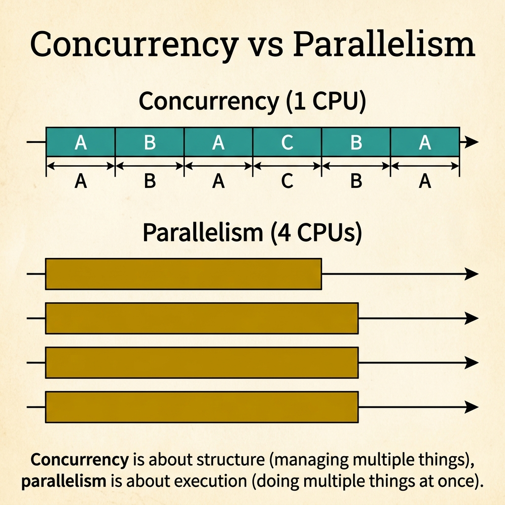
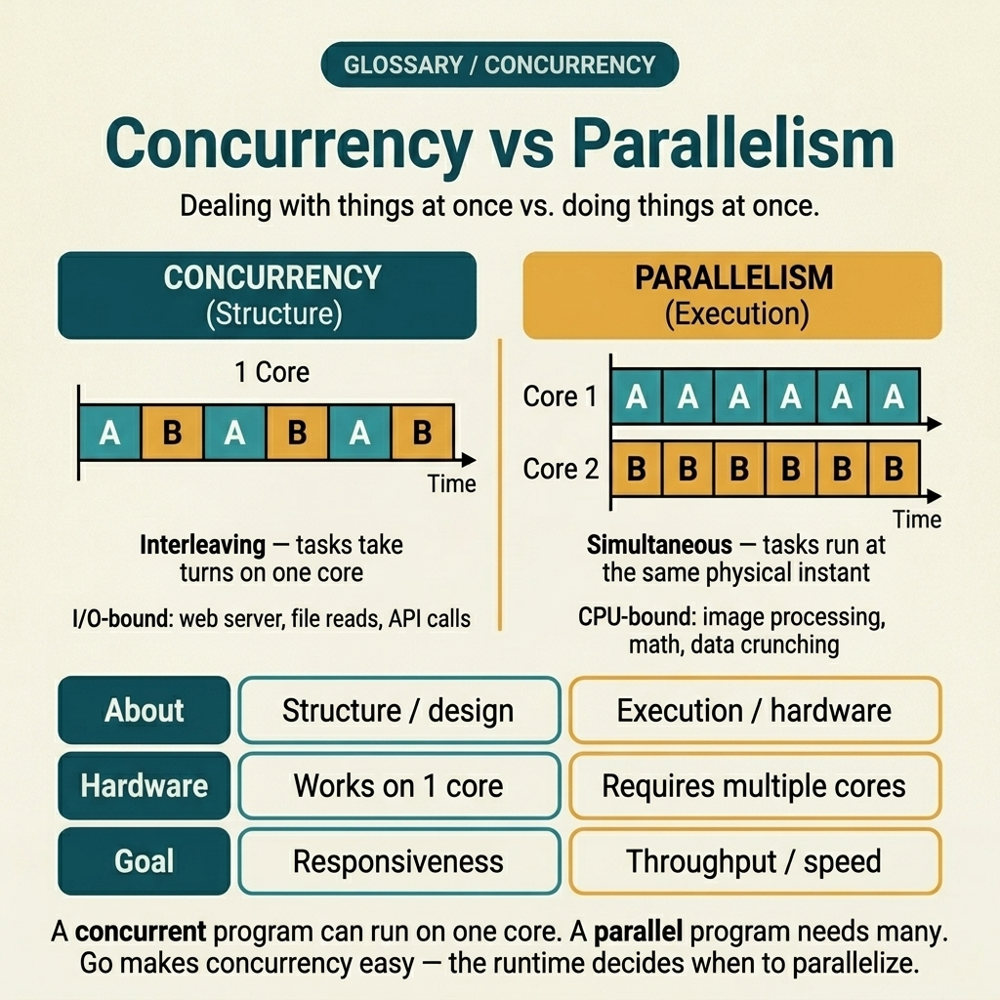
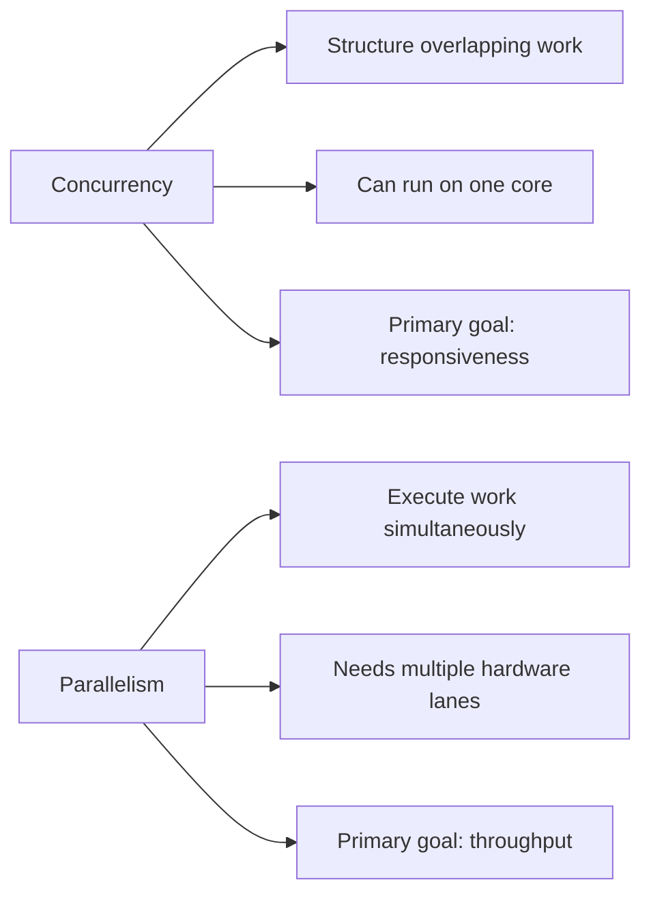

<!-- tags: glossary, reference, concurrency-async, parallelism -->
# Parallelism

> Simultaneous execution of multiple computations on separate hardware resources, as distinct from concurrency which structures overlapping tasks on potentially shared resources.

| Aspect | Detail |
| --- | --- |
| **Concept** | Simultaneous execution of multiple computations on separate hardware resources. |
| **Audience** | Backend engineer, Go developer, system designer reasoning about throughput |
| **Primary style** | Glossary term |
| **Entry point** | Use when the team debates whether a workload needs more cores or better task structure |

📅 Created: 2026-04-16 · 🔄 Updated: 2026-04-17 · ⏱️ 11 min read

---

## 1. DEFINE

Your HTTP handler spawns 8 goroutines to process a batch of images. On a single-core machine the runtime interleaves them — each goroutine gets a slice of CPU time, but only one runs at any nanosecond. Move the same binary to an 8-core machine and those goroutines physically run at the same instant, one per core. The code is identical. The execution model changed. That boundary — between *structuring* overlapping work and *executing* it simultaneously — is where parallelism begins and concurrency ends.

**Parallelism** is the simultaneous execution of multiple computations on separate hardware resources.

The word comes from geometry: two lines running side by side, never intersecting. In computing the metaphor holds — parallel tasks run on separate cores or processors without sharing a single execution timeline.

Concurrency and parallelism are not opposites. They are orthogonal axes. A program can be concurrent without being parallel (single-core interleaving), parallel without being concurrent (SIMD on a GPU), or both at the same time (goroutines scheduled across multiple OS threads on a multi-core CPU).

Rob Pike's distillation captures the split precisely:

> Concurrency is about *dealing with* lots of things at once.
> Parallelism is about *doing* lots of things at once.

The first is a design decision. The second is a runtime capability.

### 1.1 Invariants & Failure Modes

Parallelism does not eliminate concurrency hazards — it amplifies them. Two goroutines that race on a single core might interleave harmlessly for months. Put them on separate cores and the race surfaces immediately because both paths execute at the physical same instant. Every synchronization bug that hides behind slow scheduling becomes visible under true parallelism.

---

## 2. CONTEXT

**Who uses it**: System designer choosing hardware topology. Go developer tuning `GOMAXPROCS`. Performance engineer profiling CPU-bound workloads. Reviewer evaluating whether a fan-out pattern needs more cores or just better structure.

**When**: During capacity planning, performance tuning, or architecture review — whenever the question is "should we add cores or restructure the work?"

**Purpose**: Parallelism answers the throughput question. Concurrency answers the responsiveness question. Confusing the two leads teams to throw hardware at I/O-bound problems or restructure code when the real bottleneck is CPU saturation.

**In the ecosystem**:

- Parallelism sits at the *execution* layer — it requires hardware support (multiple cores, SIMD units, GPUs).
- Concurrency sits at the *design* layer — it structures tasks so they can overlap, regardless of hardware.
- Go bridges both: goroutines give you concurrency; the scheduler and `GOMAXPROCS` give you parallelism.

Common signals that parallelism is the right lever:
- CPU utilization is consistently near 100% on a single core while other cores idle.
- `pprof` shows the hot path is computation, not I/O wait.
- Adding goroutines without adding cores does not improve throughput.

---

The definition is clear on paper. The tricky part is recognizing which real-world situations call for parallelism versus better concurrency design. The examples below place the boundary into everyday engineering decisions.

## 3. EXAMPLES

Parallelism surfaces most clearly when a workload is I/O-bound and adding cores changes nothing, when a workload is CPU-bound and more cores cut wall time linearly, or when a team misidentifies the bottleneck and throws hardware at a design problem. The examples below place the boundary into each situation with a timeline showing how tasks map to cores.

### Example 1: I/O-bound — concurrency is enough

> **Goal**: Reduce wall-clock time for three independent network calls.
> **Approach**: Fan-out with goroutines on a single core.
> **Example**: A REST API handler fetches data from three downstream services, each taking 200ms.
> **Complexity**: Basic — recognizing when parallelism adds no value.

```text
Sequential (no concurrency):
  Core 1: [Svc-A 200ms][Svc-B 200ms][Svc-C 200ms]
  Wall time: 600ms

Concurrent (1 core, goroutines):
  Core 1: [Svc-A ⏳ wait][Svc-B ⏳ wait][Svc-C ⏳ wait]
           ├─ all three calls issued ─┤
  Wall time: ~200ms  (CPU idle most of the time — waiting on network)

Parallel (4 cores):
  Core 1: [Svc-A ⏳ wait]
  Core 2: [Svc-B ⏳ wait]
  Core 3: [Svc-C ⏳ wait]
  Core 4: [idle]
  Wall time: ~200ms  (same — extra cores had nothing to compute)
```

*Figure: Adding cores does not reduce network wait. Concurrency already overlapped the I/O; parallelism added idle hardware.*



*Figure: Concurrency on 1 CPU interleaves tasks A, B, C in time-slices — they overlap in schedule but not in execution. Parallelism on 4 CPUs runs tasks simultaneously on separate cores. Concurrency is structure; parallelism is execution.*

**Why?** The CPU is idle during network wait. Goroutines on a single core already overlap the waiting. More cores give each goroutine its own idling lane — cost rises, latency stays the same.

**Conclusion**: When the bottleneck is I/O, concurrency solves the responsiveness problem. Parallelism would add cost without reducing latency.

### Example 2: CPU-bound — parallelism delivers the speedup

> **Goal**: Resize 1,000 uploaded photos as fast as possible.
> **Approach**: Distribute pure computation across multiple cores.
> **Example**: An image processing pipeline where each resize is CPU-intensive with no I/O wait.
> **Complexity**: Intermediate — understanding when hardware acceleration matters.

```text
Concurrent (1 core, goroutines interleave):
  Core 1: [img-1][img-2][img-1][img-2][img-1][img-2]...
  CPU: 100% utilized — but only 1 image makes progress at a time
  Wall time: ~1000 x T  (no speedup from interleaving)

Parallel (4 cores, GOMAXPROCS=4):
  Core 1: [img-1][img-5][img-9 ]...   ── 250 images
  Core 2: [img-2][img-6][img-10]...   ── 250 images
  Core 3: [img-3][img-7][img-11]...   ── 250 images
  Core 4: [img-4][img-8][img-12]...   ── 250 images
  Wall time: ~250 x T  (~4x speedup)
```

*Figure: On a single core, goroutines interleave but total work stays the same. On 4 cores, each core processes a separate image simultaneously — wall time drops linearly.*

**Why?** CPU-bound work does not benefit from interleaving — the CPU is already at 100%. The only way to reduce wall time is to add physical execution lanes. `GOMAXPROCS` controls how many OS threads the Go scheduler uses, unlocking parallelism for computation.

**Conclusion**: When the bottleneck is CPU, concurrency structured the work; parallelism accelerated it. Throughput scales with core count.

### Example 3: Misidentified bottleneck — the expensive mistake

> **Goal**: Speed up a slow batch processing pipeline.
> **Approach**: The team requests a 32-core machine, expecting linear speedup.
> **Example**: Batch job processes 10,000 records, each requiring a database write holding a row lock.
> **Complexity**: Advanced — diagnosing when more cores cannot help.

```text
Expected (CPU-bound assumption):
  Core 1:  [batch-1][batch-5]...
  Core 2:  [batch-2][batch-6]...
  ...
  Core 32: [batch-32][batch-64]...
  Wall time: T / 32  ← team expected this

Actual (I/O-bound + lock contention):
  Core 1:  [batch-1][ ⏳ DB lock wait          ][ ⏳ DB lock wait    ]
  Core 2:  [ ⏳ DB lock wait    ][batch-2][ ⏳ DB lock wait          ]
  Core 3:  [ ⏳ DB lock wait              ][ ⏳ DB lock wait         ]
  ...
  Core 32: [ ⏳ DB lock wait                                         ]
  Wall time: ≈ T  ← almost unchanged

  pprof output:
    85% time in database/sql.(*DB).execDC     ← waiting on DB
    10% time in sync.(*Mutex).Lock            ← lock contention
     5% time in image/resize.Process          ← actual computation
```

*Figure: 32 cores sit idle waiting on a single database row lock. The serialization point is outside the CPU — adding cores only multiplied the number of waiters.*

**Why?** The team assumed batch processing was CPU-bound because goroutines were "busy." In reality, `pprof` showed 85% of time was spent waiting on the database. More cores meant more goroutines contending for the same row lock, creating *more* contention rather than more throughput.

**Conclusion**: When the bottleneck is a serialization point (lock, single connection, I/O), treating it as a parallelism problem (insufficient cores) wastes hardware budget. Profile first — then decide whether the fix is more cores or better access patterns.

---

## 4. COMPARE



*Figure: Original compare-card visual restoring the side-by-side view of structure versus execution across concurrency and parallelism.*



*Figure: Concurrency and parallelism separated by axis: structure versus execution, one-core overlap versus multi-core simultaneity, responsiveness versus throughput.*

Parallelism sounds like concurrency. The distinction: concurrency is a *design* property — how you structure overlapping work. Parallelism is an *execution* property — whether the hardware physically runs tasks at the same instant.

### Level 1

```text
Concurrency (1 core):
  Time → [A][B][A][B][A][B]
  Tasks take turns. Only one runs at any instant.

Parallelism (2 cores):
  Core 1 → [A][A][A][A][A][A]
  Core 2 → [B][B][B][B][B][B]
  Tasks run at the same physical instant.
```

*Figure: Level 1 shows that concurrency interleaves on one timeline while parallelism uses separate timelines.*

### Level 2

```text
                  Concurrency              Parallelism
                  ───────────              ───────────
Axis:             Design / structure       Execution / hardware
Hardware:         Works on 1 core          Requires multiple cores
Goal:             Responsiveness           Throughput
Best for:         I/O-bound work           CPU-bound work
Go mechanism:     goroutines + channels    GOMAXPROCS + scheduler
Risk when wrong:  Overhead without gain    Race bugs amplified
```

*Figure: Level 2 maps each concept to the axis it operates on, clarifying when each lever is the right one to pull.*

### Easily confused or boundary-slipping

You have seen the execution layer at which Parallelism should be used. The mistakes below show common confusions between concurrency and parallelism that lead teams to apply the wrong fix.

| # | Severity | Mistake | Consequence | Fix |
| --- | --- | --- | --- | --- |
| 1 | 🔴 Fatal | Adding cores to an I/O-bound workload | Hardware cost rises with no throughput gain | Profile first — if CPU is idle, the bottleneck is I/O or lock contention. |
| 2 | 🔴 Fatal | Assuming goroutines run in parallel by default | Race bugs appear only in production on multi-core machines | Understand GOMAXPROCS and test with `-race` on multi-core. |
| 3 | 🟡 Common | Using "concurrent" and "parallel" interchangeably in ADRs | Team debates the wrong axis; review misses the real constraint | Lock definition first: structure vs execution. |
| 4 | 🔵 Minor | Setting GOMAXPROCS higher than core count | Context-switch overhead increases without speedup | Match GOMAXPROCS to available physical cores. |

### Quick scan

| If you face | Action |
| --- | --- |
| Unsure whether the bottleneck is I/O or CPU | Profile with `pprof`; check CPU vs wait time |
| Goroutines are fast locally but slow in production | Check GOMAXPROCS and actual core count in container |
| Need to jump to a coordination primitive | Open [Mutex / RWMutex](./03-mutex-rwmutex.md) or [Worker Pool](./06-worker-pool.md) |

---

## 5. REF

| Resource | Type | Link | Note |
| --- | --- | --- | --- |
| Concurrency is not Parallelism | Talk | https://go.dev/blog/waza-talk | Rob Pike defines the boundary between the two concepts. |
| Go Memory Model | Official | https://go.dev/ref/mem | Foundation for reasoning about visibility under parallel execution. |
| Effective Go — Concurrency | Official | https://go.dev/doc/effective_go#concurrency | Practical guidance on goroutines, channels, and parallelism. |
| GOMAXPROCS | Official | https://pkg.go.dev/runtime#GOMAXPROCS | Controls how many OS threads execute goroutines simultaneously. |

---

## 6. RECOMMEND

You now know parallelism is about *execution on hardware*, not task structure. The next question: how do you coordinate work safely when goroutines actually run on separate cores at the same instant?

| Expand to | When | Reason | File/Link |
| --- | --- | --- | --- |
| Topic hub | When you need to route a different concurrency symptom | Return to the symptom router for the whole branch | [Concurrency & Async](./README.md) |
| Race Condition | When parallel execution exposes timing bugs | Parallelism amplifies races that single-core hides | [Race Condition](./01-race-condition.md) |
| Worker Pool | When you need to bound parallel goroutines | Worker pool is the coordination pattern for controlled parallelism | [Worker Pool](./06-worker-pool.md) |
| Fan-out / Fan-in | When parallel tasks need result aggregation | Fan-in collects results from parallel branches | [Fan-out / Fan-in](./05-fan-out-fan-in.md) |

Back to the image pipeline at the start — 8 goroutines, same code, two machines. On one core they interleave. On eight cores they parallelize. The code did not change. The execution model did. That is the entire boundary.

**Links**: [← Previous](./08-thundering-herd.md) · [→ Next](./10-thread-per-request-vs-event-loop.md)
