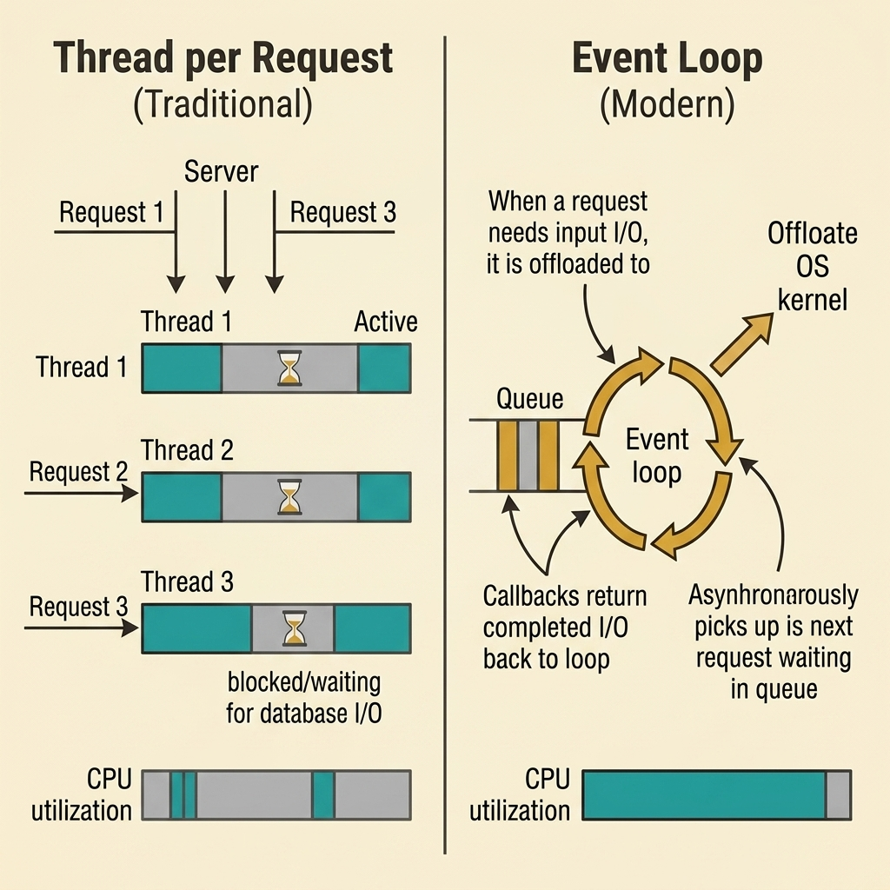
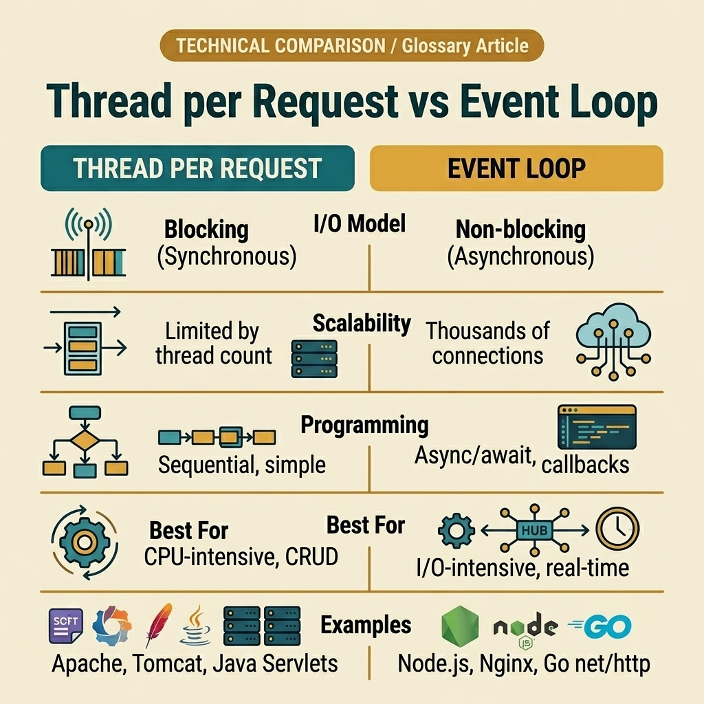

<!-- tags: glossary, reference, concurrency-async, thread-per-request, event-loop -->
# Thread per Request vs Event Loop

> Two fundamental server concurrency models that determine how a backend handles thousands of simultaneous connections — one assigns a dedicated thread to each request, the other multiplexes all requests through a single-threaded loop with non-blocking I/O.

| Aspect | Detail |
| --- | --- |
| **Concept** | Two server concurrency models: thread-per-request blocks a dedicated thread per connection, event loop multiplexes connections on a single thread with async I/O. |
| **Audience** | Backend engineer, system designer, Go developer reasoning about server throughput |
| **Primary style** | Glossary term |
| **Entry point** | Use when the team debates why a server crashes under load or which concurrency model fits a workload |

📅 Created: 2026-04-21 · 🔄 Updated: 2026-04-21 · ⏱️ 10 min read

---

## 1. DEFINE

Your server handles 1,000 requests per second just fine. Traffic spikes to 5,000. Response times climb from 50ms to 3 seconds. Threads start piling up — each one holding 1MB of stack memory, most of them doing nothing but waiting for a database query to return. At 5,000 threads that is 5GB of RAM consumed by idle waiters. The CPU spends more time context-switching between threads than doing actual work. One more traffic bump and the server crashes with an out-of-memory error.

The question is not "how many threads can I add?" The question is "should each request own a thread at all?"

**Thread per Request** and **Event Loop** are the two foundational answers the industry has developed. They differ in one core assumption: whether a thread should block and wait for I/O, or hand off the waiting and keep processing.

| Model | Core idea |
| --- | --- |
| Thread per Request | Each incoming request gets a dedicated OS thread that stays with it until the response is sent. The thread blocks during I/O. |
| Event Loop | A small number of threads — often just one — run a loop that picks up requests from a queue. When I/O is needed, the request is registered with the OS kernel and the loop moves on. |

Before these models had names, the debate was simpler: "just add more threads." The realization that threads are expensive resources — not free workers — is what forced the split into two camps.

> Thread per Request optimizes for **code simplicity**. Event Loop optimizes for **resource efficiency**. Neither is universally superior.

### 1.1 Invariants & Failure Modes

Thread per Request fails when the number of concurrent connections exceeds the thread pool capacity. The server either rejects new connections or degrades under context-switching overhead.

Event Loop fails when a single handler performs CPU-intensive work on the main thread. Because only one thread processes events, a long computation blocks every other request in the queue.

---

## 2. CONTEXT

**Who uses it**: Backend engineer choosing a framework. System architect designing for scale. DevOps engineer diagnosing thread exhaustion under load. Interviewer testing whether a candidate understands why Node.js and Tomcat behave differently.

**When**: During architecture decisions — picking between frameworks, designing for expected load, debugging performance under traffic spikes, or explaining to a team why "just increase the thread pool" stopped working.

**Purpose**: These two models answer a fundamental design question: how does the server spend its time between receiving a request and sending a response? The answer determines memory footprint, scalability ceiling, and programming complexity.

**In the ecosystem**:

- Thread per Request is the default model in traditional servers: Apache HTTP Server, Java Servlet containers like Tomcat, and Spring MVC.
- Event Loop is the model behind Node.js, Nginx, Go's `net/http` with goroutines, and Spring WebFlux with Netty.
- Go sits in a unique position: it uses goroutines — lightweight user-space threads — that give the simplicity of thread-per-request with the efficiency closer to event loop. The Go runtime multiplexes millions of goroutines onto a small number of OS threads.

---

The models are clear in theory. The real confusion starts when engineers try to pick one for a specific workload, or when they assume that one model is always better than the other.



*Figure: Thread per Request assigns one thread per connection — each thread blocks during I/O, leaving CPU idle. Event Loop uses one thread that never blocks, offloading I/O to the OS kernel and processing callbacks as they arrive.*

The examples below place each model into situations where it either shines or breaks.

## 3. EXAMPLES

### Example 1: Basic — Thread per Request handles a simple CRUD API

> **Goal**: Serve a REST API with moderate traffic and straightforward database queries.
> **Approach**: Traditional thread pool with blocking I/O.
> **Example**: A Java Spring MVC application handling 200 concurrent users.

```text
Thread per Request — 200 concurrent users:

  Thread Pool (200 threads):
    Thread 1:  [Parse request][── DB query (50ms) ──][Build response]
    Thread 2:  [Parse request][── DB query (50ms) ──][Build response]
    Thread 3:  [Parse request][── DB query (50ms) ──][Build response]
    ...
    Thread 200: [Parse request][── DB query (50ms) ──][Build response]

  Memory: 200 threads × 1MB stack = 200MB
  CPU: mostly idle during DB wait, but 200 threads is manageable
  Latency: ~60ms per request ✅
```

*Figure: At moderate concurrency, thread-per-request works well. Each thread handles one request sequentially. The programming model is simple — read top to bottom, no callbacks.*

**Why?** At 200 concurrent connections, the thread overhead is acceptable. The code is sequential: read the request, query the database, build the response. No callbacks, no promises, no event registration. A junior developer can trace the flow by reading the code top to bottom.

**Conclusion**: Thread per Request is the right choice when concurrency is moderate and code simplicity matters more than raw throughput.

### Example 2: Intermediate — Event Loop handles 10,000 WebSocket connections

> **Goal**: Maintain persistent connections for a real-time chat application.
> **Approach**: Event loop with non-blocking I/O.
> **Example**: A Node.js server managing 10,000 concurrent WebSocket clients.

```text
Event Loop — 10,000 concurrent WebSocket connections:

  Event Queue: [msg from user-42][msg from user-1337][heartbeat user-99]...

  Event Loop Thread:
    → Pick event from queue
    → If message: parse, validate, fan-out to recipients
    → If I/O needed: register with OS kernel, move to next event
    → If callback ready: process response, send to client
    → Repeat

  Memory: 1 thread + 10,000 connection state objects ≈ 50MB
  CPU: stays busy processing events, never blocks on I/O
  Throughput: 10,000+ concurrent connections on a single process ✅
```

*Figure: The event loop never waits. Each event takes microseconds to process, and I/O is delegated to the OS. A single thread handles what would require 10,000 threads in the traditional model.*

**Why?** WebSocket connections are mostly idle — the client sends a message every few seconds. Allocating a dedicated thread to each connection means 10,000 threads spending 99% of their time sleeping. The event loop keeps one thread busy handling whichever connection has work to do right now.

**Conclusion**: Event Loop dominates when the workload is I/O-bound with many concurrent but mostly idle connections.

### Example 3: Advanced — Event Loop fails under CPU-intensive work

> **Goal**: Serve an API that performs heavy image processing per request.
> **Approach**: Node.js event loop with synchronous image resize.
> **Example**: An endpoint that resizes uploaded images before saving them.

```text
Event Loop — CPU-intensive image processing:

  Event Queue: [resize img-1][resize img-2][resize img-3][resize img-4]

  Event Loop Thread:
    → Pick img-1: resize takes 500ms of pure CPU work
    → During those 500ms: NO other event is processed
    → img-2, img-3, img-4 wait in queue
    → Health check from load balancer? Also waiting.
    → Load balancer marks server as dead.

  Result: 1 CPU-bound task blocks ALL other requests ❌
```

*Figure: The event loop's strength becomes its weakness. When computation cannot be offloaded, the single thread becomes a bottleneck that stalls the entire server.*

**Why?** The event loop assumes each event completes quickly. Image resizing is CPU-bound — it cannot be offloaded to the OS kernel like a network call. The loop is stuck processing one image while thousands of other requests queue up. The fix is either offloading CPU work to a worker thread pool or using a thread-per-request model where blocking one thread does not block others.

**Conclusion**: Event Loop breaks when handlers contain CPU-intensive synchronous work. Recognizing this boundary is the difference between choosing the right model and debugging a server that "randomly" stops responding.

---

## 4. COMPARE



*Figure: Side-by-side comparison across I/O model, scalability, programming model, best-fit workloads, and representative technologies.*

### Level 1

```text
Thread per Request               Event Loop
─────────────────                ──────────
1 thread per connection          1 thread for all connections
Thread blocks on I/O             Thread never blocks
Simple sequential code           Async callbacks or await
Scales with thread count         Scales with event throughput
```

*Figure: Level 1 captures the core split — blocking versus non-blocking, many threads versus one thread.*

### Level 2

```text
                    Thread per Request         Event Loop
                    ──────────────────         ──────────
I/O model:          Blocking (synchronous)     Non-blocking (asynchronous)
Memory per conn:    ~1MB (thread stack)         ~10KB (connection state)
Max connections:    Thousands (OS limit)        Hundreds of thousands
CPU idle time:      High during I/O wait        Low — always processing
Code complexity:    Low (sequential)            Higher (callbacks/async)
Failure mode:       Thread exhaustion           Blocking the loop
Go equivalent:      goroutine (lightweight)     net/http + goroutine scheduler
```

*Figure: Level 2 adds the resource cost dimension. Thread per Request trades memory for simplicity. Event Loop trades complexity for efficiency.*

### Easily confused or boundary-slipping

| # | Severity | Mistake | Consequence | Fix |
| --- | --- | --- | --- | --- |
| 1 | 🔴 Fatal | Running CPU-heavy code on an event loop thread | Entire server stops responding to all clients | Offload CPU work to a worker thread pool. |
| 2 | 🔴 Fatal | Setting thread pool to 10,000 and hoping for the best | OS runs out of memory or context-switching kills throughput | Switch to event loop or use lightweight threads like goroutines. |
| 3 | 🟡 Common | Assuming event loop is always faster | Event loop adds latency for CPU-bound workloads | Profile the workload: I/O-bound favors event loop, CPU-bound favors threads. |
| 4 | 🟡 Common | Calling Go's model "thread per request" | Go goroutines are multiplexed, not OS threads | Understand M:N scheduling: many goroutines on few OS threads. |
| 5 | 🔵 Minor | Using async/await everywhere in a low-concurrency CRUD app | Code complexity rises with no scalability benefit | Use sequential blocking I/O when concurrency is low. |

### Quick scan

| If you face | Action |
| --- | --- |
| Server crashes under load with thread exhaustion | Consider event loop model or lightweight threads |
| Node.js server stops responding during heavy computation | Offload CPU work to worker threads or switch model |
| Need to choose between Spring MVC and Spring WebFlux | Profile: I/O-bound high-concurrency → WebFlux; CRUD low-concurrency → MVC |
| Go server handles millions of requests efficiently | Go uses goroutine M:N scheduling — best of both worlds |

---

## 5. REF

| Resource | Type | Link | Note |
| --- | --- | --- | --- |
| Node.js Event Loop Documentation | Official | https://nodejs.org/en/learn/asynchronous-work/event-loop-timers-and-nexttick | Authoritative explanation of the Node.js event loop phases. |
| Rob Pike — Concurrency is not Parallelism | Talk | https://go.dev/blog/waza-talk | Foundational talk on structuring concurrent work vs parallel execution. |
| C10K Problem | Reference | http://www.kegel.com/c10k.html | The original paper that motivated event-driven architectures. |
| Java Virtual Threads (Project Loom) | Official | https://openjdk.org/jeps/444 | Java's answer to lightweight threading, bridging both models. |

---

## 6. RECOMMEND

You now understand the two roads a server can take when a request arrives: dedicate a thread or register an event. The next question depends on your runtime. If you are in Go, goroutines already give you the simplicity of thread-per-request with event-loop-level efficiency. If you are in Java, Project Loom's virtual threads close the same gap. The real skill is recognizing which workload benefits from which model — and when to mix both.

| Expand to | When | Reason | File/Link |
| --- | --- | --- | --- |
| Topic hub | When you need to route a different concurrency symptom | Return to the symptom router for the whole branch | [Concurrency & Async](./README.md) |
| Parallelism | When you need to understand CPU-bound vs I/O-bound workloads | Parallelism is the execution side; these models are the design side | [Parallelism](./09-parallelism.md) |
| Worker Pool | When you need to bound concurrent work in either model | Worker pool controls goroutine/thread count regardless of model | [Worker Pool](./06-worker-pool.md) |
| Goroutine Leak | When lightweight threads start piling up without cleanup | Even goroutines can exhaust resources if not managed | [Goroutine Leak](./04-goroutine-leak.md) |

Back to the server handling 5,000 requests at the start — each thread holding 1MB of stack, most of them sleeping on database I/O. The answer was never "add more threads." The answer was "stop making threads wait." That is the entire boundary between these two models.

**Links**: [← Previous](./09-parallelism.md) · [→ Next](./README.md)
