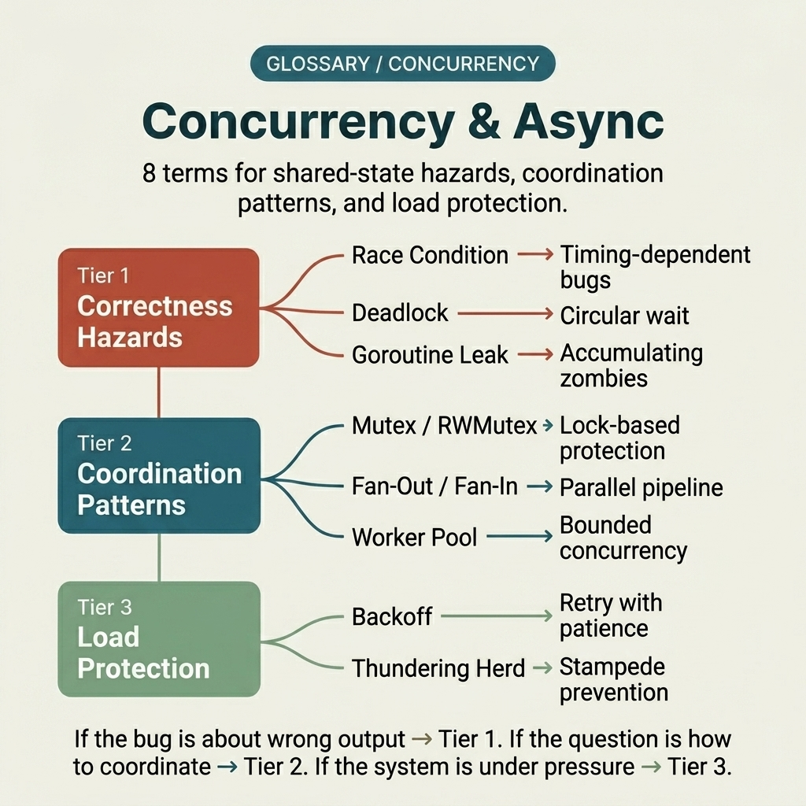
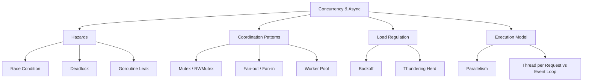

<!-- tags: glossary, reference, concurrency-async, overview -->
# Concurrency & Async

> A cluster of terms for naming timing faults, coordination patterns, and load-shedding mechanisms when multiple execution paths run concurrently.

| Aspect | Detail |
| --- | --- |
| **Concept** | A cluster of terms for naming timing faults, coordination patterns, and load-shedding mechanisms when multiple execution paths run concurrently. |
| **Audience** | Go developer, backend engineer, reviewer debugging async behavior |
| **Primary style** | Glossary hub router |
| **Entry point** | Open when a symptom involves race, deadlock, leak, or fan-out/backoff control but the root term is unclear |

📅 Created: 2026-03-30 · 🔄 Updated: 2026-04-21 · ⏱️ 7 min read

---

## 1. DEFINE

Picture this: CPU is fine, memory is not full, yet goroutine count climbs, requests lag, and logs appear intermittently. It could be a race, a deadlock, a leak, or simply fan-out without back-pressure. This README exists to route a concurrency symptom into the right concept before someone "fixes" it by spawning yet another goroutine.

**Concurrency & Async** is a cluster of terms for naming timing faults, coordination patterns, and load-shedding mechanisms when multiple execution paths run concurrently.

| Variant | Description |
| --- | --- |
| Hazards | Race condition, deadlock, and goroutine leak form the group of timing/coordination bugs with a high blast radius. |
| Coordination patterns | Mutex/RWMutex, fan-out/fan-in, and worker pool are patterns for synchronizing and distributing work. |
| Load regulation | Backoff and thundering herd name the moments when a system suffers from synchronized retries or self-inflicted collapse. |
| Execution model | Parallelism names the hardware axis — simultaneous execution on multiple cores — as distinct from concurrency's design axis. |
| Server concurrency model | Thread per Request vs Event Loop names the two foundational designs a server uses to handle thousands of connections. |

| Approach | Time | Space | When to choose |
| --- | --- | --- | --- |
| Route by timing symptom | O(1) route | O(1) | When the system fails because of execution order, not business rules |
| Route by coordination primitive | O(1) route | O(1) | When the team knows synchronization is needed but is unsure which primitive fits |
| Learn from hazard to control | O(1) route | O(1) | When moving from common concurrency bugs to production load-regulation patterns |

Core insight:

> Concurrency docs only deliver value when they clearly separate timing symptoms, coordination primitives, and load-shedding mechanisms instead of lumping everything into one "async problem" bucket.

### 1.1 Signals & Boundaries

- Race condition and deadlock are hazards, not solution patterns.
- Worker pool and fan-out/fan-in are coordination shapes; read them after understanding the blast radius of leak and race.
- Backoff and thundering herd belong to the operational control layer and usually surface only at scale.

### Coverage Map

| Entry | Role | Note |
| --- | --- | --- |
| [Race Condition](01-race-condition.md) | Canonical term | Primary entry for this branch |
| [Deadlock](02-deadlock.md) | Canonical term | Primary entry for this branch |
| [Mutex / RWMutex](03-mutex-rwmutex.md) | Canonical term | Primary entry for this branch |
| [Goroutine Leak](04-goroutine-leak.md) | Canonical term | Primary entry for this branch |
| [Fan-out / Fan-in](05-fan-out-fan-in.md) | Canonical term | Primary entry for this branch |
| [Worker Pool](06-worker-pool.md) | Canonical term | Primary entry for this branch |
| [Backoff](07-backoff.md) | Canonical term | Primary entry for this branch |
| [Thundering Herd](08-thundering-herd.md) | Canonical term | Primary entry for this branch |
| [Parallelism](09-parallelism.md) | Canonical term | Primary entry for this branch |
| [Thread per Request vs Event Loop](10-thread-per-request-vs-event-loop.md) | Canonical term | Primary entry for this branch |

---

## 2. VISUAL



*Figure: Router map for the full lane, restoring the original visual overview of hazards, coordination patterns, load regulation, and execution model.*



*Figure: Router map splitting the lane into hazards, coordination patterns, load regulation, and execution model before the reader dives into any specific term.*

The cluster name is clear; the harder part is deciding which branch matches the symptom in front of you. This visual makes that first routing decision explicit before the deeper examples begin.

### Level 1

```text
Hazards
Coordination patterns
Load regulation
```

*Figure: Level 1 splits this hub into primary decision lanes so the reader does not have to dig through a flat list of terms.*

### Level 2

```text
If the situation is...                                    Open first
---------------------------------------------   ------------------------------------------
Values are nondeterministic and hard to reproduce         Race Condition
Processes freeze, waiting on each other with no progress  Deadlock
Execution unit count keeps growing but never freed        Goroutine Leak
Need to distribute work with limits and back-pressure     Worker Pool
Adding cores does not speed up the workload               Parallelism
Server crashes under load with thread exhaustion            Thread per Request vs Event Loop
```

*Figure: Level 2 turns the hub into a symptom router: start from the real question, then branch to the specific term.*

---

## 3. CODE

The diagram just split this cluster by contention, coordination, retry pressure, and burst behavior. From here, use the hub as a timeline router to match the right timing symptom with the right concurrency term.

### Problem 1: Basic — Route the right symptom to the right glossary entry

> **Goal**: Prevent every **Concurrency & Async** question from landing in the same bucket.
> **Approach**: Start from the reader's symptom or question, then open the best-matching entry first.
> **Example**: Input is a review/design question; output is the file to open first, such as `./01-race-condition.md`.
> **Complexity**: Basic

```yaml
router:
  - symptom: Values are nondeterministic and hard to reproduce
    open_first: ./01-race-condition.md
  - symptom: Processes freeze, waiting on each other with no progress
    open_first: ./02-deadlock.md
  - symptom: Execution unit count keeps growing but never freed
    open_first: ./04-goroutine-leak.md
  - symptom: Need to distribute work with limits and back-pressure
    open_first: ./06-worker-pool.md
```

**Why?** In concurrency, misidentifying the bug class means misidentifying the mechanism: race condition, deadlock, and goroutine leak can all manifest as a system that hangs or slows. This router forces the reader to see the right type of pressure at play.

**Conclusion**: The hub's first value is shortcutting the diagnostic detour so the team opens the right timing term before patching concurrent code blindly.

### Problem 2: Intermediate — Use the hub as a purposeful learning path

> **Goal**: Read **Concurrency & Async** in logical clusters instead of jumping between disconnected files.
> **Approach**: Follow a lane from foundational concepts to heavier variants, then compare adjacent concepts when needed.
> **Example**: A reader wants to build a durable mental model rather than look up a single isolated definition.
> **Complexity**: Intermediate

```yaml
learning_path:
  hazards:
    - 01-race-condition.md
    - 02-deadlock.md
    - 04-goroutine-leak.md
  coordination:
    - 03-mutex-rwmutex.md
    - 05-fan-out-fan-in.md
    - 06-worker-pool.md
  load_regulation:
    - 07-backoff.md
    - 08-thundering-herd.md
  execution_model:
    - 09-parallelism.md
    - 10-thread-per-request-vs-event-loop.md
```

**Why?** The terms in this cluster interlock through cause-effect rhythms. A learning path takes the reader from basic synchronization bugs to production load-regulation strategies without losing the connective thread between them.

**Conclusion**: At the intermediate level, this hub moves the reader from timing bugs to pressure control following the causal rhythm of concurrency.

### Problem 3: Advanced — Use the hub as a governance map for shared vocabulary

> **Goal**: Ensure reviews, ADRs, runbooks, and postmortems all use the same language within **Concurrency & Async**.
> **Approach**: Group terms by decision lane, then use that lane as a glossary contract for the team.
> **Example**: Two people use the same word but are actually debating at two different layers of the system.
> **Complexity**: Advanced

```yaml
governance_map:
  hazards:
    - 01-race-condition.md
    - 02-deadlock.md
    - 04-goroutine-leak.md
  coordination_patterns:
    - 03-mutex-rwmutex.md
    - 05-fan-out-fan-in.md
    - 06-worker-pool.md
  load_regulation:
    - 07-backoff.md
    - 08-thundering-herd.md
```

**Why?** Shared vocabulary in concurrency is the insurance layer for incident reviews and code reviews. A governance map keeps the team clearly distinguishing coordination bugs, parallelism patterns, and retry/backoff policies.

**Conclusion**: At the advanced level, this hub is a timeline reasoning map for every discussion about timing bugs and pressure control.

---

## 4. PITFALLS

The taxonomy is clear, but routing correctly is not enough to avoid common slip-ups when using or interpreting this concept cluster.

| # | Severity | Mistake | Consequence | Fix |
| --- | --- | --- | --- | --- |
| 1 | 🔴 Fatal | Mixing multiple concept layers in the same discussion | Team fixes the wrong layer, debate drifts off-target | Re-route along the correct lane in this README before opening a specific term |
| 2 | 🟡 Common | Picking a term by familiar name rather than by symptom | Deep-links to the right file but misses the boundary | Ask the symptom question first, then choose the entry point |
| 3 | 🟡 Common | Reading a term in isolation and skipping the learning path | Fragmented understanding, missing adjacent concept comparisons | Follow the reading clusters suggested in CODE/RECOMMEND |
| 4 | 🔵 Minor | No back-link to the parent hub or root hub | Reader struggles to return to the taxonomy when lost | Keep the hub as a router; do not let files become islands |

---

## 5. REF

| Resource | Type | Link | Note |
| --- | --- | --- | --- |
| Go Memory Model | Official | https://go.dev/ref/mem | Canon for reasoning about race and synchronization |
| Go Concurrency Patterns | Talk | https://go.dev/talks/2012/concurrency.slide | Foundation for fan-in/fan-out and channel orchestration |
| The Tail at Scale | Paper | https://research.google/pubs/pub40801/ | Highly useful for retry, load spike, and herd effect |

---

## 6. RECOMMEND

You have locked the type of concurrency pressure you are facing. Move on to the term that best matches your timing symptom so you fix the mechanism instead of just suppressing the surface effect.

| Expand to | When | Reason | File/Link |
| --- | --- | --- | --- |
| Race condition first | When the team is not yet used to reading concurrency symptoms | This is the entry point for recognizing timing as a distinct problem domain | [Race Condition](./01-race-condition.md) |
| Worker pool after hazards | When uncontrolled concurrency dangers are understood | Only then do control patterns carry real meaning | [Worker Pool](./06-worker-pool.md) |
| Backoff when scaling begins | When retries and pressure stack on top of each other | Operational concurrency does not stop at in-code boundaries | [Backoff](./07-backoff.md) |
| Parallelism when throughput is the question | When adding goroutines alone does not improve speed | Clarifies the hardware axis before scaling decisions | [Parallelism](./09-parallelism.md) |
| Thread per Request vs Event Loop | When the team debates server concurrency models | Names the two roads a server takes when handling connections | [Thread per Request vs Event Loop](./10-thread-per-request-vs-event-loop.md) |

---

## 7. QUICK REF

| If you face | Open |
| --- | --- |
| Values are nondeterministic and hard to reproduce | [Race Condition](./01-race-condition.md) |
| Processes freeze, waiting on each other with no progress | [Deadlock](./02-deadlock.md) |
| Execution unit count keeps growing but never freed | [Goroutine Leak](./04-goroutine-leak.md) |
| Need to distribute work with limits and back-pressure | [Worker Pool](./06-worker-pool.md) |
| Adding cores does not speed up the workload | [Parallelism](./09-parallelism.md) |
| Server crashes under load with thread exhaustion or event loop blocks | [Thread per Request vs Event Loop](./10-thread-per-request-vs-event-loop.md) |
