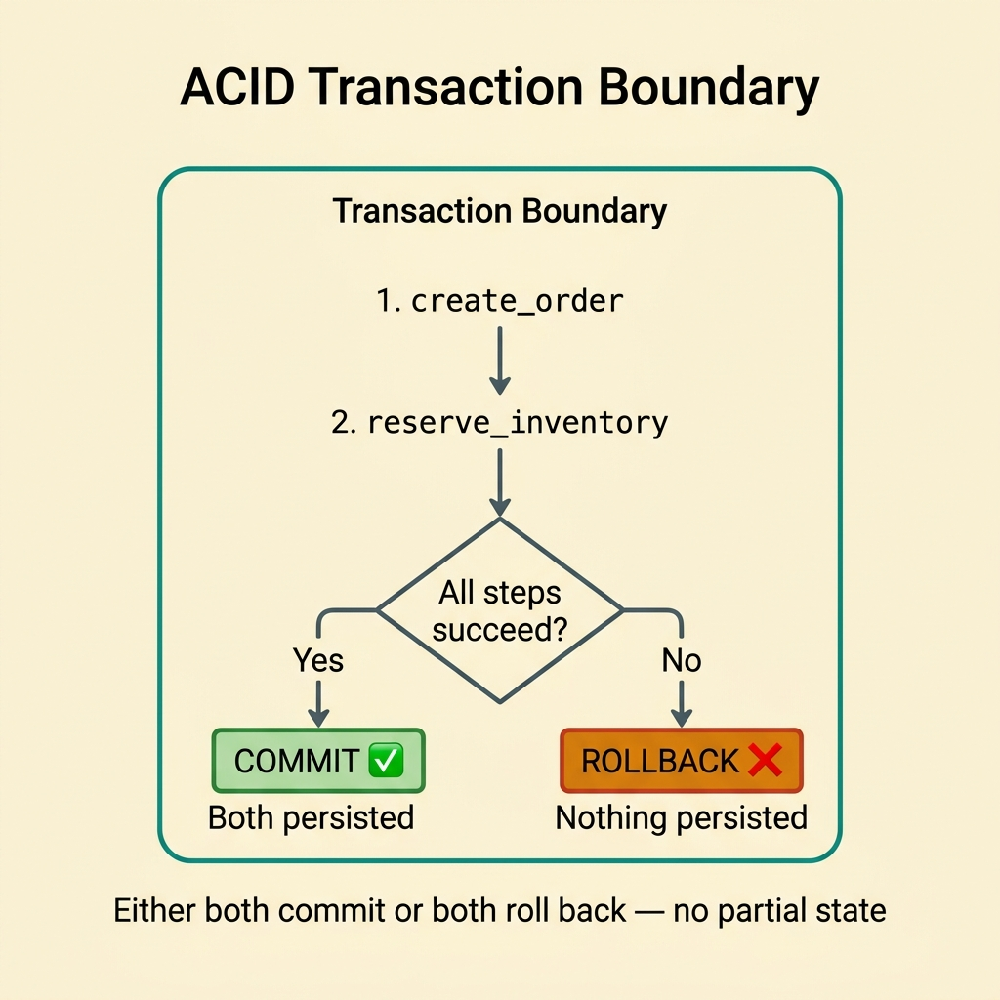
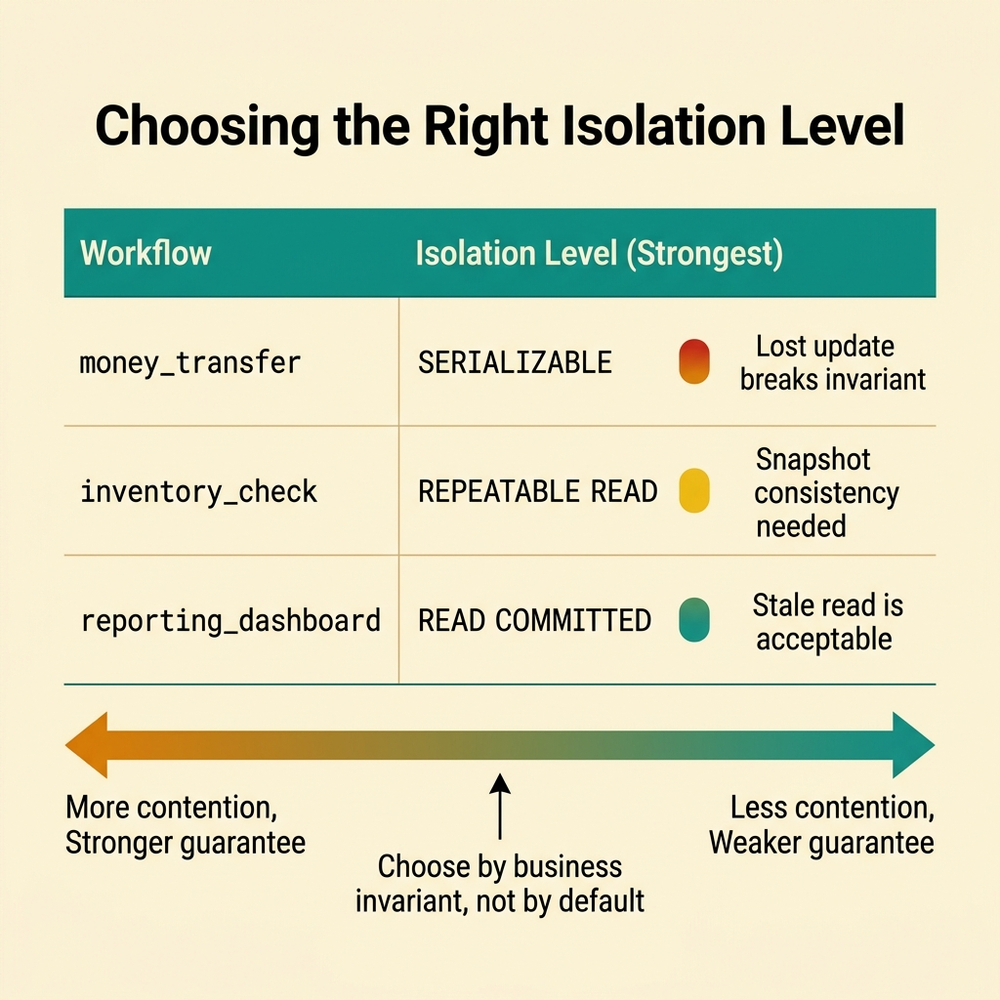
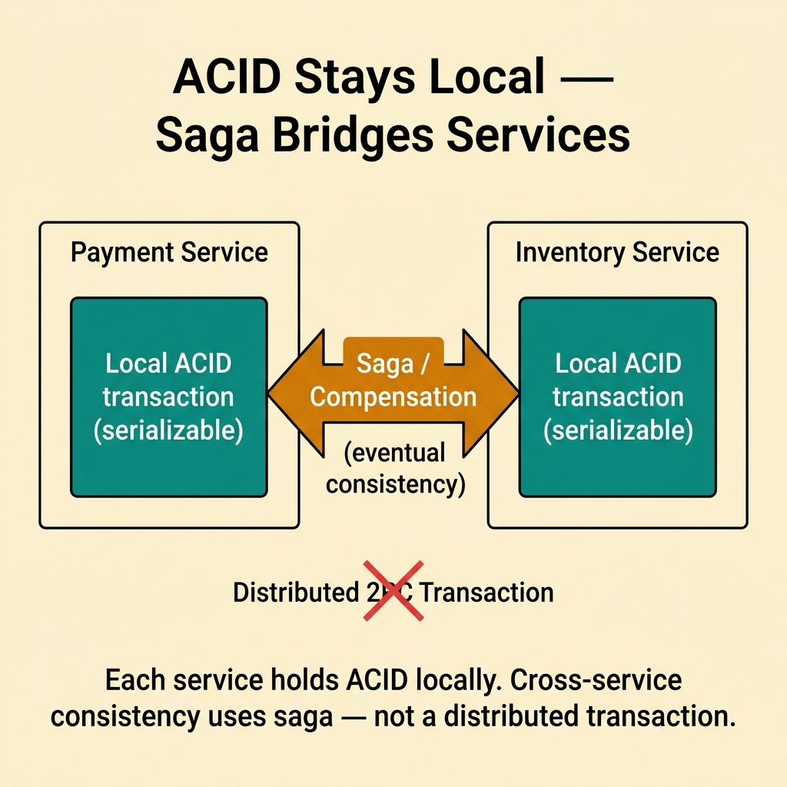
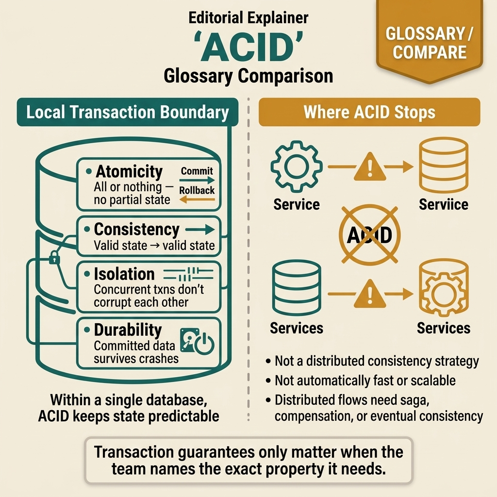

<!-- tags: glossary, reference, data-database, acid -->
# ACID

> Four properties — Atomicity, Consistency, Isolation, Durability — that make database transactions reliable and predictable.

| Aspect | Detail |
| --- | --- |
| **Concept** | Four properties — Atomicity, Consistency, Isolation, Durability — that make database transactions reliable and predictable. |
| **Audience** | Backend engineer, reviewer, platform engineer |
| **Primary style** | Glossary term |
| **Entry point** | Use when you need to speak precisely about transaction guarantees in a system with a strong source of truth |

📅 Created: 2026-03-30 · 🔄 Updated: 2026-04-17 · ⏱️ 8 min read

---

## 1. DEFINE

Picture a team saying the system needs "strong transactions," but without specifying whether they need atomicity, isolation, or durability the discussion quickly turns vague. That is the boundary of ACID.

**ACID** is four properties — atomicity, consistency, isolation, durability — that make database transactions reliable and predictable.

| Variant | Description |
| --- | --- |
| Atomicity | Either all steps in a transaction succeed together, or all are rolled back together. |
| Isolation-focused ACID | Emphasizes that transactions do not corrupt each other beyond the chosen isolation level. |
| Durability-focused ACID | Emphasizes that committed data must survive reasonable system failures. |

| Approach | Time | Space | When to choose |
| --- | --- | --- | --- |
| Strict ACID transaction | O(transaction work) | O(transaction state) | When critical data demands high correctness and a strong source of truth. |
| Relaxed transaction boundaries | O(transaction work) | O(1) | When you want to reduce contention while keeping clear semantics for a smaller scope. |
| Application-level compensation | O(transaction + compensation) | O(compensation state) | When you cannot or choose not to maintain ACID across a distributed flow. |

Core insight:

> ACID is not a marketing label for "good databases." It is shorthand for a specific set of guarantees about transaction behavior.

### 1.1 Invariants & Failure Modes

The common failure mode is claiming the system needs ACID without specifying which property actually matters. When that happens, the team easily over-designs or picks the wrong storage model.

---

## 2. CONTEXT

**Who uses it**: Backend engineer, reviewer, platform engineer

**When**: Use when you need to speak precisely about transaction guarantees in a system with a strong source of truth

**Purpose**: ACID is not a marketing label for "good databases." It is shorthand for a specific set of guarantees about transaction behavior.

**In the ecosystem**:
- Design discussions center on transaction correctness and failure semantics.
- Multiple operations must commit as a single logical unit.
- Rollback, isolation, and persistence boundaries need to be stated clearly.

Boundary to hold:
- ACID differs from BASE; ACID emphasizes stronger guarantees for transaction semantics.
- ACID does not mean every query is safe or fast.
- ACID does not solve data distribution in distributed systems on its own.

---

The four transaction properties are clear. But how much throughput does ACID cost, when should you relax it, and what does the ACID-vs-BASE trade-off look like?

## 3. EXAMPLES

ACID surfaces most clearly when a money transfer debits one account but the credit fails (Atomicity), when two transactions read the same row but produce different results (Isolation), or when the database crashes mid-write yet the data stays consistent (Durability). The examples below place the pattern into exactly those situations.

### Example 1: Basic — Define the transaction boundary explicitly

> **Goal**: Prevent multi-step writes from having vague rollback semantics.
> **Approach**: Define which units of work must commit together.
> **Example**: Order creation and inventory reservation should be reasoned about as a single transaction boundary.
> **Complexity**: Basic



*Figure: Both steps live inside one boundary — either both commit or both roll back. No partial state.*

```text
           ┌─────────────────────────────────────┐
           │        Transaction Boundary          │
           │                                      │
  Request ─┤  1. create_order ──────────┐         │
           │  2. reserve_inventory ─────┤         │
           │                            ▼         │
           │               ┌─── Success? ───┐    │
           │               │ Yes            │ No │
           │               ▼                ▼    │
           │            COMMIT          ROLLBACK  │
           └─────────────────────────────────────┘
```

*Figure: Both steps live inside one boundary — either both commit or both roll back.*

```yaml
transaction_boundary:
  unit_of_work:
    - create_order
    - reserve_inventory
  rollback_if_any_step_fails: true
```

**Why?** Without an explicit transaction boundary, the team cannot tell which steps must succeed atomically together.

**Conclusion**: Basic ACID usage starts with stating the transaction boundary clearly.

### Example 2: Intermediate — Choose the right isolation expectation

> **Goal**: Avoid picking isolation too strong or too weak based on gut feeling.
> **Approach**: Map business invariants to isolation needs.
> **Example**: Balance updates must prevent lost updates, but reporting queries do not need the same isolation level.
> **Complexity**: Intermediate



*Figure: Different workflows demand different isolation levels. Choose by business invariant, not by default.*

```text
  Workflow                Isolation Need        Why
  ─────────────────────   ─────────────────     ─────────────────────────
  money_transfer          SERIALIZABLE          Lost update breaks invariant
  reporting_dashboard     READ COMMITTED        Stale read is acceptable
  inventory_check         REPEATABLE READ       Snapshot consistency needed
```

*Figure: Different workflows demand different isolation levels — one size does not fit all.*

```yaml
isolation_needs:
  money_transfer: strong
  reporting_dashboard: relaxed_read_ok
```

**Why?** Isolation that is too strong increases contention. Isolation that is too weak can break business invariants. Choose the right level for the right workflow.

**Conclusion**: Intermediate ACID reasoning means choosing properties by invariant, not by slogan.

### Example 3: Advanced — Know when ACID should stop at local transactions

> **Goal**: Avoid forcing a distributed flow into a transaction model that does not fit.
> **Approach**: Keep strong ACID at the local source of truth; use compensation or eventual consistency at higher layers.
> **Example**: A checkout flow that crosses payment, inventory, and shipping services.
> **Complexity**: Advanced



*Figure: Each service holds ACID locally. Cross-service consistency uses saga or compensation — not a distributed transaction.*

```text
  ┌────────────────────┐    ┌─────────────────────┐
  │  Payment Service   │    │  Inventory Service   │
  │  ┌──────────────┐  │    │  ┌──────────────┐    │
  │  │ Local ACID   │  │    │  │ Local ACID   │    │
  │  │ transaction  │  │    │  │ transaction  │    │
  │  └──────────────┘  │    │  └──────────────┘    │
  └────────┬───────────┘    └────────┬────────────┘
           │                         │
           └────── Saga / Compensation ──────┘
                  (eventual consistency)
```

*Figure: Each service holds ACID locally. Cross-service consistency uses saga or compensation — not a distributed transaction.*

```yaml
distributed_flow_policy:
  local_db_transaction: acid
  cross_service_consistency: compensation_or_saga
```

**Why?** Large systems need to separate local correctness from distributed convergence. ACID remains valuable but should not be stretched beyond its natural boundary.

**Conclusion**: At the advanced level, ACID is strongest when used at the right scope.

---

## 4. COMPARE




*Figure: ACID placed at the right boundary — a local transaction guarantee, not a blanket label for "good database" or a solution for every distributed flow.*

ACID sounds like "every good database must have it," but this visual pulls the conversation to the right place: which property do you actually need, where does the transaction boundary sit, and why do local guarantees not automatically jump across service boundaries.

### Level 1


```text
transaction
  -> all steps succeed and commit
  -> or any failure triggers full rollback
```

*Figure: Level 1 shows the basic intuition of ACID — a transaction as a consistent logical unit.*

### Level 2


```text
Need atomic update plus durable commit?
  -> ACID language helps
Need cross-service eventual convergence?
  -> ACID alone is not enough
```

*Figure: Level 2 emphasizes that ACID is a transaction vocabulary, not a solution for every distributed data problem.*

### Easily confused or boundary-slipping

You have seen which data layer ACID should be used at. The mistakes below are common misuses that lead teams into lock, schema, or topology issues while still missing the real contract.

| # | Severity | Mistake | Consequence | Fix |
| --- | --- | --- | --- | --- |
| 1 | 🔴 Fatal | Saying the system needs ACID without specifying which property matters | Design overkill or wrong storage model | State clearly which atomicity, isolation, or durability is needed. |
| 2 | 🟡 Common | Treating ACID as a solution for distributed flows across multiple services | Infeasible transaction design | Keep ACID at the local boundary; use a different strategy for distribution. |
| 3 | 🟡 Common | Equating ACID with low performance | Misleading debate | Separate guarantee semantics from implementation cost. |
| 4 | 🔵 Minor | Skipping isolation level in the discussion | Concurrency bugs that are hard to explain | State isolation expectations explicitly. |

### Quick scan

| If you face | Action |
| --- | --- |
| Need to talk about local transaction guarantees | Use ACID vocabulary |
| Flow spans multiple services | Do not force ACID across every boundary |
| Unclear which property is needed | Separate atomicity, isolation, durability individually |

---

## 5. REF

| Resource | Type | Link | Note |
| --- | --- | --- | --- |
| PostgreSQL Docs | Official | https://www.postgresql.org/docs/ | Strong foundation for transaction, replication, locking, and query behavior. |
| Designing Data-Intensive Applications | Book | https://dataintensive.net/ | Excellent reference for consistency, replication, scaling, and data systems. |
| Supabase Postgres Guide | Reference | https://supabase.com/docs/guides/database | Practical supplement for PostgreSQL operations and schema practices. |

---

## 6. RECOMMEND

ACID solves the problem "data must be correct even if the system crashes mid-write." The next question: when is BASE acceptable, and how does sharding affect ACID?

| Expand to | When | Reason | File/Link |
| --- | --- | --- | --- |
| Previous concept | When you want to connect this term with the immediately preceding concept | Maintains continuity in the learning path | [README](./README.md) |
| Next concept | When you want to continue along the current conceptual layer | Keeps the learning thread consistent | [BASE](./02-base.md) |
| Topic hub | When you need to return to the larger taxonomy | Preserves full topic context | [Data & Database](./README.md) |

Back to the money transfer at the start — debit done, credit failed. Now you know: Atomicity guarantees both or nothing. But ACID has a cost: locks, WAL, fsync. Understand the cost to know when to trade off, not to abandon it.

**Links**: [← Previous](./README.md) · [→ Next](./02-base.md)
