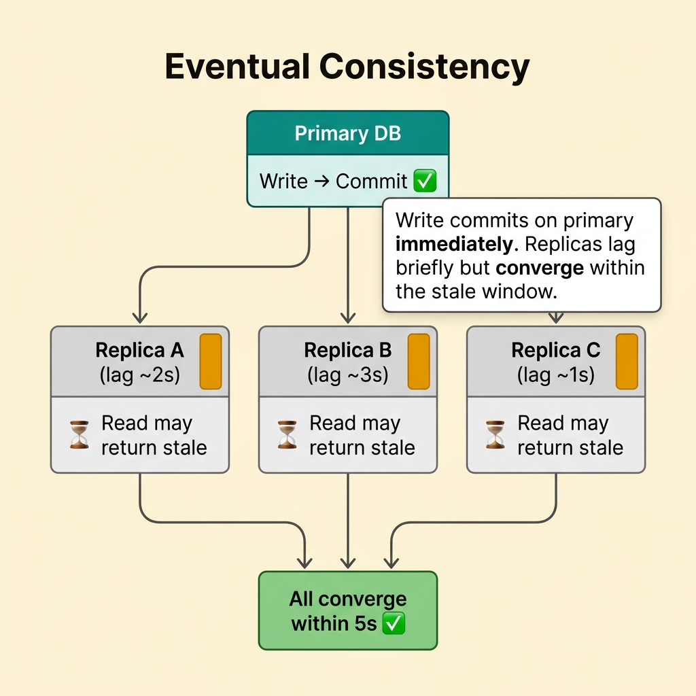
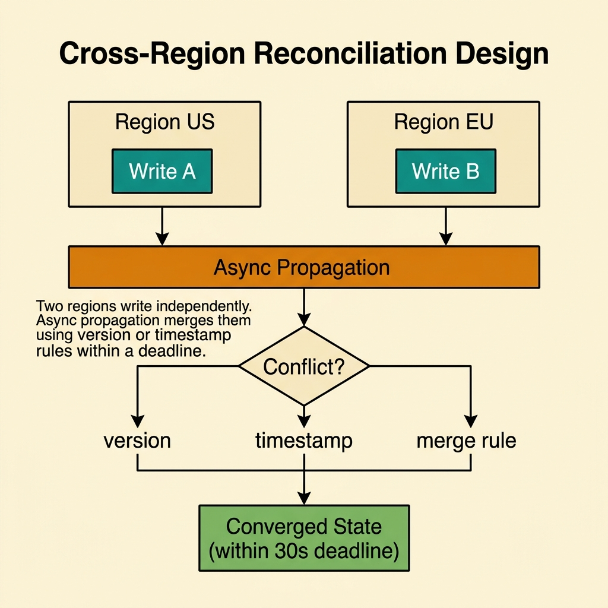
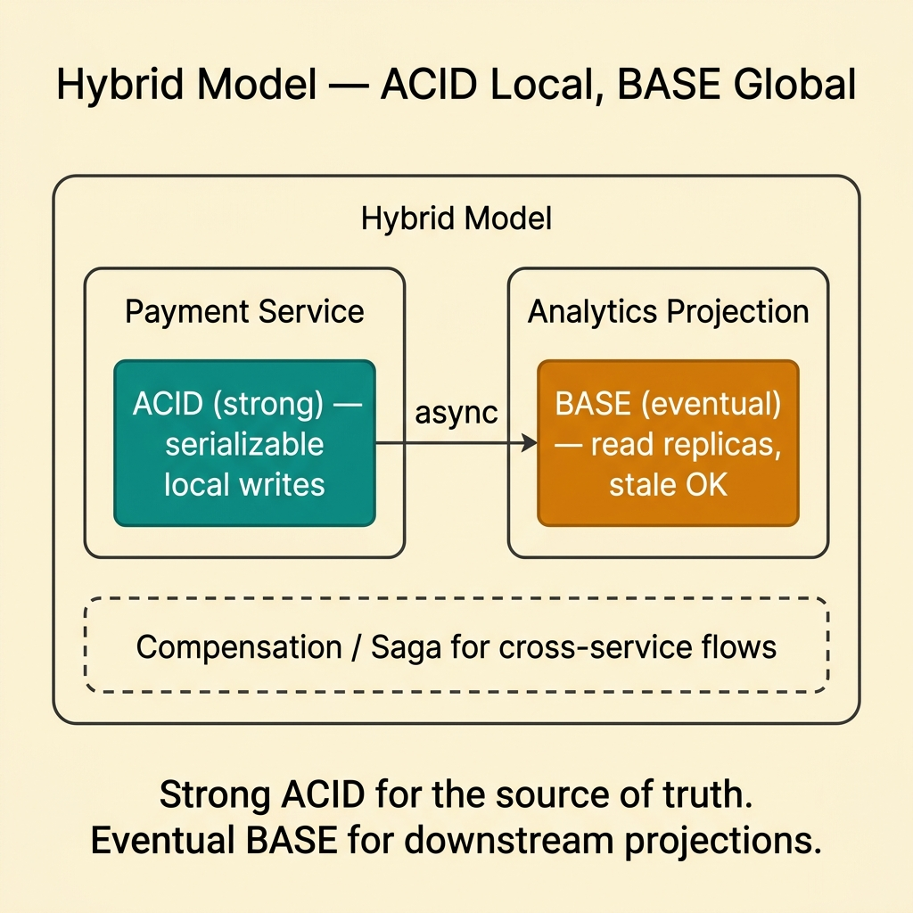
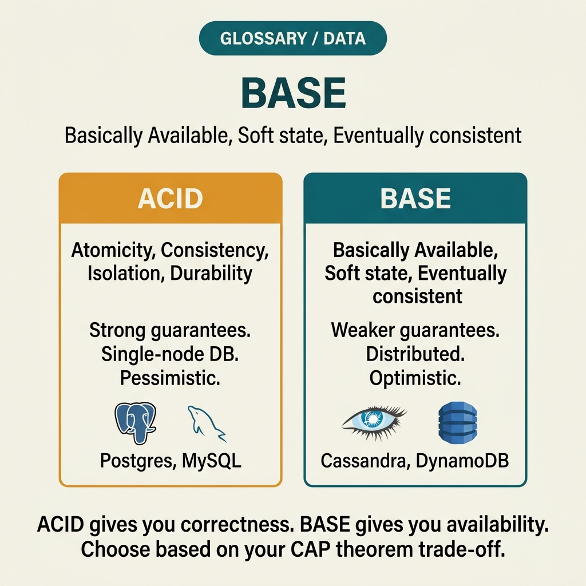

<!-- tags: glossary, reference, data-database, base -->
# BASE

> A description for systems that prioritize availability and eventual consistency over the strong transaction guarantees of ACID.

| Aspect | Detail |
| --- | --- |
| **Concept** | A description for systems that prioritize availability and eventual consistency over the strong transaction guarantees of ACID. |
| **Audience** | Backend engineer, reviewer, platform engineer |
| **Primary style** | Glossary term |
| **Entry point** | Use when the team needs to talk about distributed systems that accept eventual consistency in exchange for availability or scale |

📅 Created: 2026-03-30 · 🔄 Updated: 2026-04-17 · ⏱️ 8 min read

---

## 1. DEFINE

Picture a distributed system that must stay responsive through network partitions. Many teams cannot hold every ACID guarantee everywhere. They accept gradual convergence over time instead. That is the boundary of BASE.

**BASE** is a description for systems that prioritize availability and eventual consistency over the strong transaction guarantees of ACID.

| Variant | Description |
| --- | --- |
| Basically Available | The system prioritizes responding under more conditions. |
| Soft State | State may change over time even without new local input. |
| Eventually Consistent | Replicas converge after a period of time rather than immediately. |

| Approach | Time | Space | When to choose |
| --- | --- | --- | --- |
| Strong consistency first | O(sync coordination) | O(replication state) | When immediate correctness matters more than availability. |
| BASE-style eventual consistency | O(async propagation) | O(replication queues/state) | When availability and scale are prioritized over strong consistency everywhere. |
| Hybrid local-strong global-eventual | O(mixed) | O(mixed) | When you need strong local writes but gradual distributed convergence. |

Core insight:

> BASE does not mean abandoning correctness. It means correctness is defined through eventual convergence rather than immediate consistency at all times.

### 1.1 Invariants & Failure Modes

The common failure mode is using BASE as an excuse to skip formal reasoning about data correctness. Eventual consistency is only durable when convergence rules and reconciliation paths are defined clearly.

---

## 2. CONTEXT

**Who uses it**: Backend engineer, reviewer, platform engineer

**When**: Use when the team needs to talk about distributed systems that accept eventual consistency in exchange for availability or scale

**Purpose**: BASE does not mean abandoning correctness. It means correctness is defined through eventual convergence rather than immediate consistency at all times.

**In the ecosystem**:
- System is distributed across multiple nodes or regions.
- Availability under partition is a real concern.
- Business accepts data converging after a window of time.

Boundary to hold:
- BASE does not mean sloppy design.
- BASE differs from ACID in consistency model and failure trade-off.
- BASE does not mean every workflow is eventual; many systems use a hybrid approach.

---

Basically Available, Soft state, Eventually consistent — that is clear. But where exactly does BASE differ from ACID, when should you accept eventual consistency, and how do you handle stale data?

## 3. EXAMPLES

BASE surfaces most clearly when a social feed shows a stale post for a few seconds before updating, when a shopping cart in two regions temporarily diverges, or when a team picks Cassandra without understanding what eventual consistency means for the user. The examples below place the pattern into exactly those situations.

### Example 1: Basic — Name the consistency model you actually want

> **Goal**: Stop using "strong consistency" when the business actually accepts eventual convergence.
> **Approach**: State clearly which workflows may tolerate staleness or temporary divergence.
> **Example**: A user profile update may take a few seconds to sync across all read replicas.
> **Complexity**: Basic



*Figure: Write commits on primary immediately. Replicas lag briefly but converge within the stale window.*

```yaml
eventual_consistency_scope:
  entity: user_profile
  stale_window_allowed: 5s
  final_convergence_required: true
```

**Why?** Without stating the stale window or convergence expectation, the team will argue in the wrong direction between availability and consistency.

**Conclusion**: Basic BASE usage means stating the eventual consistency scope clearly.

### Example 2: Intermediate — Design reconciliation instead of just saying "eventual"

> **Goal**: Stop at the vague promise of "eventual consistency."
> **Approach**: Define the propagation path, conflict rules, and convergence triggers.
> **Example**: Inventory updates from multiple regions need to merge by ordering or version.
> **Complexity**: Intermediate



*Figure: Two regions write independently. Async propagation merges them using version or timestamp rules within a deadline.*

```yaml
reconciliation_policy:
  propagation: async
  conflict_rule: version_or_timestamp_based
  convergence_deadline: 30s
```

**Why?** Eventual consistency is only meaningful when "eventual" has a defined duration and reconciliation follows explicit rules.

**Conclusion**: Intermediate BASE reasoning always requires a reconciliation design.

### Example 3: Advanced — Use a hybrid model instead of binary ACID-vs-BASE

> **Goal**: Avoid the extreme debate of strong-consistency-everywhere or eventual-consistency-everywhere.
> **Approach**: Keep strong local invariants; let distributed replicas converge gradually.
> **Example**: Payment writes on the primary are strong; analytics projections are eventual.
> **Complexity**: Advanced



*Figure: Strong ACID for the source of truth. Eventual BASE for downstream projections. Hybrid keeps correctness where it matters.*

```yaml
hybrid_consistency:
  local_source_of_truth: strong
  downstream_projections: eventual
  compensation_needed: true
```

**Why?** Most real-world systems do not live entirely at one extreme. A hybrid model lets the team maintain correctness where it matters and scale where it fits.

**Conclusion**: At the advanced level, BASE delivers the most value when it sits inside a hybrid data architecture.

---

## 4. COMPARE




*Figure: Position of BASE among ACID, CAP theorem, and eventual consistency.*

BASE sounds like "weaker ACID." Not quite: BASE is a different philosophy — accepting temporary inconsistency in exchange for availability and partition tolerance. Not weaker, just a different trade-off.

### Level 1


```text
write happens
  -> replicas diverge briefly
  -> async propagation
  -> eventual convergence
```

*Figure: Level 1 shows the intuition of BASE — temporary divergence followed by gradual convergence.*

### Level 2


```text
Need high availability under partition?
  -> maybe accept stale reads temporarily
  -> but define reconciliation and invariants
```

*Figure: Level 2 emphasizes that BASE is a conditional trade-off, not a convenient shortcut.*

### Easily confused or boundary-slipping

You have seen which data layer BASE should be used at. The mistakes below are common misuses that lead teams into lock, schema, or topology issues while still missing the real contract.

| # | Severity | Mistake | Consequence | Fix |
| --- | --- | --- | --- | --- |
| 1 | 🔴 Fatal | Using BASE as an excuse to skip correctness reasoning | Data anomalies accumulate and become uncontrollable | Define convergence and invariants explicitly. |
| 2 | 🟡 Common | Treating BASE as the absolute opposite of every strong guarantee | Extreme architecture debate | Consider a hybrid model. |
| 3 | 🟡 Common | Saying eventual consistency without defining a stale window | Vague runbooks and expectations | Document timing and reconciliation explicitly. |
| 4 | 🔵 Minor | Not mapping which workflows are allowed to be eventual | Design lacks clear boundaries | Scope by entity or use case. |

### Quick scan

| If you face | Action |
| --- | --- |
| System needs high availability under partition | Consider the BASE trade-off |
| Unclear how long "eventual" means | Design a stale window and convergence deadline |
| ACID vs BASE is becoming a binary debate | Look at hybrid models |

---

## 5. REF

| Resource | Type | Link | Note |
| --- | --- | --- | --- |
| PostgreSQL Docs | Official | https://www.postgresql.org/docs/ | Strong foundation for transaction, replication, locking, and query behavior. |
| Designing Data-Intensive Applications | Book | https://dataintensive.net/ | Excellent reference for consistency, replication, scaling, and data systems. |
| Supabase Postgres Guide | Reference | https://supabase.com/docs/guides/database | Practical supplement for PostgreSQL operations and schema practices. |

---

## 6. RECOMMEND

BASE solves the problem "ACID is too expensive for scale when the use case accepts eventual consistency." The next question: how does sharding split data, and what does replication guarantee?

| Expand to | When | Reason | File/Link |
| --- | --- | --- | --- |
| Previous concept | When you want to connect this term with the immediately preceding concept | Maintains continuity in the learning path | [ACID](./01-acid.md) |
| Next concept | When you want to continue along the current conceptual layer | Keeps the learning thread consistent | [Sharding](./03-sharding.md) |
| Topic hub | When you need to return to the larger taxonomy | Preserves full topic context | [Data & Database](./README.md) |

Back to the social feed at the start — a stale post for a few seconds, then it updates. The user accepts it. Now you know: BASE is not lazy engineering. It is a conscious trade-off — availability over strict consistency, when the business allows it.

**Links**: [← Previous](./01-acid.md) · [→ Next](./03-sharding.md)
