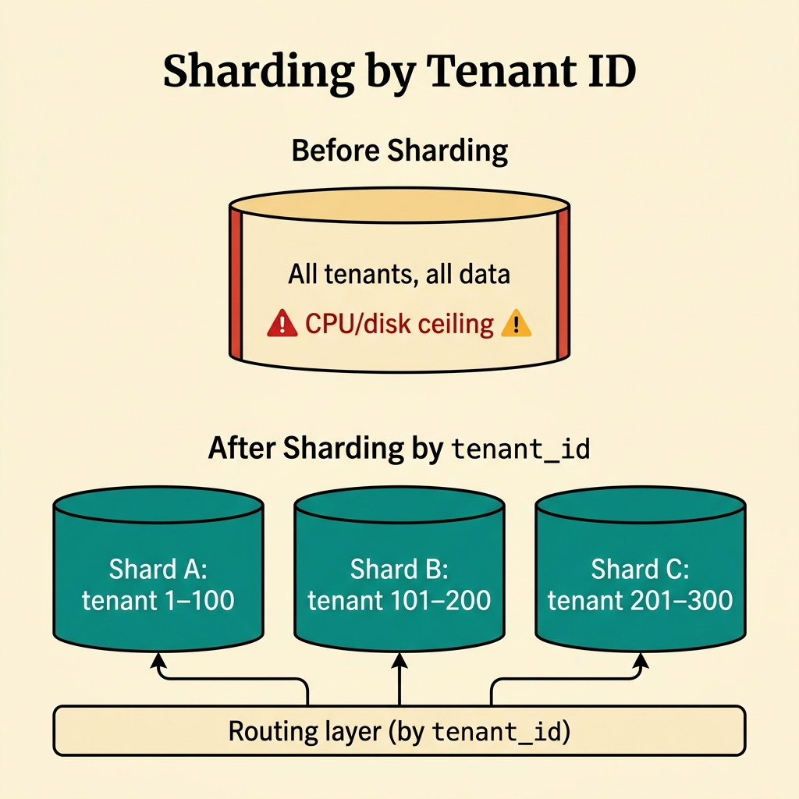
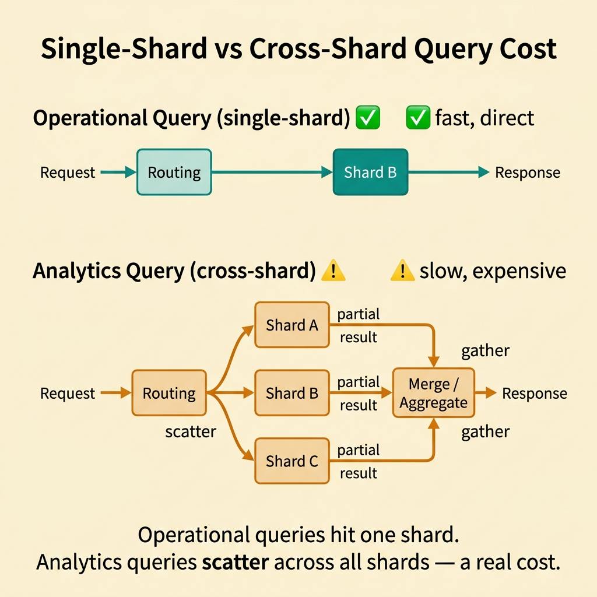
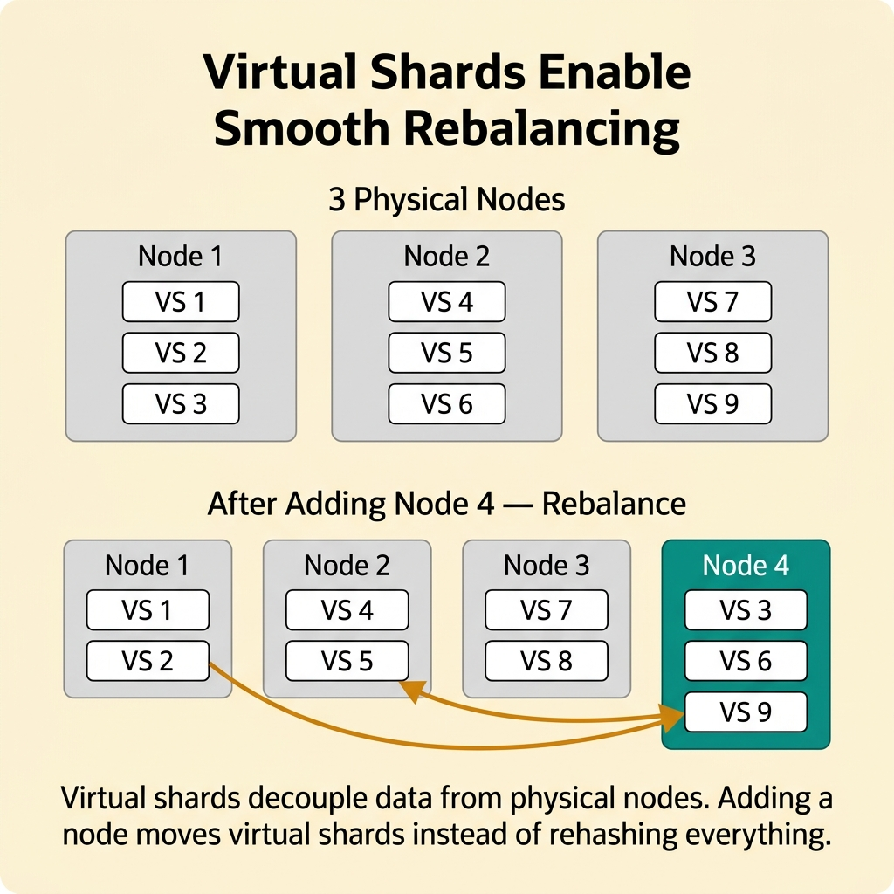
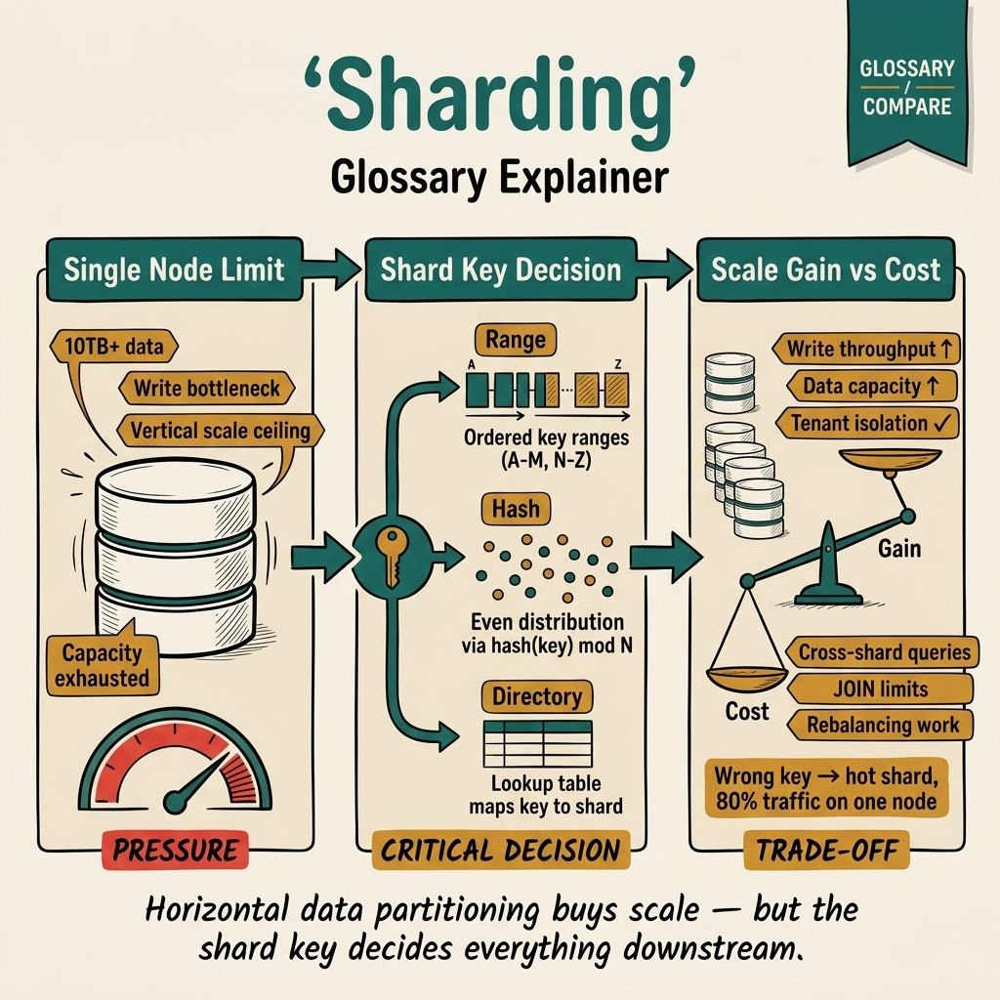

<!-- tags: glossary, reference, data-database, sharding -->
# Sharding

> A technique for splitting data horizontally across multiple nodes or database instances by shard key to scale reads and writes.

| Aspect | Detail |
| --- | --- |
| **Concept** | A technique for splitting data horizontally across multiple nodes or database instances by shard key to scale reads and writes. |
| **Audience** | Backend engineer, platform engineer, reviewer |
| **Primary style** | Glossary term |
| **Entry point** | Use when a single database can no longer handle growth in data volume or write throughput |

📅 Created: 2026-03-30 · 🔄 Updated: 2026-04-17 · ⏱️ 8 min read

---

## 1. DEFINE

Picture a database that is still correct logically but has started hitting the ceiling on data volume or write throughput. The question is no longer which index to add — it is whether the data needs to be split horizontally. That is the boundary of Sharding.

**Sharding** is a technique for splitting data horizontally across multiple nodes or database instances by shard key to scale reads and writes.

| Variant | Description |
| --- | --- |
| Range sharding | Splits data by value ranges of the shard key. |
| Hash sharding | Distributes data more evenly using a hash function on the key. |
| Directory or lookup sharding | Uses a mapping layer to determine which shard holds a given row. |

| Approach | Time | Space | When to choose |
| --- | --- | --- | --- |
| Single primary scale-up | O(1) node | O(1) | When data and throughput still fit within a single node's limits. |
| Horizontal sharding | O(shard routing) | O(number of shards) | When write volume or data size exceeds what one node can handle. |
| Hybrid sharding plus replication | O(shard + replica routing) | O(shards × replicas) | When you need to scale both writes and reads, or require HA on top. |

Core insight:

> Sharding is a scale and partitioning pattern. Its value lies in distributing load and data footprint, at the cost of routing, rebalancing, and cross-shard complexity.

### 1.1 Invariants & Failure Modes

The common failure mode is sharding too early with a poor shard key, adding complexity without removing the real bottleneck. A bad shard key can lock the system into long-term pain.

---

## 2. CONTEXT

**Who uses it**: Backend engineer, platform engineer, reviewer

**When**: Use when a single database can no longer handle growth in data volume or write throughput

**Purpose**: Sharding is a scale and partitioning pattern. Its value lies in distributing load and data footprint, at the cost of routing, rebalancing, and cross-shard complexity.

**In the ecosystem**:
- A single node can no longer handle write throughput or data size.
- Hot partitions or tenant growth are hitting the ceiling.
- Vertical scale-up is approaching its cost or technical limit.

Boundary to hold:
- Sharding differs from replication; sharding splits data, replication copies data.
- Sharding does not solve cross-shard joins or transactions automatically.
- Sharding is not the first step for every performance problem.

---

Splitting data across nodes is clear. But how do you choose a shard key, how do you handle cross-shard queries, and when do you resharding?

## 3. EXAMPLES

Sharding surfaces most clearly when a single database reaches 10 TB and queries slow down, when a bad shard key creates a hot shard carrying 80% of traffic, or when cross-shard JOINs become impossible and the team must redesign the schema. The examples below place the pattern into exactly those situations.

### Example 1: Basic — Choose shard key by real access pattern

> **Goal**: Avoid splitting data randomly and creating a new hotspot.
> **Approach**: Map the dominant query and write patterns to shard key candidates.
> **Example**: A multi-tenant system often considers tenant_id as the shard dimension.
> **Complexity**: Basic



*Figure: A single overloaded node becomes three shards. The routing layer directs each request by tenant_id.*

```yaml
shard_key_evaluation:
  candidate: tenant_id
  expected_distribution: high
  cross_shard_query_risk: medium
```

**Why?** The shard key determines distribution, hotspot risk, and the system's future rebalancing story.

**Conclusion**: Basic sharding design starts from the shard key, not from the number of shards.

### Example 2: Intermediate — Separate scale benefit from cross-shard cost

> **Goal**: Look beyond throughput gains and account for query complexity cost.
> **Approach**: List which queries will become cross-shard and how to mitigate them.
> **Example**: Analytics queries across all users become harder after sharding by tenant.
> **Complexity**: Intermediate



*Figure: Operational queries hit one shard. Analytics queries scatter across all shards and must gather results — a real cost.*

```yaml
cross_shard_analysis:
  global_queries:
    - monthly_revenue_report
  mitigation:
    - pre_aggregation
    - analytics_store
```

**Why?** Sharding optimizes the hot operational path but often degrades global queries. Both sides must be considered from the start.

**Conclusion**: Intermediate sharding reasoning always includes both scale gain and cross-shard pain.

### Example 3: Advanced — Prepare for rebalancing before growth forces it

> **Goal**: Avoid being locked into a rigid shard layout when data distribution changes.
> **Approach**: Design routing and resharding strategy from day one.
> **Example**: Hash sharding needs virtual shards to rebalance smoothly.
> **Complexity**: Advanced



*Figure: Virtual shards decouple data from physical nodes. Adding a node moves virtual shards instead of rehashing everything.*

```yaml
rebalancing_plan:
  virtual_shards: true
  routing_layer: required
  online_migration_capability: desired
```

**Why?** Sharding does not end on the first day data is split. Real growth changes distribution and forces the system to rebalance.

**Conclusion**: At the advanced level, sharding is durable only when rebalancing has been considered from the start.

---

## 4. COMPARE




*Figure: Sharding placed as a deliberate partitioning decision — it buys scale through shard-key quality, routing, and rebalance cost, not just by adding more nodes.*

Sharding sounds like partitioning, but this visual makes the boundary clearer: sharding is a scale decision with real topology cost, not a synonym for replication or a badge of technical maturity.

### Level 1


```text
full dataset
  -> split by shard key
  -> shard A / shard B / shard C
```

*Figure: Level 1 shows sharding as horizontal partitioning of the dataset.*

### Level 2


```text
Need more scale?
  -> if one node is still enough: avoid sharding
  -> if write/data volume exceeds one node: choose shard strategy and key carefully
```

*Figure: Level 2 emphasizes that sharding is a high-cost decision, not a default optimization.*

### Easily confused or boundary-slipping

You have seen which data layer Sharding should be used at. The mistakes below are common misuses that lead teams into lock, schema, or topology issues while still missing the real contract.

| # | Severity | Mistake | Consequence | Fix |
| --- | --- | --- | --- | --- |
| 1 | 🔴 Fatal | Sharding too early or with a bad shard key | Complexity increases but the real bottleneck remains | Prove scale pressure and evaluate the shard key carefully. |
| 2 | 🟡 Common | Confusing sharding with replication | Wrong direction for read/write scaling design | Separate partitioning from duplication clearly. |
| 3 | 🟡 Common | Ignoring cross-shard query cost | Global reporting and joins become painful | Design mitigation early. |
| 4 | 🔵 Minor | Not planning for rebalancing | Long-term scale gets locked in | Prepare routing and virtual shards. |

### Quick scan

| If you face | Action |
| --- | --- |
| A single node can no longer handle data or write volume | Consider sharding |
| Primarily need read scale and HA rather than write scale | Replication may fit better |
| Shard key is unclear | Do not shard yet |

---

## 5. REF

| Resource | Type | Link | Note |
| --- | --- | --- | --- |
| PostgreSQL Docs | Official | https://www.postgresql.org/docs/ | Strong foundation for transaction, replication, locking, and query behavior. |
| Designing Data-Intensive Applications | Book | https://dataintensive.net/ | Excellent reference for consistency, replication, scaling, and data systems. |
| Supabase Postgres Guide | Reference | https://supabase.com/docs/guides/database | Practical supplement for PostgreSQL operations and schema practices. |

---

## 6. RECOMMEND

Sharding solves the problem "a single database cannot scale anymore." The next question: how does replication handle read scale, and what does a migration strategy look like?

| Expand to | When | Reason | File/Link |
| --- | --- | --- | --- |
| Previous concept | When you want to connect this term with the immediately preceding concept | Maintains continuity in the learning path | [BASE](./02-base.md) |
| Next concept | When you want to continue along the current conceptual layer | Keeps the learning thread consistent | [Replication](./04-replication.md) |
| Topic hub | When you need to return to the larger taxonomy | Preserves full topic context | [Data & Database](./README.md) |

Back to the 10 TB database at the start — queries slowing down, single node hitting its limit. Now you know: the shard key determines everything. Choose right: even distribution, query locality. Choose wrong: hot shard, cross-shard hell. Measure first, shard second.

**Links**: [← Previous](./02-base.md) · [→ Next](./04-replication.md)
