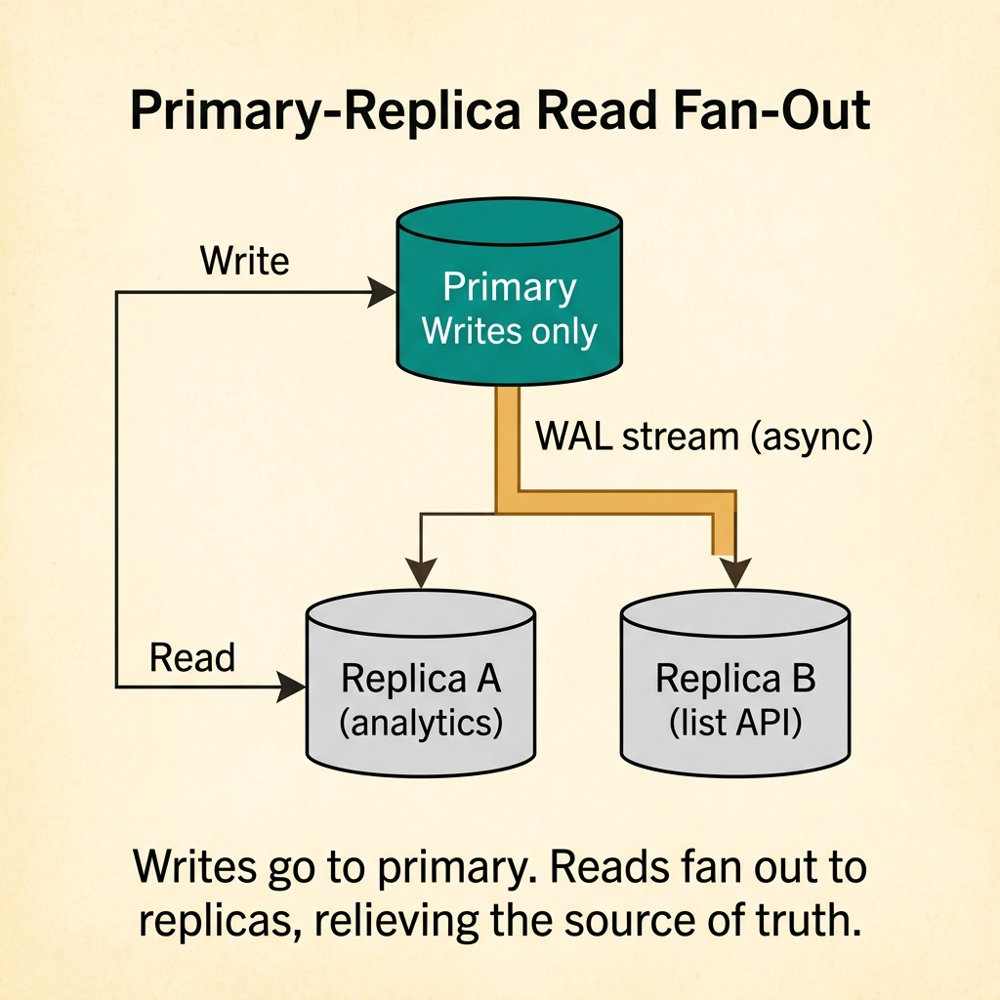
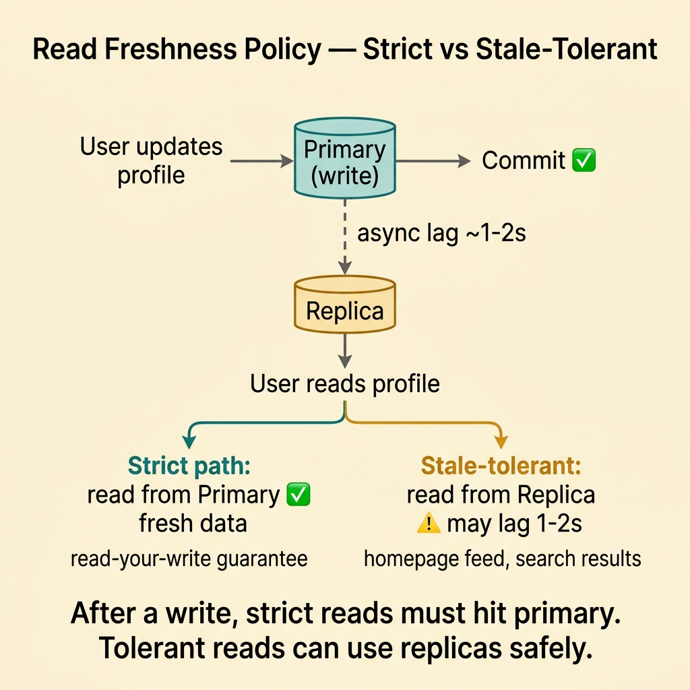
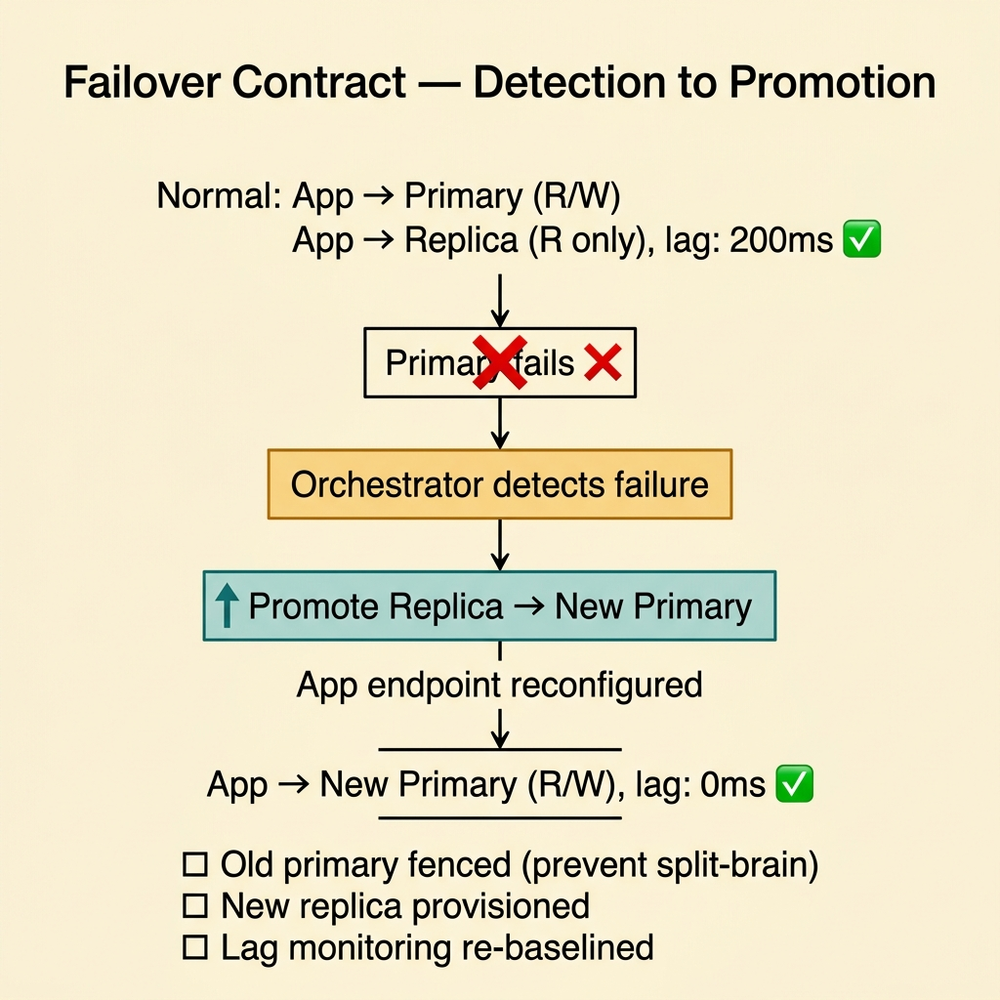
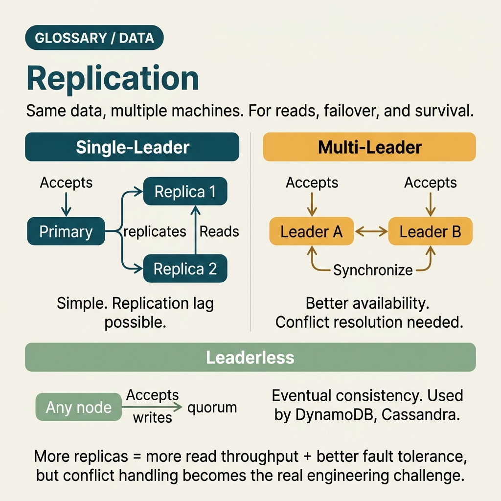

<!-- tags: glossary, reference, data-database, replication -->
# Replication

> The mechanism that copies data from one node or source of truth to other replicas to increase availability, read scale, or durability.

| Aspect | Detail |
| --- | --- |
| **Concept** | The mechanism that copies data from one node or source of truth to other replicas to increase availability, read scale, or durability. |
| **Audience** | Backend engineer, platform engineer, reviewer |
| **Primary style** | Glossary term |
| **Entry point** | Use when you need to talk about read scaling, failover, or duplicate data copies for durability |

📅 Created: 2026-03-30 · 🔄 Updated: 2026-04-17 · ⏱️ 8 min read

---

## 1. DEFINE

Picture a database that handles writes well but read traffic or availability requirements start climbing. When you need more copies of the same data instead of splitting data apart, that is the boundary of Replication.

**Replication** is the mechanism that copies data from one node or source of truth to other replicas to increase availability, read scale, or durability.

| Variant | Description |
| --- | --- |
| Primary-replica replication | One primary node accepts writes; replicas serve reads or stand by for failover. |
| Synchronous replication | Commit waits for replica acknowledgment for stronger guarantees. |
| Asynchronous replication | Writes are faster but replicas carry lag. |

| Approach | Time | Space | When to choose |
| --- | --- | --- | --- |
| Single node only | O(1) | O(1) | When load, HA, and durability do not yet require replicas. |
| Async replication | O(async propagation) | O(number of replicas) | When you want read scale or DR with lower write latency. |
| Sync or quorum replication | O(sync coordination) | O(number of replicas) | When you need stronger durability or failover semantics. |

Core insight:

> Replication copies data; it does not split data like sharding. Its value lies in availability, failover, and read fan-out, with the trade-off being lag or coordination cost.

### 1.1 Invariants & Failure Modes

The common failure mode is routing reads to replicas while forgetting about replica lag, leading to hard-to-explain read-after-write bugs. Replication always needs clear freshness semantics.

---

## 2. CONTEXT

**Who uses it**: Backend engineer, platform engineer, reviewer

**When**: Use when you need to talk about read scaling, failover, or duplicate data copies for durability

**Purpose**: Replication copies data; it does not split data like sharding. Its value lies in availability, failover, and read fan-out, with the trade-off being lag or coordination cost.

**In the ecosystem**:
- Read traffic significantly exceeds write traffic.
- Failover or disaster recovery is needed.
- Read load needs to be separated from the primary.

Boundary to hold:
- Replication differs from sharding; replication duplicates the same dataset, sharding partitions it.
- Replication does not solve unlimited write scalability on its own.
- Replica reads may be stale depending on the replication mode.

---

Copying data to multiple nodes is clear. But sync or async replication, how to handle replication lag, and automatic or manual failover?

## 3. EXAMPLES

Replication surfaces most clearly when the primary dies and a replica takes over within 30 seconds, when a user writes then reads immediately but sees stale data (replication lag), or when split-brain occurs and two nodes both think they are primary. The examples below place the pattern into exactly those situations.

### Example 1: Basic — Offload read traffic from primary

> **Goal**: Reduce read pressure on the source of truth.
> **Approach**: Route suitable reads to replicas.
> **Example**: Dashboard queries read from a replica instead of the primary.
> **Complexity**: Basic



*Figure: Writes go to primary. Reads fan out to replicas, taking pressure off the source of truth.*

```text
                    ┌─────────────┐
  Write ───────────►│   Primary   │
                    └──────┬──────┘
                           │ WAL stream (async)
                    ┌──────┴──────┐
                    ▼             ▼
              ┌──────────┐ ┌──────────┐
  Read ──────►│ Replica A│ │ Replica B│◄────── Read
              │(analytics)│ │(list API)│
              └──────────┘ └──────────┘
```

*Figure: Writes go to primary. Reads fan out to replicas, taking pressure off the source of truth.*

```yaml
read_routing:
  primary: writes_and_strict_reads
  replicas:
    - analytics_reads
    - non_critical_list_reads
```

**Why?** Replication delivers its first value through read fan-out and HA, not write scale.

**Conclusion**: Basic replication usage is offloading reads from primary when semantics allow it.

### Example 2: Intermediate — State freshness expectations for replica reads

> **Goal**: Prevent the app from accidentally demanding read-your-write from a lagging replica.
> **Approach**: Classify read paths by their sensitivity to staleness.
> **Example**: A profile page after an update should read from primary or a sticky path; a homepage feed can read from a replica.
> **Complexity**: Intermediate



*Figure: After a write, strict reads must hit primary to avoid stale data. Tolerant reads can use replicas.*

```text
  User updates profile ──► Primary (write) ──► Commit ✅
                                │
                   async lag ~1-2s
                                │
                                ▼
  User reads profile ──► ?
    │
    ├── Strict path: read from Primary     ✅ fresh data
    │    (read-your-write guarantee)
    │
    └── Stale-tolerant: read from Replica  ⚠️ may lag 1-2s
         (homepage feed, search results)
```

*Figure: After a write, strict reads must hit primary to avoid stale data. Tolerant reads can use replicas.*

```yaml
freshness_policy:
  strict_reads: primary_only
  stale_tolerant_reads: replica_ok
  max_replica_lag_allowed: 2s
```

**Why?** Replication easily causes subtle bugs if the app treats every read the same way. A clear freshness policy prevents surprises after writes.

**Conclusion**: Intermediate replication reasoning must always state freshness semantics alongside read routing.

### Example 3: Advanced — Standardize failover contract and lag observability

> **Goal**: Ensure replicas are usable during incidents, not just decorations on the architecture diagram.
> **Approach**: Measure lag, define failover triggers, and rehearse switchovers.
> **Example**: A replica gets promoted when the primary dies, but the app must know how read/write endpoints change.
> **Complexity**: Advanced



*Figure: Failover is not magic — it requires detection, promotion, endpoint reconfiguration, and fencing the old primary.*

```text
  Normal operation:
  App ──► Primary (R/W)
  App ──► Replica (R only)     lag metric: 200ms ✅

  Primary fails:
  App ──► Primary ✗ (down)
           │
           ▼
  Orchestrator detects failure
           │
           ▼
  Promote Replica → New Primary
           │
           ▼
  App endpoint reconfigured     ← must be documented
  App ──► New Primary (R/W)     lag metric: 0ms ✅

  Post-failover checklist:
    □ Old primary fenced (prevent split-brain)
    □ New replica provisioned
    □ Lag monitoring re-baselined
```

*Figure: Failover is not magic — it requires detection, promotion, endpoint reconfiguration, and fencing the old primary.*

```yaml
failover_contract:
  replica_lag_metric: required
  promote_trigger: primary_unavailable
  app_reconfiguration: documented
```

**Why?** Replication only delivers real availability when the failover contract is clear and the replica is healthy enough to be trusted.

**Conclusion**: At the advanced level, replication is a runtime contract about freshness and failover, not just having extra data copies.

---

## 4. COMPARE




*Figure: Position of replication among sharding, failover, and consensus protocols.*

Replication sounds like backup. It is not: backup is a point-in-time snapshot; replication is a continuous copy for HA and read scale. Backup is for restore; replication is for failover and read distribution.

### Level 1


```text
primary writes
  -> replicate changes
  -> replica A
  -> replica B
```

*Figure: Level 1 shows replication as data duplication from the source of truth to copies.*

### Level 2


```text
Need read scale or HA?
  -> replication helps
Need write scale beyond one primary?
  -> replication alone is not enough
```

*Figure: Level 2 emphasizes that replication solves a different layer of problems than sharding.*

### Easily confused or boundary-slipping

You have seen which data layer Replication should be used at. The mistakes below are common misuses that lead teams into lock, schema, or topology issues while still missing the real contract.

| # | Severity | Mistake | Consequence | Fix |
| --- | --- | --- | --- | --- |
| 1 | 🔴 Fatal | Using replicas for every read while forgetting about lag | Hard-to-debug stale read bugs | Set a clear freshness policy. |
| 2 | 🟡 Common | Confusing replication with a write scaling strategy | Wrong system design expectations | Separate read scale, HA, and write scale clearly. |
| 3 | 🟡 Common | Having replicas but never rehearsing failover | Availability exists only on slides | Document and rehearse the failover contract. |
| 4 | 🔵 Minor | Not measuring replica lag | No way to know if the replica is trustworthy | Emit lag metrics and set alerts. |

### Quick scan

| If you face | Action |
| --- | --- |
| Need read scale or HA | Consider replication |
| Need horizontal write scale | Replication alone is not enough |
| Replica reads are causing inconsistency surprises | Redesign the freshness policy |

---

## 5. REF

| Resource | Type | Link | Note |
| --- | --- | --- | --- |
| PostgreSQL Docs | Official | https://www.postgresql.org/docs/ | Strong foundation for transaction, replication, locking, and query behavior. |
| Designing Data-Intensive Applications | Book | https://dataintensive.net/ | Excellent reference for consistency, replication, scaling, and data systems. |
| Supabase Postgres Guide | Reference | https://supabase.com/docs/guides/database | Practical supplement for PostgreSQL operations and schema practices. |

---

## 6. RECOMMEND

Replication solves the problem "if the primary dies, which services still run." The next question: how do schema change migrations work, and what does the locking strategy look like?

| Expand to | When | Reason | File/Link |
| --- | --- | --- | --- |
| Previous concept | When you want to connect this term with the immediately preceding concept | Maintains continuity in the learning path | [Sharding](./03-sharding.md) |
| Next concept | When you want to continue along the current conceptual layer | Keeps the learning thread consistent | [Database Migration](./05-database-migration.md) |
| Topic hub | When you need to return to the larger taxonomy | Preserves full topic context | [Data & Database](./README.md) |

Back to the dead primary at the start — a replica takes over within 30 seconds. Now you know: sync replication means zero data loss but higher latency. Async means fast writes but lag exists. Choose by RPO/RTO, not by default.

**Links**: [← Previous](./03-sharding.md) · [→ Next](./05-database-migration.md)
