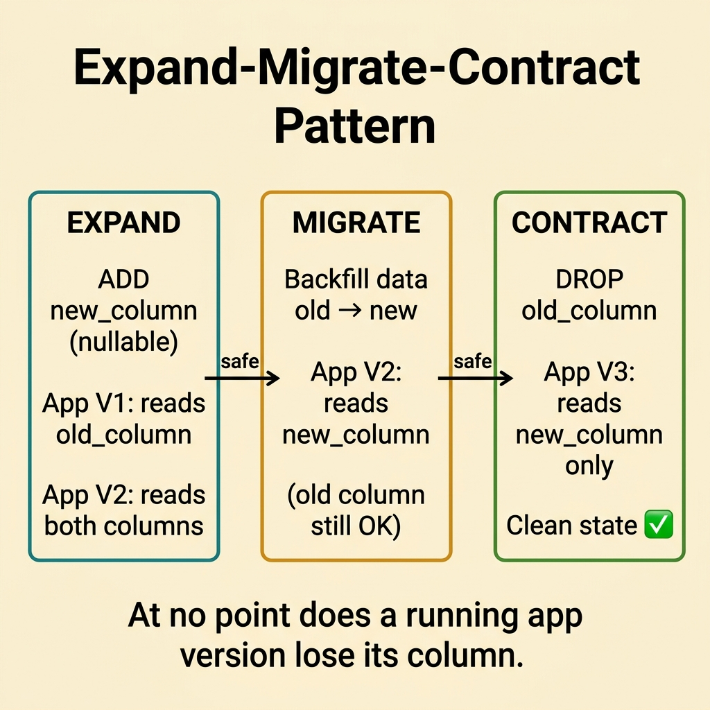
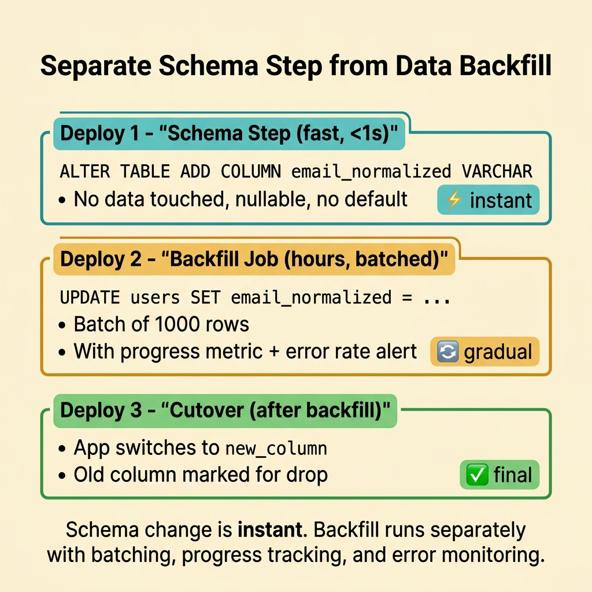
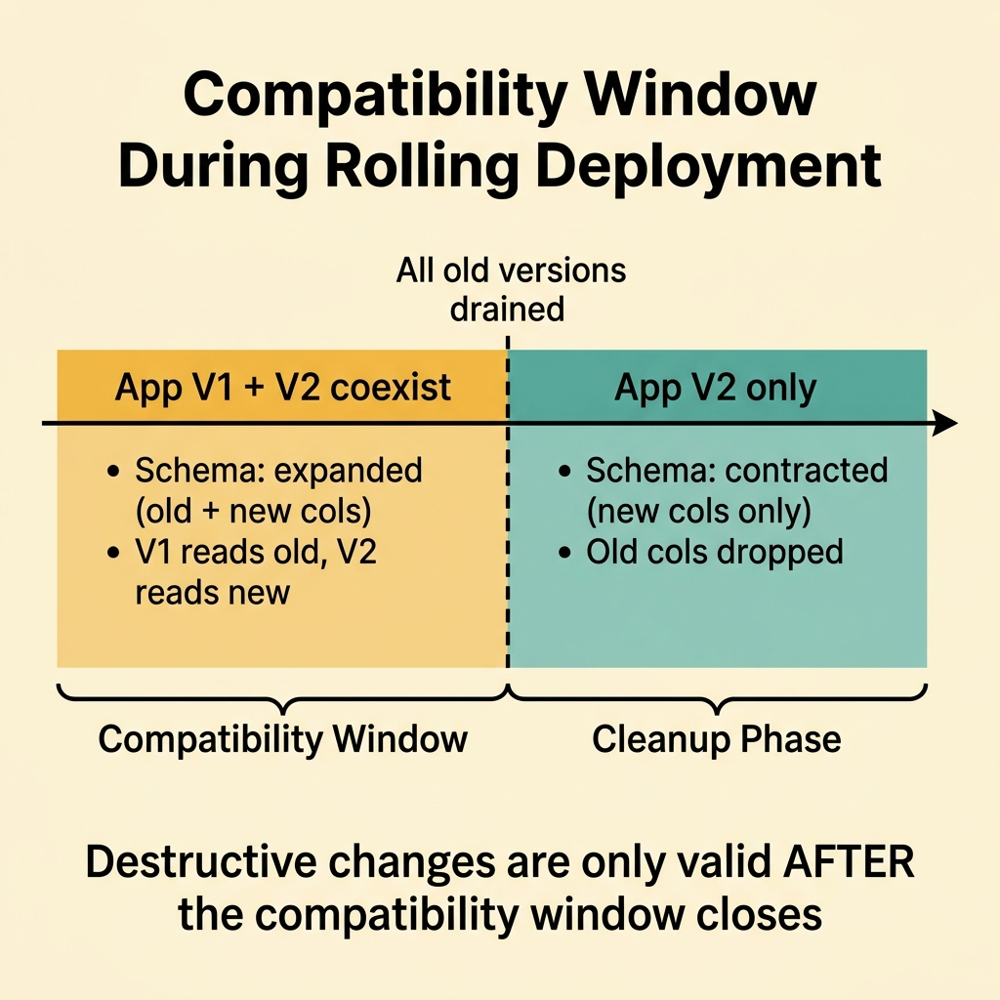
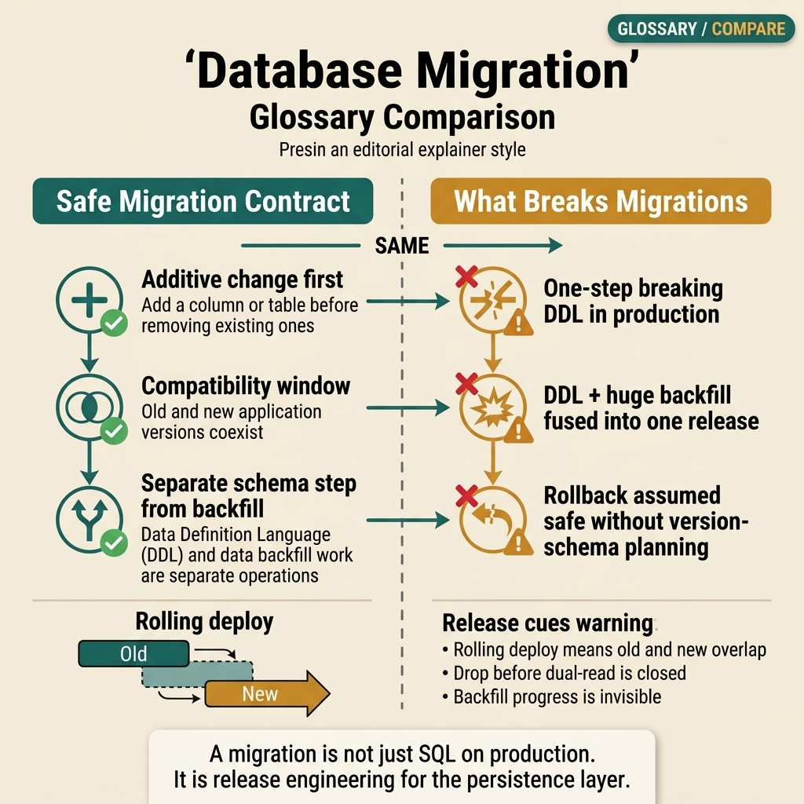

<!-- tags: glossary, reference, data-database, database-migration -->
# Database Migration

> The controlled process of changing schema or data so that the application and database evolve safely over time.

| Aspect | Detail |
| --- | --- |
| **Concept** | The controlled process of changing schema or data so that the application and database evolve safely over time. |
| **Audience** | Backend engineer, reviewer, platform engineer |
| **Primary style** | Glossary term |
| **Entry point** | Use when schema or data shape must change while keeping production running safely |

📅 Created: 2026-03-30 · 🔄 Updated: 2026-04-17 · ⏱️ 8 min read

---

## 1. DEFINE

Picture a codebase that can be deployed quickly, but a wrong schema change can lock the entire application or make rollback painful. When you need to name the process of changing schema and data safely, that is the boundary of Database Migration.

**Database Migration** is the controlled process of changing schema or data so that the application and database evolve safely over time.

| Variant | Description |
| --- | --- |
| Schema migration | Adding, altering, or dropping columns, tables, indexes, or constraints. |
| Data migration | Backfilling or transforming existing data. |
| Expand-migrate-contract | A pattern for making schema changes safely across multiple stages. |

| Approach | Time | Space | When to choose |
| --- | --- | --- | --- |
| Direct breaking change | O(1) deploy step | O(1) | Only suitable when downtime or blast radius is acceptable. |
| Backward-compatible staged migration | O(several release steps) | O(temp duplicated structures) | When the app must keep running continuously in production. |
| Online backfill plus cutover | O(backfill duration) | O(backfill state) | When data volume is large and data must be transformed safely. |

Core insight:

> Migration is not just a SQL statement. It is an evolution contract between code, schema, and data over time.

### 1.1 Invariants & Failure Modes

The common failure mode is bundling a breaking schema change into a single deploy and hoping nothing goes wrong. For a live system, safe migration usually needs multiple steps and a clear compatibility window.

---

## 2. CONTEXT

**Who uses it**: Backend engineer, reviewer, platform engineer

**When**: Use when schema or data shape must change while keeping production running safely

**Purpose**: Migration is not just a SQL statement. It is an evolution contract between code, schema, and data over time.

**In the ecosystem**:
- Schema must change while the service is still live.
- Old data needs to be backfilled to a new shape.
- Rollback safety depends on migration ordering.

Boundary to hold:
- Migration differs from a code hotfix; it directly affects the persistence layer.
- Migration differs from an app deploy, though the two must be coordinated tightly.
- Data migration differs from schema migration, even though they often ship together.

---

Versioned schema changes are clear. But how do you achieve zero-downtime migration, how do you roll back a migration, and how does data migration differ from schema migration?

## 3. EXAMPLES

Database migration surfaces most clearly when an ALTER TABLE locks a table for 10 minutes and causes service downtime, when a migration up succeeds but down does not work, or when renaming a column breaks three services still querying the old name. The examples below place the pattern into exactly those situations.

### Example 1: Basic — Break schema changes into safe steps

> **Goal**: Avoid breaking the old or new app version the moment the schema changes.
> **Approach**: Prioritize additive changes first, destructive changes last.
> **Example**: Add a new column first, dual-write for a while, then drop the old column.
> **Complexity**: Basic



*Figure: At no point does a running app version lose its column. Each phase keeps both old and new code safe.*

```text
  Phase 1 — Expand           Phase 2 — Migrate         Phase 3 — Contract
  ┌─────────────────┐        ┌─────────────────┐       ┌─────────────────┐
  │ ADD new_column   │        │ Backfill data    │       │ DROP old_column  │
  │ (nullable)       │        │ old → new        │       │ (after all apps  │
  │                  │        │                  │       │  use new_column) │
  │ App V1: reads    │        │ App V2: reads    │       │                  │
  │   old_column     │        │   new_column     │       │ App V3: reads    │
  │ App V2: reads    │        │   (old still OK) │       │   new_column     │
  │   both columns   │        │                  │       │   only           │
  └─────────────────┘        └─────────────────┘       └─────────────────┘
```

*Figure: Expand-migrate-contract in three phases. At no point does a running app version lose its column.*

```yaml
expand_contract_plan:
  step_1: add_new_column
  step_2: dual_write_or_read_compat
  step_3: backfill
  step_4: drop_old_column
```

**Why?** A single breaking change makes rollback hard and prevents multiple app versions from running side by side.

**Conclusion**: Basic migration safety starts with additive-first thinking.

### Example 2: Intermediate — Separate schema migration from data backfill

> **Goal**: Prevent the migration from holding locks too long or blocking deploys while a large backfill runs.
> **Approach**: Apply the schema change first; run the backfill separately with observability.
> **Example**: Backfill `email_normalized` for tens of millions of rows after the column already exists.
> **Complexity**: Intermediate



*Figure: Schema change is instant. Backfill runs separately with batching and error monitoring.*

```text
  Deploy 1: Schema step (fast, <1s)
  ┌──────────────────────────────┐
  │ ALTER TABLE ADD COLUMN       │  ← no data touched
  │ email_normalized VARCHAR     │  ← nullable, no default
  └──────────────────────────────┘

  Deploy 2: Backfill job (hours, batched)
  ┌──────────────────────────────┐
  │ UPDATE users SET             │
  │   email_normalized = ...     │  ← batch of 1000 rows
  │ WHERE email_normalized IS    │  ← with progress metric
  │   NULL LIMIT 1000            │  ← and error rate alert
  └──────────────────────────────┘

  Deploy 3: Cutover (after backfill complete)
  ┌──────────────────────────────┐
  │ App switches to new_column   │
  │ Old column marked for drop   │
  └──────────────────────────────┘
```

*Figure: Schema change is instant. Backfill runs separately with batching, progress tracking, and error monitoring.*

```yaml
migration_split:
  schema_step: add_column_nullable
  data_step: async_backfill_job
  cutover_after: backfill_complete
```

**Why?** Schema and data migrations have different risk profiles. Separating them makes rollout and recovery easier to control.

**Conclusion**: Intermediate migration design should separate DDL and backfill lifecycles.

### Example 3: Advanced — Treat migration as the release compatibility contract

> **Goal**: Ensure the app, migration, and rollback can coordinate in production.
> **Approach**: Define which app version can read which schema, and when destructive changes become valid.
> **Example**: Two app versions running during a rolling deployment must both read the temporary schema.
> **Complexity**: Advanced



*Figure: Destructive changes are only valid after all old app versions have drained.*

```text
  Timeline during rolling deployment:
  ───────────────────────────────────────────────────►
  │                                                  │
  │  App V1 + V2 coexist        App V2 only          │
  │  ┌─────────────────┐       ┌──────────────────┐  │
  │  │ Schema: expanded │       │ Schema: contract │  │
  │  │ old + new cols   │       │ new cols only    │  │
  │  │ V1 reads old     │       │ V2 reads new     │  │
  │  │ V2 reads new     │       │ old cols dropped │  │
  │  └─────────────────┘       └──────────────────┘  │
  │                                                  │
  │  ◄── compatibility window ──►                    │
```

*Figure: Destructive changes are only valid after all old app versions have drained. The compatibility window defines when both versions coexist.*

```yaml
compatibility_window:
  app_versions_parallel: true
  destructive_change_allowed_after: all_old_versions_drained
```

**Why?** Migration is far more durable when treated as a release contract rather than an isolated DBA task.

**Conclusion**: At the advanced level, migration is a part of release engineering for the data layer.

---

## 4. COMPARE




*Figure: Migration placed as a compatibility contract between code, schema, and data — additive first, separate backfill from heavy DDL, and allow destructive changes only after the compatibility window closes.*

Migration sounds like "running a SQL script," but this visual shifts the focus to the release contract: schema and data must evolve at a pace where coexisting app versions can still read correctly, not just a SQL statement run in the right place.

### Level 1


```text
expand schema
  -> deploy compatible app
  -> backfill data
  -> cut over
  -> contract old schema
```

*Figure: Level 1 shows that a safe migration pattern usually goes through multiple steps instead of a single jump.*

### Level 2


```text
Need schema change in prod?
  -> prefer backward-compatible steps
  -> keep old and new paths coexisting temporarily
```

*Figure: Level 2 emphasizes that safe migration is a compatibility problem over time.*

### Easily confused or boundary-slipping

You have seen which data layer Database Migration should be used at. The mistakes below are common misuses that lead teams into lock, schema, or topology issues while still missing the real contract.

| # | Severity | Mistake | Consequence | Fix |
| --- | --- | --- | --- | --- |
| 1 | 🔴 Fatal | Shipping a breaking schema change in a single step | Downtime or extremely painful rollback | Use expand-migrate-contract. |
| 2 | 🟡 Common | Mixing DDL with heavy backfill in the same release step | Long locks or uncontrollable slow deploys | Separate schema and data lifecycles. |
| 3 | 🟡 Common | Not defining a compatibility window | Old and new app versions collide | Document the version-schema contract. |
| 4 | 🔵 Minor | Skipping dry-run or observability for backfill | Backfill fails and is discovered too late | Measure progress and error rate of the backfill. |

### Quick scan

| If you face | Action |
| --- | --- |
| Need to change schema while keeping the service live | Use staged migration |
| Backfill is very large | Separate the schema step from the data step |
| Rollback safety is unclear | Review the compatibility window |

---

## 5. REF

| Resource | Type | Link | Note |
| --- | --- | --- | --- |
| PostgreSQL Docs | Official | https://www.postgresql.org/docs/ | Strong foundation for transaction, replication, locking, and query behavior. |
| Designing Data-Intensive Applications | Book | https://dataintensive.net/ | Excellent reference for consistency, replication, scaling, and data systems. |
| Supabase Postgres Guide | Reference | https://supabase.com/docs/guides/database | Practical supplement for PostgreSQL operations and schema practices. |

---

## 6. RECOMMEND

Database migration solves the problem "schema change without downtime." The next question: how does concurrent access locking work, and what is the difference between optimistic and pessimistic?

| Expand to | When | Reason | File/Link |
| --- | --- | --- | --- |
| Previous concept | When you want to connect this term with the immediately preceding concept | Maintains continuity in the learning path | [Replication](./04-replication.md) |
| Next concept | When you want to continue along the current conceptual layer | Keeps the learning thread consistent | [Optimistic Locking](./06-optimistic-locking.md) |
| Topic hub | When you need to return to the larger taxonomy | Preserves full topic context | [Data & Database](./README.md) |

Back to the ALTER TABLE at the start — locking the table for 10 minutes, service down. Now you know: expand-and-contract — add the new column, backfill, switch code, drop the old column. Zero downtime, zero data loss.

**Links**: [← Previous](./04-replication.md) · [→ Next](./06-optimistic-locking.md)
