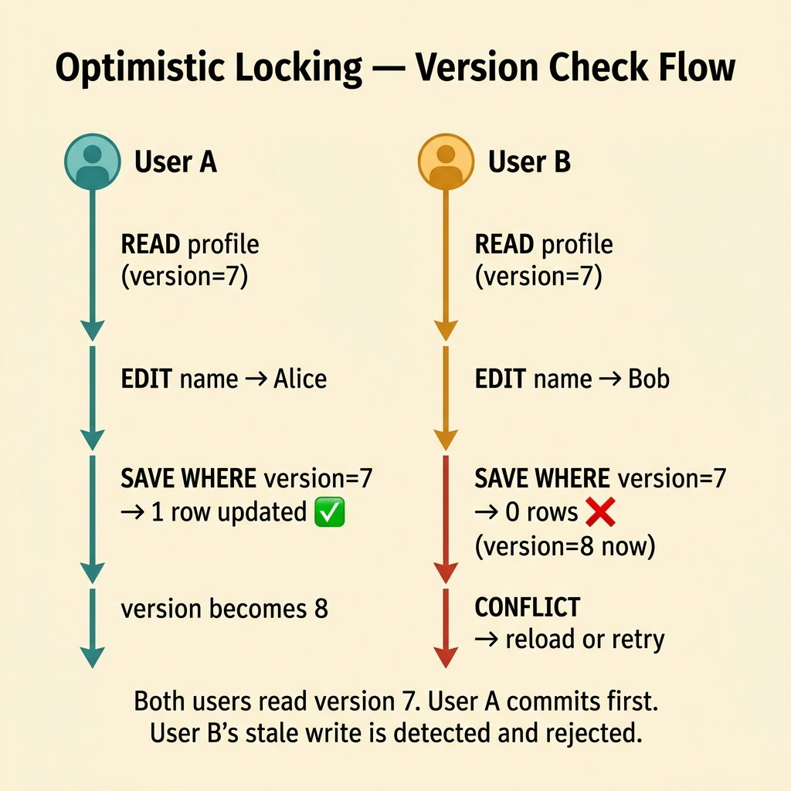
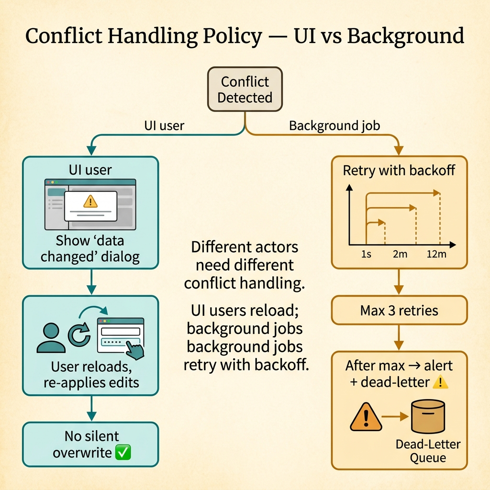
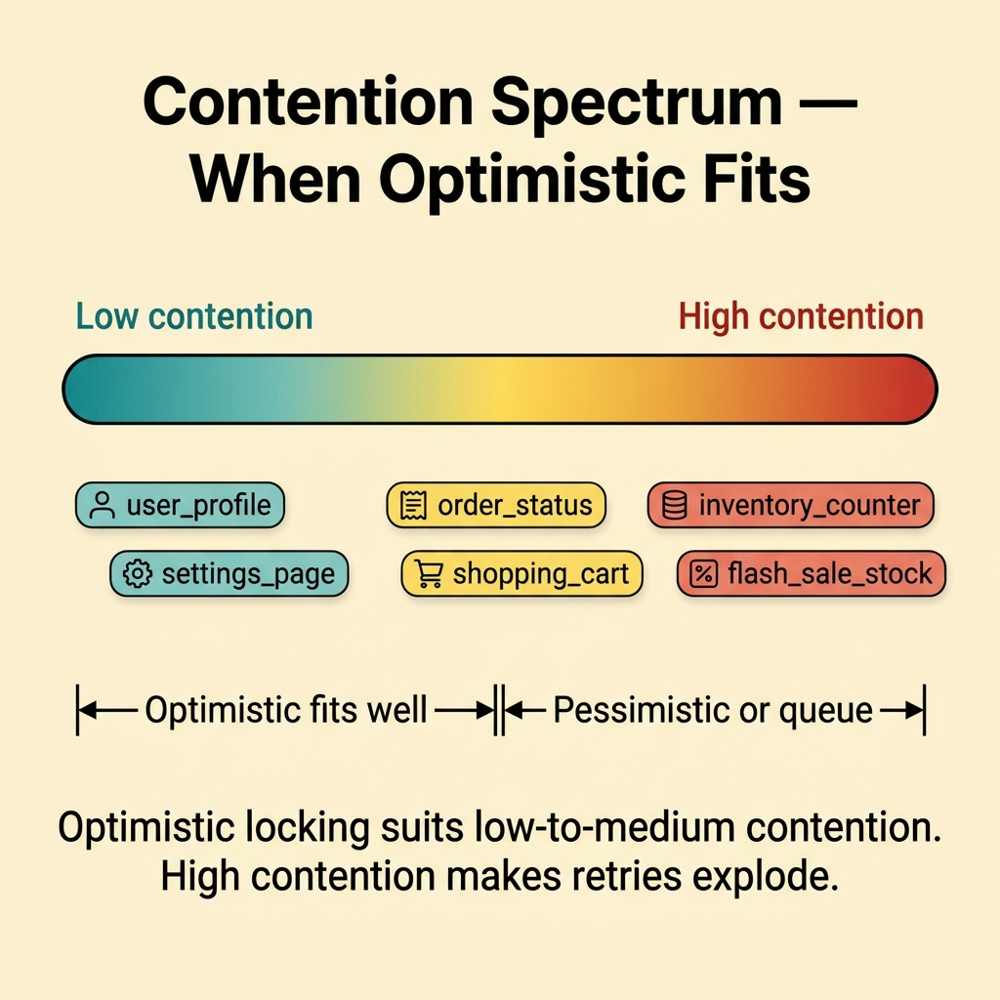
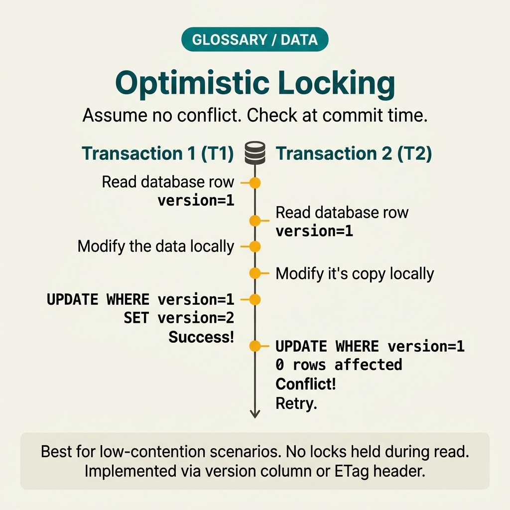

<!-- tags: glossary, reference, data-database, optimistic-locking -->
# Optimistic Locking

> A mechanism for controlling concurrent updates by allowing multiple actors to attempt writes, then detecting conflicts at commit or update time.

| Aspect | Detail |
| --- | --- |
| **Concept** | A mechanism for controlling concurrent updates by allowing multiple actors to attempt writes, then detecting conflicts at commit or update time. |
| **Audience** | Backend engineer, reviewer, platform engineer |
| **Primary style** | Glossary term |
| **Entry point** | Use when update conflicts exist but are relatively rare, and the team wants to avoid holding locks for long periods |

📅 Created: 2026-03-30 · 🔄 Updated: 2026-04-17 · ⏱️ 8 min read

---

## 1. DEFINE

Picture multiple users or workers that may edit the same record, but conflicts do not happen too often. Holding a lock before every operation would be too expensive. Detecting collisions late may be the better trade-off. That is the boundary of Optimistic Locking.

**Optimistic Locking** is a mechanism for controlling concurrent updates by allowing multiple actors to attempt writes, then detecting conflicts at commit or update time.

| Variant | Description |
| --- | --- |
| Version-column locking | Uses a version or revision number to detect stale writes. |
| Timestamp-based optimistic check | Compares the last_updated timestamp before writing. |
| Compare-and-swap style update | Updates only if the current state still matches what was read. |

| Approach | Time | Space | When to choose |
| --- | --- | --- | --- |
| No concurrency control | O(1) | O(1) | When overwrites cause no harm or the domain accepts last-write-wins. |
| Optimistic locking | O(conflict check) | O(version metadata) | When conflicts exist but are not too frequent. |
| Retry with merge logic | O(retry count) | O(retry state) | When you want to auto-resolve some lightweight conflicts. |

Core insight:

> Optimistic locking assumes conflicts are rarer than non-conflicts. It trades lock waiting for conflict detection and retry/merge logic.

### 1.1 Invariants & Failure Modes

The common failure mode is adding a version column and assuming everything is done. In reality, once a conflict is detected, you still need a proper user experience or retry policy to handle it.

---

## 2. CONTEXT

**Who uses it**: Backend engineer, reviewer, platform engineer

**When**: Use when update conflicts exist but are relatively rare, and the team wants to avoid holding locks for long periods

**Purpose**: Optimistic locking assumes conflicts are rarer than non-conflicts. It trades lock waiting for conflict detection and retry/merge logic.

**In the ecosystem**:
- Multiple actors may modify the same row or aggregate.
- A read-modify-write pattern exists but collisions are not constant.
- Holding locks for long periods would hurt throughput or UX.

Boundary to hold:
- Optimistic locking differs from ACID; it is a conflict-control technique at the app/data layer.
- Optimistic locking differs from pessimistic locking by not acquiring locks upfront.
- Conflict detection does not automatically solve merge semantics.

---

No upfront lock, check conflict at save time — that is clear. But when to use optimistic vs pessimistic, how to design retry logic, and version field or timestamp?

## 3. EXAMPLES

Optimistic locking surfaces most clearly when two users edit the same document and the second save overwrites the first (lost update), when a retry loop runs 10 times because contention is high, or when a version mismatch occurs but the UI does not notify the user. The examples below place the pattern into exactly those situations.

### Example 1: Basic — Detect stale writes with version check

> **Goal**: Prevent user B from accidentally overwriting user A's recent changes.
> **Approach**: Update only when the current version still matches the version that was read.
> **Example**: A profile editor saves along with a revision number.
> **Complexity**: Basic



*Figure: Both users read version 7. User A commits first. User B’s stale write is detected and rejected.*

```text
  User A                           User B
  ─────                            ─────
  READ  profile (version=7)        READ  profile (version=7)
  EDIT  name → "Alice"             EDIT  name → "Bob"
  SAVE  WHERE version=7            SAVE  WHERE version=7
    → 1 row updated ✅               → 0 rows updated ❌ (version=8 now)
    → version becomes 8               → CONFLICT detected
                                       → reload or retry
```

*Figure: Both users read version 7. User A commits first and bumps the version. User B's write finds a mismatch and is rejected.*

```yaml
update_guard:
  read_version: 7
  update_condition: version_equals_7
  on_conflict: reject_or_reload
```

**Why?** A version check is the simplest way to prevent lost updates in a read-modify-write flow.

**Conclusion**: Basic optimistic locking is a conditional write with conflict detection.

### Example 2: Intermediate — Design the retry or reload path when conflicts occur

> **Goal**: Prevent detected conflicts from leaving the UX or job flow in an unclear state.
> **Approach**: Determine which actor should retry and which should reload or merge manually.
> **Example**: A background job can retry; a UI edit may require the user to refresh.
> **Complexity**: Intermediate



*Figure: Different actors need different conflict handling. UI users reload; background jobs retry with backoff.*

```text
  Conflict detected
       │
       ├── Actor is UI user?
       │     → Show "data changed" dialog
       │     → User reloads, re-applies edits
       │     → No silent overwrite
       │
       └── Actor is background job?
             → Retry with backoff
             → Max 3 retries
             → After max → alert + dead-letter
```

*Figure: Different actors need different conflict handling. UI users reload; background jobs retry with backoff.*

```yaml
conflict_policy:
  ui_flow: prompt_reload
  background_job: retry_with_backoff
  max_retries: 3
```

**Why?** Conflict detection is only the first half of the story. The second half is how the system responds when a conflict actually happens.

**Conclusion**: Intermediate optimistic locking needs a clear conflict handling policy.

### Example 3: Advanced — Choose optimistic locking for aggregates with low to medium hotness

> **Goal**: Avoid applying optimistic locking where conflicts happen constantly.
> **Approach**: Measure the contention rate before committing to a strategy.
> **Example**: A user profile fits better than a hot inventory counter.
> **Complexity**: Advanced



*Figure: Optimistic locking suits low-to-medium contention. High contention makes retries explode.*

```text
  Contention spectrum:
  ──────────────────────────────────────────────────────►
  Low contention                              High contention
  │                                           │
  │  user_profile     order_status    inventory_counter
  │  settings_page    shopping_cart   flash_sale_stock
  │                                           │
  │  ◄── Optimistic fits well ──►             │
  │                        ◄── Pessimistic or queue ──►
```

*Figure: Optimistic locking suits low-to-medium contention. High contention makes retries explode — consider pessimistic locks or serialized queues instead.*

```yaml
contention_profile:
  entity: user_profile
  conflict_rate: low
  chosen_strategy: optimistic_locking
```

**Why?** If conflicts happen densely, optimistic locking creates a retry storm and degrades UX. Advanced usage starts from the actual contention profile.

**Conclusion**: At the advanced level, optimistic locking is a decision based on conflict frequency, not a default for every write path.

---

## 4. COMPARE




*Figure: Position of optimistic locking among pessimistic locking, MVCC, and conflict resolution.*

Optimistic sounds like "no locking." Not quite: optimistic still detects conflicts — it just detects them at save time instead of locking at read time. Low contention makes it efficient; high contention creates a retry storm.

### Level 1


```text
read row version 7
modify locally
update where version = 7
if 0 rows updated => conflict
```

*Figure: Level 1 shows optimistic locking turning concurrent updates into conditional writes.*

### Level 2


```text
Conflict rare?
  -> optimistic likely good
Conflict frequent?
  -> retries explode and another strategy may fit better
```

*Figure: Level 2 emphasizes that optimistic locking fits best when conflicts are not too frequent.*

### Easily confused or boundary-slipping

You have seen which data layer Optimistic Locking should be used at. The mistakes below are common misuses that lead teams into lock, schema, or topology issues while still missing the real contract.

| # | Severity | Mistake | Consequence | Fix |
| --- | --- | --- | --- | --- |
| 1 | 🔴 Fatal | Having a version check but no conflict handling | The bug is detected but the flow still breaks | Design a clear reload or retry policy. |
| 2 | 🟡 Common | Using optimistic locking on a very hot hotspot | Retries increase and throughput drops | Measure conflict rate first. |
| 3 | 🟡 Common | Confusing optimistic locking with an isolation guarantee | Discussion drifts to the wrong layer | Keep the boundary between conflict-control and transaction semantics clear. |
| 4 | 🔵 Minor | Hiding conflicts from observability | No way to tell how high the real conflict rate is | Emit metrics for conflict count. |

### Quick scan

| If you face | Action |
| --- | --- |
| Conflicts are rare but lost updates are a concern | Consider optimistic locking |
| Conflicts are happening constantly | Optimistic may no longer fit |
| Conflicts are detected but nobody knows what to do next | Design a retry or reload path |

---

## 5. REF

| Resource | Type | Link | Note |
| --- | --- | --- | --- |
| PostgreSQL Docs | Official | https://www.postgresql.org/docs/ | Strong foundation for transaction, replication, locking, and query behavior. |
| Designing Data-Intensive Applications | Book | https://dataintensive.net/ | Excellent reference for consistency, replication, scaling, and data systems. |
| Supabase Postgres Guide | Reference | https://supabase.com/docs/guides/database | Practical supplement for PostgreSQL operations and schema practices. |

---

## 6. RECOMMEND

Optimistic locking solves the problem "concurrent updates without holding locks for long." The next question: when contention is high, how does pessimistic locking work, and what about the soft delete pattern?

| Expand to | When | Reason | File/Link |
| --- | --- | --- | --- |
| Previous concept | When you want to connect this term with the immediately preceding concept | Maintains continuity in the learning path | [Database Migration](./05-database-migration.md) |
| Next concept | When you want to continue along the current conceptual layer | Keeps the learning thread consistent | [Pessimistic Locking](./07-pessimistic-locking.md) |
| Topic hub | When you need to return to the larger taxonomy | Preserves full topic context | [Data & Database](./README.md) |

Back to the lost update at the start — two users save at the same time, the latter overwrites. Now you know: version field, check-and-set, retry on conflict. Simple and effective for low contention. High contention? Pessimistic is cheaper.

**Links**: [← Previous](./05-database-migration.md) · [→ Next](./07-pessimistic-locking.md)
