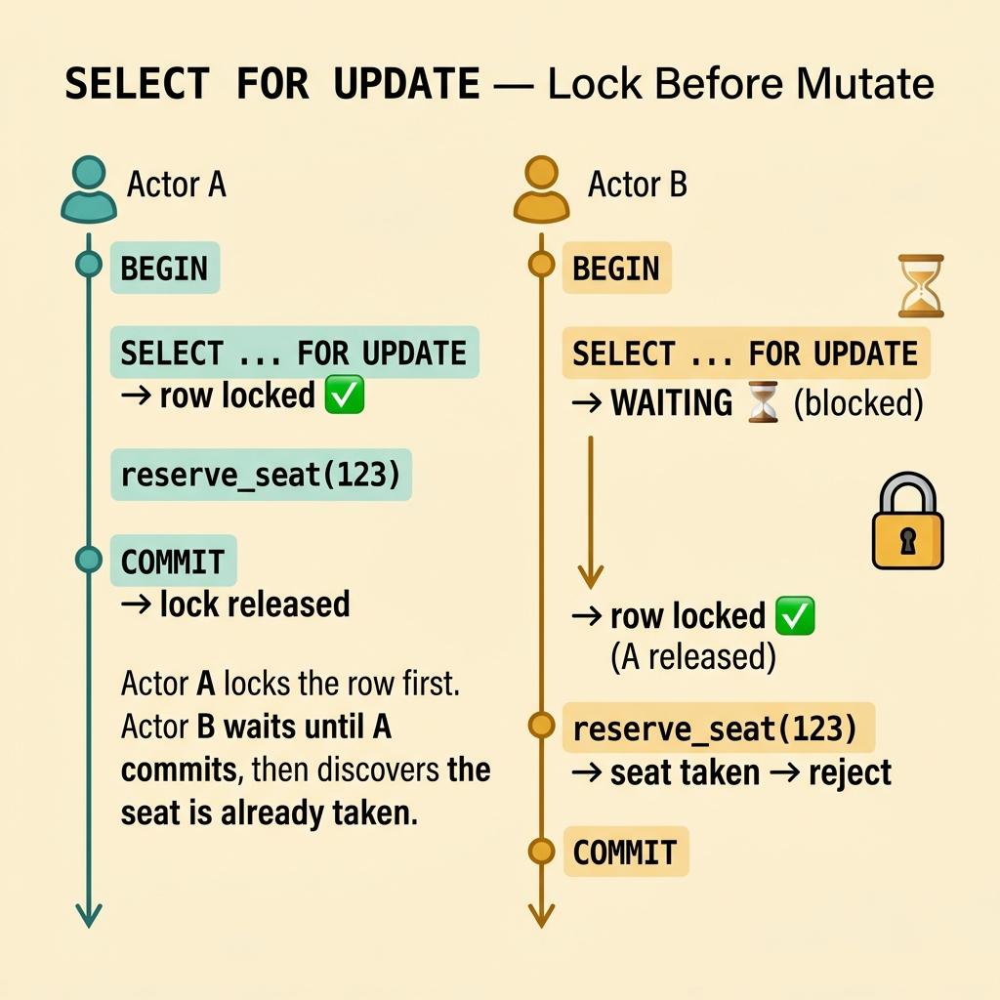
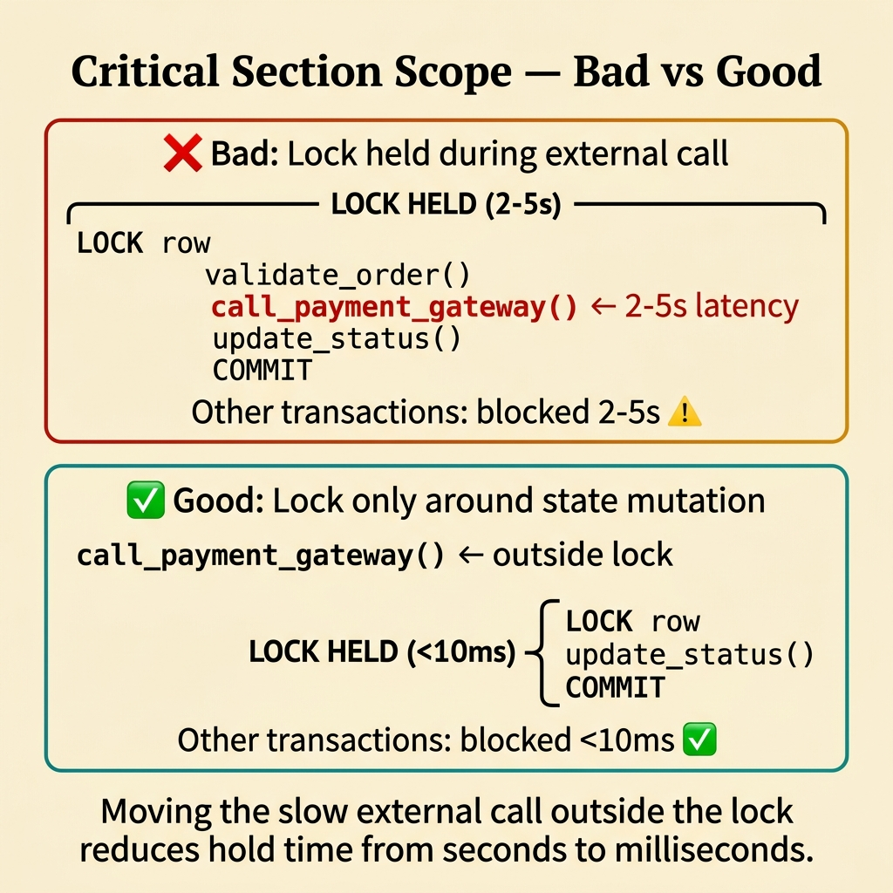
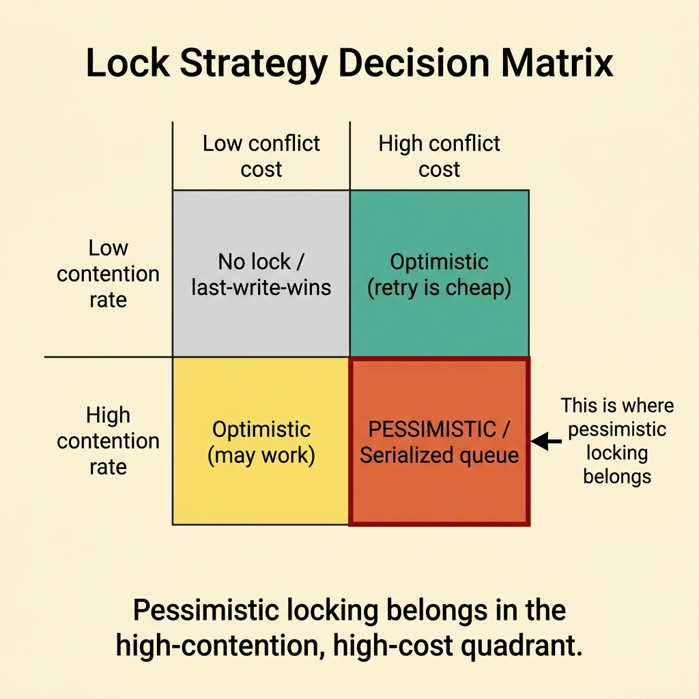
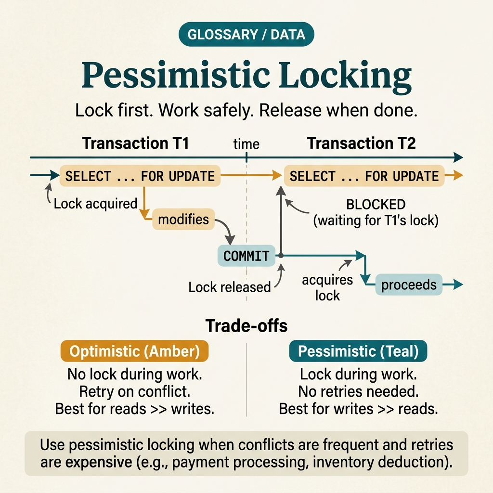

<!-- tags: glossary, reference, data-database, pessimistic-locking -->
# Pessimistic Locking

> A mechanism for controlling concurrent access by locking the resource before operating on it, preventing other actors from modifying — and sometimes reading — it until the work is complete.

| Aspect | Detail |
| --- | --- |
| **Concept** | A mechanism for controlling concurrent access by locking the resource before operating on it, preventing other actors from modifying — and sometimes reading — it until the work is complete. |
| **Audience** | Backend engineer, reviewer, platform engineer |
| **Primary style** | Glossary term |
| **Entry point** | Use when conflicts or invariants are highly sensitive, and the team wants to block collisions upfront rather than detect them late |

📅 Created: 2026-03-30 · 🔄 Updated: 2026-04-17 · ⏱️ 8 min read

---

## 1. DEFINE

Picture workflows where conflicts are not rare or where the cost of a conflict is too high to retry — for example, seat booking or a hot inventory reservation. When you need to lock first to prevent collisions upfront, that is the boundary of Pessimistic Locking.

**Pessimistic Locking** is a mechanism for controlling concurrent access by locking the resource before operating on it, preventing other actors from modifying — and sometimes reading — it until the work is complete.

| Variant | Description |
| --- | --- |
| Row-level lock | Locks the specific row being operated on. |
| Shared vs exclusive lock | Allows concurrent reads or blocks entirely depending on the mode. |
| Select-for-update style locking | Reads and then holds a lock for a safe subsequent update. |

| Approach | Time | Space | When to choose |
| --- | --- | --- | --- |
| No lock then detect later | O(1) | O(1) | When conflicts are rare and retries are cheaper. |
| Pessimistic locking | O(lock acquisition) | O(lock state) | When conflicts are expensive or very frequent. |
| Queue or serialization by owner | O(queue wait) | O(queue state) | When you want to convert lock contention into work serialization. |

Core insight:

> Pessimistic locking assumes the collision is more costly than the wait, so it blocks conflicts upfront rather than fixing consequences afterward.

### 1.1 Invariants & Failure Modes

The common failure mode is holding a lock too wide or too long, causing throughput to drop sharply and increasing deadlock risk. The right lock strategy is not just having a lock — it is locking at the right scope and for the right duration.

---

## 2. CONTEXT

**Who uses it**: Backend engineer, reviewer, platform engineer

**When**: Use when conflicts or invariants are highly sensitive, and the team wants to block collisions upfront rather than detect them late

**Purpose**: Pessimistic locking assumes the collision is more costly than the wait, so it blocks conflicts upfront rather than fixing consequences afterward.

**In the ecosystem**:
- Conflict rate is high or the invariant is very sensitive.
- Retrying after a conflict is too expensive or unacceptable.
- A critical section is short but must be absolutely certain.

Boundary to hold:
- Pessimistic locking differs from optimistic locking by paying the cost of waiting upfront.
- Pessimistic locking does not replace transaction design.
- Long locks or wrong ordering can lead to contention or deadlock.

---

Lock first, then modify — that is clear. But how long should the lock timeout be, how does deadlock detection work, and how long should SELECT FOR UPDATE hold?

## 3. EXAMPLES

Pessimistic locking surfaces most clearly when an inventory deduction goes wrong because two concurrent requests did not lock, when SELECT FOR UPDATE holds a lock for 30 seconds and other transactions queue behind it, or when a deadlock occurs because two transactions lock two rows in reverse order. The examples below place the pattern into exactly those situations.

### Example 1: Basic — Lock before mutating a sensitive resource

> **Goal**: Prevent two actors from modifying the same resource without wanting to handle conflicts afterward.
> **Approach**: Acquire the lock before the business operation begins.
> **Example**: A seat reservation allows only one actor to hold a slot at any given time.
> **Complexity**: Basic



*Figure: Actor A locks the row first. Actor B waits until A commits, then discovers the seat is already taken.*

```yaml
lock_flow:
  acquire: seat_123
  mutate: reserve_seat
  release_after: commit
```

**Why?** In workflows like booking, handling conflicts after the fact can be too late or cause a poor user experience. Locking early ensures only one actor proceeds.

**Conclusion**: Pessimistic locking fits when the cost of a conflict is too high to accept.

### Example 2: Intermediate — Keep the critical section short to avoid contention

> **Goal**: Prevent the lock from becoming a bottleneck for the entire system.
> **Approach**: Hold the lock only around the minimal state mutation that requires it.
> **Example**: Do not hold the lock while calling an external payment gateway.
> **Complexity**: Intermediate



*Figure: Moving the slow external call outside the lock reduces hold time from seconds to milliseconds.*

```yaml
critical_section_policy:
  lock_scope: minimal_state_change_only
  forbidden_inside_lock:
    - remote_api_calls
    - slow_io
```

**Why?** A lock is only safe when its scope is kept small. The more work done inside the lock, the higher the contention and deadlock risk.

**Conclusion**: Intermediate pessimistic locking is a scope control problem, not just a lock-or-no-lock decision.

### Example 3: Advanced — Choose pessimistic locking when the contention profile is genuinely hot

> **Goal**: Avoid using pessimistic locking as the default for every write path.
> **Approach**: Map hotspots and the cost of conflict before applying.
> **Example**: A hot inventory counter may need a lock or a serialized owner path instead of optimistic retries.
> **Complexity**: Advanced



*Figure: Pessimistic locking belongs in the high-contention, high-cost quadrant.*

```yaml
contention_profile:
  entity: inventory_counter
  conflict_rate: high
  conflict_cost: high
  chosen_strategy: pessimistic_or_serialized
```

**Why?** If contention is high, optimistic locking may create a retry storm. But pessimistic locking is only justified when the wait cost remains acceptable compared to the conflict cost.

**Conclusion**: At the advanced level, pessimistic locking is a decision based on hotspot economics.

---

## 4. COMPARE




*Figure: Position of pessimistic locking among optimistic locking, distributed locks, and database isolation.*

Pessimistic sounds like "more reliable than optimistic." True for correctness — but the cost is throughput: lock hold time blocks other transactions. High contention needs pessimistic; low contention makes optimistic cheaper.

### Level 1


```text
acquire lock
read and modify resource
commit
release lock
```

*Figure: Level 1 shows pessimistic locking blocking collisions by holding a lock before mutating.*

### Level 2


```text
Conflict expensive or frequent?
  -> lock early may be worth it
Lock held too long?
  -> contention and deadlock risk rise
```

*Figure: Level 2 emphasizes the fundamental trade-off of pessimistic locking — safety vs waiting and contention.*

### Easily confused or boundary-slipping

You have seen which data layer Pessimistic Locking should be used at. The mistakes below are common misuses that lead teams into lock, schema, or topology issues while still missing the real contract.

| # | Severity | Mistake | Consequence | Fix |
| --- | --- | --- | --- | --- |
| 1 | 🔴 Fatal | Holding the lock too long or around external I/O | Contention spikes and deadlock becomes likely | Shrink the critical section. |
| 2 | 🟡 Common | Using pessimistic locking as the default for every path | Throughput drops unnecessarily | Use only at genuinely sensitive hotspots. |
| 3 | 🟡 Common | Not designing lock ordering | Deadlock risk increases | Standardize lock ordering or use owner serialization. |
| 4 | 🔵 Minor | Not measuring lock wait time | No way to tell if the lock is helping or hurting | Emit lock wait metrics. |

### Quick scan

| If you face | Action |
| --- | --- |
| Conflict is extremely expensive or extremely frequent | Consider pessimistic locking |
| Lock is wrapping remote calls | Lock scope is too wide |
| Deadlock or wait time is increasing | Review ordering and the critical section |

---

## 5. REF

| Resource | Type | Link | Note |
| --- | --- | --- | --- |
| PostgreSQL Docs | Official | https://www.postgresql.org/docs/ | Strong foundation for transaction, replication, locking, and query behavior. |
| Designing Data-Intensive Applications | Book | https://dataintensive.net/ | Excellent reference for consistency, replication, scaling, and data systems. |
| Supabase Postgres Guide | Reference | https://supabase.com/docs/guides/database | Practical supplement for PostgreSQL operations and schema practices. |

---

## 6. RECOMMEND

Pessimistic locking solves the problem "must guarantee exclusive access when contention is high." The next question: how does the soft delete pattern work, and how does upsert handle insert-or-update?

| Expand to | When | Reason | File/Link |
| --- | --- | --- | --- |
| Previous concept | When you want to connect this term with the immediately preceding concept | Maintains continuity in the learning path | [Optimistic Locking](./06-optimistic-locking.md) |
| Next concept | When you want to continue along the current conceptual layer | Keeps the learning thread consistent | [Soft Delete](./08-soft-delete.md) |
| Topic hub | When you need to return to the larger taxonomy | Preserves full topic context | [Data & Database](./README.md) |

Back to the inventory deduction at the start — two concurrent requests, stock reduced incorrectly. Now you know: SELECT FOR UPDATE, process, commit. Lock scope as small as possible, clear timeout, consistent lock ordering to avoid deadlock.

**Links**: [← Previous](./06-optimistic-locking.md) · [→ Next](./08-soft-delete.md)
