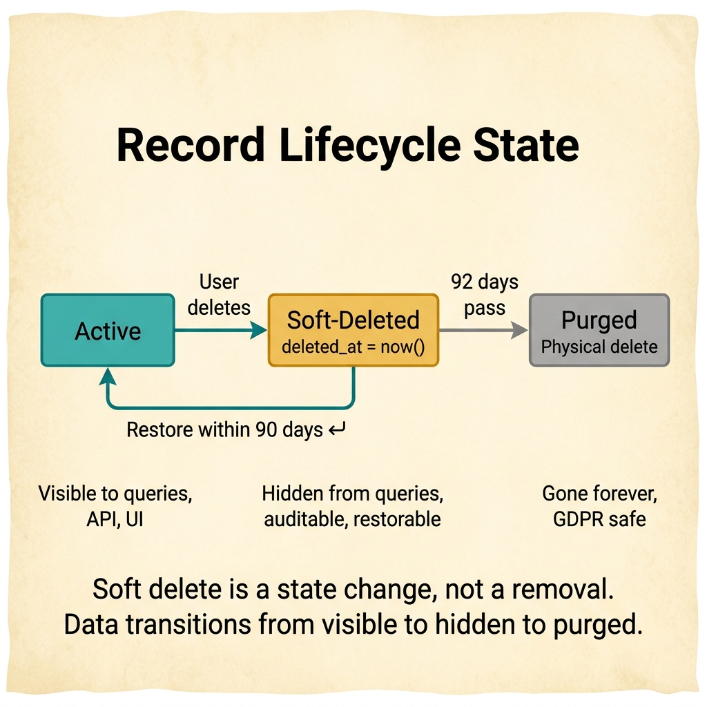
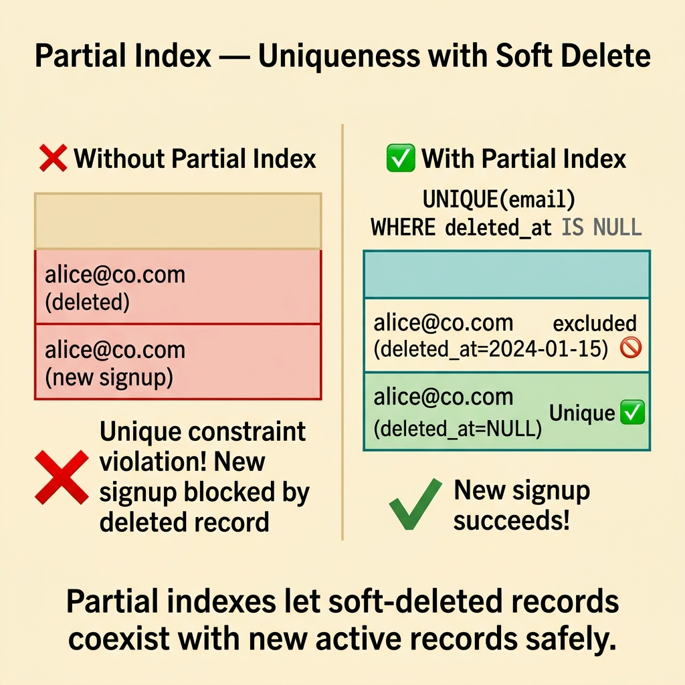
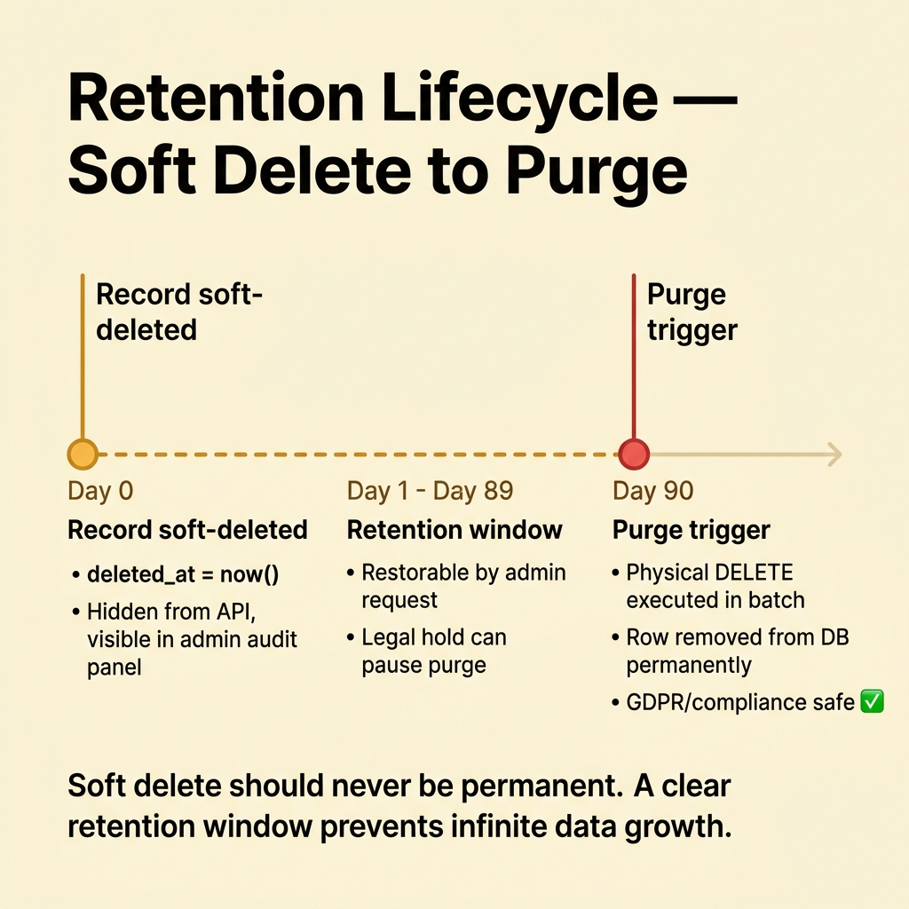
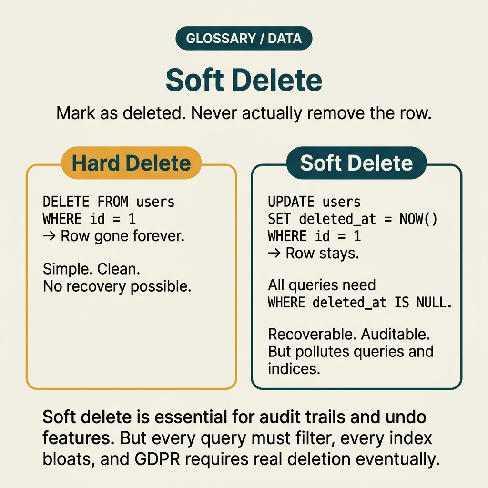

<!-- tags: glossary, reference, data-database, soft-delete -->
# Soft Delete

> A technique that marks a record as deleted instead of removing it physically, supporting audit, recovery, or referential continuity.

| Aspect | Detail |
| --- | --- |
| **Concept** | Marks records as deleted rather than erasing them physically, preserving data for audits or recovery. |
| **Audience** | Backend engineer, reviewer, platform engineer |
| **Primary style** | Glossary term |
| **Entry point** | Use when data must hide from normal flows but remain for auditing, restoration, or history. |

📅 Created: 2026-03-30 · 🔄 Updated: 2026-04-17 · ⏱️ 8 min read

---

## 1. DEFINE

Many systems cannot erase a record physically because audits, compliance rules, recovery workflows, or foreign-key semantics depend on it. When a team wants to hide data from the main flow but leave a trace, they enter the boundary of Soft Delete.

**Soft Delete** is a technique that marks a record as deleted instead of removing it physically, supporting audit, recovery, or referential continuity.

| Variant | Description |
| --- | --- |
| Boolean flag soft delete | Uses a boolean flag like `is_deleted`. |
| Timestamp soft delete | Uses `deleted_at` to mark deletion and record the exact time. |
| Archived-state soft delete | Moves the record to an archived or inactive state instead of a simple deletion. |

| Approach | Time | Space | When to choose |
| --- | --- | --- | --- |
| Hard delete | O(1) | O(1) | When you can erase data immediately without affecting audits or recovery. |
| Soft delete in-place | O(1) | O(existing row + flag) | When you must keep the record in place but hide it. |
| Soft delete plus archival | O(move or mark) | O(active + archived data) | When separating hot and cold data while preserving history. |

Core insight:

> Soft delete acts as a data lifecycle strategy. It does not mean the data disappears. It means the data changes its visibility state and retention semantics.

### 1.1 Invariants & Failure Modes

A common failure mode happens when developers add a deleted flag but forget to apply it to queries, indexes, or unique constraints. The system exposes the supposedly hidden record or blocks new creations.

---

## 2. CONTEXT

**Who uses it**: Backend engineer, reviewer, platform engineer.

**When to use**: Use it when data must hide from normal operations but remain available for audits, restoration, or history.

**Purpose**: Soft delete serves as a data lifecycle strategy. It shifts the visibility state and retention semantics rather than destroying the data.

**In the ecosystem**:
- The system requires an audit trail or the ability to restore records.
- Immediate physical deletion breaks reporting pipelines or referential continuity.
- Compliance regulations mandate data retention for a specific duration.

Boundaries to maintain:
- Soft delete differs from an archive strategy, although they often pair together.
- Soft delete does not replace a dedicated retention policy.
- Soft delete increases query complexity because every read path must check the deleted state.

---

The idea of marking records instead of removing them is clear. But which queries require filtering, do indexes bloat, and how does GDPR handle true erasure?

## 3. EXAMPLES

Soft delete becomes visible when a user needs to undo a deletion within 30 days. It also appears when queries slow down because deleted rows form 80% of the table. Another case is when developers forget `WHERE deleted_at IS NULL` and generate false reports. The following examples place the pattern in these exact situations.

### Example 1: Basic — Hiding records from normal read flows without physical deletion

> **Goal**: Keep the record for audits or restoration without displaying it on the UI or API.
> **Approach**: Mark the record as deleted and filter it from default queries.
> **Example**: The system deactivates a user account but retains it for auditing purposes.
> **Complexity**: Basic

```yaml
soft_delete_policy:
  marker: deleted_at
  default_queries_exclude_deleted: true
  restore_supported: true
```



*Figure: Soft delete is a state change, not a removal. Data transitions from active to hidden to purged.*

**Why?** Soft delete excels when the deletion semantics require hiding and retaining data instead of erasing it forever.

**Takeaway**: Basic soft delete hides data without losing the trace.

### Example 2: Intermediate — Adjusting indexes and uniqueness rules

> **Goal**: Prevent soft-deleted records from triggering unique key violations or slowing down queries.
> **Approach**: Design a partial index or a uniqueness rule that respects the deleted state.
> **Example**: A soft-deleted email address must allow the creation of a new account if business rules permit.
> **Complexity**: Intermediate

```yaml
uniqueness_policy:
  key: email
  active_records_only_unique: true
  deleted_records_ignored_for_signup: true
```



*Figure: Partial indexes let soft-deleted records coexist with new active records safely.*

**Why?** Soft delete creates confusing bugs in the create and update paths if you ignore indexes and uniqueness constraints.

**Takeaway**: Intermediate soft delete requires schema awareness, not just query adjustments.

### Example 3: Advanced — Combining soft delete with a retention and purge workflow

> **Goal**: Prevent data from persisting indefinitely just because of a soft delete.
> **Approach**: Establish a clear lifecycle that soft deletes first and purges physically after the retention window ends.
> **Example**: The system soft-deletes a record today and purges it physically 90 days later.
> **Complexity**: Advanced

```yaml
retention_lifecycle:
  soft_delete_now: true
  purge_after_days: 90
  legal_hold_can_block_purge: true
```



*Figure: Soft delete should never be permanent. A clear retention window prevents infinite data growth.*

**Why?** Soft delete should never become a permanent default state for all data. Advanced designs manage the entire lifecycle from active state to final purge.

**Takeaway**: At the advanced level, soft delete acts as one phase within a comprehensive retention workflow.

---

## 4. COMPARE



*Figure: The position of soft delete between hard delete, audit logs, and data retention policies.*

Soft delete sounds like "never delete anything." That is not entirely true. Soft delete preserves data for undo actions and audits, but it requires a purge policy. Without a purge policy, tables bloat, queries degrade, and storage scales out of control.

### Level 1

```text
record active
  -> mark deleted_at
  -> hidden from normal queries
  -> still restorable or auditable
```

*Figure: Level 1 shows soft delete as a state change rather than a physical removal.*

### Level 2

```text
Need audit or restore?
  -> soft delete may fit
Need true erasure now?
  -> hard delete or retention workflow may be required
```

*Figure: Level 2 highlights soft delete as a trade-off between reversibility and query complexity.*

### Common Pitfalls and Boundary Slips

You have seen where Soft Delete belongs in the data layer. The following mistakes represent misuses that touch locks, schemas, or topologies while missing the actual contract.

| # | Severity | Defect | Consequence | Fix |
| --- | --- | --- | --- | --- |
| 1 | 🔴 Fatal | Adding a deleted flag but forgetting to filter the query path. | The system exposes deleted records. | Standardize default scopes or query policies. |
| 2 | 🟡 Common | Failing to adjust uniqueness rules and indexes. | Soft-deleted data blocks new creation paths. | Design indexes that respect the deleted state. |
| 3 | 🟡 Common | Retaining soft-deleted data forever. | Storage bloats and retention debt grows. | Add a physical purge lifecycle. |
| 4 | 🔵 Minor | Confusing soft delete with hard delete semantics. | Business expectations misalign with reality. | Document visibility versus true erasure clearly. |

### Quick Scan

| If you encounter | Do this |
| --- | --- |
| The system needs auditing or restoration after deletion. | Consider implementing a soft delete. |
| The delete flag exists but queries still expose records. | Review the default query policy. |
| Soft-deleted data grows indefinitely. | Design a purge lifecycle. |

---

## 5. REF

| Resource | Type | Link | Notes |
| --- | --- | --- | --- |
| PostgreSQL Docs | Official | https://www.postgresql.org/docs/ | Excellent foundation for transactions, replication, and query behaviors. |
| Designing Data-Intensive Applications | Book | https://dataintensive.net/ | Strong reference for consistency, replication, scaling, and data systems. |
| Supabase Postgres Guide | Reference | https://supabase.com/docs/guides/database | Practical supplement for PostgreSQL operations and schema design. |

---

## 6. RECOMMEND

Soft delete solves the "undo deletion or keep audit trail" problem. The next questions involve upsert patterns and the differences between OLTP and OLAP workloads.

| Extension | When to use | Rationale | File/Link |
| --- | --- | --- | --- |
| Previous concept | When linking this term to the previous adjacent concept. | Maintains continuity in the learning path. | [Pessimistic Locking](./07-pessimistic-locking.md) |
| Next concept | When advancing through the current conceptual layer. | Keeps the learning flow consistent. | [Upsert](./09-upsert.md) |
| Topic hub | When returning to the broader taxonomy. | Preserves context across the entire topic. | [Data & Database](./README.md) |

Return to that degrading query from earlier. You have 80% deleted rows and full index scans. Now you know the solution: create a partial index `WHERE deleted_at IS NULL`, implement a purge job for old data, and always enforce a default filter in your ORM. Soft delete is easy to implement, but maintenance requires effort.

**Links**: [← Previous](./07-pessimistic-locking.md) · [→ Next](./09-upsert.md)
