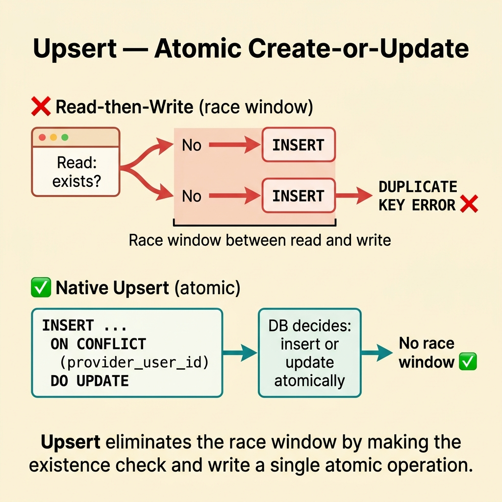
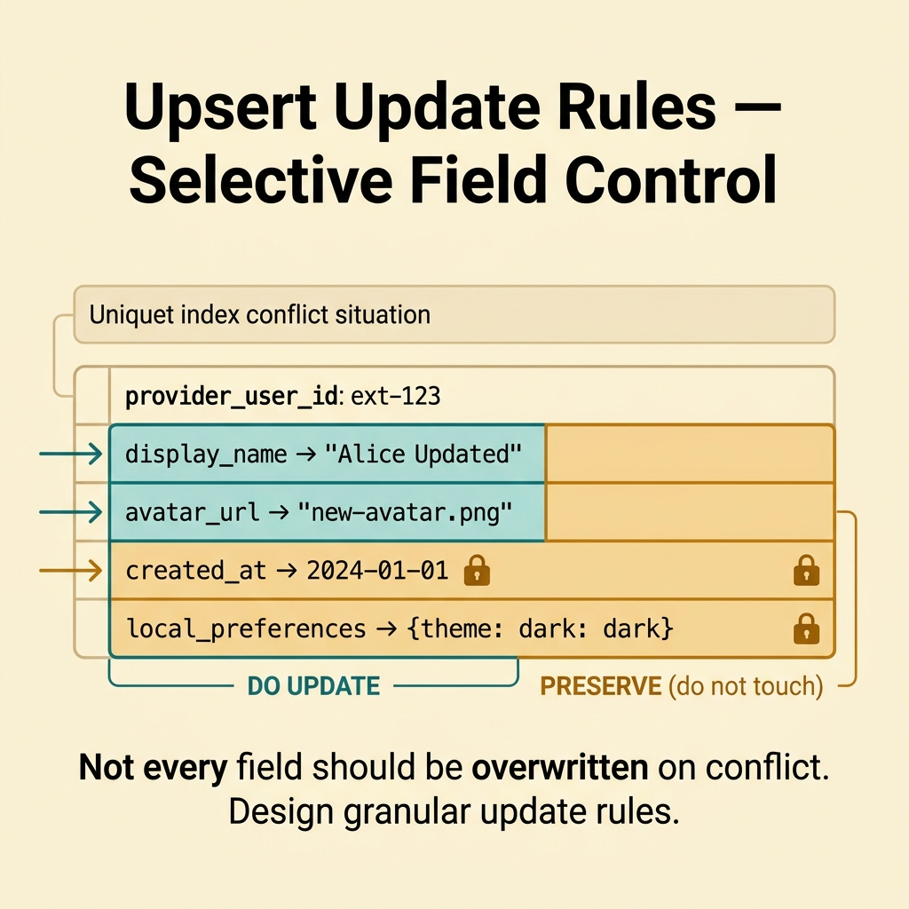
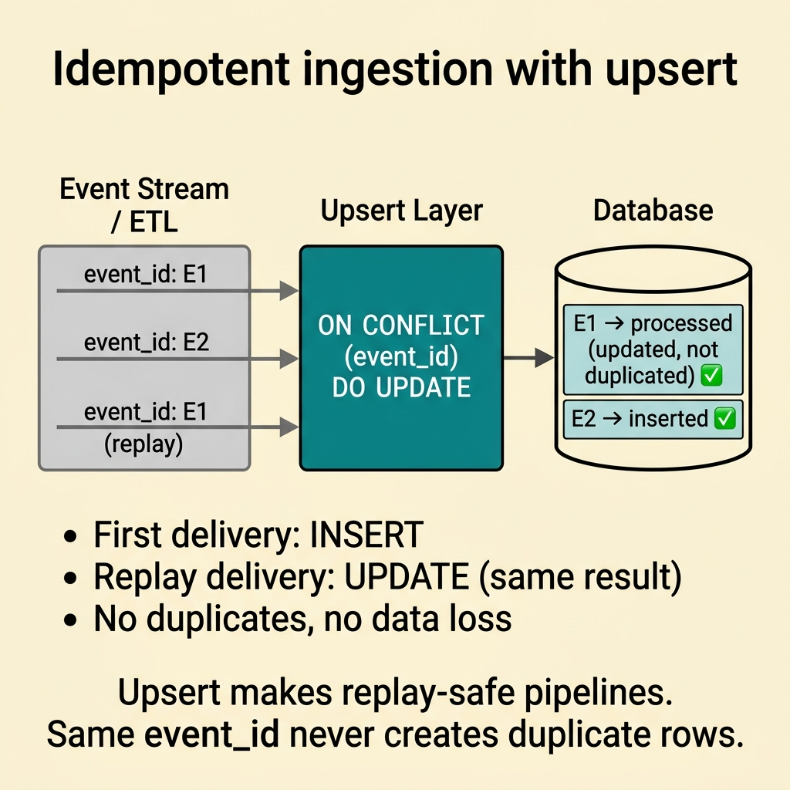
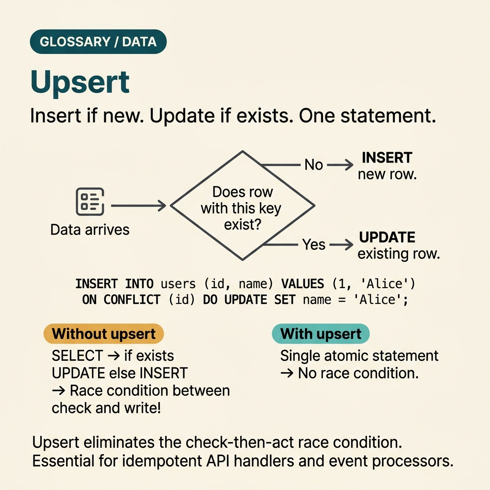

<!-- tags: glossary, reference, data-database, upsert -->
# Upsert

> A combined write operation that inserts a record if it does not exist, or updates it according to a conflict rule if it does.

| Aspect | Detail |
| --- | --- |
| **Concept** | A dual write operation that inserts new records or updates existing ones based on conflict rules. |
| **Audience** | Backend engineer, reviewer, platform engineer |
| **Primary style** | Glossary term |
| **Entry point** | Use when the write path handles create-or-update logic and requires clear semantics for conflicts. |

📅 Created: 2026-03-30 · 🔄 Updated: 2026-04-17 · ⏱️ 8 min read

---

## 1. DEFINE

Certain workflows avoid splitting creations and updates at the application layer because race windows open and complexity increases. When a system needs a create-or-update operation with explicit semantics, it enters the Upsert boundary.

**Upsert** is a combined write operation that inserts a record if it does not exist, or updates it according to a conflict rule if it does.

| Variant | Description |
| --- | --- |
| Insert on conflict update | Inserts a row, but updates it if a unique constraint conflict occurs. |
| Insert ignore existing | Inserts a row if it is missing, but ignores it if it already exists. |
| Merge-style upsert | Combines multiple field updates using specific rules when a conflict triggers. |

| Approach | Time | Space | When to choose |
| --- | --- | --- | --- |
| Separate read then insert/update | O(read + write) | O(1) | When the race window is negligible or semantics remain simple. |
| Native upsert | O(single write) | O(1) | When you need atomic create-or-update semantics. |
| Upsert plus business merge logic | O(single write + merge) | O(merge state) | When conflicts demand granular update rules. |

Core insight:

> Upsert is more than syntactic convenience. It narrows the race window and defines clear semantics for create-or-update operations within a strict atomic boundary.

### 1.1 Invariants & Failure Modes

A common failure mode happens when developers use upsert universally but forget the update rules for complex business conflicts. The convenient statement masks critical domain semantics.

---

## 2. CONTEXT

**Who uses it**: Backend engineer, reviewer, platform engineer.

**When to use**: Use it when the write path must handle create-or-update within a single contract and demands explicit conflict semantics.

**Purpose**: Upsert is not just syntactic sugar. It shrinks race windows and formalizes create-or-update semantics inside an atomic boundary.

**In the ecosystem**:
- The write path follows an "if exists update, else insert" pattern.
- Concurrent writers collide frequently on the creation path.
- Application code executes read-before-write solely to decide between insert and update.

Boundaries to maintain:
- Upsert differs from optimistic locking. Upsert resolves existence conflicts, not all concurrent update conflicts.
- Upsert differs from a migration backfill, although developers use it to write idempotent data.
- Upsert does not replace explicit business merge semantics when conflicts grow complex.

---

The choice between insert and update based on existence is clear. But which key triggers `ON CONFLICT`, how do race conditions behave during concurrent upserts, and what about bulk performance?

## 3. EXAMPLES

Upsert becomes prominent when external data synchronization requires "create if missing, update if present." It also shines when two concurrent requests insert the same key and cause a duplicate error. Another case involves batch upserting 100,000 rows where each row demands an existence check. The following examples place the pattern in these exact situations.

### Example 1: Basic — Merging creation and update into an atomic write path

> **Goal**: Avoid a read-before-write cycle that only determines whether to insert or update.
> **Approach**: Rely on native upsert semantics tied to a unique key.
> **Example**: The system syncs user profiles from an external provider using `provider_user_id`.
> **Complexity**: Basic

```yaml
upsert_contract:
  conflict_key: provider_user_id
  on_missing: insert
  on_existing: update_selected_fields
```



*Figure: Upsert eliminates the race window by making the existence check and write a single atomic operation.*

**Why?** Native upserts reduce the race window between reads and writes. They clarify create-or-update semantics within the persistence layer.

**Takeaway**: Basic upsert provides immense value when the write path features idempotent create-or-update semantics.

### Example 2: Intermediate — Updating specific fields during a conflict

> **Goal**: Prevent the upsert from accidentally overwriting more data than necessary.
> **Approach**: Design a deliberate update set instead of overwriting the entire row.
> **Example**: The system updates `display_name` and `avatar`, but leaves `created_at` and local preferences untouched.
> **Complexity**: Intermediate

```yaml
update_rule:
  on_conflict_update:
    - display_name
    - avatar_url
  preserve:
    - created_at
    - local_preferences
```



*Figure: Not every field should be overwritten on conflict. Design granular update rules.*

**Why?** Upsert delivers strong atomicity, but vague update rules can still corrupt domain data.

**Takeaway**: Intermediate upsert enforces conflict-aware update rules rather than just offering clean syntax.

### Example 3: Advanced — Using upsert as a foundation for idempotent ingestion

> **Goal**: Allow ingestion pipelines to replay without duplicating records.
> **Approach**: Combine unique keys, upsert semantics, and a source-of-truth policy.
> **Example**: An ETL batch or event consumer replays messages without cloning existing records.
> **Complexity**: Advanced

```yaml
idempotent_ingest:
  unique_business_key: event_id
  write_mode: upsert
  replay_safe: true
```



*Figure: Upsert makes replay-safe pipelines. Same event_id never creates duplicate rows.*

**Why?** Upsert shines in pipelines that feature replay mechanisms or duplicate deliveries, provided that business keys and update semantics remain well-defined.

**Takeaway**: At the advanced level, upsert acts as a primary building block for idempotent ingestion workflows.

---

## 4. COMPARE



*Figure: The position of upsert alongside individual INSERT/UPDATE commands, MERGE statements, and bulk operations.*

Upsert sounds like "check existence, then insert or update." The logic matches, but implementing a check-then-act flow in application code introduces race conditions. Upsert via `ON CONFLICT` in PostgreSQL or `MERGE` in SQL Server guarantees database-level atomicity.

### Level 1

```text
input record
  -> if no matching key: insert
  -> if key exists: update according to rule
```

*Figure: Level 1 illustrates upsert as a create-or-update operation over the same key space.*

### Level 2

```text
Need idempotent create-or-update?
  -> native upsert may help
Need complex merge semantics?
  -> define update rule carefully
```

*Figure: Level 2 emphasizes that upsert excels when you define the conflict rule clearly.*

### Common Pitfalls and Boundary Slips

You have seen where Upsert fits into the data layer. The following mistakes highlight how teams touch locks, schemas, or topologies while missing the actual write contract.

| # | Severity | Defect | Consequence | Fix |
| --- | --- | --- | --- | --- |
| 1 | 🔴 Fatal | Using upsert without defining a clear conflict key. | Write semantics become ambiguous and error-prone. | Define the unique business key first. |
| 2 | 🟡 Common | Overwriting the entire row upon a conflict. | The system loses critical data that should remain intact. | Design granular, field-level update rules. |
| 3 | 🟡 Common | Treating upsert as a universal fix for concurrency conflicts. | Teams confuse the boundary with locking and versioning. | Separate existence conflicts from update conflicts. |
| 4 | 🔵 Minor | Ignoring idempotency when deploying upserts. | Pipeline replays generate unexpected data mutations. | Map upsert logic directly to the ingestion contract. |

### Quick Scan

| If you encounter | Do this |
| --- | --- |
| The create-or-update flow requires stronger atomicity. | Evaluate an upsert pattern. |
| The conflict key remains unclear. | Delay the upsert implementation until you define the key. |
| A pipeline replay might duplicate incoming events. | Leverage upsert to enforce idempotency. |

---

## 5. REF

| Resource | Type | Link | Notes |
| --- | --- | --- | --- |
| PostgreSQL Docs | Official | https://www.postgresql.org/docs/ | Excellent foundation for transactions, replication, and query behaviors. |
| Designing Data-Intensive Applications | Book | https://dataintensive.net/ | Strong reference for consistency, replication, scaling, and data systems. |
| Supabase Postgres Guide | Reference | https://supabase.com/docs/guides/database | Practical supplement for PostgreSQL operations and schema design. |

---

## 6. RECOMMEND

Upsert solves the "idempotent data sync" problem. The next questions tackle the differences between OLTP and OLAP workloads, and how query patterns diverge.

| Extension | When to use | Rationale | File/Link |
| --- | --- | --- | --- |
| Previous concept | When linking this term to the previous adjacent concept. | Maintains continuity in the learning path. | [Soft Delete](./08-soft-delete.md) |
| Next concept | When advancing through the current conceptual layer. | Keeps the learning flow consistent. | [OLTP / OLAP](./10-oltp-olap.md) |
| Topic hub | When returning to the broader taxonomy. | Preserves context across the entire topic. | [Data & Database](./README.md) |

Return to that duplicate creation bug. Two concurrent requests hit a check-then-insert race condition. Now you know the solution: leverage `ON CONFLICT DO UPDATE` in a single statement. The database guarantees atomic execution. You do not need application-level locks or retry logic.

**Links**: [← Previous](./08-soft-delete.md) · [→ Next](./10-oltp-olap.md)
