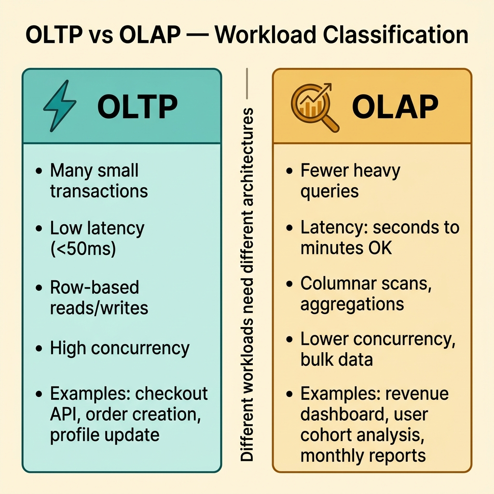
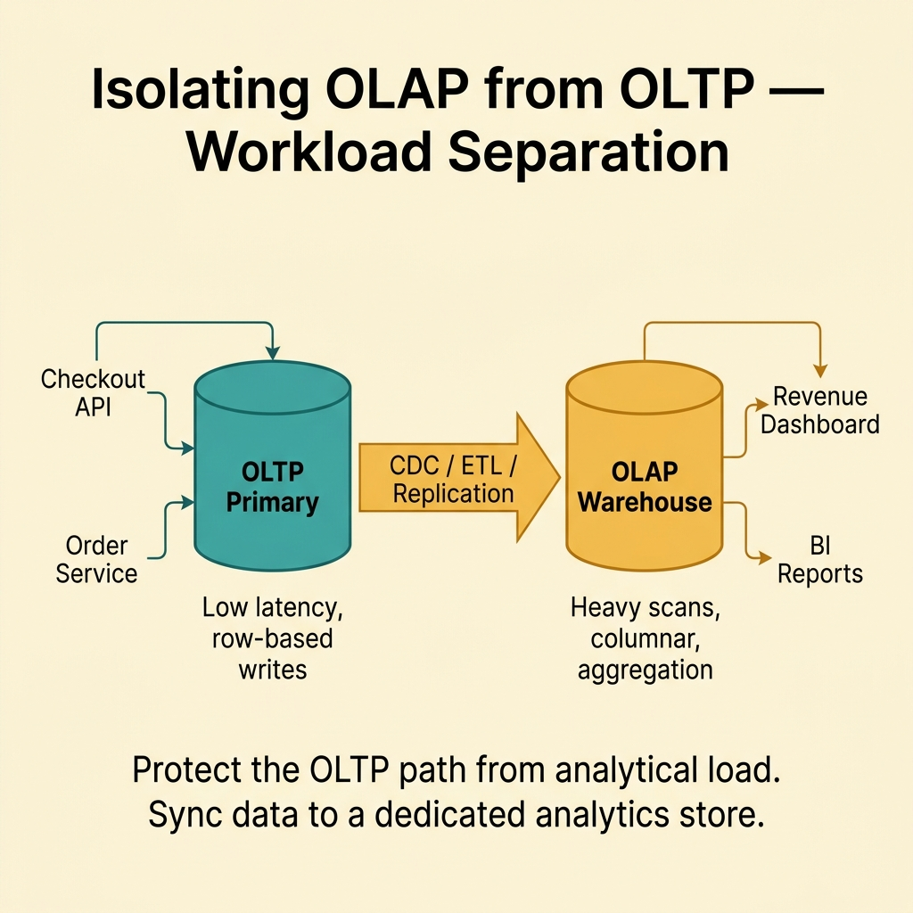
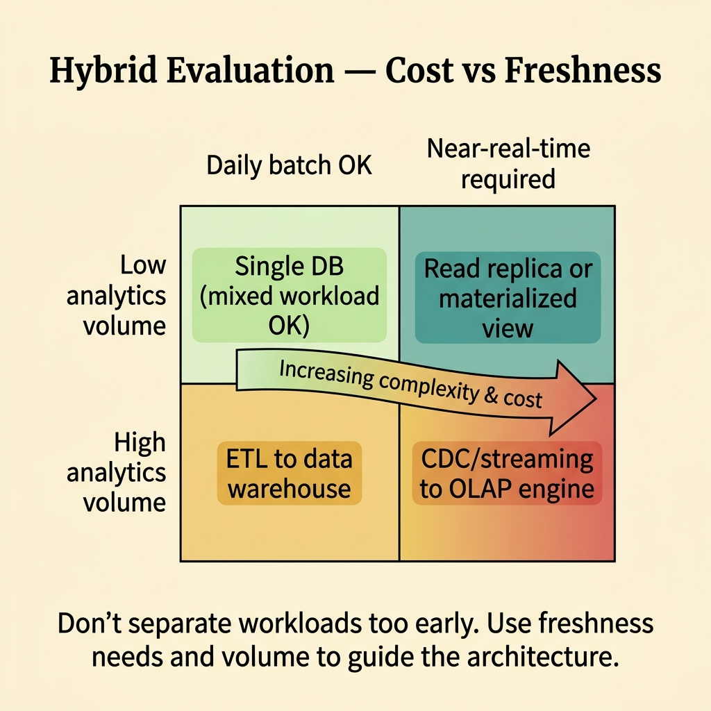
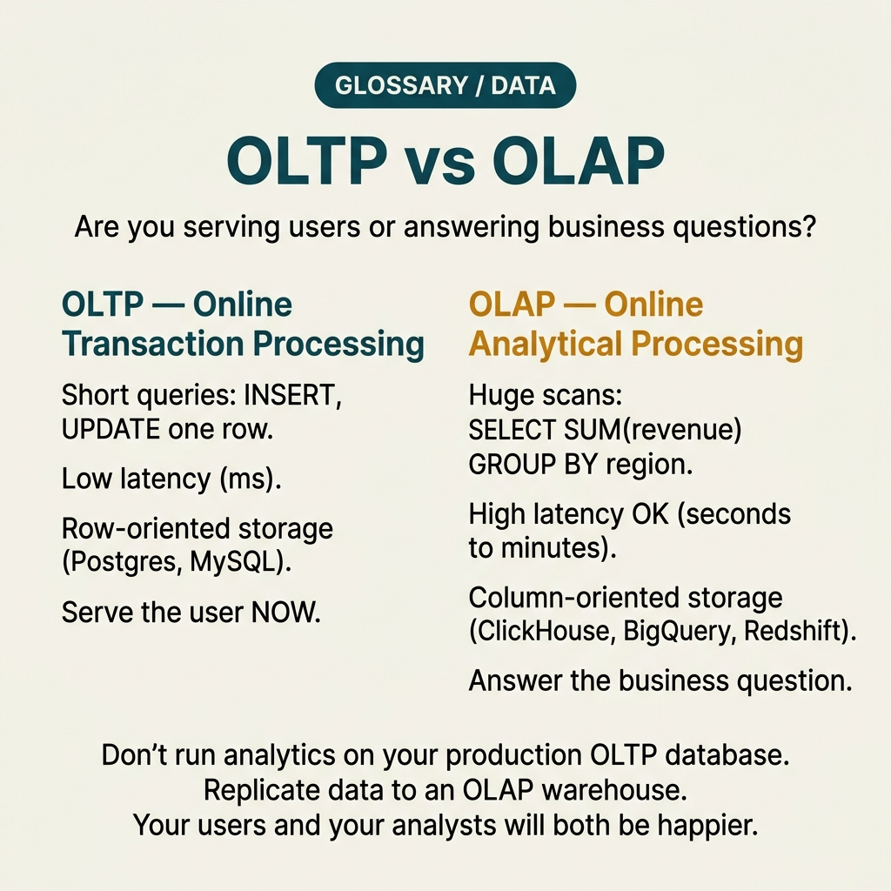

<!-- tags: glossary, reference, data-database, oltp-olap -->
# OLTP / OLAP

> Two distinct data workloads: OLTP optimizes high-speed online transactions, while OLAP optimizes heavy analytics over massive datasets.

| Aspect | Detail |
| --- | --- |
| **Concept** | Two distinct data workloads: OLTP handles fast online transactions, while OLAP processes heavy analytical queries over large datasets. |
| **Audience** | Backend engineer, data engineer, reviewer, platform engineer |
| **Primary style** | Glossary term |
| **Entry point** | Use when the team must separate transactional systems from analytical ones without mixing their respective workloads. |

📅 Created: 2026-03-30 · 🔄 Updated: 2026-04-17 · ⏱️ 8 min read

---

## 1. DEFINE

Many systems slow down not because the database engine is weak, but because heavy analytical workloads bleed into environments meant for transactional traffic, or vice versa. When you need to identify the exact data workload pattern, you enter the OLTP / OLAP boundary.

**OLTP / OLAP** represents two data workloads: OLTP optimizes high-speed online transactions, while OLAP optimizes heavy analytics over massive datasets.

| Variant | Description |
| --- | --- |
| OLTP | Transactional workloads featuring many small reads and writes, high concurrency, and extreme latency sensitivity. |
| OLAP | Analytical workloads involving massive data scans, heavy aggregations, and lower sensitivity to per-request latency. |
| HTAP or hybrid compromise | An attempt to serve both workloads within a single architecture or a combined platform. |

| Approach | Time | Space | When to choose |
| --- | --- | --- | --- |
| Single mixed workload store | O(mixed query cost) | O(1) | When workloads remain small or the trade-off remains acceptable. |
| Separate OLTP and OLAP stores | O(optimized per workload) | O(separate systems) | When transactional and analytical needs grow large enough to justify separation. |
| Replicate or pipeline to analytics sink | O(replication or ETL latency) | O(extra store + pipeline) | When you must protect the OLTP path from analytical load. |

Core insight:

> OLTP and OLAP function as workload vocabulary. They help teams describe the exact access pattern the data system serves, rather than dumping everything into one database and expecting universal optimization.

### 1.1 Invariants & Failure Modes

A common failure mode occurs when teams force the same database and schema to serve hot transactional traffic and heavy analytical scans simultaneously. Optimizing individual queries fails to resolve the fundamental workload mismatch.

---

## 2. CONTEXT

**Who uses it**: Backend engineer, data engineer, reviewer, platform engineer.

**When to use**: Use it when the team needs to separate transactional systems from analytical systems and avoid mixing workloads.

**Purpose**: OLTP and OLAP serve as workload vocabulary. They help teams identify the access pattern the data system actually serves instead of expecting one database to optimize everything simultaneously.

**In the ecosystem**:
- Heavy reporting queries degrade the performance of transactional APIs.
- Analytics or BI queries scan massive amounts of data on the same source that serves live applications.
- Design discussions conflate user-facing latency requirements with data exploration needs.

Boundaries to maintain:
- OLTP/OLAP classification differs from choosing a storage engine name or a vendor.
- OLAP does not mean batch-only processing, and OLTP does not mean relational-only databases.
- This terminology provides a workload classification, not a moral judgment of good versus bad.

---

The difference between transaction processing and analytics is clear. But when should you separate databases, implement ETL or CDC, and where does columnar storage excel?

## 3. EXAMPLES

OLTP/OLAP becomes apparent when an analytics query locks the production database for 10 minutes. It also appears when reports running on a transactional database cause latency spikes for users. Another case involves teams demanding real-time dashboards while relying on nightly ETL batches. The following examples place the pattern in these exact situations.

### Example 1: Basic — Calling the workload by its correct name

> **Goal**: Prevent transactional and analytical needs from blending into a vague, undefined problem.
> **Approach**: Classify query paths based on latency sensitivity and the shape of data scans.
> **Example**: The checkout database handles an OLTP workload, while the revenue dashboard relies on an OLAP-like workload.
> **Complexity**: Basic

```yaml
workload_classification:
  checkout_api: oltp
  monthly_revenue_report: olap
```



*Figure: OLTP handles fast transactions with low latency. OLAP handles heavy analytics with columnar scans. Different workloads need different architectures.*

**Why?** Simply assigning the correct workload name helps the team choose the right metrics and architecture for further discussion.

**Takeaway**: Basic OLTP/OLAP usage establishes accurate workload naming conventions.

### Example 2: Intermediate — Isolating analytical load from the transactional path

> **Goal**: Prevent massive query scans from degrading the speed of user-facing traffic.
> **Approach**: Replicate or pipeline data into an analytics store or a read-optimized sink.
> **Example**: An operational PostgreSQL database feeds data into a warehouse for BI dashboards.
> **Complexity**: Intermediate

```yaml
separation_strategy:
  source_of_truth: oltp_primary
  analytics_sink: warehouse_or_read_model
  transfer_mode: replication_or_etl
```



*Figure: Protect the OLTP path from analytical load. Sync data to a dedicated analytics store.*

**Why?** When both workloads grow sufficiently large, separation proves more effective than attempting infinite optimizations on a single store.

**Takeaway**: Intermediate OLTP/OLAP usage focuses on architectural separation based on workload types.

### Example 3: Advanced — Evaluating hybrid models using cost and freshness trade-offs

> **Goal**: Avoid separating workloads just to satisfy terminology, and avoid mixing them merely to reduce system count.
> **Approach**: Compare freshness requirements, infrastructure costs, and the operational overhead of separation.
> **Example**: A near-real-time dashboard might demand a replication stream instead of a daily batch ETL.
> **Complexity**: Advanced

```yaml
hybrid_evaluation:
  transactional_latency_priority: high
  analytics_freshness_need: near_real_time
  chosen_model: oltp_plus_streamed_olap
```



*Figure: Don’t separate workloads too early. Use freshness needs and analytics volume to guide the architecture.*

**Why?** OLTP and OLAP do not require total separation in every scenario. Teams must articulate the workload trade-offs using freshness, latency, and cost metrics clearly.

**Takeaway**: At the advanced level, OLTP/OLAP provides a framework to reason about workload placement.

---

## 4. COMPARE



*Figure: The position of OLTP/OLAP alongside data warehouses, data lakes, and ETL pipelines.*

OLTP sounds like "the main database." That is true, but running analytics on an OLTP database is the most common anti-pattern. OLTP optimizes for row-based writes and reads, while OLAP optimizes for columnar scans. Mixing the two workloads kills the performance of both.

### Level 1

```text
OLTP: many small transactions, low latency
OLAP: fewer but heavier analytical queries over large datasets
```

*Figure: Level 1 contrasts two fundamentally different data workloads side by side.*

### Level 2

```text
Need user-facing fast writes and reads?
  -> think OLTP
Need aggregation over huge history?
  -> think OLAP
```

*Figure: Level 2 transforms OLTP/OLAP into a clear decision boundary for workload design.*

### Common Pitfalls and Boundary Slips

You have seen where OLTP / OLAP belongs in the data layer. The following mistakes highlight how teams touch locks, schemas, or topologies while missing the actual contract.

| # | Severity | Defect | Consequence | Fix |
| --- | --- | --- | --- | --- |
| 1 | 🔴 Fatal | Mixing analytical scans directly into the hot transactional path. | User-facing latency degrades steadily over time. | Separate the workloads when they grow large enough. |
| 2 | 🟡 Common | Treating OLTP or OLAP as product names instead of workload types. | Teams argue at the wrong architectural level. | Use the terms to describe access patterns specifically. |
| 3 | 🟡 Common | Separating workloads too early without a clear business need. | Operational overhead increases without any tangible benefit. | Evaluate the cost-freshness trade-off before splitting. |
| 4 | 🔵 Minor | Failing to specify the explicit freshness requirement for analytics. | The team selects a pipeline with the wrong update cadence. | Establish an explicit freshness SLA upfront. |

### Quick Scan

| If you encounter | Do this |
| --- | --- |
| Analytics queries slow down the transactional API significantly. | Reevaluate your OLTP/OLAP separation strategy. |
| The current workload type remains unclear to the team. | Classify it based on latency sensitivity and scan shapes. |
| The analytics dashboards require near-real-time data. | Evaluate hybrid streaming models instead of pure batch pipelines. |

---

## 5. REF

| Resource | Type | Link | Notes |
| --- | --- | --- | --- |
| PostgreSQL Docs | Official | https://www.postgresql.org/docs/ | Excellent foundation for transactions, replication, and query behaviors. |
| Designing Data-Intensive Applications | Book | https://dataintensive.net/ | Strong reference for consistency, replication, scaling, and data systems. |
| Supabase Postgres Guide | Reference | https://supabase.com/docs/guides/database | Practical supplement for PostgreSQL operations and schema design. |

---

## 6. RECOMMEND

OLTP/OLAP solves the "analytics slowing down production" problem. The next questions explore ACID guarantees for transactions and sharding strategies for scale.

| Extension | When to use | Rationale | File/Link |
| --- | --- | --- | --- |
| Previous concept | When linking this term to the previous adjacent concept. | Maintains continuity in the learning path. | [Upsert](./09-upsert.md) |
| Next concept | When advancing through the current conceptual layer. | Keeps the learning flow consistent. | [README](./README.md) |
| Topic hub | When returning to the broader taxonomy. | Preserves context across the entire topic. | [Data & Database](./README.md) |

Return to that massive analytics query from earlier. It locked production for 10 minutes and caused user timeouts. Now you know the solution: separate the workloads. Use OLTP for transactions and OLAP for analytics. Sync the data using CDC or ETL pipelines. Let each engine optimize for its specific job.

**Links**: [← Previous](./09-upsert.md) · [→ Next](./README.md)
