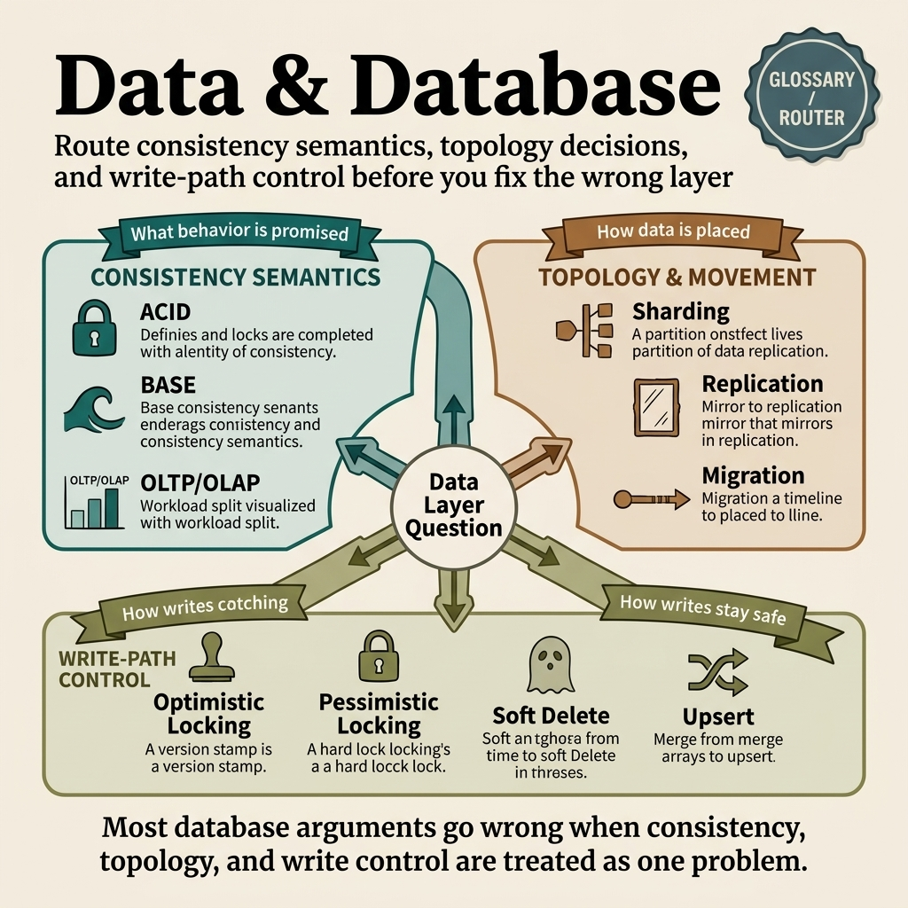

<!-- tags: glossary, reference, data-database, overview -->
# Data & Database

> A terminology hub identifying consistency models, data topologies, and write-path protections across databases and platforms.

| Aspect | Detail |
| --- | --- |
| **Concept** | A cluster of terms identifying data consistency, topology, and write-path protection mechanisms. |
| **Audience** | Backend engineer, database engineer, system reviewer |
| **Primary style** | Glossary hub router |
| **Entry point** | Open this hub when data layer symptoms appear but their root causes remain ambiguous. |

📅 Created: 2026-03-30 · 🔄 Updated: 2026-04-11 · ⏱️ 7 min read

---

## 1. DEFINE

A data bug might stem from transaction semantics, replication lag, shard layouts, or locking strategies. If the team merely states that the database has a problem, diagnosis quickly degenerates into guesswork. This README routes data symptoms to the correct layer so teams avoid fixing replication with locks or resolving write conflicts by adding shards.

**Data & Database** is a terminology hub identifying consistency models, data topologies, and write-path protections across databases and platforms.

| Variant | Description |
| --- | --- |
| Consistency semantics | ACID, BASE, and OLTP/OLAP lock expectations regarding data system behaviors and workloads. |
| Topology & movement | Sharding, replication, and migrations describe how data distributes and evolves over time. |
| Write-path control | Optimistic locking, pessimistic locking, soft delete, and upsert maintain strict write behaviors. |

| Approach | Time | Space | When to choose |
| --- | --- | --- | --- |
| Route by data symptom | O(1) route | O(1) | When facing stale reads, write conflicts, schema drift, or reporting pressure. |
| Route by architecture decision | O(1) route | O(1) | When choosing between scaling out, copying data, or changing transaction semantics. |
| Learn from model to operation | O(1) route | O(1) | When moving from basic consistency concepts to production write controls. |

Core insight:

> The data layer becomes chaotic when teams mix consistency expectations, topology concerns, and write-path controls into a single conversation.

### 1.1 Signals & Boundaries

- ACID/BASE describes fundamental semantics, not a toggleable feature flag.
- Sharding and replication solve two different problems: distributing load versus duplicating data.
- Locking, upsert, and soft delete belong to the write-path boundary and require distinct naming to prevent incorrect fixes.

### Coverage Map

| Entry | Role | Notes |
| --- | --- | --- |
| [ACID](01-acid.md) | Canonical term | Main entry point for this branch |
| [BASE](02-base.md) | Canonical term | Main entry point for this branch |
| [Sharding](03-sharding.md) | Canonical term | Main entry point for this branch |
| [Replication](04-replication.md) | Canonical term | Main entry point for this branch |
| [Database Migration](05-database-migration.md) | Canonical term | Main entry point for this branch |
| [Optimistic Locking](06-optimistic-locking.md) | Canonical term | Main entry point for this branch |
| [Pessimistic Locking](07-pessimistic-locking.md) | Canonical term | Main entry point for this branch |
| [Soft Delete](08-soft-delete.md) | Canonical term | Main entry point for this branch |
| [Upsert](09-upsert.md) | Canonical term | Main entry point for this branch |
| [OLTP / OLAP](10-oltp-olap.md) | Canonical term | Main entry point for this branch |

---

## 2. VISUAL



*Figure: A router map separating consistency semantics, topology and movement, and write-path controls.*

DEFINE locked the main lanes. This visual maintains a sharp taxonomy so readers understand whether they are debating data contracts, scale topologies, or write behaviors before touching tools.

### Level 1

```text
Consistency semantics
Topology & movement
Write-path control
```

*Figure: Level 1 divides this hub into primary decision lanes to save readers from navigating a flat terminology list.*

### Level 2

```text
If the symptom is...                                      Open this file first
-------------------------------------------------------   ------------------------------------------
Need to lock transaction and consistency expectations     ACID
Scaling out and separating data by key or region          Sharding
Write conflicts occur when multiple actors edit a record  Optimistic Locking
Merging insert and update into one deliberate action      Upsert
```

*Figure: Level 2 transforms the hub into a symptom router, starting with real questions before branching into specific terms.*

---

## 3. CODE

The diagram separated this cluster by consistency contracts, write paths, topologies, and data lifecycles. From here, use this hub as a routing map to locate the specific data layer your question targets.

### Problem 1: Basic — Routing the symptom to the correct glossary entry

> **Goal**: Prevent every Data & Database question from landing in the same generic bucket.
> **Approach**: Start with the reader's symptom or question, then open the most appropriate entry.
> **Example**: The input is a design review question; the output is the target file like `./01-acid.md`.
> **Complexity**: Basic

```yaml
router:
  - symptom: Need to lock transaction and consistency expectations
    open_first: ./01-acid.md
  - symptom: Scaling out and separating data by key or region
    open_first: ./03-sharding.md
  - symptom: Write conflicts occur when multiple actors edit a record
    open_first: ./06-optimistic-locking.md
  - symptom: Merging insert and update into one deliberate action
    open_first: ./09-upsert.md
```

**Why?** In database discussions, mixing terminology often causes teams to apply incorrect fixes, like using locks instead of altering the write path, or blaming replication for a transaction model issue. This router forces questions back to their proper data layer.

**Takeaway**: The primary value of the hub lies in guiding readers to the correct starting point before they touch schemas or topologies.

### Problem 2: Intermediate — Using the hub as an intentional learning path

> **Goal**: Read Data & Database terms in logical clusters rather than jumping between disconnected files.
> **Approach**: Follow a lane from its foundation to heavier variants, returning to compare adjacent concepts.
> **Example**: A reader wants to build a durable mental model instead of just looking up a single definition.
> **Complexity**: Intermediate

```yaml
learning_path:
  semantics:
    - 01-acid.md
    - 02-base.md
    - 10-oltp-olap.md
  topology:
    - 03-sharding.md
    - 04-replication.md
    - 05-database-migration.md
  write_path:
    - 06-optimistic-locking.md
    - 07-pessimistic-locking.md
    - 08-soft-delete.md
    - 09-upsert.md
```

**Why?** Data terms always exist in chains. Consistency leads to locking, which then influences replication, migrations, or upserts. A structured learning path helps readers grasp the entire decision ecosystem, not just isolated fragments.

**Takeaway**: At the intermediate level, this hub connects consistency, write paths, and topologies into a cohesive, logical flow.

### Problem 3: Advanced — Using the hub as a governance map for shared vocabulary

> **Goal**: Ensure reviews, ADRs, runbooks, and postmortems share the exact same Data & Database language.
> **Approach**: Group terms into decision lanes and use those lanes as a glossary contract for the team.
> **Example**: Resolving conflicts when two engineers use the same word but debate across different system layers.
> **Complexity**: Advanced

```yaml
governance_map:
  consistency_semantics:
    - 01-acid.md
    - 02-base.md
    - 10-oltp-olap.md
  topology_movement:
    - 03-sharding.md
    - 04-replication.md
    - 05-database-migration.md
  write_path_control:
    - 06-optimistic-locking.md
    - 07-pessimistic-locking.md
    - 08-soft-delete.md
```

**Why?** A shared vocabulary within this cluster directly impacts design reviews, migration plans, and incident responses. The governance map ensures the team distinguishes data contracts from scaling strategies and write controls cleanly.

**Takeaway**: At the advanced level, this hub acts as a language coordination board to unify storage decisions.

---

## 4. PITFALLS

The taxonomy is clear, but accurate routing alone cannot prevent the common slips teams make when interpreting these concepts.

| # | Severity | Defect | Consequence | Fix |
| --- | --- | --- | --- | --- |
| 1 | 🔴 Fatal | Mixing multiple concept layers in a single discussion. | The team fixes the wrong problem layer and drifts off track. | Reroute the discussion using the specific README lanes. |
| 2 | 🟡 Common | Selecting a term by familiarity instead of symptom mapping. | Deep-linking hits the right file but the wrong boundary. | Define the symptom question first, then select the entry point. |
| 3 | 🟡 Common | Reading isolated terms while ignoring the learning path. | Knowledge remains fragmented without adjacent concepts for comparison. | Follow the suggested reading clusters in the recommendation section. |
| 4 | 🔵 Minor | Failing to link back to the parent hub or root hub. | Readers struggle to return to the taxonomy when lost. | Keep the hub acting as a router to prevent files from becoming islands. |

---

## 5. REF

| Resource | Type | Link | Notes |
| --- | --- | --- | --- |
| Designing Data-Intensive Applications | Book | https://dataintensive.net/ | A powerful source for consistency, replication, and data system trade-offs. |
| PostgreSQL Documentation | Official | https://www.postgresql.org/docs/ | An excellent source of truth for locking, transactions, and DDL operations. |
| Martin Kleppmann Talks | Reference | https://martin.kleppmann.com/ | Useful resources regarding data consistency and event flows. |

---

## 6. RECOMMEND

You have locked onto the active data layer. Proceed through the consistency contract or write path closest to the actual problem, rather than jumping to a random database term.

| Extension | When to use | Rationale | File/Link |
| --- | --- | --- | --- |
| Start with ACID | When the team has not established transaction expectations. | All subsequent debates become fragile if semantics remain ambiguous. | [ACID](./01-acid.md) |
| Move to Replication | When diagnosing a stale read or failover symptom. | Scale and availability require accurate semantics for proper explanation. | [Replication](./04-replication.md) |
| Check Optimistic Locking | When the write path turns into a bottleneck. | This term prevents conflicts from escalating out of control. | [Optimistic Locking](./06-optimistic-locking.md) |

---

## 7. QUICK REF

| If you encounter | Open this |
| --- | --- |
| A need to lock transaction and consistency expectations | [ACID](./01-acid.md) |
| A need to scale out and separate data by key or region | [Sharding](./03-sharding.md) |
| Write conflicts when multiple actors edit the same record | [Optimistic Locking](./06-optimistic-locking.md) |
| A desire to merge insertions and updates into one action | [Upsert](./09-upsert.md) |
