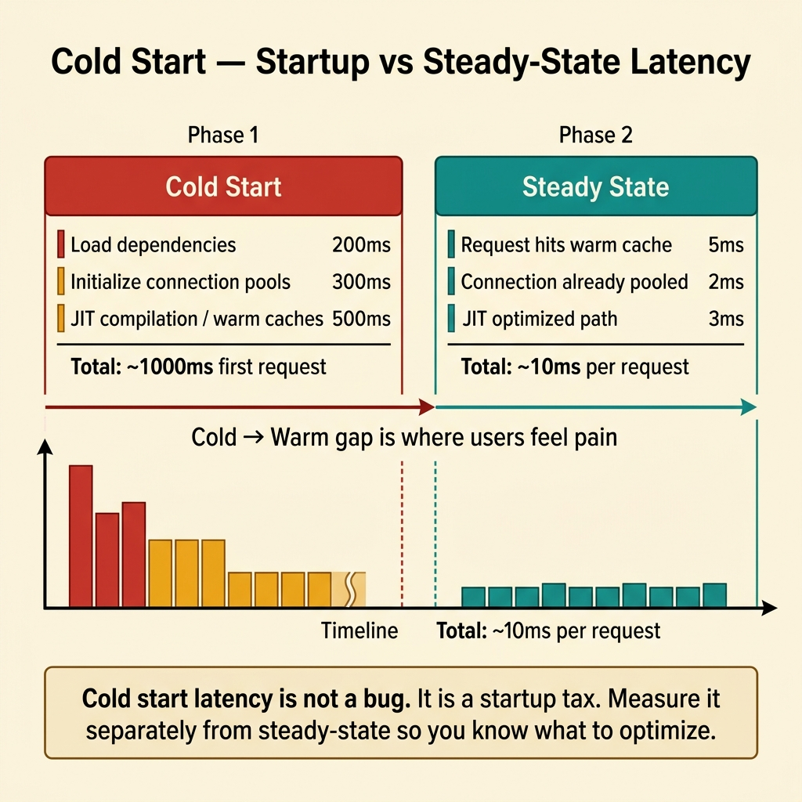
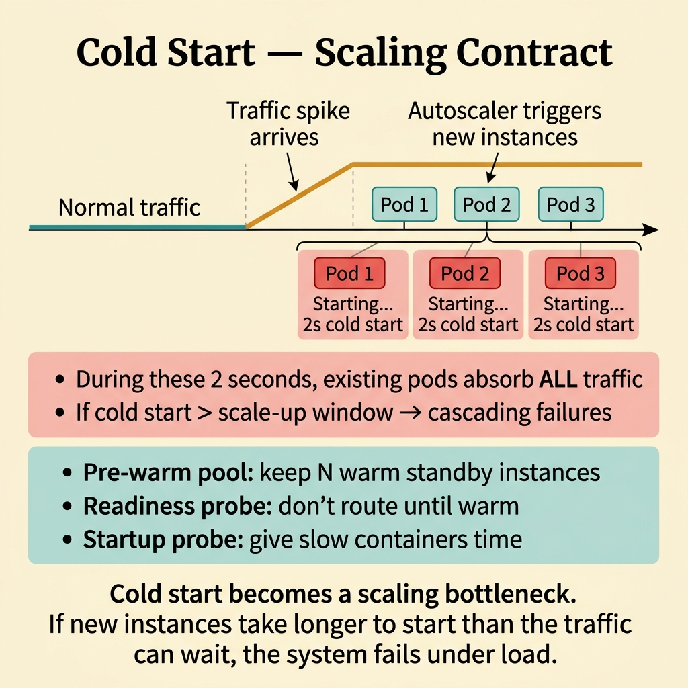
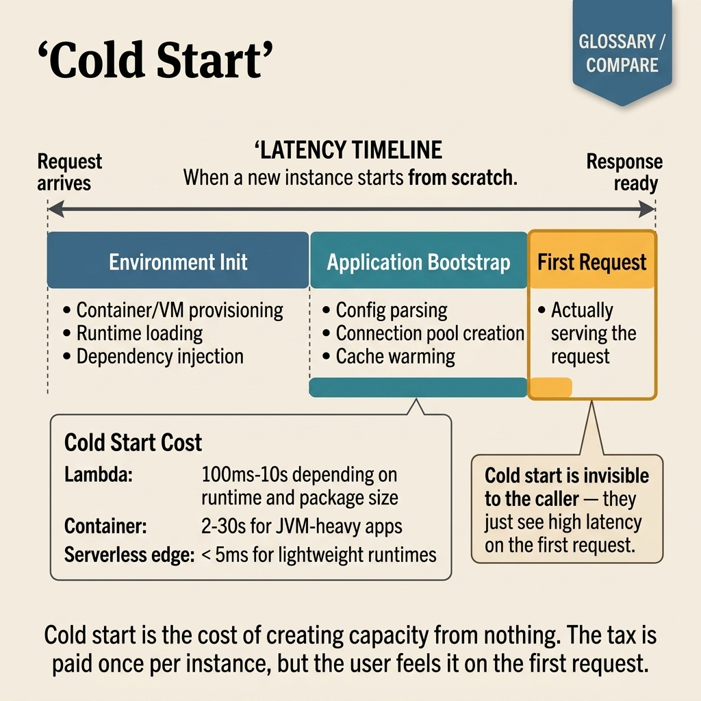

<!-- tags: glossary, reference, deployment-runtime, cold-start -->
# Cold Start

> The latency on the very first invocation when no instance is ready — typically includes pulling the image, initializing the runtime, loading code, and opening resources.

| Aspect | Detail |
| --- | --- |
| **Concept** | The latency on the very first invocation when no instance is ready — typically includes pulling the image, initializing the runtime, loading code, and opening resources. |
| **Audience** | Backend engineer, platform engineer, SRE |
| **Primary style** | Glossary term |
| **Entry point** | Use when a newly spawned instance shows noticeably high latency before truly serving requests |

📅 Created: 2026-03-30 · 🔄 Updated: 2026-04-16 · ⏱️ 7 min read

---

## 1. DEFINE

Picture a service that autoscales beautifully on the dashboard, but the first request after scale-out is noticeably slow because the instance must pull the image, initialize the runtime, and open resources. That is the boundary of Cold Start.

**Cold Start** is the latency on the very first invocation when no instance is ready — typically includes pulling the image, initializing the runtime, loading code, and opening resources.

| Variant | Description |
| --- | --- |
| Container cold start | Latency from image pull, scheduling, or runtime bootstrap. |
| Application cold start | Latency from loading code, initializing dependencies, connecting to the database, and hydrating cache. |
| Scale-to-zero cold path | Cold path that occurs when a worker or function is freshly created from zero capacity. |

| Approach | Time | Space | When to choose |
| --- | --- | --- | --- |
| Pre-provisioned warm capacity | O(1) request path | O(warm capacity) | When the SLA is sensitive to the very first request. |
| Lazy init everything | O(startup path, large) | O(1) | When startup cost is not latency-critical. |
| Targeted warm-up | O(selected init) | O(warmed state) | When only a few init steps truly matter. |

Core insight:

> Cold start is startup debt exposed on the first request. It does not mean the service is always slow — it means the service is slow the moment it is born and has not been prepared.

### 1.1 Invariants & Failure Modes

The common failure mode is looking only at p95 steady-state and ignoring first-request latency. For user-facing systems, cold start can break the SLA even when average metrics look fine.

---

## 2. CONTEXT

**Who uses it**: Backend engineer, platform engineer, SRE

**When**: Use when a newly spawned instance shows noticeably high latency before truly serving requests

**Purpose**: Cold start is startup debt exposed on the first request. It does not mean the service is always slow — it means the service is slow the moment it is born and has not been prepared.

**In the ecosystem**:
- The first request after scale-out is significantly slower than steady-state.
- Scale-to-zero or autoscaling causes short but recurring spikes.
- Startup logs reveal many init steps before the app is ready.

Boundary to hold:
- Cold start differs from warm-up; cold start is the phenomenon, warm-up is the mitigation.
- Cold start differs from warm start because no reusable state exists yet.
- Cold start is not a rollout strategy.

---

Slow startup is clear. But cold start in serverless differs from containers differs from VMs — which mitigation fits each type, and how long can the user wait?

## 3. EXAMPLES

Cold start surfaces most clearly when the first Lambda invocation takes 3 seconds, when a new pod starts but the JVM has not warmed yet, or when a traffic spike triggers a wave of simultaneous cold starts. The examples below place the pattern into exactly those situations.

### Example 1: Basic — Separate startup latency from steady-state latency

> **Goal**: Avoid confusing a slow first request with the entire service being slow.
> **Approach**: Separate metrics for the startup path from the steady-state request path.
> **Example**: An autoscaled API has a healthy p95 but the first hit after scale-out reaches 2 seconds.
> **Complexity**: Basic

```text
  Timeline of a scale-out event:

  ─── steady state (p95: 120ms) ───┐
                                    │ scale-out triggered
                                    ▼
  ┌──────────────────────────────────────────────────────┐
  │ Cold Start Path                                       │
  │ pull image ──► init runtime ──► load code ──► open DB │
  │           200ms      300ms         400ms        900ms │
  │                                    Total: ~1800ms     │
  └──────────────────────────────────────────────────────┘
                                    │
                                    ▼
  ─── steady state resumes (p95: 120ms) ───►

  First request:  1800ms  ⚠️
  Second request:  120ms  ✅
```

*Figure: Cold start hits only the first request on fresh capacity. Steady-state resumes immediately after.*



*Figure: Cold start latency is not a bug. It is a startup tax. Measure it separately from steady-state.*

```yaml
startup_observation:
  startup_latency: 1800ms
  steady_state_p95: 120ms
  trigger: scale_out_event
```

**Why?** Without separating startup latency, the team optimizes the wrong target — tuning queries or business logic while the real bottleneck sits in the bootstrap path.

**Conclusion**: Cold-start analysis should begin from first-request cost.

### Example 2: Intermediate — Warm only the startup path segments that matter

> **Goal**: Reduce cold start without unconditionally pre-initializing everything.
> **Approach**: Identify hot dependencies and preload selectively.
> **Example**: Pre-connect the DB pool and hydrate the config cache, but do not eager-load every secondary module.
> **Complexity**: Intermediate

```text
  Startup critical path analysis:

  ┌── HOT (preload) ───────────────────────────┐
  │  config load        50ms   ███              │
  │  DB pool connect   400ms   ██████████████   │  ← biggest win
  │  template compile  200ms   ███████          │
  └────────────────────────────────────────────┘

  ┌── COLD (defer) ────────────────────────────┐
  │  background jobs    80ms   ████             │  ← not on request path
  │  optional integr   150ms   ██████           │  ← rarely used at boot
  └────────────────────────────────────────────┘

  Before: 880ms total startup
  After:  650ms (hot only) + deferred async = ~200ms first request
```

*Figure: Preload only the segments that block the first request. Defer everything that can initialize after traffic starts.*

```yaml
warm_targets:
  preload:
    - config
    - db_pool
    - hot_templates
  defer:
    - background_jobs
    - optional_integrations
```

**Why?** Not every init step deserves a spot on the startup critical path. Selective warm-up reduces first-request latency without inflating startup cost unnecessarily.

**Conclusion**: Intermediate handling is trimming the startup critical path, not eager-loading everything.

### Example 3: Advanced — Treat cold start as part of the scaling contract

> **Goal**: Ensure autoscaling does not break user experience.
> **Approach**: Set an explicit startup SLO and capacity policy for cold paths.
> **Example**: Keep a minimum number of warm pods during peak hours.
> **Complexity**: Advanced

```text
  Scaling contract timeline:

  06:00                12:00               18:00              00:00
  ├── off-peak ────────┼── peak hours ──────┼── off-peak ──────┤
  │                    │                    │                  │
  │ min_warm: 0        │ min_warm: 2        │ min_warm: 0      │
  │ scale-to-zero OK   │ cold start SLO:    │ scale-to-zero OK │
  │                    │   < 500ms          │                  │
  │ cold starts        │ pre-provisioned    │ cold starts      │
  │ acceptable         │ capacity ready     │ acceptable       │
  └────────────────────┴────────────────────┴──────────────────┘
```

*Figure: During peak hours, warm capacity stays provisioned. Off-peak allows scale-to-zero. The SLO defines the maximum acceptable cold start.*



*Figure: If new instances take longer to start than the traffic can wait, the system fails under load.*

```yaml
scaling_contract:
  min_warm_instances: 2
  cold_start_slo: 500ms
  off_peak_policy: scale_to_zero_allowed
```

**Why?** When cold start is tied to autoscaling, it is no longer an implementation detail. It is a trade-off between cost and latency that the platform must own explicitly.

**Conclusion**: At the advanced level, cold start must be viewed as part of the capacity policy.

---

## 4. COMPARE




*Figure: Position of cold start between fresh-capacity cost, mitigation layer, and readiness expectation.*

Cold start sounds like "slow startup." True, but the real confusion is that it only surfaces when capacity is freshly spawned — not during steady-state behavior.

### Level 1


```text
new instance
  -> pull image / boot runtime
  -> init app
  -> open resources
  -> first request slower
```

*Figure: Level 1 shows cold start as a chain of startup costs before the instance becomes useful.*

### Level 2


```text
scale event happens
  -> no ready instance available
  -> first requests wait for startup path
  -> latency spike appears only on fresh capacity
```

*Figure: Level 2 emphasizes that cold start is tied to fresh capacity, not a reflection of steady-state throughput.*

### Easily confused or boundary-slipping

You have seen at which step of the runtime lifecycle Cold Start belongs. The mistakes below are common misuses where rollout, startup, or recovery sounds right by name but system behavior is entirely different.

| # | Severity | Mistake | Consequence | Fix |
| --- | --- | --- | --- | --- |
| 1 | 🔴 Fatal | Optimizing steady-state without measuring first-request latency | SLA still breaks at scale-out | Measure startup latency separately. |
| 2 | 🟡 Common | Eager-loading everything to eliminate cold start | Startup path bloats unnecessarily | Preload only hot dependencies. |
| 3 | 🟡 Common | Confusing cold start with a rollout bug | Diagnosis goes in the wrong direction | Separate startup issues from release issues. |
| 4 | 🔵 Minor | Not tying cold start to autoscaling policy | Cost-latency trade-off stays vague | Set a clear scaling contract. |

### Quick scan

| If you face | Action |
| --- | --- |
| First request after scale-out is slow | Suspect cold start first |
| Cold path only occurs when spawning a new instance | Separate startup metrics from steady-state |
| Want to reduce cold start | Look at warm-up and capacity policy |

---

## 5. REF

| Resource | Type | Link | Note |
| --- | --- | --- | --- |
| Google SRE Workbook | Reference | https://sre.google/workbook/table-of-contents/ | Strong foundation for release safety and incident response. |
| Argo Rollouts | Reference | https://argo-rollouts.readthedocs.io/ | Useful for rollout patterns like canary and blue-green. |
| LaunchDarkly Guides | Reference | https://launchdarkly.com/docs/ | Useful for release control, flags, and dark launch. |

---

## 6. RECOMMEND

Cold start solves the problem "first request is abnormally slow." The next question: how does warm start differ, and what does a warm-up strategy look like?

| Expand to | When | Reason | File/Link |
| --- | --- | --- | --- |
| Topic hub | When you need to see startup behavior in the full topic context | Preserves the larger lifecycle map | [Deployment & Runtime](./README.md) |
| Next concept | When you want to compare with instances that already have reusable state | Warm start is the closest adjacent concept | [Warm Start](./02-warm-start.md) |
| Mitigation term | When you want to learn how to reduce the cold path | Warm-up is the logical next step | [Warm-up](./03-warm-up.md) |

Back to the 3-second Lambda at the start — the first user waits, the rest are fast. Now you know: provisioned concurrency for serverless, readiness probes for containers, warm-up requests for JVM. Each layer has its own approach.

**Links**: [← Previous](./README.md) · [→ Next](./02-warm-start.md)
