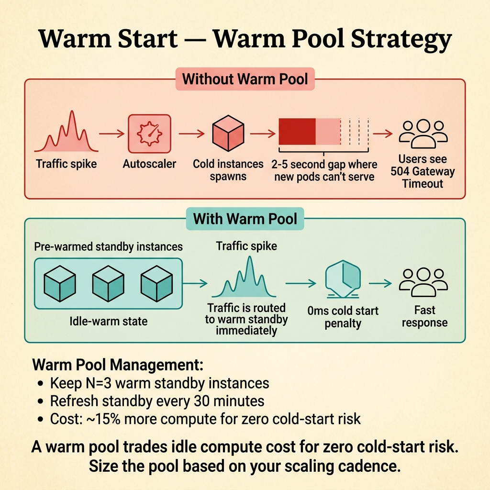

<!-- tags: glossary, reference, deployment-runtime, warm-start -->
# Warm Start

> The startup state when an instance or runtime already has partial state, resources, or artifacts available, making it noticeably faster than a cold start.

| Aspect | Detail |
| --- | --- |
| **Concept** | The startup state when an instance or runtime already has partial state, resources, or artifacts available, making it noticeably faster than a cold start. |
| **Audience** | Backend engineer, platform engineer, SRE |
| **Primary style** | Glossary term |
| **Entry point** | Use when you need to distinguish a subsequent startup or reused instance from a completely fresh cold start |

📅 Created: 2026-03-30 · 🔄 Updated: 2026-04-16 · ⏱️ 7 min read

---

## 1. DEFINE

Not every startup is the same. Some instances still go through the startup path but complete it far faster because the image is already cached, connections have been retained, or resources have been primed. That is the boundary of Warm Start.

**Warm Start** is the startup state when an instance or runtime already has partial state, resources, or artifacts available, making it noticeably faster than a cold start.

| Variant | Description |
| --- | --- |
| Container warm start | Image or runtime artifacts are already present on the node. |
| Application warm start | Part of the cache, compiled templates, or connection state has been reused. |
| Traffic warm handoff | Instance is near-ready thanks to warm-up before receiving traffic. |

| Approach | Time | Space | When to choose |
| --- | --- | --- | --- |
| Rely on natural warm state | O(reduced startup path) | O(existing state) | When the platform already provides good reuse. |
| Maintain warm pool | O(near-ready path) | O(warm capacity) | When cold start is too expensive but full pre-provisioning is not yet needed. |
| Explicit priming | O(targeted init) | O(primed state) | When you want to warm a few clear bottlenecks. |

Core insight:

> Warm start is not a separate deployment pattern. It describes the startup state where part of the cost has already been paid upfront.

### 1.1 Invariants & Failure Modes

The common failure mode is attributing every faster startup to a successful warm-up, when often it is just incidental platform reuse.

---

## 2. CONTEXT

**Who uses it**: Backend engineer, platform engineer, SRE

**When**: Use when you need to distinguish a subsequent startup or reused instance from a completely fresh cold start

**Purpose**: Warm start is not a separate deployment pattern. It describes the startup state where part of the cost has already been paid upfront.

**In the ecosystem**:
- First startup is noticeably slower than subsequent ones.
- Node or runtime reuse means the first request after a restart is not as bad.
- Warm instances start serving traffic sooner than cold instances.

Boundary to hold:
- Warm start differs from warm-up; warm-up is an action, warm start is an observed state.
- Warm start does not mean zero latency.
- Warm start still has startup cost — just less than cold start.

---

The instance is already partly ready — that is clear. But how long before warm becomes cold again, what is the memory overhead of warm instances, and what does the cost trade-off look like?

## 3. EXAMPLES

Warm start surfaces most clearly when a Lambda reuses its container and responds under 100 ms, when a pod's warm cache is lost after a restart, or when a keep-warm strategy costs money but drops p99 latency. The examples below place the pattern into exactly those situations.

### Example 1: Basic — Distinguish warm start from cold start in metrics

> **Goal**: Avoid mixing two startup states into the same measurement bucket.
> **Approach**: Separate measurements by startup condition.
> **Example**: The first pod on a node behaves very differently from the third pod on the same node.
> **Complexity**: Basic

```text
  Same service, different startup conditions:

  Pod A (cold start — first on node):
  ┌─────────────────────────────────────────────────┐
  │ pull image ► init runtime ► load code ► open DB │
  │    200ms        300ms         400ms       900ms │
  │                              Total: ~1800ms  ⚠️ │
  └─────────────────────────────────────────────────┘

  Pod B (warm start — third on same node):
  ┌─────────────────────────────────────────────────┐
  │ (image cached) ► init runtime ► load code ► DB  │
  │      0ms            100ms        200ms    300ms │
  │                              Total: ~600ms   ✅ │
  └─────────────────────────────────────────────────┘
```

*Figure: Pod A pays the full cold start cost. Pod B skips the image pull and benefits from cached layers — 3× faster.*


*Figure: Warm start and cold start are different performance regimes. Mixing them in one metric hides the real problem.*

```yaml
startup_classes:
  cold_start: no_reused_layers_or_state
  warm_start: reused_layers_or_partial_state
```

**Why?** Merging cold and warm into a single average metric destroys visibility into actual startup behavior.

**Conclusion**: Warm start must be measured as a separate startup class.

### Example 2: Intermediate — Use a warm pool to reduce first-request spikes

> **Goal**: Keep a near-ready capacity reserve without over-provisioning entirely.
> **Approach**: Maintain a minimum number of warm instances during traffic-sensitive periods.
> **Example**: An API keeps 2 warm instances during peak hours.
> **Complexity**: Intermediate

```text
  Warm pool timeline:

  06:00         12:00 (peak start)    18:00 (peak end)     00:00
  ──────────────┬─────────────────────┬────────────────────┤
  min_ready: 0  │ min_ready: 2        │ min_ready: 0       │
                │                     │                    │
  cold starts   │ ┌─ warm pool ─────┐ │ scale-to-zero OK   │
  accepted      │ │ Pod A: ready ✅ │ │                    │
                │ │ Pod B: ready ✅ │ │                    │
                │ └─────────────────┘ │                    │
                │ new traffic → no    │                    │
                │ cold start ✅       │                    │
```

*Figure: During peak hours, two pods stay warm. Traffic arrives without a cold start penalty. Off-peak scales back to zero.*



*Figure: A warm pool trades idle compute cost for zero cold-start risk.*

```yaml
warm_pool_policy:
  peak_hours_min_ready: 2
  off_peak_min_ready: 0
  objective: reduce_first_request_spike
```

**Why?** A warm pool trades a portion of idle cost for a portion of latency improvement.

**Conclusion**: Warm-start optimization is usually capacity shaping, not a code trick.

### Example 3: Advanced — Determine which startup segments should become standard warm state

> **Goal**: Know which resources are worth keeping warm long-term.
> **Approach**: Promote artifacts with high startup cost and high reuse rate as warm-state candidates.
> **Example**: DB pools, compiled templates, auth metadata cache.
> **Complexity**: Advanced

```text
  Warm-state candidate evaluation:

  Resource            Startup Cost    Reuse Rate    Verdict
  ──────────────────  ─────────────   ──────────    ──────────────
  DB connection pool   400ms  HIGH     99%  HIGH    ✅ warm candidate
  Config cache          50ms  LOW      99%  HIGH    ✅ warm candidate
  Compiled templates   200ms  MED      80%  HIGH    ✅ warm candidate
  Rare integration     150ms  MED       5%  LOW     ❌ not worth warming
  Background scheduler  80ms  LOW      10%  LOW     ❌ defer to async
```

*Figure: High startup cost + high reuse rate = warm candidate. Low reuse rate = defer regardless of cost.*

```yaml
warm_state_candidates:
  high_value_reuse:
    - db_pool
    - config_cache
    - compiled_templates
  avoid_overwarming:
    - rarely_used_integrations
```

**Why?** Not every state is worth warming. Advanced thinking selects only the resources that genuinely cut the startup critical path.

**Conclusion**: At the advanced level, warm start is the result of deliberate runtime design.

---

## 4. COMPARE


*Figure: Warm start placed as an observed state — startup cost has been partly paid upfront, but not to be confused with a warm-up action or a deployment strategy.*

Warm start sounds like "already booted," but the real boundary is narrower: it describes a startup state shortened by reuse. It does not explain where the reuse came from or how long it lasts.

### Level 1


```text
cold start: full bootstrap
warm start: partial bootstrap with reused state
```

*Figure: Level 1 places warm start next to cold start to show it is a shortened startup.*

### Level 2


```text
same artifact
  -> first launch pays full startup cost
  -> later launch reuses layers/state
  -> latency improves but not zero
```

*Figure: Level 2 shows warm start comes from environment or artifact reuse.*

### Easily confused or boundary-slipping

You have seen at which step of the runtime lifecycle Warm Start belongs. The mistakes below are common misuses where rollout, startup, or recovery sounds right by name but system behavior is entirely different.

| # | Severity | Mistake | Consequence | Fix |
| --- | --- | --- | --- | --- |
| 1 | 🔴 Fatal | Merging cold and warm startup into a single metric | Lose visibility into real startup behavior | Separate startup classes clearly in metrics. |
| 2 | 🟡 Common | Confusing warm start with warm-up | Misjudge the effectiveness of optimization | Distinguish observed state from action taken. |
| 3 | 🟡 Common | Maintaining too large a warm pool | Cost increases unnecessarily | Optimize by traffic window. |
| 4 | 🔵 Minor | Reused state is not documented | Difficult to reproduce behavior across environments | Document warm-state assumptions explicitly. |

### Quick scan

| If you face | Action |
| --- | --- |
| Subsequent startups are faster than the first | Suspect warm start |
| Want to reduce cold path without heavy over-provisioning | Look at warm pool |
| Not sure where the warm start is coming from | Separate platform reuse from deliberate warm-up |

---

## 5. REF

| Resource | Type | Link | Note |
| --- | --- | --- | --- |
| Google SRE Workbook | Reference | https://sre.google/workbook/table-of-contents/ | Strong foundation for release safety and incident response. |
| Argo Rollouts | Reference | https://argo-rollouts.readthedocs.io/ | Useful for rollout patterns like canary and blue-green. |
| LaunchDarkly Guides | Reference | https://launchdarkly.com/docs/ | Useful for release control, flags, and dark launch. |

---

## 6. RECOMMEND

Warm start solves the problem "keeping instances ready for the next request." The next question: how does proactive warm-up work, and what does a blue-green deployment look like?

| Expand to | When | Reason | File/Link |
| --- | --- | --- | --- |
| Previous concept | When you just learned cold start and want to compare the faster state | Keeps the boundary between cold and warm clear | [Cold Start](./01-cold-start.md) |
| Next concept | When you want to see the proactive action that creates warm state | Warm-up is the logical next step | [Warm-up](./03-warm-up.md) |
| Topic hub | When you need to return to the full lifecycle | Preserves the larger learning path | [Deployment & Runtime](./README.md) |

Back to the Lambda reuse at the start — 100 ms response vs 3 seconds cold. Now you know: warm state is a resource, not free. A keep-warm strategy balances cost against latency. Measure p99, calculate the bill, then decide.

**Links**: [← Previous](./01-cold-start.md) · [→ Next](./03-warm-up.md)
