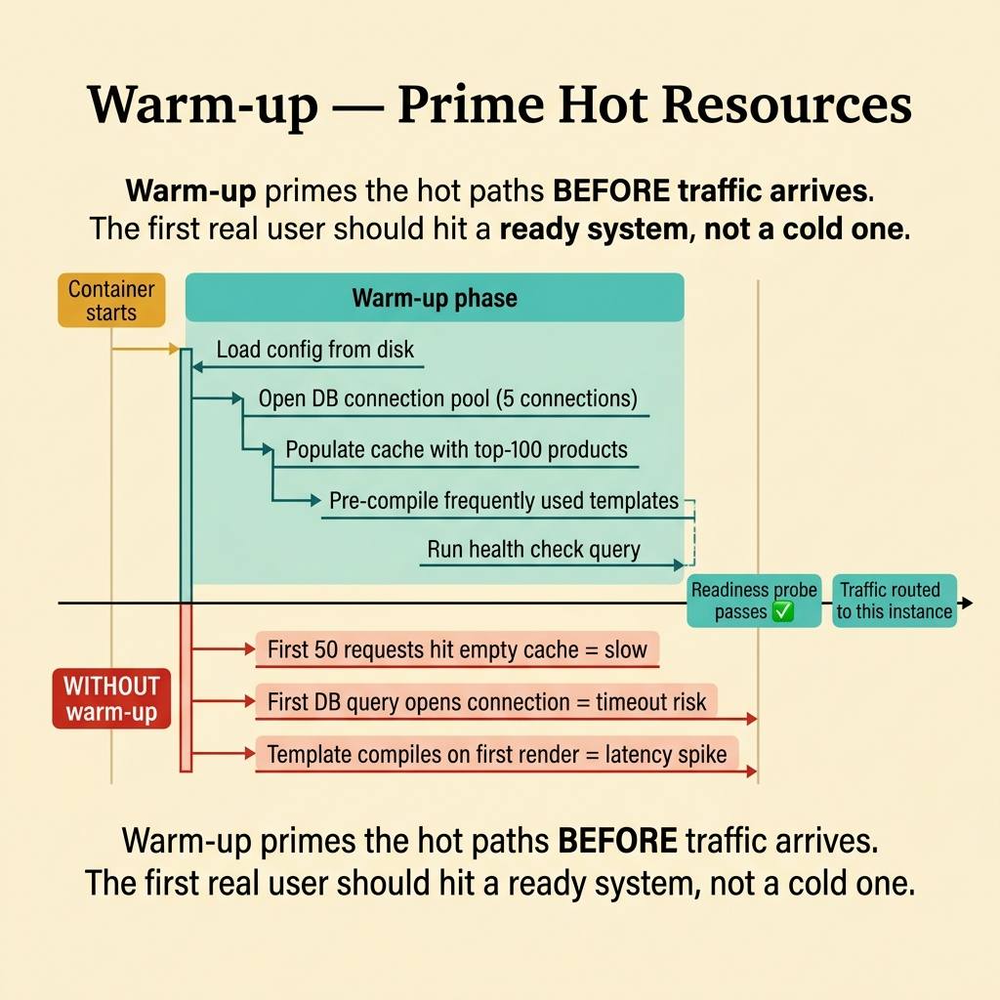
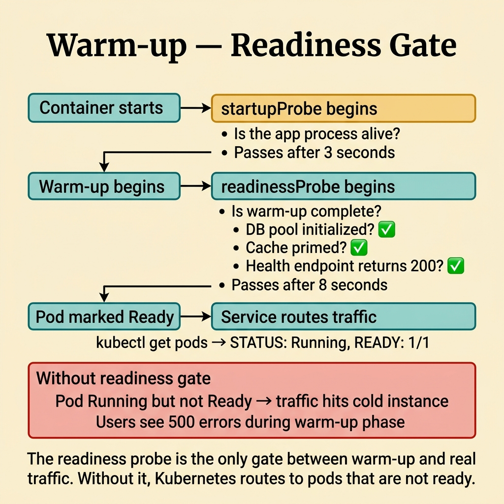
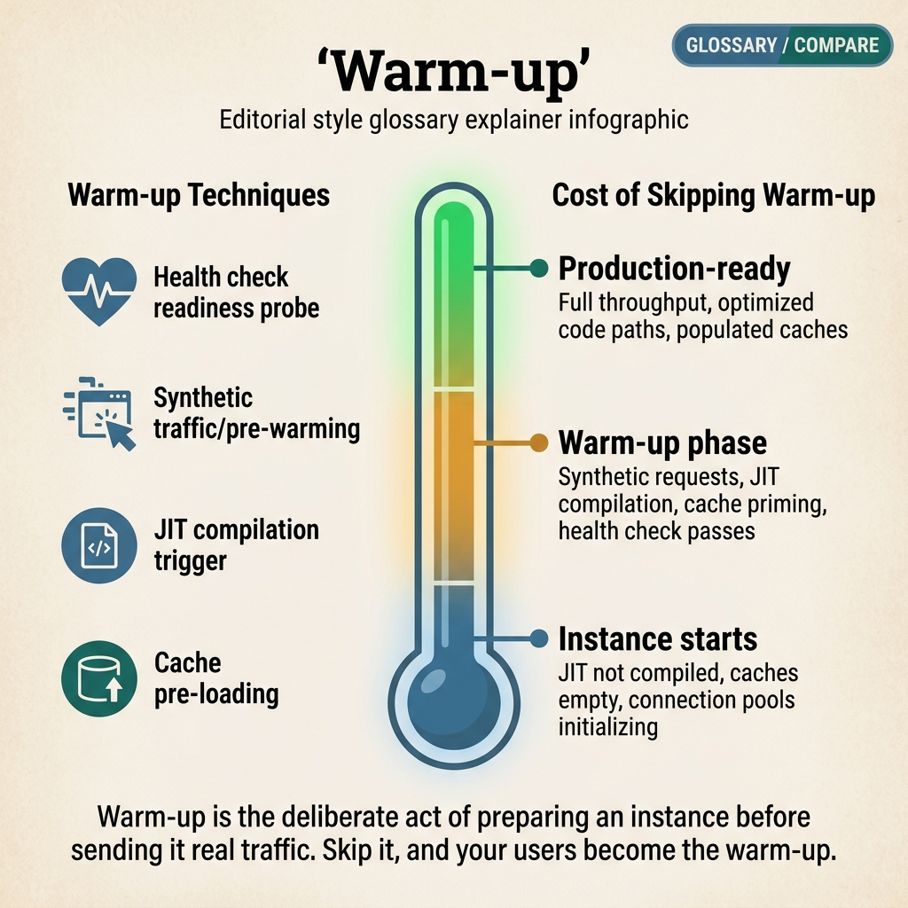

<!-- tags: glossary, reference, deployment-runtime, warm-up -->
# Warm-up

> Proactive actions that prepare an instance or service before it receives traffic — priming caches, opening connections, or running synthetic requests.

| Aspect | Detail |
| --- | --- |
| **Concept** | Proactive actions that prepare an instance or service before it receives traffic — priming caches, opening connections, or running synthetic requests. |
| **Audience** | Backend engineer, platform engineer, SRE |
| **Primary style** | Glossary term |
| **Entry point** | Use when discussing the runtime preparation step before an instance officially serves requests |

📅 Created: 2026-03-30 · 🔄 Updated: 2026-04-16 · ⏱️ 7 min read

---

## 1. DEFINE

Picture an instance that is already running but should not receive real traffic yet. The cache is empty, the connection pool is not open, and critical dependencies have not been touched. When the team proactively prepares the instance before it takes load, that is the boundary of Warm-up.

**Warm-up** is the set of proactive actions that prepare an instance or service before it receives traffic — priming caches, opening connections, or running synthetic requests.

| Variant | Description |
| --- | --- |
| Startup warm-up | Prime resources immediately when the instance boots. |
| Pre-traffic warm-up | Prepare the instance before adding it to the load balancer. |
| Synthetic traffic warm-up | Use simulated requests to heat critical paths. |

| Approach | Time | Space | When to choose |
| --- | --- | --- | --- |
| Eager full warm-up | O(full prep cost) | O(all warmed resources) | When startup cost is small and first-request safety is critical. |
| Targeted hot-path warm-up | O(selected prep cost) | O(selected warmed state) | When only a few paths are truly sensitive to first-request latency. |
| Background gradual warm-up | O(progressive) | O(progressive state) | When reducing the startup burst while still preparing gradually. |

Core insight:

> Warm-up is a proactive action. Its value lies in converting startup uncertainty into a deliberate, measurable preparation step.

### 1.1 Invariants & Failure Modes

The common failure mode is turning warm-up into a dumping ground for every init step. When that happens, readiness stretches indefinitely and warm-up becomes the new bottleneck.

---

## 2. CONTEXT

**Who uses it**: Backend engineer, platform engineer, SRE

**When**: Use when discussing the runtime preparation step before an instance officially serves requests

**Purpose**: Warm-up is a proactive action. Its value lies in converting startup uncertainty into a deliberate, measurable preparation step.

**In the ecosystem**:
- The instance is ready in terms of process state but not ready in terms of workload state.
- First requests typically bring up the database pool, config cache, or hot paths slowly.
- Rollout needs gating before the instance receives real traffic.

Boundary to hold:
- Warm-up differs from warm start. Warm start is an observed state; warm-up is a deliberate action.
- Warm-up differs from health check. Health check only confirms; warm-up proactively prepares.
- Warm-up does not decide rollout strategy on its own.

---

Heating the instance before traffic is clear. But how long should warm-up take, what should be warmed, and how does the readiness probe connect to warm-up?

## 3. EXAMPLES

Warm-up surfaces most clearly when a JVM service's first request is 10× slower because JIT has not compiled yet, when the cache is empty after deploy and the database gets spiked, or when the connection pool is lazy-initialized and the first request must wait for a connection. The examples below place the pattern into exactly those situations.

### Example 1: Basic — Prime hot resources before receiving traffic

> **Goal**: Reduce first-request latency and post-deploy spikes.
> **Approach**: Warm the resources that have a direct impact on the critical path.
> **Example**: Open the database pool and load the config cache before marking ready.
> **Complexity**: Basic

```text
  Instance startup with warm-up:

  Boot
   │
   ├── process alive ✅
   │
   ├── warm-up phase begins:
   │    ├── open DB pool ──────────► pool ready ✅
   │    ├── load config cache ─────► cache seeded ✅
   │    └── compile hot route templates ► compiled ✅
   │
   ├── warm-up complete ✅
   │
   ├── readiness = true ✅
   │
   └── traffic starts flowing ──► first request is fast ✅
```

*Figure: The instance is alive early, but traffic only arrives after warm-up completes. The first user never pays the startup cost.*



*Figure: Warm-up primes the hot paths BEFORE traffic arrives. The first real user should hit a ready system.*

```yaml
warm_up_targets:
  before_ready:
    - db_pool
    - config_cache
    - hot_route_templates
```

**Why?** If the instance receives traffic before these resources are ready, the first user pays the startup cost on behalf of the system.

**Conclusion**: Basic warm-up is preparing hot resources before opening the door for traffic.

### Example 2: Intermediate — Attach warm-up to the readiness gate

> **Goal**: Prevent the load balancer from sending requests to a new instance just because its process is alive.
> **Approach**: Only mark ready after essential warm-up steps are complete.
> **Example**: The readiness probe turns green only after warm-up finishes.
> **Complexity**: Intermediate

```text
  Warm-up gated readiness:

  ┌─ Kubernetes Pod Lifecycle ──────────────────────┐
  │                                                 │
  │  liveness probe ──► process alive?  ✅          │
  │  (checks every 10s)                             │
  │                                                 │
  │  readiness probe ──► warm-up complete?          │
  │  │                                              │
  │  ├── db_connected?          ──► YES ✅          │
  │  ├── hot_cache_seeded?      ──► YES ✅          │
  │  ├── critical_deps_healthy? ──► YES ✅          │
  │  │                                              │
  │  └── readiness = true ✅                        │
  │      pod added to Service endpoints             │
  │      load balancer starts sending traffic        │
  │                                                 │
  └─────────────────────────────────────────────────┘

  ⚠️ Without warm-up gating:
     readiness = true as soon as process starts
     first requests hit cold cache → latency spike
```

*Figure: Liveness confirms the process is alive. Readiness confirms the workload is prepared. Without this separation, the instance serves traffic before it is actually ready.*



*Figure: The readiness probe is the only gate between warm-up and real traffic.*

```yaml
readiness_gate:
  process_alive: true
  warm_up_complete_required: true
  ready_after:
    - db_connected
    - hot_cache_seeded
```

**Why?** Warm-up is most useful when it is wired into traffic gating. Without the gate, the instance can still be hit with requests too early.

**Conclusion**: Intermediate warm-up is readiness discipline.

### Example 3: Advanced — Optimize warm-up cost by priming only the hot paths

> **Goal**: Avoid over-warming that slows deploy or makes scale-out expensive.
> **Approach**: Classify hot paths and lazy-load rarely used paths.
> **Example**: Prime the 3 endpoints that handle 80% of traffic; defer admin paths.
> **Complexity**: Advanced

```text
  Warm-up budget allocation:

  ┌─ Eager warm-up (before ready) ─────────────────┐
  │                                                 │
  │  search_home     ──► 45% of traffic  ──► WARM ✅│
  │  product_detail  ──► 25% of traffic  ──► WARM ✅│
  │  auth_metadata   ──► 10% of traffic  ──► WARM ✅│
  │                                                 │
  │  Total: 80% of traffic covered                  │
  │  Warm-up time: ~2 seconds                       │
  └─────────────────────────────────────────────────┘

  ┌─ Lazy after ready ─────────────────────────────┐
  │                                                 │
  │  admin_reports   ──► 3% of traffic  ──► LAZY   │
  │  analytics_export──► 1% of traffic  ──► LAZY   │
  │  debug_endpoints ──► <1% of traffic ──► LAZY   │
  │                                                 │
  │  Loaded on first request (acceptable latency)   │
  └─────────────────────────────────────────────────┘
```

*Figure: The 80/20 rule applied to warm-up. Hot paths are primed eagerly. Rare paths are loaded lazily after readiness, keeping startup fast.*

```yaml
warm_up_budget:
  hot_path_share: 0.8
  eager_prime:
    - search_home
    - product_detail
    - auth_metadata
  lazy_after_ready:
    - admin_reports
```

**Why?** Unlimited warm-up turns readiness into a new bottleneck. Advanced design optimizes based on traffic reality.

**Conclusion**: At the advanced level, warm-up needs a clear budget and scope.

---

## 4. COMPARE




*Figure: Warm-up as action before traffic — prime the right hot paths, wire into readiness, and budget the prep time so startup does not become a new bottleneck.*

Warm-up sounds like a health check, but the real focus is on deliberate action. Prime the resources that hurt on the hot path, then use readiness to block traffic until the critical preparation is complete.

### Level 1


```text
instance boot
  -> warm cache / open pool / prime hot path
  -> mark ready
  -> receive traffic
```

*Figure: Level 1 shows warm-up as a step inserted before traffic reaches the instance.*

### Level 2


```text
need readiness?
  -> process healthy only is not enough
  -> workload ready then attach to traffic
```

*Figure: Level 2 emphasizes that technical readiness is not the same as operational readiness.*

### Easily confused or boundary-slipping

You have seen at which step of the runtime lifecycle Warm-up belongs. The mistakes below are common misuses where rollout, startup, or recovery sounds right by name but system behavior is entirely different.

| # | Severity | Mistake | Consequence | Fix |
| --- | --- | --- | --- | --- |
| 1 | 🔴 Fatal | Marking ready before warm-up completes | First user pays the startup cost | Wire warm-up into the readiness gate. |
| 2 | 🟡 Common | Warming everything that can be warmed | Deploy and scale-out become excessively slow | Prime only the hot paths. |
| 3 | 🟡 Common | Confusing health check with warm-up | Instance is healthy but not workload-ready | Separate liveness, readiness, and warm-up clearly. |
| 4 | 🔵 Minor | Not measuring warm-up duration | Impossible to know which optimizations actually help | Emit metrics for warm-up stages. |

### Quick scan

| If you face | Action |
| --- | --- |
| Instance is alive but the first request is still slow | Add warm-up before readiness |
| Readiness turns green too early | Review the warm-up gate |
| Deploy is slow because init does too much | Limit warm-up to hot paths only |

---

## 5. REF

| Resource | Type | Link | Note |
| --- | --- | --- | --- |
| Google SRE Workbook | Reference | https://sre.google/workbook/table-of-contents/ | Strong foundation for release safety and incident response. |
| Argo Rollouts | Reference | https://argo-rollouts.readthedocs.io/ | Useful for rollout patterns like canary and blue-green. |
| LaunchDarkly Guides | Reference | https://launchdarkly.com/docs/ | Useful for release control, flags, and dark launch. |

---

## 6. RECOMMEND

Warm-up solves the problem "first request after deploy is abnormally slow." The next question: how does blue-green swap work, and how does canary roll out?

| Expand to | When | Reason | File/Link |
| --- | --- | --- | --- |
| Previous concept | After learning warm start and wanting to see the action that creates it | Warm-up is the logical next step | [Warm Start](./02-warm-start.md) |
| Next concept | When transitioning from startup to rollout strategy | Blue-green is the first deployment strategy to learn next | [Blue-Green Deployment](./04-blue-green-deployment.md) |
| Topic hub | When returning to the lifecycle map | Preserves the larger context | [Deployment & Runtime](./README.md) |

Back to the JVM 10× slowdown at the start — JIT had not compiled the hot path. Now you know: send warm-up requests before readiness = true. Cache, pool, JIT — warm everything, then open for traffic. Users are not your warm-up tool.

**Links**: [← Previous](./02-warm-start.md) · [→ Next](./04-blue-green-deployment.md)
