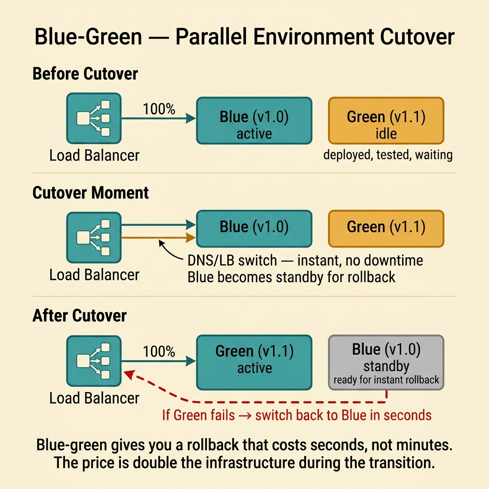
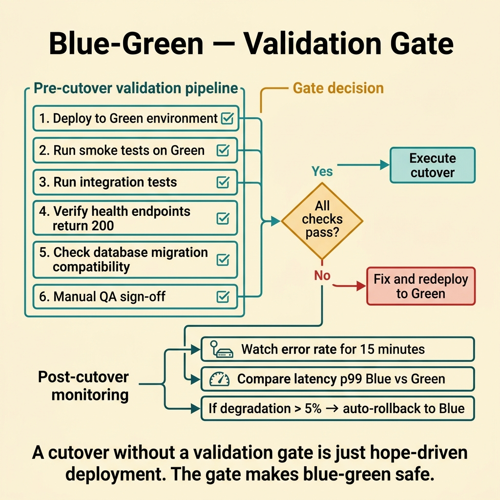
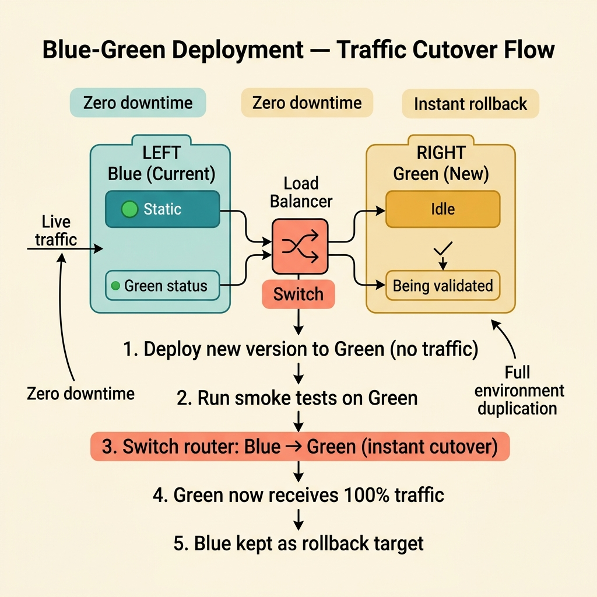

<!-- tags: glossary, reference, deployment-runtime, blue-green-deployment -->
# Blue-Green Deployment

> A strategy that maintains two near-identical production environments to switch traffic quickly and roll back safely.

| Aspect | Detail |
| --- | --- |
| **Concept** | A strategy that maintains two near-identical production environments to switch traffic quickly and roll back safely. |
| **Audience** | Backend engineer, platform engineer, SRE, reviewer |
| **Primary style** | Glossary term |
| **Entry point** | Use when traffic needs to be switched atomically between two near-identical environments |

📅 Created: 2026-03-30 · 🔄 Updated: 2026-04-16 · ⏱️ 8 min read

---

## 1. DEFINE

Picture an API service that serves millions of requests per hour. The team cannot afford a broken deploy to last for minutes. Blue-green maintains two identical environments side by side. Deploy to green, validate green, switch traffic to green. If anything breaks, switch back to blue in seconds. That is the boundary of Blue-Green Deployment.

**Blue-Green Deployment** is a strategy that maintains two near-identical production environments to switch traffic quickly and roll back safely.

| Variant | Description |
| --- | --- |
| Full traffic switch | Move all traffic from blue to green at a single point in time. |
| Validated green before switch | Smoke test green before the full cutover. |
| Quick fallback pair | Keep blue as an instant rollback target after the switch. |

| Approach | Time | Space | When to choose |
| --- | --- | --- | --- |
| In-place deploy | O(1) envs | O(1) | When accepting less flexible rollback. |
| Blue-green full swap | O(2) envs | O(double env cost) | When instant rollback via traffic switch is needed. |
| Blue-green with validation gate | O(2) envs + checks | O(double env cost) | When rollout needs smoke/integration validation before cutover. |

Core insight:

> Blue-green buys rollback speed at the cost of infrastructure and environment parity discipline.

### 1.1 Invariants & Failure Modes

The common failure mode is calling it blue-green but letting the two environments drift out of parity. When blue and green are not identical, the cutover and rollback become unpredictable.

---

## 2. CONTEXT

**Who uses it**: Backend engineer, platform engineer, SRE, reviewer

**When**: Use when traffic needs to be switched atomically between two near-identical environments

**Purpose**: Blue-green buys rollback speed at the cost of infrastructure and environment parity discipline.

**In the ecosystem**:
- The release lifecycle needs a name for the full cutover strategy with instant rollback.
- Runbooks and design reviews mention blue-green without specifying parity discipline or data contracts.
- The team needs a release strategy where rollback is a traffic operation, not a redeploy operation.

Boundary to hold:
- Blue-green belongs to the deployment-runtime layer, not a business-domain term.
- Blue-green is full cutover; canary is gradual exposure. Different rollout profiles.
- Blue-green does not eliminate data compatibility risk. Schema must support both versions temporarily.

---

Two parallel environments is clear. But how does database migration work, how fast is rollback, and what is the cost of running two environments simultaneously?

## 3. EXAMPLES

Blue-green surfaces most clearly when a new deploy needs instant rollback but rolling update is not fast enough, when a database schema change breaks both blue and green, or when the team is running 2× infrastructure cost for every release. The examples below place the pattern into exactly those situations.

### Example 1: Basic — Prepare a parallel environment before cutover

> **Goal**: Do not touch the environment that is currently live.
> **Approach**: Prepare green in parallel with blue, then switch traffic.
> **Example**: An API production service needs to roll out a new version with near-instant rollback.
> **Complexity**: Basic

```text
  Blue-green traffic switch:

  BEFORE cutover:
  ┌───────────────────────────────────────────────┐
  │  Load Balancer                                │
  │       │                                       │
  │       ▼                                       │
  │  ┌─────────┐          ┌─────────┐             │
  │  │  BLUE   │ ◄─ live  │  GREEN  │ ◄─ idle    │
  │  │  (v1)   │          │  (v2)   │  deploying  │
  │  └─────────┘          └─────────┘             │
  └───────────────────────────────────────────────┘

  AFTER cutover:
  ┌───────────────────────────────────────────────┐
  │  Load Balancer                                │
  │       │                                       │
  │       ▼                                       │
  │  ┌─────────┐          ┌─────────┐             │
  │  │  BLUE   │ ◄─ idle  │  GREEN  │ ◄─ live    │
  │  │  (v1)   │ standby  │  (v2)   │             │
  │  └─────────┘          └─────────┘             │
  └───────────────────────────────────────────────┘

  If GREEN fails → switch back to BLUE in ~30 seconds
```

*Figure: Traffic moves atomically from blue to green. Blue remains idle as instant rollback target. No partial state — either all traffic goes to blue or all to green.*



*Figure: Blue-green gives you a rollback that costs seconds, not minutes. The price is double infrastructure during transition.*

```yaml
blue_green_plan:
  current_live: blue
  candidate: green
  switch_method: load_balancer_cutover
```

**Why?** When the new environment stands beside the old one, rollback becomes a traffic operation instead of a redeploy operation.

**Conclusion**: Blue-green separates the release candidate from the live environment.

### Example 2: Intermediate — Attach cutover to a validation gate

> **Goal**: Do not switch all traffic just because the build is done.
> **Approach**: Run smoke and integration checks on green before cutover.
> **Example**: Green must pass health, dependency checks, and synthetic transactions.
> **Complexity**: Intermediate

```text
  Validated blue-green cutover:

  Green deployed ✅
       │
       ├── health_checks ──────────► ✅ pass
       ├── synthetic_transactions ──► ✅ pass
       ├── dependency_connectivity ─► ✅ pass
       │
       ▼
  ┌─ Validation Gate ─────────────────────────────┐
  │  All checks pass?                              │
  │  ├── YES ──► proceed to cutover               │
  │  └── NO  ──► abort, keep blue live            │
  └────────────────────────────────────────────────┘
       │
       ▼
  Load Balancer switches to GREEN ✅
```

*Figure: The cutover only proceeds after all validation checks pass. A single failure keeps blue as the live environment.*



*Figure: A cutover without a validation gate is hope-driven deployment. The gate makes blue-green safe.*

```yaml
validation_gate:
  before_cutover:
    - health_checks
    - synthetic_transactions
    - dependency_connectivity
```

**Why?** Blue-green reduces rollback risk but still needs to reduce the risk of a bad cutover.

**Conclusion**: Blue-green is safer when the cutover goes through a validation gate.

### Example 3: Advanced — Manage blue-green as a release strategy that touches the data contract

> **Goal**: Prevent the app from switching quickly while the data layer is incompatible.
> **Approach**: Check backward compatibility of schema, jobs, and side effects before cutover.
> **Example**: The new version needs an additive schema so blue and green can coexist briefly.
> **Complexity**: Advanced

```text
  Blue-green data contract:

  ┌─ Schema compatibility matrix ──────────────────┐
  │                                                 │
  │  Migration type     Blue-safe?   Green-safe?    │
  │  ────────────────── ──────────── ────────────── │
  │  ADD column          ✅ yes       ✅ yes        │
  │  ADD table           ✅ yes       ✅ yes        │
  │  RENAME column       ❌ no        ✅ yes        │
  │  DROP column         ❌ no        ❌ no         │
  │  CHANGE type         ❌ no        ✅ maybe      │
  └─────────────────────────────────────────────────┘

  Rule: only additive migrations before cutover.
  Destructive migrations happen AFTER blue is decommissioned.

  Timeline:
  1. Apply additive migration (both versions work)
  2. Switch traffic to green
  3. Observe for 24-48 hours
  4. Decommission blue
  5. Apply destructive migration (clean up old columns)
```

*Figure: The schema compatibility matrix shows which migration types are safe for blue-green coexistence. Only additive changes are allowed before the switch.*

```yaml
compatibility_contract:
  app_versions_running_in_parallel: true
  schema_policy: additive_first
  rollback_safe_if: old_version_can_still_run
```

**Why?** Blue-green only provides fast rollback if both the app and the data contract allow reversal.

**Conclusion**: Blue-green is durable when paired with schema and side-effect compatibility.

---

## 4. COMPARE




*Figure: Blue-green as a full cutover strategy — it buys rollback speed through environment parity and compatibility discipline, not through traffic wizardry alone.*

Blue-green sounds like canary, but the decision boundary is different. Blue-green is a monolithic swap strategy to change the rollback profile. It does not provide gradual exposure or eliminate data contract risk.

### Level 1


```text
Blue serves traffic
Green prepared in parallel
Switch traffic -> Green
If bad -> switch back to Blue
```

*Figure: Level 1 shows the basic shape of blue-green in the deployment lifecycle.*

### Level 2


```text
Need safer full cutover?
  -> keep two near-identical envs
  -> validate green
  -> switch traffic atomically
```

*Figure: Level 2 turns the term into a decision boundary — blue-green is a rollback-speed purchase, not a gradual rollout.*

### Easily confused or boundary-slipping

You have seen at which step of the runtime lifecycle Blue-Green Deployment belongs. The mistakes below are common misuses where rollout, startup, or recovery sounds right by name but system behavior is entirely different.

| # | Severity | Mistake | Consequence | Fix |
| --- | --- | --- | --- | --- |
| 1 | 🔴 Fatal | Two environments no longer maintain parity | Cutover or rollback behaves differently than expected | Keep environment parity as a hard requirement. |
| 2 | 🟡 Common | App switches fast but schema is not rollback-safe | Rollback fails at the data layer | Use additive migrations first. |
| 3 | 🟡 Common | Not testing green before cutover | All traffic goes to an unvalidated candidate | Add a validation gate. |
| 4 | 🔵 Minor | Treating blue-green as the default answer for every system | Infrastructure cost increases unnecessarily | Use only when rollback speed is truly important. |

### Quick scan

| If you face | Action |
| --- | --- |
| Need near-instant rollback | Consider blue-green |
| Do not want to modify the live environment directly | Build a parallel environment |
| Schema is not rollback-safe | Do not trust blue-green to save everything |

---

## 5. REF

| Resource | Type | Link | Note |
| --- | --- | --- | --- |
| Google SRE Workbook | Reference | https://sre.google/workbook/table-of-contents/ | Strong foundation for release safety and incident response. |
| Argo Rollouts | Reference | https://argo-rollouts.readthedocs.io/ | Useful for rollout patterns like canary and blue-green. |
| LaunchDarkly Guides | Reference | https://launchdarkly.com/docs/ | Useful for release control, flags, and dark launch. |

---

## 6. RECOMMEND

Blue-green solves the problem "deploy rollback must be instant." The next question: what does gradual rollout use, and how is rolling update different?

| Expand to | When | Reason | File/Link |
| --- | --- | --- | --- |
| Previous concept | When comparing this term with the one before it | Maintains continuity in the learning path | [Warm-up](./03-warm-up.md) |
| Next concept | When continuing along the current lifecycle | Keeps the learning flow consistent | [Canary Deployment](./05-canary-deployment.md) |
| Topic hub | When returning to the larger taxonomy | Preserves full topic context | [Deployment & Runtime](./README.md) |

Back to the deploy that needed instant rollback at the start — switch traffic from green to blue in seconds. Now you know: blue-green = zero-downtime + instant rollback. The cost is 2× infrastructure. Database migrations must be backward compatible, otherwise switching back is dead too.

**Links**: [← Previous](./03-warm-up.md) · [→ Next](./05-canary-deployment.md)
