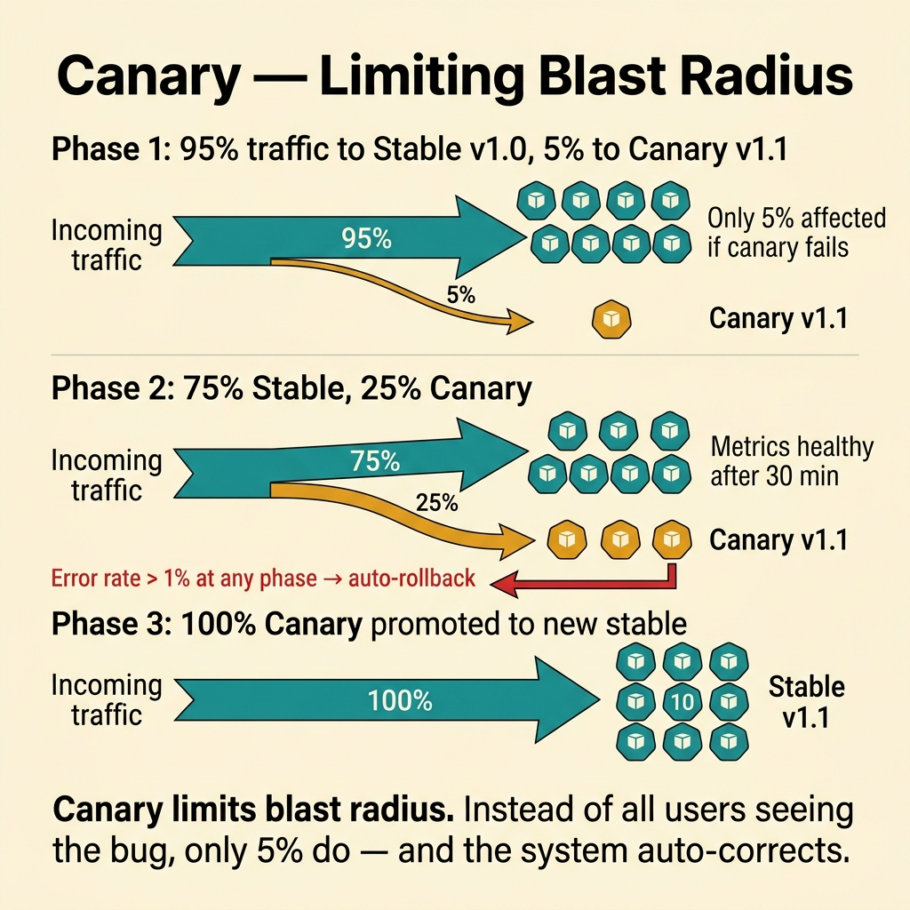
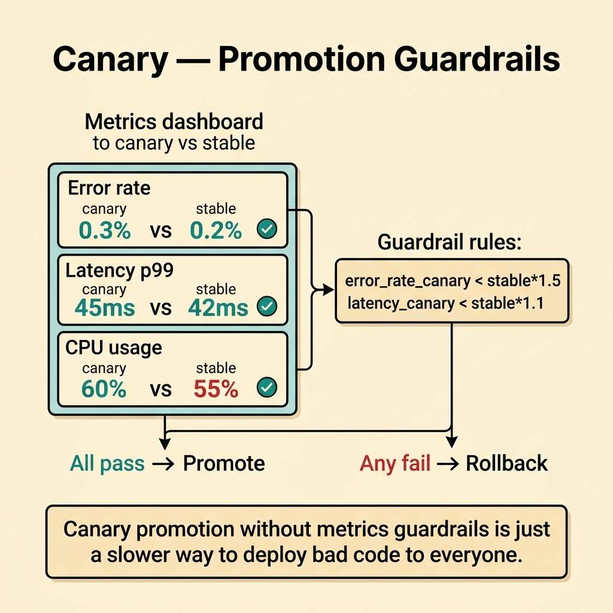
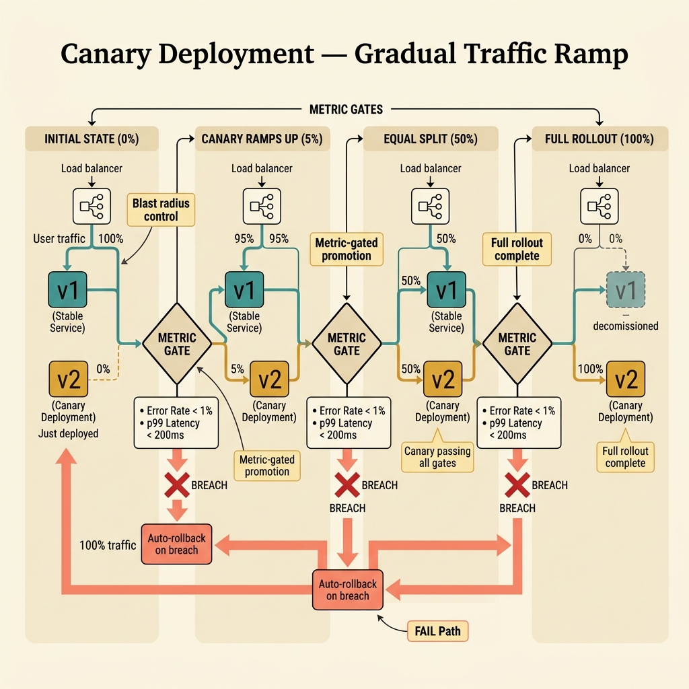

<!-- tags: glossary, reference, deployment-runtime, canary-deployment -->
# Canary Deployment

> A rollout strategy that gradually exposes a new version to a small fraction of traffic before widening to all users.

| Aspect | Detail |
| --- | --- |
| **Concept** | A rollout strategy that gradually exposes a new version to a small fraction of traffic before widening to all users. |
| **Audience** | Backend engineer, platform engineer, SRE, reviewer |
| **Primary style** | Glossary term |
| **Entry point** | Use when the team wants to validate a new version on a slice of real traffic before widening |

📅 Created: 2026-03-30 · 🔄 Updated: 2026-04-16 · ⏱️ 8 min read

---

## 1. DEFINE

Picture a payment service release. Sending 100% of traffic to the new version on day one is a gamble. Canary sends 1% first. If error rate stays flat, promote to 5%. Then 25%. Then 100%. At any stage, abort and rollback if metrics breach the budget. That is the boundary of Canary Deployment.

**Canary Deployment** is a rollout strategy that gradually exposes a new version to a small fraction of traffic before widening to all users.

| Variant | Description |
| --- | --- |
| Percentage-based canary | Increase traffic by percentage steps. |
| Cohort-based canary | Open only for a specific group of tenants, users, or regions. |
| Metric-gated canary | Each expansion step depends on error and latency guardrails. |

| Approach | Time | Space | When to choose |
| --- | --- | --- | --- |
| Full cutover | O(1) stages | O(1) | When accepting higher risk for faster release. |
| Manual staged canary | O(stages) | O(1) | When human verification is needed at each step. |
| Automated metric-gated canary | O(stages + analysis) | O(metric history) | When rollout safety needs to be automated. |

Core insight:

> Canary's power is that it turns production traffic into a learning loop with a small blast radius.

### 1.1 Invariants & Failure Modes

The common failure mode is calling a partial rollout "canary" without attaching any metric gates. Without promote and abort criteria, canary is just a slow way to ship a bug to everyone.

---

## 2. CONTEXT

**Who uses it**: Backend engineer, platform engineer, SRE, reviewer

**When**: Use when the team wants to validate a new version on a slice of real traffic before widening

**Purpose**: Canary's power is that it turns production traffic into a learning loop with a small blast radius.

**In the ecosystem**:
- The release lifecycle needs a precise name for the gradual rollout strategy.
- Runbooks and design reviews mention canary without specifying metric gates or abort criteria.
- The team needs a release strategy that learns from production without risking the entire fleet.

Boundary to hold:
- Canary belongs to the deployment-runtime layer, not a business-domain term.
- Canary validates a release; rolling replaces instances. Different objectives.
- Canary without metric gates is just a slow full rollout.

---

Gradual rollout is clear. But what percentage for canary, which metrics to watch, and auto-promote or manual?

## 3. EXAMPLES

Canary surfaces most clearly when 1% of traffic detects a memory leak before a full roll, when canary metrics are compared against baseline with no automation, or when promotion happens too early because it "looks fine" but the sample size is insufficient. The examples below place the pattern into exactly those situations.

### Example 1: Basic — Limit the blast radius of a new release

> **Goal**: Do not let all users hit the new version immediately.
> **Approach**: Start with a very small fraction of traffic.
> **Example**: Payment service release opens to 1% of traffic first.
> **Complexity**: Basic

```text
  Canary traffic progression:

  Step 1:  ▓░░░░░░░░░░░░░░░░░░░  1% new, 99% old
           observe 30 min → metrics OK ✅

  Step 2:  ▓▓▓░░░░░░░░░░░░░░░░░  5% new, 95% old
           observe 1 hour → metrics OK ✅

  Step 3:  ▓▓▓▓▓▓▓▓▓░░░░░░░░░░░  25% new, 75% old
           observe 2 hours → metrics OK ✅

  Step 4:  ▓▓▓▓▓▓▓▓▓▓▓▓▓▓▓▓▓▓▓▓  100% new
           full rollout complete ✅
```

*Figure: Each step increases exposure. Observation windows between steps provide time to detect issues before they affect more users.*



*Figure: Canary limits blast radius. Only 5% of users see the bug, and the system auto-corrects.*

```yaml
canary_schedule:
  - 1_percent
  - 5_percent
  - 25_percent
  - 100_percent
```

**Why?** If the release is broken, the blast radius at the 1% step is dramatically smaller than a full cutover.

**Conclusion**: Canary enables learning with a small blast radius.

### Example 2: Intermediate — Promote only when metrics stay within guardrails

> **Goal**: Do not use gut feeling to decide the next rollout step.
> **Approach**: Attach each step to error, latency, or business guardrails.
> **Example**: Promote from 5% to 25% only if error rate does not exceed the threshold.
> **Complexity**: Intermediate

```text
  Metric-gated canary promotion:

  Canary at 5%
       │
       ├── error_rate_delta ──► +0.3% (threshold: 1%) ✅
       ├── latency_p95_delta ─► +12ms (threshold: 50ms) ✅
       ├── checkout_drop ─────► no signal ✅
       │
       ▼
  ┌─ Promotion Gate ───────────────────────────────┐
  │  All metrics within budget?                     │
  │  ├── YES ──► promote to 25% ✅                 │
  │  └── NO  ──► ABORT and rollback ❌             │
  └─────────────────────────────────────────────────┘

  Canary at 25%
       │
       ├── error_rate_delta ──► +2.5% (threshold: 1%) ❌
       │
       ▼
  ⏸️  ABORT — rollback triggered automatically
```

*Figure: Each stage has explicit thresholds. The 5% stage passes all gates. The 25% stage breaches error rate and triggers automatic rollback.*



*Figure: Canary promotion without metrics guardrails is just a slower way to deploy bad code to everyone.*

```yaml
promotion_gate:
  error_rate_delta_max: 1_percent
  latency_p95_delta_max: 50ms
  business_abort_signal:
    - checkout_drop
```

**Why?** Canary is only powerful when each step has explicit promote and abort criteria.

**Conclusion**: Canary is safer with clear metric gates.

### Example 3: Advanced — Choose canary cohort to reduce uneven risk

> **Goal**: Roll out by user group or region that fits the risk profile.
> **Approach**: Start with a lower-risk or better-observed cohort.
> **Example**: Launch first for internal users or a small region.
> **Complexity**: Advanced

```text
  Cohort-based canary selection:

  ┌─ Stage 1: Internal users ─────────────────────┐
  │  Who: employees, QA accounts                   │
  │  Why: high tolerance, fast feedback loop        │
  │  Observe: 48 hours                              │
  └────────────┬────────────────────────────────────┘
               │ metrics OK ✅
               ▼
  ┌─ Stage 2: Low-risk region ────────────────────┐
  │  Who: region with smallest revenue share       │
  │  Why: production realism, contained impact     │
  │  Observe: 72 hours                              │
  └────────────┬────────────────────────────────────┘
               │ metrics OK ✅
               ▼
  ┌─ Stage 3: Public traffic ─────────────────────┐
  │  Who: all users                                 │
  │  Promotion: 10% → 50% → 100%                   │
  │  Metric-gated at each step                      │
  └─────────────────────────────────────────────────┘
```

*Figure: Not all 1% traffic slices are equal. Cohort selection starts with the lowest-risk group and graduates to public traffic.*

```yaml
cohort_canary:
  stage_1: internal_users
  stage_2: low_risk_region
  stage_3: public_traffic
```

**Why?** Not all 1% of traffic is the same. Choosing the right cohort helps learn more with less risk.

**Conclusion**: Advanced canary is a problem of choosing the learning target, not just choosing a traffic percentage.

---

## 4. COMPARE




*Figure: Position of canary between partial traffic learning, experiment-style gates, and downstream recovery policy.*

Canary sounds like A/B testing. Close, but the core question is different. Canary learns about release safety under a small blast radius. A/B testing optimizes business outcomes between product variants.

### Level 1


```text
100 percent old
-> 1 percent new
-> 5 percent new
-> 25 percent new
-> 100 percent new
```

*Figure: Level 1 shows the basic shape of canary in the deployment lifecycle.*

### Level 2


```text
At each step
  route small traffic slice
  compare error and latency
  promote or stop
```

*Figure: Level 2 turns the term into a decision boundary — each step is a gate, not just a stage.*

### Easily confused or boundary-slipping

You have seen at which step of the runtime lifecycle Canary Deployment belongs. The mistakes below are common misuses where rollout, startup, or recovery sounds right by name but system behavior is entirely different.

| # | Severity | Mistake | Consequence | Fix |
| --- | --- | --- | --- | --- |
| 1 | 🔴 Fatal | Calling a partial rollout canary but having no gates | Release risk remains vague | Add explicit promote and abort policies. |
| 2 | 🟡 Common | Watching only technical metrics, ignoring business signals | Release is healthy on CPU but hurting conversion | Attach both system and business guardrails. |
| 3 | 🟡 Common | Increasing traffic too fast between steps | Canary's learning value is lost | Keep stages long enough to observe. |
| 4 | 🔵 Minor | No clear rollback trigger | Canary detects an issue but the team reacts slowly | Document the abort policy. |

### Quick scan

| If you face | Action |
| --- | --- |
| Want to learn from real traffic while reducing blast radius | Use canary |
| No clear metric gates | Not a real canary yet |
| Traffic risk is uneven across users or regions | Use cohort canary |

---

## 5. REF

| Resource | Type | Link | Note |
| --- | --- | --- | --- |
| Google SRE Workbook | Reference | https://sre.google/workbook/table-of-contents/ | Strong foundation for release safety and incident response. |
| Argo Rollouts | Reference | https://argo-rollouts.readthedocs.io/ | Useful for rollout patterns like canary and blue-green. |
| LaunchDarkly Guides | Reference | https://launchdarkly.com/docs/ | Useful for release control, flags, and dark launch. |

---

## 6. RECOMMEND

Canary solves the problem "detect a deploy bug before it impacts 100% of users." The next question: how does rolling update work, and when does shadow deployment apply?

| Expand to | When | Reason | File/Link |
| --- | --- | --- | --- |
| Previous concept | When comparing this term with the one before it | Maintains continuity in the learning path | [Blue-Green Deployment](./04-blue-green-deployment.md) |
| Next concept | When continuing along the current lifecycle | Keeps the learning flow consistent | [Rolling Deployment](./06-rolling-deployment.md) |
| Topic hub | When returning to the larger taxonomy | Preserves full topic context | [Deployment & Runtime](./README.md) |

Back to the 1% traffic at the start — detecting a memory leak early. Now you know: canary at 1–5%, watch error rate + p99 latency + memory, auto-rollback if the threshold is breached. Simple, but it saves production incidents.

**Links**: [← Previous](./04-blue-green-deployment.md) · [→ Next](./06-rolling-deployment.md)
