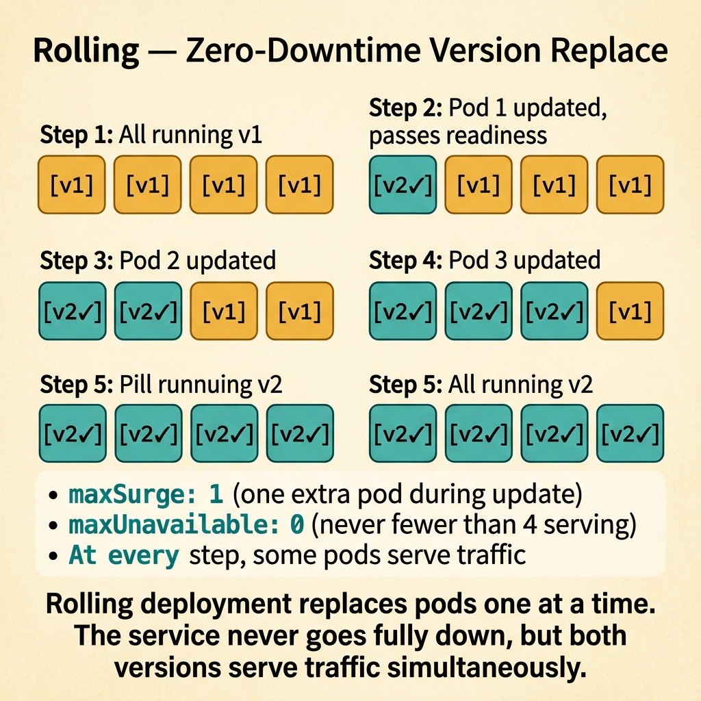
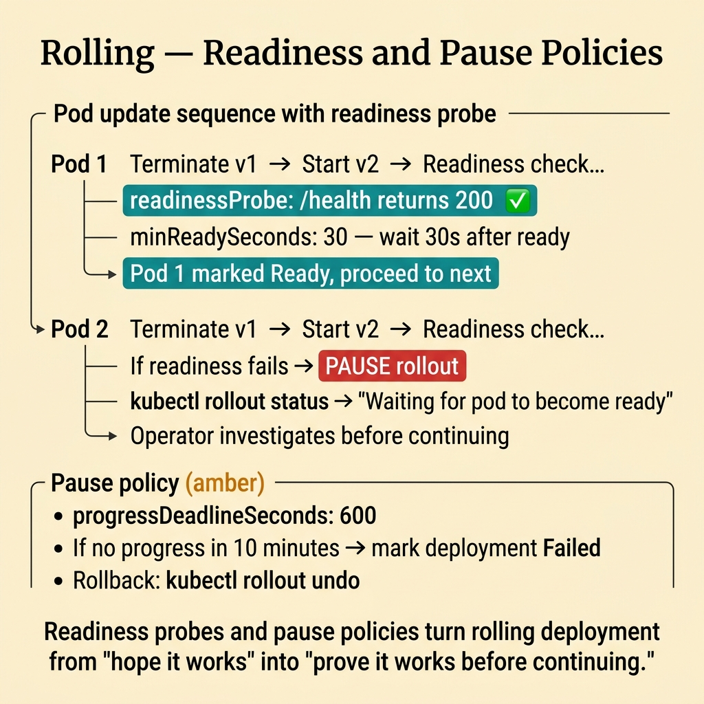
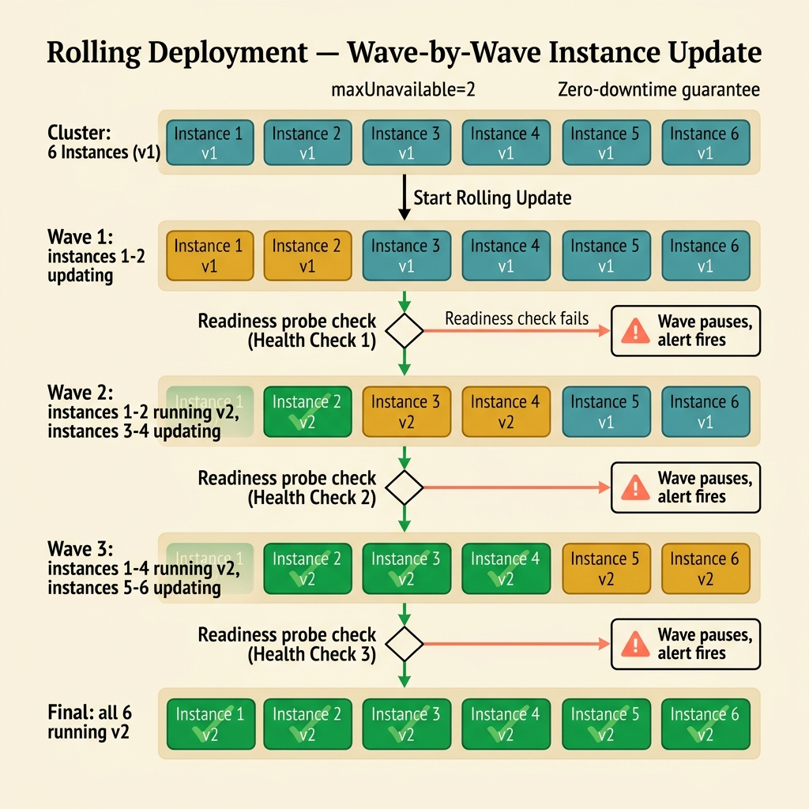

<!-- tags: glossary, reference, deployment-runtime, rolling-deployment -->
# Rolling Deployment

> A strategy that gradually replaces old instances with new ones in small batches until the entire fleet is updated.

| Aspect | Detail |
| --- | --- |
| **Concept** | A strategy that gradually replaces old instances with new ones in small batches until the entire fleet is updated. |
| **Audience** | Backend engineer, platform engineer, SRE, reviewer |
| **Primary style** | Glossary term |
| **Entry point** | Use when the fleet needs a gradual version replacement while keeping the service running continuously |

📅 Created: 2026-03-30 · 🔄 Updated: 2026-04-16 · ⏱️ 8 min read

---

## 1. DEFINE

Picture a Kubernetes cluster with 10 pods. Replacing all 10 at once risks a full outage if the new version is broken. Replacing them two at a time keeps 80% of capacity alive at every step. That is the boundary of Rolling Deployment.

**Rolling Deployment** is a strategy that gradually replaces old instances with new ones in small batches until the entire fleet is updated.

| Variant | Description |
| --- | --- |
| Instance rolling | Replace pods or VMs one batch at a time. |
| Zone-partition rolling | Roll out by availability zone, shard, or node group. |
| Health-gated rolling | Proceed to the next batch only when the current batch is stable. |

| Approach | Time | Space | When to choose |
| --- | --- | --- | --- |
| Big-bang replace | O(1) batch | O(1) | When accepting downtime or higher risk. |
| Batch rolling | O(number of batches) | O(1) | When minimal downtime is needed with existing capacity. |
| Partitioned rolling | O(partitions × batches) | O(1) | When blast radius must be isolated by zone or shard. |

Core insight:

> Rolling deployment shifts traffic by replacing instances gradually — not through a monolithic cutover like blue-green.

### 1.1 Invariants & Failure Modes

The common failure mode is calling something a rolling deployment without attaching health gates or pause policies. Without those, rolling is just a slower way to spread a bug across the entire fleet.

---

## 2. CONTEXT

**Who uses it**: Backend engineer, platform engineer, SRE, reviewer

**When**: Use when the fleet needs a gradual version replacement while keeping the service running continuously

**Purpose**: Rolling deployment shifts traffic by replacing instances gradually — not through a monolithic cutover like blue-green.

**In the ecosystem**:
- The default Kubernetes deployment strategy, but often misconfigured.
- Runbooks and design reviews that say "we do rolling updates" without specifying batch size, gates, or pause conditions.
- Needs to be linked to release behavior, traffic continuity, and recovery.

Boundary to hold:
- Rolling deployment belongs to the deployment-runtime layer, not a business-domain term.
- Rolling replaces instances; canary validates a version. Different jobs.
- Rolling does not eliminate mixed-version risk — it creates it intentionally.

---

Gradual pod replacement is clear. But what should maxSurge and maxUnavailable be set to, how does rollback work mid-roll, and what about mixed-version risk?

## 3. EXAMPLES

Rolling deployment surfaces most clearly when Kubernetes uses it as the default strategy but the team does not understand maxSurge, when old and new pods run simultaneously and cause API version mismatch, or when rollback takes 10 minutes because all old pods have already been killed. The examples below place the pattern into exactly those situations.

### Example 1: Basic — Keep the service running while replacing versions

> **Goal**: Update the fleet without taking the entire service down.
> **Approach**: Replace instances in small batches.
> **Example**: 10 pods updated 2 at a time.
> **Complexity**: Basic

```text
  Rolling replacement — 10 pods, batch size 2:

  Step 1:  [new][new][old][old][old][old][old][old][old][old]
                       ▲ 8 pods still serving
  Step 2:  [new][new][new][new][old][old][old][old][old][old]
                                ▲ 6 old remaining
  Step 3:  [new][new][new][new][new][new][old][old][old][old]
                                         ▲ 4 old remaining
  Step 4:  [new][new][new][new][new][new][new][new][old][old]
                                                    ▲ 2 old remaining
  Step 5:  [new][new][new][new][new][new][new][new][new][new]
                                                    ▲ done ✅
```

*Figure: At every step, most of the fleet is alive and serving traffic. Only the batch being replaced is unavailable.*



*Figure: Rolling deployment replaces pods one at a time. The service never fully goes down.*

```yaml
rolling_plan:
  fleet_size: 10
  batch_size: 2
  max_unavailable: 2
```

**Why?** Batch replacement keeps the majority of the fleet serving traffic while a small number of instances are being replaced.

**Conclusion**: Rolling deployment provides continuous availability during updates.

### Example 2: Intermediate — Attach readiness and pause policies to rolling

> **Goal**: Stop rolling forward if the current batch is not healthy.
> **Approach**: Use health and readiness gates with a pause-on-anomaly policy.
> **Example**: A new batch passes readiness but error rate spikes after 2 minutes, so the rollout pauses.
> **Complexity**: Intermediate

```text
  Rolling with health gates:

  Batch 1: [new][new] deployed
       │
       ├─ readiness check ──► ✅ pass
       ├─ wait 2 min
       ├─ error rate check ──► ✅ within budget
       │
       ▼
  Batch 2: [new][new] deployed
       │
       ├─ readiness check ──► ✅ pass
       ├─ wait 2 min
       ├─ error rate check ──► ❌ spike detected
       │
       ▼
  ⏸️  PAUSE — rollout halted, investigation required
       │
       ├─► Option A: fix and resume
       └─► Option B: rollback to old version
```

*Figure: Each batch is a checkpoint. If metrics breach the budget after a batch, the rollout pauses before the problem spreads further.*



*Figure: Readiness probes and pause policies turn rolling deployment from 'hope it works' into 'prove it works.'*

```yaml
rolling_gate:
  continue_if:
    - readiness_green
    - error_rate_within_budget
  pause_if:
    - crash_loop
    - latency_spike
```

**Why?** Rolling is only safe when each batch serves as a checkpoint. Without gates, small batches are just a slower way to propagate a bug.

**Conclusion**: Rolling deployment is safer with batch gates and pause discipline.

### Example 3: Advanced — Partition rolling by zone or shard

> **Goal**: Prevent a single rollout bug from hitting the entire fleet simultaneously.
> **Approach**: Roll by operationally meaningful partitions.
> **Example**: Roll zone A first, then zone B and C.
> **Complexity**: Advanced

```text
  Partitioned rolling by availability zone:

  ┌── Zone A (roll first) ──────────────────────┐
  │  Batch 1: [new][new]  ──► health check ✅   │
  │  Batch 2: [new][new]  ──► health check ✅   │
  │  Zone A complete ✅                          │
  └─────────────────────────────────────────────┘
       │
       ▼  observe Zone A metrics for 10 min
       │
  ┌── Zone B (roll second) ─────────────────────┐
  │  Batch 1: [new][new]  ──► health check ✅   │
  │  Batch 2: [new][new]  ──► health check ✅   │
  │  Zone B complete ✅                          │
  └─────────────────────────────────────────────┘
       │
       ▼  observe Zone B metrics for 10 min
       │
  ┌── Zone C (roll last) ──────────────────────┐
  │  Batch 1: [new][new]  ──► health check ✅  │
  │  Batch 2: [new][new]  ──► health check ✅  │
  │  Zone C complete ✅                         │
  └─────────────────────────────────────────────┘
```

*Figure: Each zone completes independently with an observation window between zones. A failure in Zone A stops the rollout before Zone B is touched.*

```yaml
partitioned_rollout:
  order:
    - az_a
    - az_b
    - az_c
  objective: contain_blast_radius
```

**Why?** When topology matters, partitioned rolling reduces blast radius and provides an opportunity to observe failures per infrastructure slice.

**Conclusion**: Advanced rolling deployment should leverage topology to increase safety.

---

## 4. COMPARE




*Figure: Rolling deployment as batch replacement discipline — availability is maintained by the replacement cadence and per-batch gates, not by full cutover or canary validation.*

Rolling sounds like canary, but the core payoff differs. Rolling optimizes for replacement continuity. Batch size, health gates, and mixed-version coexistence are the three safety variables to watch first.

### Level 1


```text
old old old old
new replaces old one batch at a time
until all are new
```

*Figure: Level 1 shows the basic shape of rolling deployment in the lifecycle.*

### Level 2


```text
Batch N deployed
  -> health check passes
  -> next batch allowed
  -> otherwise pause or rollback
```

*Figure: Level 2 turns the term into a decision boundary — each batch is a gate, not just a step.*

### Easily confused or boundary-slipping

You have seen at which step of the runtime lifecycle Rolling Deployment belongs. The mistakes below are common misuses where rollout, startup, or recovery sounds right by name but system behavior is entirely different.

| # | Severity | Mistake | Consequence | Fix |
| --- | --- | --- | --- | --- |
| 1 | 🔴 Fatal | Rolling forward without waiting for batch stability | Bug spreads across the entire fleet | Add pause and health gates. |
| 2 | 🟡 Common | Batch size too large | Blast radius approaches big-bang | Reduce batch size according to risk. |
| 3 | 🟡 Common | Confusing rolling with canary | Observability and gates designed for the wrong purpose | Keep the boundary between replacement and exposure clear. |
| 4 | 🔵 Minor | Not considering topology when rolling | A single bug can hit all AZs simultaneously | Partition rollout by zone or shard. |

### Quick scan

| If you face | Action |
| --- | --- |
| Want to update the fleet gradually while keeping the service running | Use rolling deployment |
| New batch is unhealthy but rollout keeps going | Missing gates or pause policy |
| Want better blast radius isolation | Roll by partition or zone |

---

## 5. REF

| Resource | Type | Link | Note |
| --- | --- | --- | --- |
| Google SRE Workbook | Reference | https://sre.google/workbook/table-of-contents/ | Strong foundation for release safety and incident response. |
| Argo Rollouts | Reference | https://argo-rollouts.readthedocs.io/ | Useful for rollout patterns like canary and blue-green. |
| LaunchDarkly Guides | Reference | https://launchdarkly.com/docs/ | Useful for release control, flags, and dark launch. |

---

## 6. RECOMMEND

Rolling deployment solves the problem "deploy with no downtime without paying for 2× infrastructure." The next question: when does shadow deployment apply, and how does a feature flag replace a deploy?

| Expand to | When | Reason | File/Link |
| --- | --- | --- | --- |
| Previous concept | When comparing this term with the one before it | Maintains continuity in the learning path | [Canary Deployment](./05-canary-deployment.md) |
| Next concept | When continuing along the current lifecycle | Keeps the learning flow consistent | [Shadow Deployment](./07-shadow-deployment.md) |
| Topic hub | When returning to the larger taxonomy | Preserves full topic context | [Deployment & Runtime](./README.md) |

Back to the API version mismatch at the start — old and new pods running side by side. Now you know: rolling is safe when the API is backward compatible. Not compatible? Use blue-green or feature flags instead.

**Links**: [← Previous](./05-canary-deployment.md) · [→ Next](./07-shadow-deployment.md)
