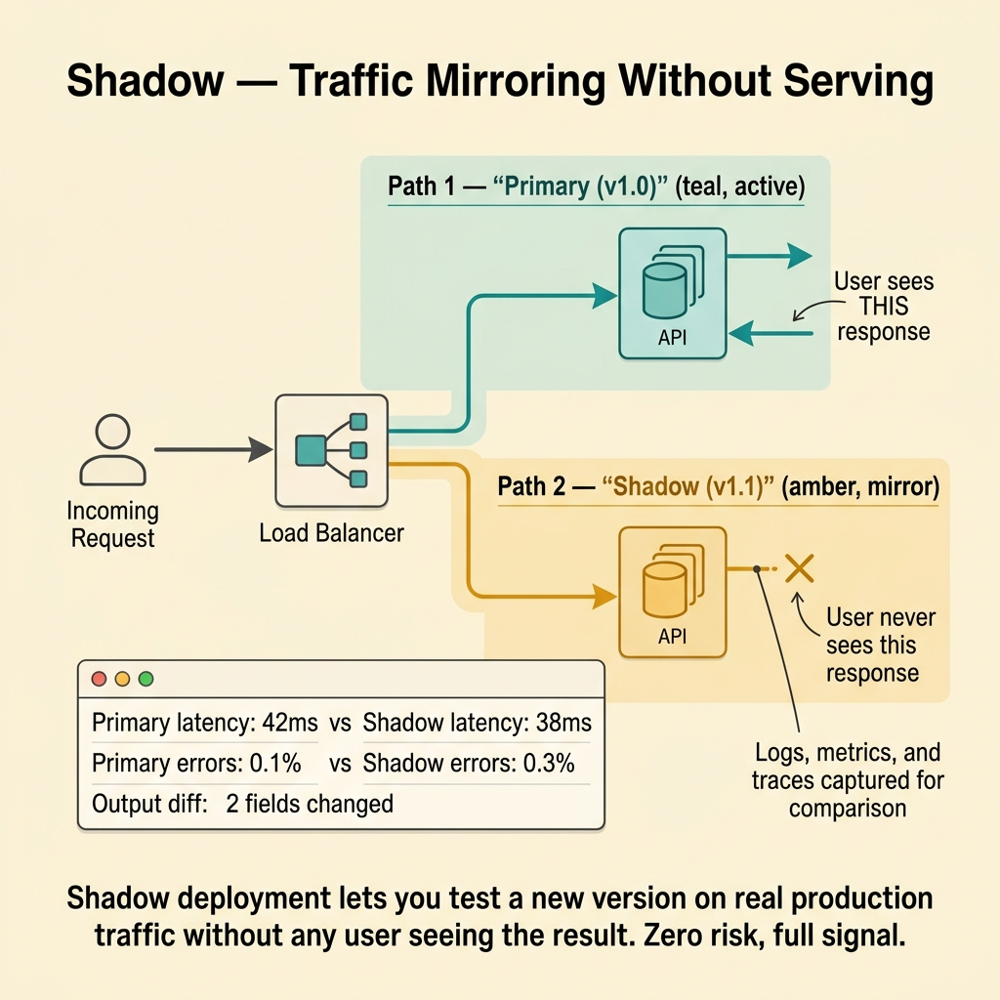
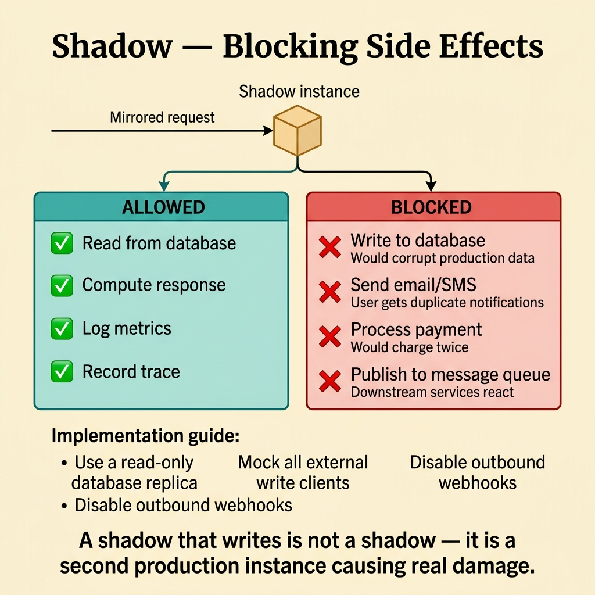
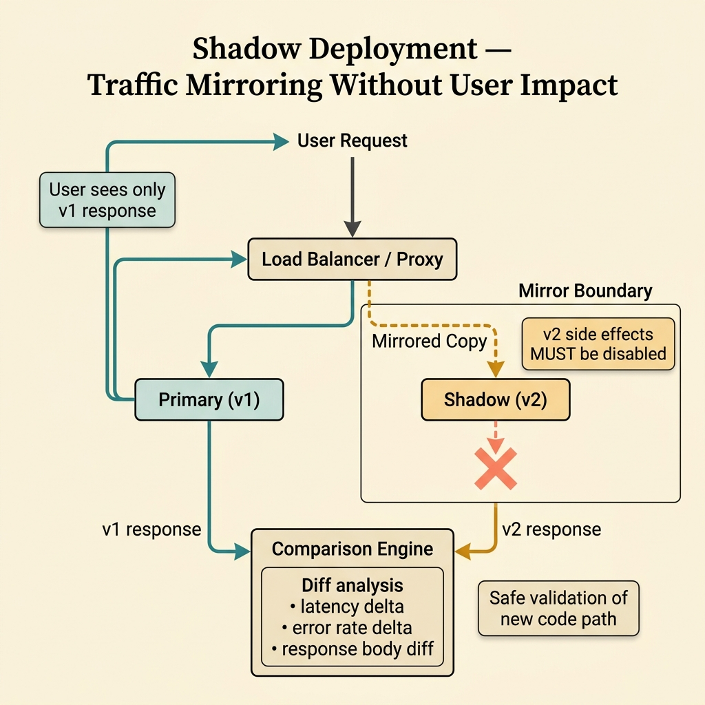

<!-- tags: glossary, reference, deployment-runtime, shadow-deployment -->
# Shadow Deployment

> A strategy that sends a copy of real traffic to a new version to observe its behavior without using those results in the user-facing response.

| Aspect | Detail |
| --- | --- |
| **Concept** | A strategy that sends a copy of real traffic to a new version to observe its behavior without using those results in the user-facing response. |
| **Audience** | Backend engineer, platform engineer, SRE, reviewer |
| **Primary style** | Glossary term |
| **Entry point** | Use when you want to learn how the new version behaves under production load without letting it serve real users |

📅 Created: 2026-03-30 · 🔄 Updated: 2026-04-16 · ⏱️ 8 min read

---

## 1. DEFINE

Picture a team about to release a rewritten search ranking engine. Staging tests passed, but nobody knows how it handles the full variety of production queries. Shadow deployment lets the team mirror real traffic to the new version, compare its output against the current version, and do all of this without a single user seeing the new results. That is the boundary of Shadow Deployment.

**Shadow Deployment** is a strategy that sends a copy of real traffic to a new version to observe its behavior without using those results in the user-facing response.

| Variant | Description |
| --- | --- |
| Traffic mirroring shadow | Copies real requests to the candidate service. |
| Read-only shadow | Only shadows requests that do not cause side effects. |
| Sampled shadow | Mirrors only a fraction of traffic to reduce cost and risk. |

| Approach | Time | Space | When to choose |
| --- | --- | --- | --- |
| No production test before release | O(1) | O(1) | When accepting less learning from production behavior. |
| Full shadow traffic | O(sample size) | O(extra shadow capacity) | When broad observation is needed without serving users. |
| Sampled read-only shadow | O(small sample size) | O(smaller extra capacity) | When balancing observability with cost and risk. |

Core insight:

> Shadow deployment learns from real traffic while separating the learning loop from the user-facing response path.

### 1.1 Invariants & Failure Modes

The common failure mode is running a shadow but not blocking side effects. If the candidate writes to the real database or fires real events, the shadow becomes a silent data corruption vector.

---

## 2. CONTEXT

**Who uses it**: Backend engineer, platform engineer, SRE, reviewer

**When**: Use when you want to learn how the new version behaves under production load without letting it serve real users

**Purpose**: Shadow deployment learns from real traffic while separating the learning loop from the user-facing response path.

**In the ecosystem**:
- The release lifecycle needs a term for "test under real load without user exposure."
- Staging cannot replicate production traffic patterns accurately.
- The team needs confidence in the candidate before any rollout strategy begins.

Boundary to hold:
- Shadow deployment belongs to the deployment-runtime layer, not a business-domain term.
- Shadow observes; canary serves. Different response ownership.
- Shadow does not replace rollout — it precedes it.

---

Mirroring traffic to the new version is clear. But how does the shadow handle side effects, what about data pollution, and what is the cost of doubling traffic?

## 3. EXAMPLES

Shadow deployment surfaces most clearly when testing a new version with real traffic without affecting users, when a shadow write hits the real database and creates duplicate data, or when traffic mirroring doubles bandwidth cost. The examples below place the pattern into exactly those situations.

### Example 1: Basic — Observe the new version on real traffic without serving users

> **Goal**: Learn the candidate service's behavior before real exposure.
> **Approach**: Mirror traffic to the new version and only record metrics and logs.
> **Example**: Search service v2 runs as a shadow alongside v1.
> **Complexity**: Basic

```text
  Shadow deployment flow:

  User request
       │
       ├──────────────────────► Current Version (v1)
       │                              │
       │                              ├── process request
       │                              ├── return response to user ✅
       │                              │
       └── mirror (async copy) ──►  Shadow Version (v2)
                                       │
                                       ├── process request
                                       ├── log metrics & output
                                       └── response DISCARDED 🗑️
                                           (user never sees it)
```

*Figure: The user always receives v1's response. V2 processes the same request in the background for observation only.*



*Figure: Shadow lets you test a new version on real traffic without any user seeing the result. Zero risk, full signal.*

```yaml
shadow_flow:
  user_response_source: current_version
  mirrored_target: candidate_version
  compare:
    - latency
    - errors
    - output_shape
```

**Why?** Shadow deployment validates runtime behavior on real traffic without forcing users to pay the price for an unproven candidate.

**Conclusion**: Shadow deployment delivers production realism without user-facing blast radius.

### Example 2: Intermediate — Block side effects on the shadow path

> **Goal**: Ensure the candidate does not accidentally write real data or fire real events.
> **Approach**: Disable writes or redirect side effects to sandbox targets.
> **Example**: A payment shadow path only simulates downstream calls.
> **Complexity**: Intermediate

```text
  Shadow side-effect control:

  Mirrored request ──► Shadow Version (v2)
       │
       ├── read operations ──► real DB (read-only) ✅
       │
       ├── write operations ──► BLOCKED ❌
       │                        or redirected to sandbox DB
       │
       ├── external API calls ──► MOCKED / DROPPED ❌
       │                          no real downstream impact
       │
       └── event publishing ──► DROPPED ❌
                                no real events emitted

  Result: v2 processes the request, produces output,
          but leaves zero footprint on production systems.
```

*Figure: Reads are allowed. Writes, external calls, and events are blocked or sandboxed. The shadow version leaves no real footprint.*



*Figure: A shadow that writes is not a shadow — it is a second production instance causing real damage.*

```yaml
shadow_safety:
  writes_allowed: false
  external_side_effects:
    mode: sandbox_or_drop
  compare_output_only: true
```

**Why?** A shadow is only safe if the candidate leaves no real footprint on the system.

**Conclusion**: A proper shadow deployment requires side-effect discipline.

### Example 3: Advanced — Use shadow to compare output divergence

> **Goal**: Know where the new version diverges from the current one before a real rollout.
> **Approach**: Record both outputs and classify acceptable vs. unacceptable divergence.
> **Example**: Ranking service v2 returns different results from v1 on 3% of requests.
> **Complexity**: Advanced

```text
  Divergence analysis pipeline:

  Same request ──► v1 output ──┐
                                ├── compare ──► divergence report
  Same request ──► v2 output ──┘

  ┌─────────────────────────────────────────────────────┐
  │ Field              v1           v2        Match?    │
  │ ─────────────────  ───────────  ────────  ───────── │
  │ status_code        200          200       ✅        │
  │ ranking_top_10     [A,B,C,D]    [A,C,B,D] ⚠️ diff  │
  │ response_latency   45ms         62ms      ⚠️ +38%  │
  └─────────────────────────────────────────────────────┘

  Divergence rate: 3.2%  (threshold: 1%)  ──► ❌ needs investigation
```

*Figure: Both versions process the same input. The divergence report surfaces where v2 behaves differently — and whether the difference is acceptable.*

```yaml
divergence_analysis:
  compare_fields:
    - status_code
    - ranking_top_10
    - response_latency
  acceptable_threshold: 1_percent
```

**Why?** Shadow deployment is most powerful when it does not just mirror and watch metrics, but actively compares candidate output against the baseline.

**Conclusion**: Advanced shadow deployment is controlled evaluation on real traffic.

---

## 4. COMPARE




*Figure: Shadow deployment as production learning without response ownership — mirror traffic, block side effects, and measure divergence intentionally.*

Shadow sounds like a read-only canary, but the real payoff is different. Shadow has value only when the candidate learns from real traffic without owning the user response or leaving production footprints in the wrong place.

### Level 1


```text
user request -> current version returns response
             -> mirrored copy -> shadow version observes only
```

*Figure: Level 1 shows the basic shape of shadow deployment in the lifecycle.*

### Level 2


```text
Need prod realism without user exposure?
  -> mirror traffic
  -> compare logs and metrics
  -> block side effects on shadow path
```

*Figure: Level 2 turns the term into a decision boundary — shadow is observation, not serving.*

### Easily confused or boundary-slipping

You have seen at which step of the runtime lifecycle Shadow Deployment belongs. The mistakes below are common misuses where rollout, startup, or recovery sounds right by name but system behavior is entirely different.

| # | Severity | Mistake | Consequence | Fix |
| --- | --- | --- | --- | --- |
| 1 | 🔴 Fatal | Shadow path still has real side effects | Candidate silently corrupts production data | Block or sandbox all side effects. |
| 2 | 🟡 Common | Mirroring 100% of traffic without a capacity plan | Shadow consumes excessive resources from the main system | Sample traffic or scale shadow capacity separately. |
| 3 | 🟡 Common | Running shadow but not comparing anything structured | Very little is learned from real traffic | Design compare metrics and output analysis explicitly. |
| 4 | 🔵 Minor | Confusing shadow with canary | Sets wrong expectations about user exposure | Keep the response path boundary clear. |

### Quick scan

| If you face | Action |
| --- | --- |
| Want to test production behavior without serving new responses to users | Use shadow deployment |
| Candidate still creates real side effects | Shadow boundary is broken |
| Need to compare the new version against the old on the same input | Design divergence analysis |

---

## 5. REF

| Resource | Type | Link | Note |
| --- | --- | --- | --- |
| Google SRE Workbook | Reference | https://sre.google/workbook/table-of-contents/ | Strong foundation for release safety and incident response. |
| Argo Rollouts | Reference | https://argo-rollouts.readthedocs.io/ | Useful for rollout patterns like canary and blue-green. |
| LaunchDarkly Guides | Reference | https://launchdarkly.com/docs/ | Useful for release control, flags, and dark launch. |

---

## 6. RECOMMEND

Shadow deployment solves the problem "test the new version with real traffic at zero user impact." The next question: how does a feature flag control release, and where does dark launch differ from shadow?

| Expand to | When | Reason | File/Link |
| --- | --- | --- | --- |
| Previous concept | When comparing this term with the one before it | Maintains continuity in the learning path | [Rolling Deployment](./06-rolling-deployment.md) |
| Next concept | When continuing along the current lifecycle | Keeps the learning flow consistent | [Feature Flag / Feature Toggle](./08-feature-flag.md) |
| Topic hub | When returning to the larger taxonomy | Preserves full topic context | [Deployment & Runtime](./README.md) |

Back to the real-traffic test at the start — the team needed to know how the new version handles production load. Now you know: mirror traffic, compare responses, ensure the shadow causes no write side effects. Safe if read-only; dangerous if mutations are involved.

**Links**: [← Previous](./06-rolling-deployment.md) · [→ Next](./08-feature-flag.md)
