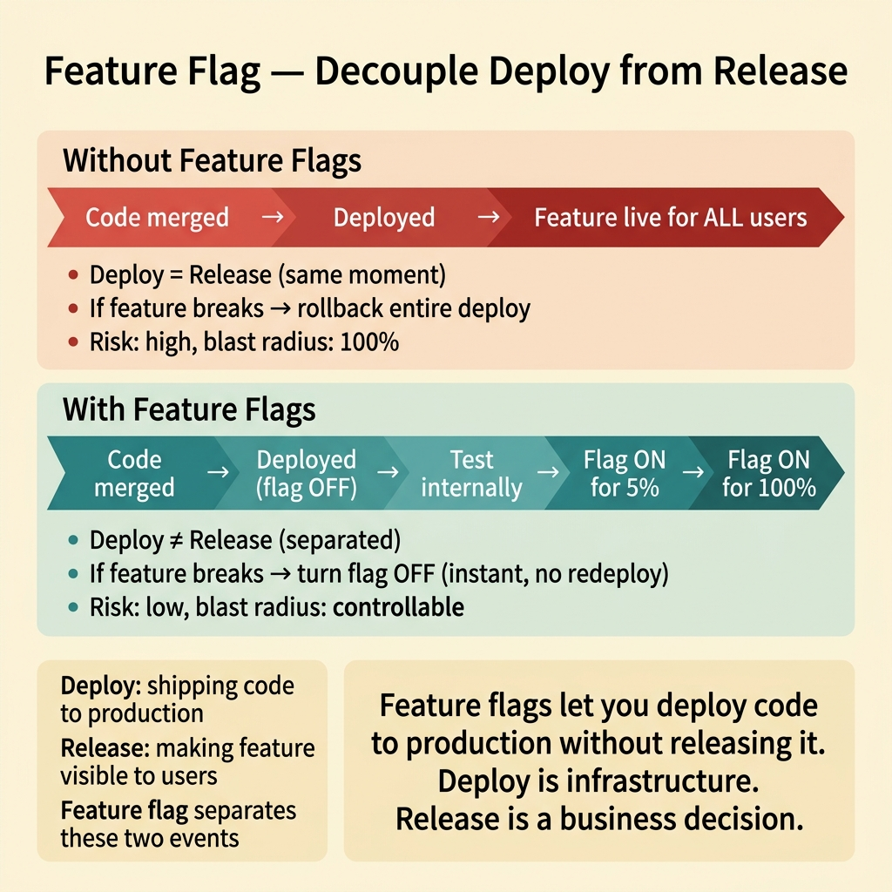
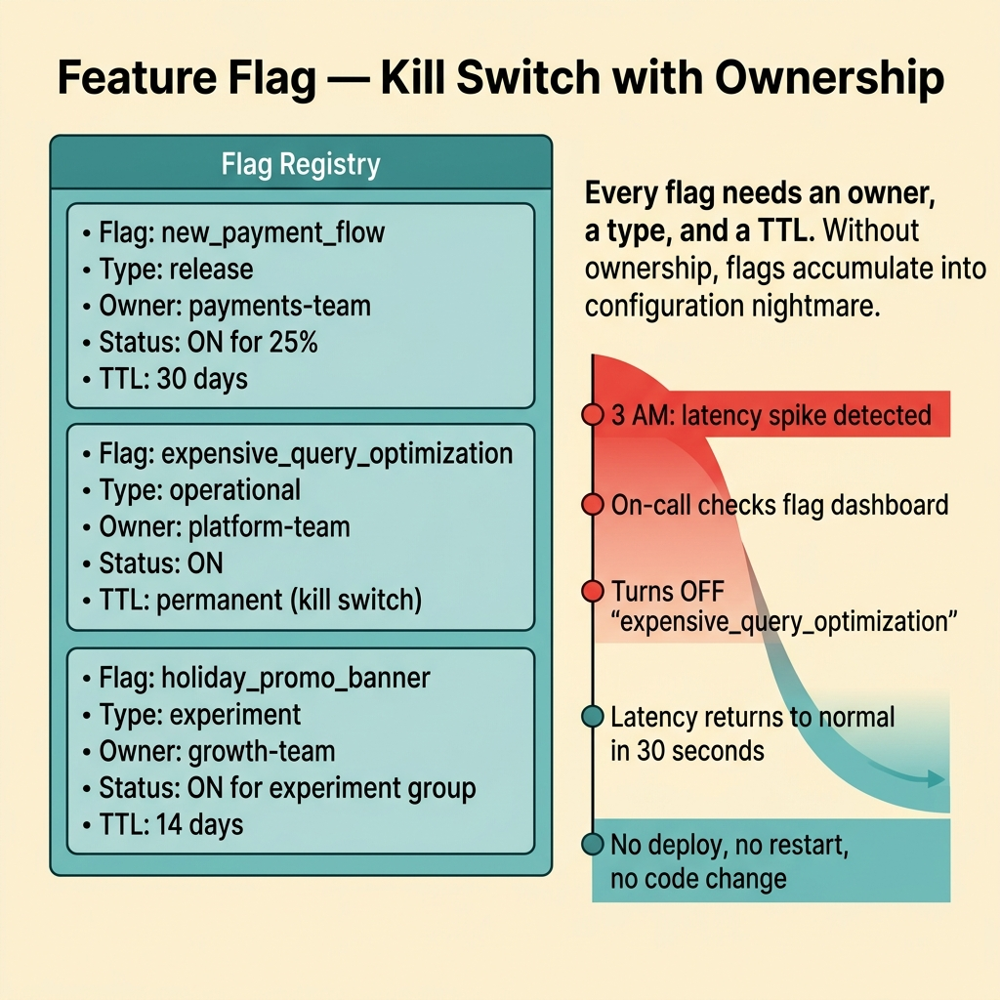
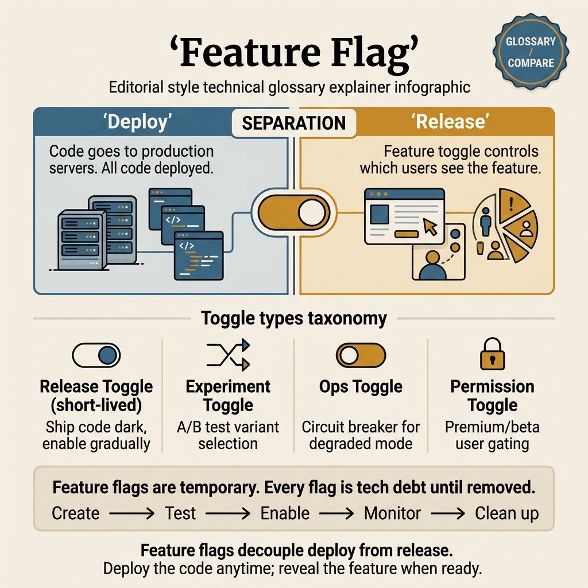

<!-- tags: glossary, reference, deployment-runtime, feature-flag -->
# Feature Flag / Feature Toggle

> A mechanism to enable or disable features at runtime, decoupling code deployment from user-facing release.

| Aspect | Detail |
| --- | --- |
| **Concept** | A mechanism to enable or disable features at runtime, decoupling code deployment from user-facing release. |
| **Audience** | Backend engineer, platform engineer, SRE, reviewer |
| **Primary style** | Glossary term |
| **Entry point** | Use when code is already deployed but the team wants to control who sees or uses a feature at runtime |

📅 Created: 2026-03-30 · 🔄 Updated: 2026-04-16 · ⏱️ 8 min read

---

## 1. DEFINE

Picture a checkout rewrite that is fully merged and deployed to production. The code is live, but no customer sees it yet. A single configuration change flips the flag, and the new checkout appears for 10% of users. Another flip, and it disappears entirely. That is the boundary of Feature Flag.

**Feature Flag / Feature Toggle** is a mechanism to enable or disable features at runtime, decoupling code deployment from user-facing release.

| Variant | Description |
| --- | --- |
| Boolean flag | Simple on or off for a single feature. |
| Targeted rollout flag | Opens by cohort, tenant, region, or percentage. |
| Operational flag | Enables or disables technical behavior during an incident. |

| Approach | Time | Space | When to choose |
| --- | --- | --- | --- |
| Deploy equals release | O(1) | O(1) | When accepting user exposure immediately after deploy. |
| Boolean runtime toggle | O(1) | O(number of flags) | When a simple decouple between deploy and release is enough. |
| Targeted flagging | O(1) evaluation | O(flag rules) | When progressive exposure by cohort or percentage is needed. |

Core insight:

> Feature flags turn release exposure into a runtime decision, no longer hard-wired to the deploy event.

### 1.1 Invariants & Failure Modes

The common failure mode is accumulating hundreds of flags without a retirement plan. Every unretired flag adds a runtime branch that is never tested, never documented, and compounds into silent tech debt.

---

## 2. CONTEXT

**Who uses it**: Backend engineer, platform engineer, SRE, reviewer

**When**: Use when code is already deployed but the team wants to control who sees or uses a feature at runtime

**Purpose**: Feature flags turn release exposure into a runtime decision, no longer hard-wired to the deploy event.

**In the ecosystem**:
- The release lifecycle needs a clear name for the mechanism that separates deploy from release.
- Runbooks and design reviews often say "just toggle it" without specifying ownership, targeting rules, or flag lifecycle.
- Flags connect release behavior with traffic exposure and incident recovery.

Boundary to hold:
- Feature flags belong to the deployment-runtime layer, not a business-domain term.
- Flags control exposure; canary controls traffic routing. Different jobs.
- Flags have a lifecycle: create, use, retire. Skipping retirement creates branching debt.

---

Toggling features via config is clear. But how does flag debt accumulate, what does lifecycle management look like, and when does a flag become tech debt?

## 3. EXAMPLES

Feature flags surface most clearly when code is deployed but not yet exposed to users, when 200 flags exist and nobody knows which ones are still active, or when three layers of nested flags create logic branches that are impossible to test. The examples below place the pattern into exactly those situations.

### Example 1: Basic — Decouple deploy from release

> **Goal**: Allow code to reach production without exposing it to all users.
> **Approach**: Wrap the feature behind a runtime toggle.
> **Example**: Checkout v2 is deployed but the flag stays off for public users.
> **Complexity**: Basic

```text
  Feature flag lifecycle — basic:

  ┌─────────────┐     ┌─────────────┐     ┌─────────────┐
  │  Code merged │────►│   Deployed   │────►│  In prod     │
  │  to main     │     │  to prod     │     │  but hidden  │
  └─────────────┘     └─────────────┘     └──────┬──────┘
                                                  │
                                          flag = OFF
                                                  │
                                    ┌─────────────┴─────────────┐
                                    ▼                           ▼
                              flag = ON                   flag stays OFF
                              (feature visible)           (feature hidden)
```

*Figure: Code ships to production in one event. Feature visibility is a separate, independent decision controlled by the flag.*



*Figure: Deploy is infrastructure. Release is a business decision. Feature flags separate these two events.*

```yaml
feature_release:
  deploy_state: code_in_prod
  flag_state: off
  public_exposure: false
```

**Why?** When deploy and release are tightly coupled, every rollback and release decision becomes significantly heavier.

**Conclusion**: Feature flags cut code shipment apart from feature exposure.

### Example 2: Intermediate — Roll out gradually by cohort or percentage

> **Goal**: Learn the impact of a feature on a small user group first.
> **Approach**: Use targeting rules instead of global on or off.
> **Example**: Open first for internal users, then 10% of public traffic.
> **Complexity**: Intermediate

```text
  Targeted rollout progression:

  Stage 1: flag evaluates ──► internal_users only
           │
           ├── observe metrics for 48h
           ├── error rate OK ✅
           │
           ▼
  Stage 2: flag evaluates ──► 10% public traffic
           │
           ├── observe metrics for 72h
           ├── conversion rate stable ✅
           │
           ▼
  Stage 3: flag evaluates ──► all users (100%)
           │
           └── flag marked for retirement
```

*Figure: Each stage increases exposure. Metrics are observed before advancing. The flag is retired after full rollout.*

```yaml
flag_rules:
  stage_1: internal_users
  stage_2: 10_percent_public
  stage_3: all_users
```

**Why?** Targeting turns a flag into a release lever, not just a hard switch.

**Conclusion**: Intermediate feature flags are runtime exposure strategies by cohort.

### Example 3: Advanced — Use operational flags as kill switches with ownership

> **Goal**: Disable dangerous behavior without redeploying.
> **Approach**: Define clearly who can change the flag and under what conditions.
> **Example**: Disable the recommendation engine when a downstream service is overloaded.
> **Complexity**: Advanced

```text
  Operational flag as kill switch:

  Normal state:
  ┌──────────────────────────────────────────────┐
  │  Request ──► Recommendation Engine ──► Response │
  │  flag: enable_recommendations = ON              │
  └──────────────────────────────────────────────┘

  Incident state (downstream overload):
  ┌──────────────────────────────────────────────┐
  │  On-call toggles flag OFF                       │
  │  Request ──► Fallback (cached/static) ──► Response │
  │  flag: enable_recommendations = OFF             │
  │                                                 │
  │  Telemetry: fallback_rate ↑, error_rate ↓       │
  └──────────────────────────────────────────────┘

  Ownership:
    who_can_toggle: oncall_team
    when: downstream_overload detected
    audit_trail: required ✅
```

*Figure: During an incident, the on-call engineer flips the flag. Traffic shifts to the fallback path. The audit trail records who changed what and when.*



*Figure: Every flag needs an owner, a type, and a TTL. Without ownership, flags become a configuration nightmare.*

```yaml
operational_flag:
  name: disable_recommendations
  owner: oncall_team
  trigger_condition: downstream_overload
  required_telemetry:
    - fallback_rate
    - error_rate
```

**Why?** Operational flags are powerful but dangerous if ownership is unclear. An unowned kill switch is a liability during incidents.

**Conclusion**: Advanced feature flags serve as release and incident control, not just product toggles.

---

## 4. COMPARE




*Figure: Position of feature flags between the deploy event, runtime exposure control, and branching debt risk.*

Feature flags sound like if-else in code. True, but the important boundary is the lifecycle: flags exist to decouple shipment from exposure, then must be retired before runtime branching becomes real debt.

### Level 1


```text
deploy code
  -> flag off => feature hidden
  -> flag on  => feature visible
```

*Figure: Level 1 shows the basic shape of feature flags in the lifecycle.*

### Level 2


```text
Need selective exposure?
  -> evaluate user or tenant rules
  -> return old or new behavior at runtime
```

*Figure: Level 2 turns the term into a decision boundary — flags are runtime routing, not static config.*

### Easily confused or boundary-slipping

You have seen at which step of the runtime lifecycle Feature Flag belongs. The mistakes below are common misuses where rollout, startup, or recovery sounds right by name but system behavior is entirely different.

| # | Severity | Mistake | Consequence | Fix |
| --- | --- | --- | --- | --- |
| 1 | 🔴 Fatal | Flags have no retirement plan | Codebase accumulates branching debt | Set an owner and a cleanup rule for every flag. |
| 2 | 🟡 Common | Using flags as a substitute for rollout strategy everywhere | Release plan becomes tangled and hard to reason about | Keep the boundary between flags, canary, and dark launch. |
| 3 | 🟡 Common | No control over who can change operational flags | Runtime behavior changes without audit | Set ownership and require an audit trail. |
| 4 | 🔵 Minor | Flag names are vague | On-call engineers cannot understand runtime meaning | Name flags by behavior and scope. |

### Quick scan

| If you face | Action |
| --- | --- |
| Code is in production but public exposure is not wanted | Use feature flag |
| Want to roll out by cohort | Use targeting rules |
| Need a kill switch during an incident | Use operational flag with clear ownership |

---

## 5. REF

| Resource | Type | Link | Note |
| --- | --- | --- | --- |
| Google SRE Workbook | Reference | https://sre.google/workbook/table-of-contents/ | Strong foundation for release safety and incident response. |
| Argo Rollouts | Reference | https://argo-rollouts.readthedocs.io/ | Useful for rollout patterns like canary and blue-green. |
| LaunchDarkly Guides | Reference | https://launchdarkly.com/docs/ | Useful for release control, flags, and dark launch. |

---

## 6. RECOMMEND

Feature flags solve the problem "deploy code without releasing the feature." The next question: how does dark launch use flags, and how does rollback work through flags?

| Expand to | When | Reason | File/Link |
| --- | --- | --- | --- |
| Previous concept | When comparing this term with the one before it | Maintains continuity in the learning path | [Shadow Deployment](./07-shadow-deployment.md) |
| Next concept | When continuing along the current lifecycle | Keeps the learning flow consistent | [Dark Launch](./09-dark-launch.md) |
| Topic hub | When returning to the larger taxonomy | Preserves full topic context | [Deployment & Runtime](./README.md) |

Back to the 200 flags at the start — nobody knows which ones are still active. Now you know: flags have a TTL. Create the flag, use the flag, remove the flag. No removal means compound tech debt. A flag management tool and a cleanup policy are mandatory.

**Links**: [← Previous](./07-shadow-deployment.md) · [→ Next](./09-dark-launch.md)
